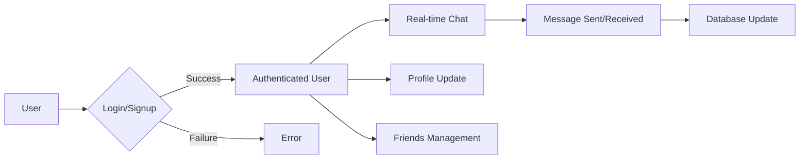

```mdx
---
title: "Backend Development"
description: "Details on the server-side implementation using Node.js, Express, and MongoDB."
sidebar_position: 2
---

# Backend Development

<TOC />

## System Purpose

This backend system provides the server-side logic for a chat application.  Its core functionalities include:

*   **User Authentication and Authorization:** Securely manages user registration, login, logout, and profile updates using various authentication methods including Google OAuth 2.0.  [View on GitHub](https://github.com/GitDex-AI/backend/blob/main/backend/src/routes/auth.route.js)
*   **Real-time Messaging:** Enables real-time communication between users using Socket.IO. [View on GitHub](https://github.com/GitDex-AI/backend/blob/main/backend/src/index.js)
*   **Friend Management:** Allows users to add, remove, and manage their friends. [View on GitHub](https://github.com/GitDex-AI/backend/blob/main/backend/src/routes/friend.route.js)
*   **Data Persistence:** Stores user data, messages, and friend relationships in a MongoDB database. [View on GitHub](https://github.com/GitDex-AI/backend/blob/main/backend/src/lib/db.js)

## System Architecture Overview

The system follows a three-tier architecture:

*   **Presentation Tier:** The frontend (React application, not detailed here) handles user interaction and displays information.
*   **Business Tier:** The backend (Node.js/Express) processes requests, handles business logic, and interacts with the data tier.
*   **Data Tier:** MongoDB stores and retrieves persistent data.


```mermaid
graph TD
    A[Frontend (React)] -->|API Calls| B(Backend (Node.js/Express));
    B -->|Database Queries| C[MongoDB];
    A -->|Real-time Communication| D(Socket.IO);
    subgraph "Client"
        A
    end
    subgraph "Server"
        B
        D
    end
```


## Technology Stack

| Layer       | Technology             | Version     | Purpose                                                        |
| :---------- | :---------------------- | :---------- | :------------------------------------------------------------- |
| **Backend** | Node.js                | (Inferred) | Server-side JavaScript runtime environment                   |
|             | Express                 | ^4.21.2     | Web application framework                                      |
|             | Mongoose                | ^8.9.5      | MongoDB object modeling tool                                   |
|             | MongoDB                | (Inferred) | NoSQL database                                                |
|             | bcryptjs                | ^2.4.3      | Password hashing                                             |
|             | Passport                | ^0.7.0      | Authentication middleware                                      |
|             | Passport-Google-OAuth20 | ^2.0.0      | Google OAuth 2.0 authentication strategy                       |
|             | Socket.IO               | ^4.8.1      | Real-time bidirectional communication                          |
|             | jsonwebtoken            | ^9.0.2      | JSON Web Token (JWT) generation and verification               |
|             | cookie-parser          | ^1.4.7      | Parses cookies from HTTP requests                               |
|             | express-session         | ^1.18.1     | Session management                                             |
|             | dotenv                  | ^16.4.7     | Loads environment variables from a `.env` file                  |
|             | Cloudinary              | ^2.5.1      | Cloud storage for user profile pictures (likely)                |
| **Dev**     | Nodemon                 | ^3.1.9      | Monitors for changes and restarts the server automatically     |


```javascript
{
  "dependencies": {
    "express": "^4.21.2",
    "mongoose": "^8.9.5",
    "passport": "^0.7.0",
    "socket.io": "^4.8.1"
  }
}
```
[View on GitHub](https://github.com/GitDex-AI/backend/blob/main/backend/package.json#L15-L21)

This snippet showcases some of the core dependencies for the backend.


## Core Application Features

*   **Authentication:** Users can register with a username and password, or use Google OAuth 2.0 for seamless login.  The `passport` library handles authentication strategies. [View on GitHub](https://github.com/GitDex-AI/backend/blob/main/backend/src/routes/auth.route.js#L26-L45)
*   **Real-time Chat:** Socket.IO facilitates real-time communication between connected users.  Messages are sent and received instantaneously. [View on GitHub](https://github.com/GitDex-AI/backend/blob/main/backend/src/index.js#L46-L50)
*   **Friend Management:** Users can add friends which are persisted to the database.  Friend requests and management are handled via backend routes. [View on GitHub](https://github.com/GitDex-AI/backend/blob/main/backend/src/routes/friend.route.js)
*   **Profile Update:** Users can modify their profile information after authentication, which is protected using middleware. [View on GitHub](https://github.com/GitDex-AI/backend/blob/main/backend/src/routes/auth.route.js#L20-L21)


```javascript
app.use(session({
    secret: process.env.SESSION_SECRET, 
    resave: false,
    saveUninitialized: false, 
    cookie: {
        secure: process.env.NODE_ENV === "production", 
        httpOnly: true,
        maxAge: 7 * 24 * 60 * 60 * 1000 
    }
}));
```
[View on GitHub](https://github.com/GitDex-AI/backend/blob/main/backend/src/index.js#L38-L48) This code snippet configures Express sessions, crucial for managing user login states.

```javascript
router.get(
    '/google',
    passport.authenticate('google', { scope: ['profile', 'email'] })
);
```
[View on GitHub](https://github.com/GitDex-AI/backend/blob/main/backend/src/routes/auth.route.js#L37-L39) This code snippet demonstrates Google OAuth 2.0 route configuration.





## Project Structure

```
backend/
├── src/
│   ├── controllers/
│   │   └── auth.controller.js
│   ├── lib/
│   │   ├── db.js
│   │   └── socket.js
│   ├── middleware/
│   │   └── auth.middleware.js
│   ├── routes/
│   │   ├── auth.route.js
│   │   ├── message.route.js
│   │   └── friend.route.js
│   └── index.js
├── package.json
└── ...
```

## Key Integration Points

*   **State Management:** Express sessions and JWTs are utilized for authentication state.  Sessions store user information, while JWTs are used for secure authorization in subsequent requests.
*   **API Flows:**  RESTful APIs are used for communication between the frontend and backend.  Endpoints are defined in route files (`auth.route.js`, `message.route.js`, `friend.route.js`).
*   **Authentication:** Passport.js manages authentication, providing Google OAuth 2.0 and username/password login strategies.
*   **Database Interactions:** Mongoose provides an ORM for interacting with the MongoDB database, simplifying data access and manipulation.  Error handling is implemented at each interaction point.  The database schema would ideally be clearly defined for optimal efficiency.

Next: [Backend Authentication](./2.1_backend_authentication.mdx)
```