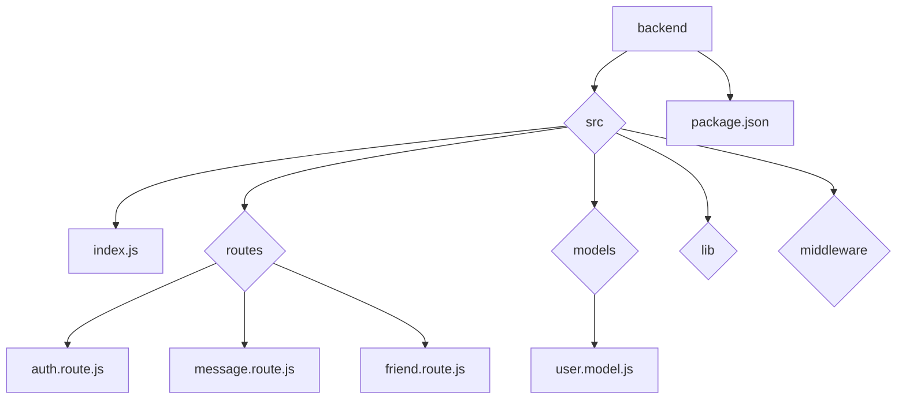

# Backend Development

<TOC />

## Overview

This document details the backend implementation of a chat application using Node.js, Express.js, and MongoDB.  The backend handles user authentication, friend management, message routing, and serves as the API for the frontend application.  The architecture is built around a RESTful API design, leveraging various middleware for security and functionality.

The core components include:

* **Express.js Server:**  The foundation of the backend, handling routing and request processing.
* **MongoDB:**  The NoSQL database used for persistent storage of user data and messages.
* **Passport.js:**  Handles authentication strategies, including email/password and Google OAuth.
* **Socket.IO:**  Enables real-time communication for chat functionality (handled in `./lib/socket.js`, not detailed here).
* **Various Middleware:**  Cookie parsing, body parsing, CORS handling, and session management ensure security and proper request handling.


`

```mermaid
graph TD
    A[Frontend (React)] --> B(Backend API);
    B --> C[Express.js Server];
    C --> D[Authentication (Passport.js)];
    C --> E[Database (MongoDB)];
    C --> F[Socket.IO];
    E --> G[User Model];
    E --> H[Message Model];
```


## Project Structure

The backend project is organized as follows:

* **`backend/`:** The root directory for the backend project.
* **`backend/src/`:** Contains the source code.
    * **`backend/src/index.js`:** The main server file.
    * **`backend/src/routes/`:** Contains API route definitions.
        * **`backend/src/routes/auth.route.js`:**  Handles authentication-related routes.
        * **`backend/src/routes/message.route.js`:** Handles message-related routes (not detailed here).
        * **`backend/src/routes/friend.route.js`:** Handles friend management routes (not detailed here).
    * **`backend/src/models/`:** Contains MongoDB schema definitions.
        * **`backend/src/models/user.model.js`:** Defines the User schema.
    * **`backend/src/lib/`:** Contains reusable functions and configurations.
        * **`backend/src/lib/db.js`:** Handles database connection.
        * **`backend/src/lib/socket.js`:** Handles Socket.IO setup.
        * **`backend/src/lib/passport.config.js`:** Configures Passport.js authentication strategies.
    * **`backend/src/middleware/`:** Contains custom middleware functions.
        * **`backend/src/middleware/auth.middleware.js`:** Implements route protection (not detailed here).
* **`backend/package.json`:** Contains project metadata, dependencies, and scripts.


`




## `package.json` [Source](https://github.com/shinymack/Chat-App-MERN/blob/main/backend/package.json)

This file lists project dependencies and scripts.  Key dependencies include `express`, `mongoose`, `passport`, `jsonwebtoken`, `bcryptjs`, and `socket.io`. `nodemon` is used for development to restart the server on code changes.


```json
{
  "name": "backend",
  "version": "1.0.0",
  "main": "src/index.js",
  "scripts": {
    "dev": "nodemon src/index.js",
    "start": "node src/index.js"
  },
  "dependencies": {
    "bcryptjs": "^2.4.3",
    "cookie-parser": "^1.4.7",
    "dotenv": "^16.4.7",
    "express": "^4.21.2",
    "express-session": "^1.18.1",
    "jsonwebtoken": "^9.0.2",
    "mongoose": "^8.9.5",
    "passport": "^0.7.0",
    "passport-google-oauth20": "^2.0.0",
    "socket.io": "^4.8.1"
  },
  "devDependencies": {
    "nodemon": "^3.1.9"
  }
}
```

## `index.js` [Source](https://github.com/shinymack/Chat-App-MERN/blob/main/backend/src/index.js)

This file is the main entry point for the server. It sets up Express.js, connects to the database, configures middleware, and defines routes.  Note the use of `cors` to allow requests from the frontend, and `express-session` for managing user sessions.


```javascript
import express from "express";
import cors from "cors";
import authRoutes from "./routes/auth.route.js";
// ... other imports

const app = express();

app.use(cookieParser());
app.use(express.json({limit : '2mb'}));
app.use(cors({
    origin: "http://localhost:5173",
    credentials: true,
}));

app.use(session({
    secret: process.env.SESSION_SECRET, 
    resave: false,
    saveUninitialized: false, 
    cookie: {
        secure: process.env.NODE_ENV === "production", 
        httpOnly: true,
        maxAge: 7 * 24 * 60 * 60 * 1000 
    }
}));

app.use(passport.initialize());
app.use(passport.session());  

app.use("/api/auth", authRoutes );
// ... other routes

server.listen(PORT, () => {
    console.log("server is running on PORT: " + String(PORT));
    connectDB();
});
```

## `user.model.js` [Source](https://github.com/shinymack/Chat-App-MERN/blob/main/backend/src/models/user.model.js)

This file defines the Mongoose schema for the `User` model.  It includes fields for email, username, password, profile picture, friends list, friend requests, and Google authentication data.  The schema enforces data validation and ensures unique usernames and emails.  Note the pre-save hook to handle password management for Google authentication.


```javascript
import mongoose from "mongoose"

const  userSchema = new mongoose.Schema(
    {
        email: { 
            type: String,
            required: true,
            unique: true
        },
        username: {
            type: String,
            required: [true, "Username is required"],
            unique: true,
            trim: true,
            minlength: [3, "Username must be at least 3 characters long"],
            maxlength: [20, "Username cannot be more than 20 characters long"]
        },
        password: {
            type: String,
            minlength: 6,
        },
        // ... other fields
    },
    { 
        timestamps: true
    } 
);

// ... pre-save hook

const User = mongoose.model("User", userSchema);

export default User;
```

## `auth.route.js` [Source](https://github.com/shinymack/Chat-App-MERN/blob/main/backend/src/routes/auth.route.js)

This file defines routes for user authentication, including signup, login, logout, profile updates, and Google OAuth.  It utilizes Passport.js middleware for authentication and `protectRoute` middleware to protect certain routes.


```javascript
import express from "express"
import passport from 'passport';
import { login, logout, signup, updateProfile, checkAuth, googleAuthCallback, checkUsernameAvailability} from  "../controllers/auth.controller.js"
import { protectRoute } from "../middleware/auth.middleware.js"
const router = express.Router();

router.post("/signup", signup);
router.post("/login", login);
router.post("/logout", logout);
router.put("/update-profile", protectRoute ,updateProfile)
router.get("/username/check/:username", protectRoute, checkUsernameAvailability);
router.get("/check", protectRoute, checkAuth)

router.get(
    '/google',
    passport.authenticate('google', { scope: ['profile', 'email'] })
);
router.get(
    '/google/callback',
    passport.authenticate('google', {
        failureRedirect: 'http://localhost:5173/login', 
        failureMessage: true 
    }),
    googleAuthCallback 
);
export default router;
```

Next: [Backend API Endpoints](./2.1_backend_api.mdx)