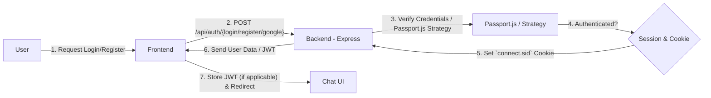

# Backend Architecture
<TOC />

## System Purpose
The backend serves as the core computational and data persistence layer for the application, handling all server-side logic, API endpoints, and real-time communication. Its primary responsibilities include:

*   **User Management & Authentication**: Securely handles user registration, login, session management, and authentication using various strategies, including Google OAuth.
*   **Message Exchange**: Manages the creation, storage, and retrieval of messages between users, supporting both individual and potentially group conversations.
*   **Real-time Communication**: Facilitates instant message delivery and online status tracking using WebSockets, ensuring a dynamic and responsive user experience.
*   **Friendship Management**: Provides functionalities to manage connections and relationships between users, such as sending and accepting friend requests.
*   **Data Persistence**: Interacts with a MongoDB database to store all application data, including user profiles, messages, and friend lists.
*   **Environment Configuration**: Manages sensitive information and application settings through environment variables for secure and flexible deployment.

The main entry point for the backend is the `index.js` file, which orchestrates various modules for routing, database connection, and real-time services.
*   [View `index.js` on GitHub](https://github.com/shinymack/Chat-App-MERN/blob/main/backend/src/index.js)
*   [View `db.js` on GitHub](https://github.com/shinymack/Chat-App-MERN/blob/main/backend/src/lib/db.js)
*   [View `socket.js` on GitHub](https://github.com/shinymack/Chat-App-MERN/blob/main/backend/src/lib/socket.js)

## System Architecture Overview
The backend is structured as a robust Node.js application leveraging the Express.js framework, complemented by Socket.IO for real-time capabilities and MongoDB as its primary data store. This architecture follows a client-server model, often considered a variation of a three-tier architecture:

1.  **Client Tier (Frontend)**: Interacts with the backend through RESTful API calls for data operations and establishes a WebSocket connection for real-time events.
2.  **Application Tier (Backend)**:
    *   **Express.js Server**: Handles all HTTP requests, processes business logic, and routes requests to appropriate handlers. It acts as the central hub for authentication, message processing, and friend management.
    *   **Socket.IO Server**: Runs alongside the Express server, managing persistent WebSocket connections for real-time features like instant messaging and online user status updates.
3.  **Data Tier**:
    *   **MongoDB**: A NoSQL database used for storing application data, accessed by the Express server via Mongoose ODM.

The `index.js` file initializes the Express application, sets up middleware, defines API routes, and integrates the Socket.IO server. The `db.js` module is responsible for connecting to MongoDB, while `socket.js` encapsulates the Socket.IO server setup and related utilities.


```mermaid
graph TD
  F[Frontend] -->|HTTP/API Requests| B[Backend - Node.js/Express]
  B -->|Database Queries| D[MongoDB Atlas]
  F -->|Real-time Communication via WebSocket| S[Socket.IO Server]
  S -->|Real-time Events (e.g., New Message, Online Users)| B
  subgraph "Client Tier"
    F
  end
  subgraph "Application Tier"
    B
    S
  end
  subgraph "Data Tier"
    D
  end
```


**Architecture Diagram**: This diagram illustrates the high-level interaction between the frontend, the backend services (Express.js and Socket.IO), and the MongoDB database. The frontend communicates with the backend for both traditional API requests and real-time events, maintaining clear separation of concerns.

## Technology Stack
The backend is built upon a modern JavaScript-based technology stack, leveraging various libraries and frameworks to provide robust functionalities. The core technologies and their purposes are outlined below, with versions sourced from `package.json`.

| Layer                 | Technology             | Version  | Purpose                                                                                                                                              |
| :-------------------- | :--------------------- | :------- | :--------------------------------------------------------------------------------------------------------------------------------------------------- |
| **Server Framework**  | `express`              | `^4.21.2`| Fast, unopinionated, minimalist web framework for Node.js, used for building RESTful APIs.                                                          |
| **Real-time**         | `socket.io`            | `^4.8.1` | Enables real-time, bidirectional, event-based communication between clients and the server (WebSockets).                                             |
| **Database ODM**      | `mongoose`             | `^8.9.5` | MongoDB object data modeling (ODM) tool for Node.js, providing a straightforward, schema-based solution for application data.                      |
| **Authentication**    | `passport`             | `^0.7.0` | Authentication middleware for Node.js, offering flexible authentication strategies.                                                                  |
|                       | `passport-google-oauth20`| `^2.0.0` | Passport strategy for authenticating with Google using the OAuth 2.0 API.                                                                            |
|                       | `bcryptjs`             | `^2.4.3` | Library to hash passwords, enhancing security by storing hashed versions instead of plain text.                                                      |
|                       | `jsonwebtoken`         | `^9.0.2` | Implements JSON Web Tokens (JWT) for secure information exchange between parties, often used for session management.                                 |
|                       | `express-session`      | `^1.18.1`| Middleware for handling user sessions, often used with Passport.js for persistent logins.                                                            |
|                       | `cookie-parser`        | `^1.4.7` | Middleware to parse incoming cookie headers from client requests.                                                                                    |
| **Utilities**         | `dotenv`               | `^16.4.7`| Loads environment variables from a `.env` file into `process.env`.                                                                                   |
|                       | `cors`                 | `^2.8.5` | Middleware for enabling Cross-Origin Resource Sharing (CORS), allowing controlled access from different domains.                                       |
|                       | `cloudinary`           | `^2.5.1` | Cloud-based image and video management service, likely used for media uploads (though not explicitly shown in provided `index.js`).                  |
| **Development**       | `nodemon`              | `^3.1.9` | Utility that monitors for any changes in source and automatically restarts the server, aiding development efficiency.                              |

The `package.json` file outlines all these dependencies:
```json
// backend/package.json
{
  "name": "backend",
  "version": "1.0.0",
  "main": "src/index.js",
  "scripts": {
    "dev": "nodemon src/index.js",
    "start": "node src/index.js"
  },
  "author": "",
  "type": "module",
  "license": "ISC",
  "description": "",
  "dependencies": {
    "bcryptjs": "^2.4.3",
    "cloudinary": "^2.5.1",
    "cookie-parser": "^1.4.7",
    "dotenv": "^16.4.7",
    "express": "^4.21.2",
    "express-session": "^1.18.1",
    "jsonwebtoken": "^9.0.2",
    "mongoose": "^8.9.5",
    "passport": "^0.7.0",
    "passport-google-oauth20": "^2.0.0",
    "socket.io": "^4.8.1"
  },
  "devDependencies": {
    "nodemon": "^3.1.9"
  }
}
```
[View `package.json` on GitHub](https://github.com/shinymack/Chat-App-MERN/blob/main/backend/package.json)

## Core Application Features

### 1. Authentication and Authorization
The backend implements a comprehensive authentication system leveraging `passport.js` and `express-session` for session management, in addition to `bcryptjs` for password hashing and `jsonwebtoken` (JWT) for secure token-based authorization. Google OAuth 2.0 is also supported via `passport-google-oauth20`. The system is configured to handle sessions securely, with `httpOnly` and `secure` cookies.

```javascript
// backend/src/index.js
import cookieParser from "cookie-parser";
import session from "express-session";
import passport from "passport";
import { configurePassport } from "./lib/passport.config.js";

// ... other imports and setup

dotenv.config();
configurePassport(); // Initializes Passport strategies

app.use(cookieParser());
app.use(express.json({limit : '2mb'})); // Parses JSON request bodies
app.use(express.urlencoded({ limit: '2mb', extended: true })); // Parses URL-encoded request bodies
app.use(cors({ // Configures CORS for frontend interaction
    origin: "http://localhost:5173",
    credentials: true,
}));

app.use(session({ // Configures Express session middleware
    secret: process.env.SESSION_SECRET, 
    resave: false,
    saveUninitialized: false, 
    cookie: {
        secure: process.env.NODE_ENV === "production", // true in production (HTTPS)
        httpOnly: true, // Prevents client-side JS access to cookies
        maxAge: 7 * 24 * 60 * 60 * 1000 // Session valid for 7 days
    }
}));

app.use(passport.initialize()); // Initializes Passport
app.use(passport.session()); // Enables Passport session support
```
[View `index.js#L14-L40` on GitHub](https://github.com/shinymack/Chat-App-MERN/blob/main/backend/src/index.js#L14-L40)
This snippet from `index.js` shows the middleware configuration for parsing request bodies, handling CORS, setting up secure sessions, and integrating Passport.js for authentication.

The authentication flow typically involves:
1.  User sends login credentials or initiates Google OAuth.
2.  Backend authenticates via Passport.js using configured strategies.
3.  Upon successful authentication, a session is established, and a cookie is sent to the client. For API calls, a JWT might also be issued.
4.  Subsequent requests are authenticated using the session cookie or JWT.





**Authentication Flow**: This flowchart illustrates the typical process of user authentication, from the frontend request to backend processing, session management, and eventual redirection to the chat interface.

### 2. Real-time Messaging
Real-time communication is a cornerstone of any chat application, and this backend utilizes `socket.io` to enable instant message delivery and online status updates. The `socket.js` module sets up the Socket.IO server, manages user connections, and tracks online users.

```javascript
// backend/src/lib/socket.js
import { Server } from "socket.io";
import http from "http";
import express from "express";

const app = express();
const server = http.createServer(app); // HTTP server created from Express app

const io = new Server(server, { // Socket.IO server initialized with CORS
    cors: {
        origin: ["http://localhost:5173"]
    }
})

// Stores online users: {userId : socketId}
const userSocketMap = {}; 

export function getReceiverSocketId(userId) {
    return userSocketMap[userId];
}

io.on("connection", (socket) => { // Event handler for new client connections
    console.log("A user connected", socket.id);

    const userId = socket.handshake.query.userId; // Extract userId from handshake
    if(userId) userSocketMap[userId] = socket.id; // Map userId to socketId

    // Emit online users list to all connected clients
    io.emit("getOnlineUsers", Object.keys(userSocketMap));

    socket.on("disconnect", ()=>{ // Event handler for client disconnections
        console.log("A user disconnected", socket.id);
        delete userSocketMap[userId]; // Remove user from online map
        // Emit updated online users list
        io.emit("getOnlineUsers", Object.keys(userSocketMap));
    })
})

export { io, app, server };
```
[View `socket.js#L1-L32` on GitHub](https://github.com/shinymack/Chat-App-MERN/blob/main/backend/src/lib/socket.js#L1-L32)
This code snippet from `socket.js` demonstrates the core logic for setting up the Socket.IO server, handling new connections and disconnections, and maintaining a map of online users. The `io.emit("getOnlineUsers", ...)` call ensures all clients receive real-time updates on who is currently online.

### 3. Data Persistence
MongoDB is used as the NoSQL database for flexible and scalable data storage. The `mongoose` ODM (Object Data Modeling) library simplifies interactions with MongoDB by providing a schema-based solution for application data. The `db.js` module centralizes the database connection logic.

```javascript
// backend/src/lib/db.js
import mongoose from "mongoose"

export const connectDB = async () => {
  try {
    const conn = await mongoose.connect(process.env.MONGODB_URI);
    console.log(`MongoDB connected:  ${conn.connection.host}`);
  }
  catch(error){
    console.log("MongoDB connection error: ", error);
  }
}
```
[View `db.js#L1-L10` on GitHub](https://github.com/shinymack/Chat-App-MERN/blob/main/backend/src/lib/db.js#L1-L10)
The `connectDB` function ensures a stable connection to the MongoDB database using the URI specified in the environment variables (`.env`).

### 4. API Endpoints
The `index.js` file defines and mounts various API routes, organizing them by feature:

*   `/api/auth`: Handles all authentication-related requests (login, register, logout, Google OAuth).
*   `/api/messages`: Manages message-related operations (sending, retrieving messages).
*   `/api/friends`: Deals with friend requests and management.

```javascript
// backend/src/index.js
import authRoutes from "./routes/auth.route.js";
import messageRoutes from "./routes/message.route.js";
import friendRoutes from "./routes/friend.route.js";

// ... other middleware setup

app.use("/api/auth", authRoutes );
app.use("/api/messages", messageRoutes );
app.use("/api/friends", friendRoutes);
```
[View `index.js#L4-L7, L42-L44` on GitHub](https://github.com/shinymack/Chat-App-MERN/blob/main/backend/src/index.js#L4-L7,L42-L44)
This snippet shows how different route modules are imported and then mounted under specific base paths, adhering to a modular and organized approach for API development.

## Key Integration Points
The backend components are tightly integrated to deliver a cohesive application experience. Understanding these integration points is crucial for development and maintenance.

*   **API Request Flow**: Frontend clients make HTTP requests to the Express server's `/api/auth`, `/api/messages`, and `/api/friends` endpoints. These requests are processed by Express middleware (e.g., `express.json()`, `cookieParser`, `passport` session handlers) before being routed to specific handlers (defined in `auth.route.js`, `message.route.js`, `friend.route.js`). These handlers then interact with the MongoDB database via Mongoose to perform CRUD operations.
*   **Authentication & Session Management**: Passport.js is deeply integrated with `express-session` and `cookieParser`. Upon successful authentication, Passport serializes user information into the session, which is then stored server-side. A session ID (`connect.sid`) is set as an `httpOnly` cookie in the client's browser, allowing subsequent requests to be authenticated without resending credentials. This ensures a persistent and secure user experience. JWTs might be used for specific stateless API segments if needed, augmenting session-based auth.
*   **Real-time Communication Flow**: When a user logs in (or connects), their `userId` is sent to the Socket.IO server (typically via a query parameter during connection). The `socket.js` module maps this `userId` to the `socket.id` and broadcasts the updated list of online users to all connected clients. When a message is sent via an API endpoint, the backend can also use `getReceiverSocketId()` to emit the new message directly to the recipient's connected socket, ensuring instant delivery.
*   **Database Interactions**: All persistent data operations (user registration, message saving, friend list updates) are handled through Mongoose. The `connectDB` function ensures that the application has a robust connection to MongoDB from the moment the server starts.
*   **Environment Configuration**: The `dotenv` library ensures that sensitive credentials (like `MONGODB_URI`, `SESSION_SECRET`) are loaded from `.env` files and kept out of version control, enhancing security and allowing flexible deployment across different environments.
*   **Scalability & Best Practices**: The modular structure (routes, lib directories) promotes separation of concerns, making the codebase easier to manage, test, and scale. Using `socket.io` for real-time ensures that the communication layer is efficient, while `express.json` and `express.urlencoded` with `limit` settings help prevent large payload attacks. Secure cookie settings (`httpOnly`, `secure`) and CORS configuration enhance the overall security posture of the application.

Next: [Authentication & Authorization](./2.1_backend_auth_authz.mdx)