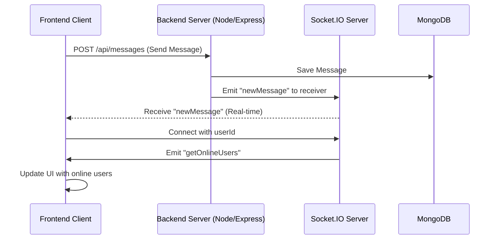

# Backend Architecture
<TOC />

## System Purpose
The backend system serves as the core infrastructure for the chat application, managing user authentication, message exchange, friend management, and real-time communication. It provides a robust and scalable API for the frontend client, ensuring secure data handling and efficient message delivery. Key functionalities include:

*   **User Authentication and Authorization**: Secure user registration, login, session management, and Google OAuth integration. ([backend/src/routes/auth.route.js](https://github.com/shinymack/Chat-App-MERN/blob/main/backend/src/routes/auth.route.js))
*   **Real-time Messaging**: Instantaneous delivery of messages between users using WebSockets. ([backend/src/lib/socket.js](https://github.com/shinymack/Chat-App-MERN/blob/main/backend/src/lib/socket.js))
*   **Friend Management**: Functionality to add, remove, and manage connections between users. ([backend/src/routes/friend.route.js](https://github.com/shinymack/Chat-App-MERN/blob/main/backend/src/routes/friend.route.js))
*   **Message Storage**: Persistence of chat messages and user data in a NoSQL database. ([backend/src/lib/db.js](https://github.com/shinymack/Chat-App-MERN/blob/main/backend/src/lib/db.js))

## System Architecture Overview
The backend follows a layered architecture, primarily operating as the application and data layers within a typical three-tier system. It exposes a RESTful API for standard operations and utilizes WebSockets for real-time communication. This design promotes separation of concerns, scalability, and maintainability.


```mermaid
graph TD
  A[Frontend Client] -->|HTTP/REST API Calls| B[Backend Server (Node.js/Express)]
  B -->|Database Operations (Mongoose)| C[MongoDB Database]
  A -->|WebSocket Connection| D[Socket.IO Server]
  B <--> D
  subgraph "Backend System"
    B
    D
    C
  end
```


*   **Frontend Client**: Interacts with the backend via HTTP requests for initial data fetching and authentication, and maintains a WebSocket connection for real-time updates.
*   **Backend Server (Node.js/Express)**: Handles all incoming HTTP requests, processes business logic, manages authentication, and interacts with the database. It also facilitates real-time communication by integrating with the Socket.IO server.
*   **Socket.IO Server**: Manages WebSocket connections, broadcasting messages and presence updates to connected clients in real-time.
*   **MongoDB Database**: Stores all persistent application data, including user profiles, messages, and friend relationships.

## Technology Stack
The backend is built upon a robust JavaScript ecosystem, leveraging Node.js and Express.js for the server runtime and API framework, respectively. MongoDB serves as the NoSQL database, and Socket.IO powers real-time functionalities.

| Layer       | Technology       | Purpose                                             | Version (from `package.json`) |
| :---------- | :--------------- | :-------------------------------------------------- | :---------------------------- |
| **Runtime** | Node.js          | JavaScript runtime environment                      | N/A                           |
| **Framework** | Express.js       | Web application framework for API development       | ^4.21.2                       |
| **Database** | MongoDB          | NoSQL database for data persistence                 | N/A                           |
| **ODM**     | Mongoose         | Object Data Modeling for MongoDB                    | ^8.9.5                        |
| **Real-time** | Socket.IO        | Bidirectional event-based communication (WebSockets) | ^4.8.1                        |
| **Authentication** | Passport.js      | Authentication middleware for Node.js             | ^0.7.0                        |
|             | bcryptjs         | Hashing library for secure password storage         | ^2.4.3                        |
|             | jsonwebtoken     | JSON Web Token implementation for secure API access | ^9.0.2                        |
| **Utilities** | dotenv           | Loads environment variables from a .env file        | ^16.4.7                       |
|             | cookie-parser    | Parse Cookie header and populate req.cookies        | ^1.4.7                        |
|             | express-session  | Session management middleware                       | ^1.18.1                       |
|             | cloudinary       | Cloud-based image and video management              | ^2.5.1                        |

### Dependencies
The `package.json` file outlines the core dependencies:

```json
{
  "dependencies": {
    "bcryptjs": "^2.4.3",
    "cloudinary": "^2.5.1",
    "cookie-parser": "^1.4.7",
    "dotenv": "^16.4.7",
    "express": "^4.21.2",
    "express-session": "^1.18.1",
    "jsonwebtoken": "^9.0.2",
    "mongoose": "^8.9.5",
    "passport": "^0.7.0",
    "passport-google-oauth20": "^2.0.0",
    "socket.io": "^4.8.1"
  },
  "devDependencies": {
    "nodemon": "^3.1.9"
  }
}
```
[View `package.json` on GitHub](https://github.com/shinymack/Chat-App-MERN/blob/main/backend/package.json#L15-L33)

This configuration reflects a modern Node.js application stack focusing on security, performance, and real-time capabilities. `nodemon` is used in development for automatic server restarts.

## Core Application Features

### Server Initialization and Middleware
The `index.js` file serves as the entry point for the backend, configuring Express.js, integrating middleware, and setting up routes. It initializes the database connection and the Socket.IO server.

```javascript
import express from "express";
import cors from "cors";
// ... other imports ...

const __dirname = path.resolve();
dotenv.config();

configurePassport();

app.use(cookieParser());
app.use(express.json({limit : '2mb'}));
app.use(express.urlencoded({ limit: '2mb', extended: true }));
app.use(cors({
    origin: "http://localhost:5173",
    credentials: true,
}));

app.use(session({
    secret: process.env.SESSION_SECRET, 
    resave: false,
    saveUninitialized: false, 
    cookie: {
        secure: process.env.NODE_ENV === "production", 
        httpOnly: true,
        maxAge: 7 * 24 * 60 * 60 * 1000 
    }
}));

app.use(passport.initialize());
app.use(passport.session());  

app.use("/api/auth", authRoutes );
app.use("/api/messages", messageRoutes );
app.use("/api/friends", friendRoutes);

// ... server listening ...
```
[View `backend/src/index.js` on GitHub](https://github.com/shinymack/Chat-App-MERN/blob/main/backend/src/index.js#L1-L54)
This snippet demonstrates the setup of essential middleware such as `cookie-parser`, `express.json` for body parsing, `cors` for cross-origin requests, and `express-session` along with `passport` for authentication. The `/api` routes are defined to handle different resource types.

### Database Connection
The `db.js` module provides a simple and robust way to establish a connection to MongoDB using Mongoose. It ensures that the application has access to persistent storage.

```javascript
import mongoose from "mongoose"

export const connectDB = async () => {
  try {
    const conn = await mongoose.connect(process.env.MONGODB_URI);
    console.log(`MongoDB connected:  ${conn.connection.host}`);
  }
  catch(error){
    console.log("MongoDB connection error: ", error);
  }
}
```
[View `backend/src/lib/db.js` on GitHub](https://github.com/shinymack/Chat-App-MERN/blob/main/backend/src/lib/db.js#L1-L9)
This asynchronous function attempts to connect to the MongoDB URI specified in environment variables and logs the connection status or any errors encountered.

### Real-time Communication with Socket.IO
The `socket.js` module sets up the Socket.IO server, enabling real-time functionalities like instant message delivery and online user presence.

```javascript
import { Server } from "socket.io";
import http from "http";
import express from "express";

const app = express();
const server = http.createServer(app);

const io = new Server(server, {
    cors: {
        origin: ["http://localhost:5173"]
    }
})

export function getReceiverSocketId(userId) {
    return userSocketMap[userId];
}

const userSocketMap = {}; //{userId : socketId}

io.on("connection", (socket) => {
    console.log("A user connected", socket.id);

    const userId = socket.handshake.query.userId;
    if(userId) userSocketMap[userId] = socket.id;

    io.emit("getOnlineUsers", Object.keys(userSocketMap));

    socket.on("disconnect", ()=>{
        console.log("A user disconnected", socket.id);
        delete userSocketMap[userId]; 
        io.emit("getOnlineUsers", Object.keys(userSocketMap));
    })
})

export { io, app, server };
```
[View `backend/src/lib/socket.js` on GitHub](https://github.com/shinymack/Chat-App-MERN/blob/main/backend/src/lib/socket.js#L1-L38)
This code initializes a Socket.IO server, configures CORS, and manages connected users by mapping `userId` to `socketId`. It emits "getOnlineUsers" events on connection and disconnection to update all clients about the current online status of users.

### Real-time Messaging Flow





This diagram illustrates the flow for sending a message. The client first sends an HTTP POST request to the backend. The backend saves the message to the database, then uses Socket.IO to instantly notify the intended receiver and potentially other relevant clients (e.g., sender for UI update) about the new message. It also shows the Socket.IO connection and online user updates.

## Key Integration Points
The backend integrates several crucial components to deliver a full-featured chat application:

*   **Authentication Flow**: `passport.js` with `express-session` and `cookie-parser` provides a secure authentication mechanism. When a user logs in, a session is established, and a cookie is set, allowing subsequent requests to be authenticated without resending credentials. `bcryptjs` ensures that user passwords are securely hashed before storage.
*   **Database Integration**: `mongoose` acts as an ODM (Object Data Modeling) layer over MongoDB. This provides a structured way to interact with the database, defining schemas for users, messages, and other data, ensuring data integrity and simplifying CRUD operations.
*   **Real-time Communication**: `socket.io` is tightly integrated with the Express server. While standard API calls handle initial data and non-real-time operations, `socket.io` manages persistent WebSocket connections for instant message delivery and live presence updates. The `userSocketMap` in `socket.js` is a critical component for targeting specific users with real-time events.
*   **API Design**: The backend exposes clear, resource-oriented RESTful API endpoints (`/api/auth`, `/api/messages`, `/api/friends`). This design promotes a clean separation between frontend and backend logic, making the system easier to understand, test, and scale.
*   **Environment Configuration**: `dotenv` is used to manage environment-specific variables, such as `MONGODB_URI`, `SESSION_SECRET`, and `PORT`. This practice enhances security by keeping sensitive information out of the codebase and allows for flexible deployment across different environments (development, production).

**Best Practices and Insights**:
*   **Separation of Concerns**: The architecture clearly separates routing, business logic (implied within route handlers and services), database interaction, and real-time communication into distinct modules, which aids in maintainability and scalability.
*   **Scalability for Real-time**: The `userSocketMap` approach allows the Socket.IO server to efficiently identify and send messages to specific online users. For larger applications, this map could be distributed across multiple Socket.IO instances using a Redis adapter.
*   **Security**: The use of `bcryptjs` for password hashing, `jsonwebtoken` for secure API tokens (implicitly used by Passport strategies), `httpOnly` cookies, and `secure` cookies in production environments demonstrates a strong focus on application security.
*   **Production Deployment**: The `if(process.env.NODE_ENV === "production")` block handles serving static files from the frontend build directory, demonstrating a common strategy for deploying full-stack applications on a single server.

Next: [Backend API Endpoints](./2.1_backend_api_endpoints.mdx)