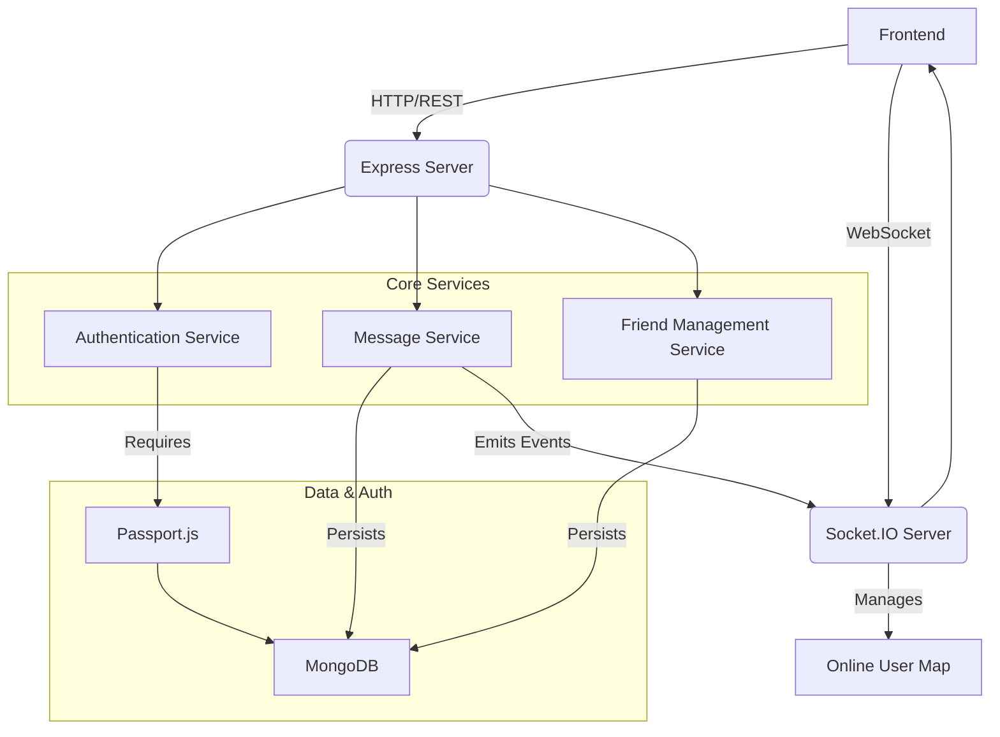
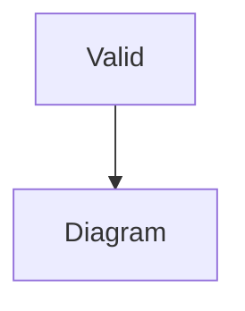

# Backend Architecture

<TOC />

The backend serves as the core of the application, handling all server-side logic, API interactions, data persistence, and real-time communication. This section provides an in-depth look at its structure, core services, and how different components interact to deliver a robust and scalable application experience.

## System Overview

The backend is built upon a Node.js ecosystem, leveraging Express.js for API routing and middleware management. It integrates MongoDB for data storage via Mongoose ODM, and Socket.IO for real-time, bidirectional event-based communication. Authentication is managed through Passport.js, supporting both local and OAuth strategies.

### Key Features

*   **RESTful API Endpoints**: Provides structured access to application resources (e.g., user authentication, message exchange, friend management).
*   **Real-time Communication**: Utilizes WebSockets for instant message delivery and online user presence updates.
*   **Database Integration**: Connects to MongoDB for persistent storage of application data.
*   **Authentication & Authorization**: Secures API endpoints and user sessions using JWTs, cookies, and OAuth (Google).
*   **Scalability**: Designed with a modular structure, enabling easier scaling of individual components.
*   **Production Readiness**: Includes configurations for serving static frontend assets in a production environment.

### Technology Stack and Dependencies

The `package.json` file outlines the core dependencies and development tools:

```json
// backend/package.json
{
  "name": "backend",
  "version": "1.0.0",
  "main": "src/index.js",
  "scripts": {
    "dev": "nodemon src/index.js",
    "start": "node src/index.js"
  },
  "dependencies": {
    "bcryptjs": "^2.4.3",
    "cloudinary": "^2.5.1",
    "cookie-parser": "^1.4.7",
    "dotenv": "^16.4.7",
    "express": "^4.21.2",
    "express-session": "^1.18.1",
    "jsonwebtoken": "^9.0.2",
    "mongoose": "^8.9.5",
    "passport": "^0.7.0",
    "passport-google-oauth20": "^2.0.0",
    "socket.io": "^4.8.1"
  },
  "devDependencies": {
    "nodemon": "^3.1.9"
  }
}
```

**Key Dependencies Explained:**

*   **`express`**: Fast, unopinionated, minimalist web framework for Node.js. Used for building the RESTful API.
*   **`mongoose`**: MongoDB object modeling tool designed to work in an asynchronous environment. Manages data schemas and interactions.
*   **`socket.io`**: Enables real-time, bidirectional, event-based communication. Crucial for chat functionality.
*   **`passport` & `passport-google-oauth20`**: Authentication middleware for Node.js. Supports various strategies, including Google OAuth 2.0.
*   **`jsonwebtoken`**: Implements JSON Web Tokens for secure information exchange.
*   **`bcryptjs`**: Library for hashing passwords.
*   **`cookie-parser`**: Parses `Cookie` header and populates `req.cookies`.
*   **`express-session`**: Simple session middleware for Express.
*   **`dotenv`**: Loads environment variables from a `.env` file.
*   **`cloudinary`**: Cloud-based image and video management (though specific usage isn't in provided files, its presence indicates media handling capabilities).
*   **`nodemon`**: (Dev Dependency) Automatically restarts the node application when file changes are detected.

### Backend System Architecture

The following diagram illustrates the high-level architecture of the backend and its interaction with external services and the frontend.





## Application Entry Point and Initialization

The primary entry point for the backend application is `src/index.js` [backend/src/index.js](https://github.com/shinymack/Chat-App-MERN/blob/main/backend/src/index.js). This file is responsible for setting up the Express application, configuring middleware, defining API routes, connecting to the database, and initiating the Socket.IO server.

```javascript
// backend/src/index.js#L1-L29
import express from "express";
import cors from "cors";
import authRoutes from "./routes/auth.route.js";
import messageRoutes from "./routes/message.route.js";
import friendRoutes from "./routes/friend.route.js";

import path from "path";

import dotenv from "dotenv";
import cookieParser from "cookie-parser";

import { connectDB } from "./lib/db.js";
import { app, server } from "./lib/socket.js";

import session from "express-session";
import passport from "passport";
import { configurePassport } from "./lib/passport.config.js";

const __dirname = path.resolve();
dotenv.config();

configurePassport();

app.use(cookieParser());
app.use(express.json({limit : '2mb'}));
app.use(express.urlencoded({ limit: '2mb', extended: true }));
app.use(cors({
    origin: "http://localhost:5173",
    credentials: true,
}));

app.use(session({
    secret: process.env.SESSION_SECRET, 
    resave: false,
    saveUninitialized: false, 
    cookie: {
        secure: process.env.NODE_ENV === "production", // true in production (HTTPS)
        httpOnly: true,
        maxAge: 7 * 24 * 60 * 60 * 1000 
        // sameSite: 'lax' // or 'none' if backend and frontend are on different domains in prod
    }
}));
```

### Middleware Configuration

The `index.js` file configures essential Express middleware:

*   **`cookieParser()`**: Parses incoming cookie headers, making `req.cookies` available.
*   **`express.json({limit: '2mb'})`**: Parses incoming requests with JSON payloads. The `limit` ensures that large payloads are handled without issues, crucial for applications that might involve file uploads (even if only metadata via JSON).
*   **`express.urlencoded({limit: '2mb', extended: true})`**: Parses incoming requests with URL-encoded payloads. `extended: true` allows for rich objects and arrays to be encoded into the URL-encoded format.
*   **`cors()`**: Enables Cross-Origin Resource Sharing. Configured to allow requests from `http://localhost:5173` (likely the frontend development server) and to include credentials (cookies, HTTP authentication).
*   **`express-session`**: Manages user sessions. The `secret` is vital for session security, and cookie settings ensure secure and persistent sessions. `httpOnly: true` prevents client-side JavaScript access to the cookie, mitigating XSS risks.
*   **`passport.initialize()`** and **`passport.session()`**: Initializes Passport.js for authentication and enables session support for Passport, allowing user data to be stored in the session.

### API Routes

The backend defines distinct API routes for different functionalities, promoting a modular and organized structure:

*   **`/api/auth`**: Handled by `authRoutes`, managing user registration, login, logout, and potentially OAuth flows.
*   **`/api/messages`**: Handled by `messageRoutes`, managing message creation, retrieval, and other message-related operations.
*   **`/api/friends`**: Handled by `friendRoutes`, managing friend requests, approvals, and friend lists.

This separation of concerns makes the codebase more maintainable and scalable.

### Production Build Serving

For production deployments, the backend is configured to serve the static assets of the frontend. This is a common practice in full-stack applications where the frontend is built into static files.

```javascript
// backend/src/index.js#L54-L59
if(process.env.NODE_ENV === "production"){
    app.use(express.static(path.join(__dirname, "../frontend/dist")));
    
    app.get("*" , (req, res) => {
        res.sendFile(path.join(__dirname,"../frontend", "dist","index.html"));
    })
}
```

This ensures that any request not matching an API route will serve the `index.html` file of the compiled frontend, allowing client-side routing to take over.

## Database Management

The `src/lib/db.js` file handles the connection to MongoDB using Mongoose.

```javascript
// backend/src/lib/db.js
import mongoose from "mongoose"

export const connectDB = async () => {
  try {
    const conn = await mongoose.connect(process.env.MONGODB_URI);
    console.log(`MongoDB connected:  ${conn.connection.host}`);
  }
  catch(error){
    console.log("MongoDB connection error: ", error);
  }
}
```

The `connectDB` function asynchronously establishes a connection to the MongoDB database using the URI provided in `process.env.MONGODB_URI`. This ensures that sensitive database credentials are kept out of the codebase and managed via environment variables. The connection attempt includes error handling to log any issues during the connection process.

## Real-time Communication with Socket.IO

The `src/lib/socket.js` file is dedicated to setting up and managing the Socket.IO server, enabling real-time features like instant messaging and online user presence.

```javascript
// backend/src/lib/socket.js#L1-L26
import { Server } from "socket.io";
import http from "http";
import express from "express";

const app = express();

const server = http.createServer(app);

const io = new Server(server, {
    cors: {
        origin: ["http://localhost:5173"]
    }
})

export function getReceiverSocketId(userId) {
    return userSocketMap[userId];
}

// used to store online users
const userSocketMap = {}; //{userId : socketId}

io.on("connection", (socket) => {
    console.log("A user connected", socket.id);

    const userId = socket.handshake.query.userId;
    if(userId) userSocketMap[userId] = socket.id;

    io.emit("getOnlineUsers", Object.keys(userSocketMap));

    socket.on("disconnect", ()=>{
        console.log("A user disconnected", socket.id);
        delete userSocketMap[userId]; 
        io.emit("getOnlineUsers", Object.keys(userSocketMap));
    })
})
```

### Socket.IO Server Setup

*   An `express` app is created, and an `http` server is then created using this Express app. This is a standard pattern when integrating Socket.IO with an existing Express application, allowing both HTTP requests and WebSocket connections to be served on the same port.
*   The `Server` instance from `socket.io` is initialized with the `http` server.
*   CORS is configured specifically for Socket.IO to allow connections from the frontend development server (`http://localhost:5173`).

### Online User Management

A `userSocketMap` object is maintained to keep track of currently online users. This map stores `userId: socketId` pairs, enabling the server to efficiently target specific users for real-time messages or notifications.

*   **`getReceiverSocketId(userId)`**: A utility function to retrieve the `socketId` of a specific user, crucial for direct messaging.
*   **`io.on("connection", ...)`**: This event listener fires whenever a new client establishes a WebSocket connection.
    *   It extracts the `userId` from the handshake query parameters.
    *   If a `userId` is present, it's added to `userSocketMap`.
    *   The `getOnlineUsers` event is emitted to all connected clients, providing an updated list of online users.
*   **`socket.on("disconnect", ...)`**: This listener triggers when a client disconnects.
    *   The corresponding `userId` is removed from `userSocketMap`.
    *   The `getOnlineUsers` event is again emitted to update all clients about the change in online user status.

This design ensures that the frontend always has an up-to-date view of who is currently online, which is essential for a real-time chat application.

### Socket.IO Interaction Flow





## Best Practices and Insights

*   **Environment Variables**: The consistent use of `dotenv` and `process.env` for sensitive information (like `MONGODB_URI`, `SESSION_SECRET`, `PORT`) is a crucial security best practice, preventing hardcoded credentials.
*   **Modular Routing**: Separating routes into `auth.route.js`, `message.route.js`, and `friend.route.js` enhances code organization, making it easier to manage and scale the API.
*   **Session Management**: `express-session` with `httpOnly` and `secure` cookie flags (in production) provides a robust and secure way to manage user sessions.
*   **CORS Configuration**: Explicitly defining `origin` and `credentials` in both Express and Socket.IO CORS configurations is important for security and correct cross-origin communication.
*   **Real-time Scalability**: While `userSocketMap` is suitable for smaller applications, for very large-scale systems, this map might need to be replaced with a distributed store (e.g., Redis) to handle multiple backend instances effectively.
*   **Error Handling**: The `connectDB` function includes basic error logging. Expanding error handling across all API routes and middleware would further improve the backend's robustness.

This backend architecture provides a solid foundation for a modern, real-time application, demonstrating effective use of Node.js, Express, MongoDB, and Socket.IO.

---

Next: [Authentication & Authorization](./2.1_backend_auth_auth.mdx)