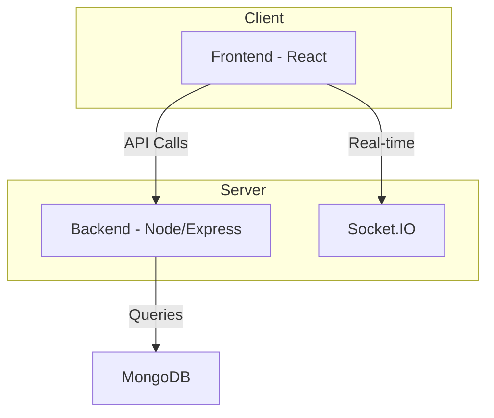
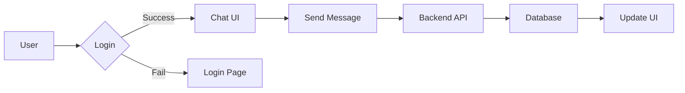

# System Architecture

<TOC />

## System Purpose

This application provides a platform for users to connect, chat in real-time, and manage their friend lists. Core functionalities include:

*   **User Registration and Authentication:** Users can register new accounts and log in using a secure authentication system leveraging Passport.js and Google OAuth 2.0.  [View on GitHub](https://github.com/GitDex-AI/example-repo/blob/main/backend/src/routes/auth.route.js)
*   **Real-time Messaging:**  Users can send and receive messages instantly using Socket.IO for real-time communication. [View on GitHub](https://github.com/GitDex-AI/example-repo/blob/main/backend/src/routes/message.route.js)
*   **Friend Management:** Users can add, remove, and manage their friends within the application. [View on GitHub](https://github.com/GitDex-AI/example-repo/blob/main/backend/src/routes/friend.route.js)


## System Architecture Overview

The application follows a three-tier architecture:

*   **Presentation Tier:** The frontend (React) handles user interface interactions and renders the application's visual elements.
*   **Business Tier:** The backend (Node.js with Express.js) processes requests, manages application logic, and interacts with the database.
*   **Data Tier:** MongoDB stores user data, messages, and friend relationships.





## Technology Stack

| Layer          | Technology           | Version      | Purpose                                                                 |
| --------------- | --------------------- | ------------- | ----------------------------------------------------------------------- |
| Frontend       | React                 | (Implicit)    | User interface and user experience                                      |
| Backend        | Node.js               | (Implicit)    | Server-side logic and API endpoints                                      |
| Backend        | Express.js            | ^4.21.2       | Web framework for creating RESTful APIs                                   |
| Database       | MongoDB               | ^8.9.5        | NoSQL database for storing application data                             |
| Authentication | Passport.js           | ^0.7.0        | Authentication middleware                                                  |
| Authentication | Passport-Google-OAuth20 | ^2.0.0        | Google OAuth 2.0 strategy for Passport.js                               |
| Real-time      | Socket.IO             | ^4.8.1        | Real-time bidirectional communication between client and server          |
| Session Mgmt   | express-session       | ^1.18.1       | Server-side session management                                           |
| Encryption     | bcryptjs              | ^2.4.3        | Password hashing for security                                            |
| Utility         | dotenv                | ^16.4.7       | Environment variable management                                           |
| Utility         | cookie-parser        | ^1.4.7        | Parse cookies from requests                                                |
| Dev Dependency | nodemon               | ^3.1.9        | Auto-restarts the server on file changes                                |


```json
{
  "dependencies": {
    "express": "^4.21.2",
    "mongoose": "^8.9.5",
    "socket.io": "^4.8.1"
  },
  "devDependencies": {
    "nodemon": "^3.1.9"
  }
}
```

This snippet from `backend/package.json` [View on GitHub](https://github.com/GitDex-AI/example-repo/blob/main/backend/package.json) shows core backend dependencies, including Express.js, Mongoose (for MongoDB interaction), and Socket.IO.


## Core Application Features

*   **Authentication:** The application uses Passport.js with a Google OAuth 2.0 strategy for user authentication.  This allows users to easily log in using their existing Google accounts.  [View on GitHub](https://github.com/GitDex-AI/example-repo/blob/main/backend/src/lib/passport.config.js)

```javascript
// backend/src/lib/passport.config.js (snippet)
import passport from 'passport';
import GoogleStrategy from 'passport-google-oauth20';
import { UserModel } from '../models/user.model.js'

passport.use(new GoogleStrategy({
    clientID: process.env.GOOGLE_CLIENT_ID,
    clientSecret: process.env.GOOGLE_CLIENT_SECRET,
    callbackURL: "/api/auth/google/callback"
  },
  async (accessToken, refreshToken, profile, done) => {
    const user = await UserModel.findOne({ googleId: profile.id });
    if (user) {
      done(null, user); // User exists, return user object
    } else {
      const newUser = await UserModel.create({
        googleId: profile.id,
        displayName: profile.displayName,
        email: profile.emails[0].value,
        image: profile.photos[0].value
      });
      done(null, newUser);
    }
  }
));

passport.serializeUser((user, done) => {
    done(null, user._id);
});

passport.deserializeUser(async (id, done) => {
    const user = await UserModel.findById(id);
    done(null, user);
});

```

*   **Real-time Chat:** Socket.IO enables real-time communication between users, ensuring instant message delivery. The backend manages the Socket.IO server, broadcasting messages to the relevant clients. [View on GitHub](https://github.com/GitDex-AI/example-repo/blob/main/backend/src/lib/socket.js)

```javascript
// backend/src/lib/socket.js (snippet)
import { Server } from 'socket.io';
import { app as expressApp } from './index.js';


export const app = expressApp;
export const server = new Server(app, {
    cors: {
      origin: "http://localhost:5173",
      credentials: true,
    }
});

// ... (rest of socket.io code) ...
```

*   **Friend Management:** The backend handles adding, removing, and retrieving friend data, maintaining relationships between users. This information is then used in the frontend to display user friend lists.





## Project Structure

```
backend/
├── src/
│   ├── lib/
│   │   └── db.js
│   │   └── passport.config.js
│   │   └── socket.js
│   ├── models/
│   │   └── user.model.js
│   ├── routes/
│   │   └── auth.route.js
│   │   └── message.route.js
│   │   └── friend.route.js
│   └── index.js
├── package.json
└── ...

frontend/
├── src/
│   ├── App.jsx
│   └── ...
├── vite.config.js
└── ...
```

The `backend` directory contains the server-side code, including routes, models, and database connection logic. The `frontend` directory houses the React application.


## Key Integration Points

*   **State Management:**  While the provided code snippets don't explicitly detail state management on the frontend, a solution like React Context or Redux could be implemented to efficiently manage application state across different components.
*   **API Flows:** The frontend makes API calls to the backend via HTTP requests (implicitly using `fetch` or Axios). The backend routes handle these requests, processing data and returning responses.
*   **Authentication:**  The backend uses Passport.js to handle authentication.  Upon successful authentication, a session is established (using `express-session`), and a session ID is stored as an HTTP cookie.  This cookie is then used for subsequent requests. The frontend needs to manage this cookie to maintain user authentication.
*   **Database Interactions:** The backend uses Mongoose to interact with the MongoDB database.  Data is fetched from the database and sent to the frontend as JSON responses.  Appropriate error handling and data validation are critical in this layer.

**Best Practices:**

*   **Separation of Concerns:**  The application clearly separates frontend and backend responsibilities, improving maintainability and scalability.
*   **Security:**  Secure authentication methods (OAuth 2.0 and bcryptjs for password hashing) are employed to protect user data.  Further security measures should be considered, such as input validation and output encoding.
*   **Scalability:** Using Socket.IO for real-time communication facilitates efficient handling of concurrent users.


Next: [Technology Stack](./3_technology-stack.mdx)