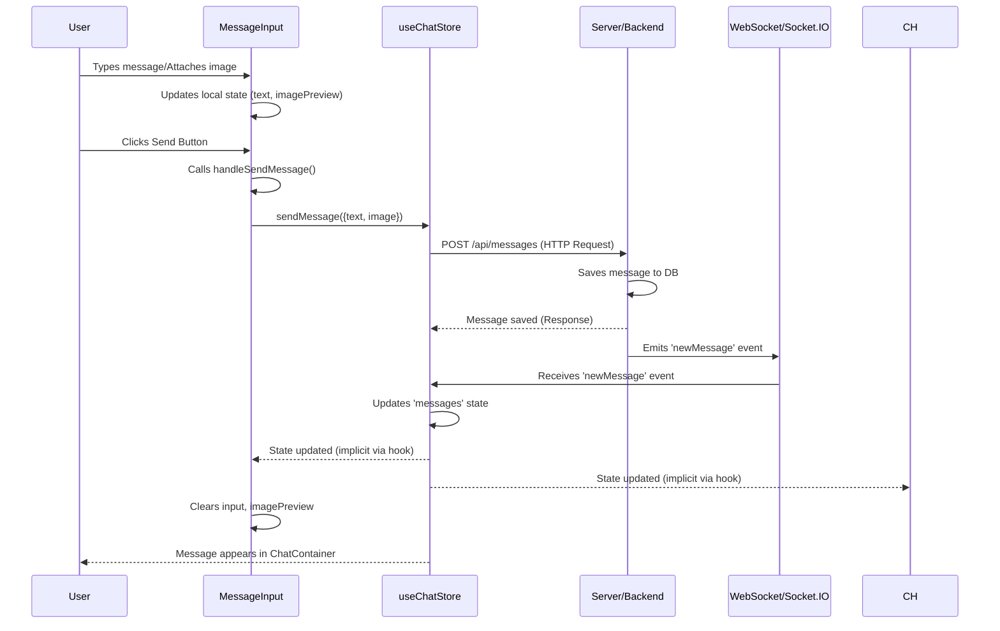

---
title: "Core UI Components and Pages"
description: "Description of major React components and application pages responsible for rendering the chat interface."
sidebar_position: 31
---

# Core UI Components and Pages

<TOC />

This section details the primary React components and pages that constitute the user interface for the chat application. These components are responsible for rendering the chat interface, managing user interactions, displaying messages, and handling user selection within the frontend.

## System Purpose

The core UI components are designed to provide a dynamic and responsive chat experience. They manage the display of chat messages, user lists, and input mechanisms, ensuring real-time updates and an intuitive user interface.

*   **`HomePage`**: The main entry point for the authenticated user, orchestrating the layout and conditional rendering of other major components.
*   **`Sidebar`**: Displays a list of available chat partners (friends), allowing users to select a conversation. It also provides a filter to show only online users.
*   **`ChatContainer`**: Renders the conversation for the currently selected user, including message history, sender/receiver differentiation, and attachment previews.
*   **`MessageInput`**: Provides the interface for users to compose and send text messages and attach images.

## Architecture

The frontend architecture follows a component-based approach, leveraging React for declarative UI construction. Components interact primarily through a centralized state management system (`useChatStore`, `useAuthStore`) and local component state. `HomePage` acts as the orchestrator, conditionally rendering `ChatContainer` or `NoChatSelected` based on the `selectedUser` state, and `Sidebar` always remains visible for navigation.


```mermaid
graph TD
    A["HomePage (Page)"] --> B["Sidebar (Component)"];
    A --> C{"selectedUser?"};
    C -- Yes --> D["ChatContainer (Component)"];
    C -- No --> E["NoChatSelected (Component)"];
    D --> F["ChatHeader (Component)"];
    D --> G["MessageInput (Component)"];
    B --> H["UserList (Friends)"];
    G --> I["ImagePreview"];

    subgraph State Management
        J["useChatStore"] -- Provides --> B;
        J -- Provides --> D;
        J -- Provides --> G;
        K["useAuthStore"] -- Provides --> D;
        K -- Provides --> B;
    end
    J -- Manages --> "selectedUser, messages, users, isMessagesLoading";
    K -- Manages --> "authUser, onlineUsers";
```


## Technology Stack

The frontend primarily utilizes React with a combination of state management hooks and libraries for a responsive and interactive user experience.

| Layer/Aspect         | Technology/Library       | Purpose                                                                                                 |
| :------------------- | :----------------------- | :------------------------------------------------------------------------------------------------------ |
| **Frontend Framework** | React                    | Building the user interface with a component-based approach.                                            |
| **State Management** | Zustand (via `useChatStore`, `useAuthStore`) | Lightweight, performant state management for global application state (e.g., messages, users, auth).    |
| **Styling**          | Tailwind CSS (via DaisyUI) | Utility-first CSS framework for rapid UI development and responsive design; DaisyUI provides component styles. |
| **Icons**            | Lucide React             | A set of open-source SVG icons integrated into React components.                                        |
| **Notifications**    | React Hot Toast          | Simple and beautiful toast notifications for user feedback (e.g., error messages).                       |
| **Time Formatting**  | Custom Utility (`formatMessageTime`) | Helper function for displaying human-readable message timestamps.                                     |

## Features

### Homepage Layout and Routing

The `HomePage` component ([View on GitHub](https://github.com/shinymack/Chat-App-MERN/blob/main/frontend/src/pages/HomePage.jsx)) serves as the main application shell, structuring the chat interface into a responsive two- or three-column layout. It conditionally renders the `ChatContainer` when a user is selected or `NoChatSelected` otherwise.

```jsx
// frontend/src/pages/HomePage.jsx
import ChatContainer from "../components/ChatContainer";
import FriendsBox from "../components/FriendsBox";
import NoChatSelected from "../components/NoChatSelected";
import Sidebar from "../components/Sidebar";
import { useChatStore } from "../store/useChatStore"

const HomePage = () => {
  const { selectedUser } = useChatStore();
  const { isFriendsBoxOpen } = useChatStore();
  return (
      <div className="h-screen bg-base-200">
      <div className="flex items-center justify-center pt-20 px-4 w-full">
        <div className="bg-base-100 rounded-lg shadow-xl w-full max-w-6xl h-[calc(100vh-8rem)]">
          <div className="flex h-full rounded-lg overflow-hidden w-full">
            <Sidebar />
            {!selectedUser ? <NoChatSelected /> : <ChatContainer />}
            {isFriendsBoxOpen && <FriendsBox />}
          </div>
        </div>
      </div>
    </div>
  )
}

export default HomePage
```

This snippet from [frontend/src/pages/HomePage.jsx#L8-L24](https://github.com/shinymack/Chat-App-MERN/blob/main/frontend/src/pages/HomePage.jsx#L8-L24) shows the core rendering logic. The `selectedUser` state, managed by `useChatStore`, dictates whether the chat messages are displayed (`ChatContainer`) or a placeholder (`NoChatSelected`). This design ensures a clean initial state and smooth transitions between chat partners. The `FriendsBox` component, though not provided in the files, suggests a potential third column or modal for managing friend requests or discovering new contacts.

### Sidebar Navigation and User Listing

The `Sidebar` component ([View on GitHub](https://github.com/shinymack/Chat-App-MERN/blob/main/frontend/src/components/Sidebar.jsx)) displays a list of the user's friends, allowing selection to initiate or continue a chat. It integrates with `useChatStore` to fetch friends and `useAuthStore` to determine online status.

```jsx
// frontend/src/components/Sidebar.jsx
import { useEffect, useState } from "react";
import { useChatStore } from "../store/useChatStore";
import SidebarSkeleton from "./skeletons/SidebarSkeleton";
import { Users } from "lucide-react";
import { useAuthStore } from "../store/useAuthStore";

const Sidebar = () => {
    const { getFriends, users, selectedUser, setSelectedUser, isUsersLoading } =
        useChatStore();

    const { onlineUsers } = useAuthStore();
    const [showOnlineOnly, setShowOnlineOnly] = useState(false);
    useEffect(() => {
        getFriends();
    }, [getFriends]);
    const filteredUsers = showOnlineOnly
        ? users.filter((user) => onlineUsers.includes(user._id))
        : users;
    if (isUsersLoading) return <SidebarSkeleton />;
    return (
        <div className={`h-full sm:w-72 sm:border-r border-base-300  flex-col transition-all duration-200 ${selectedUser ?
                                    "hidden sm:flex w-[100vw] "
                                    : ""}`}>
            {/* ... truncated for brevity ... */}
            <div className="overflow-y-scroll h-[calc(100vh-14rem)] w-full flex flex-col py-3">
                    {filteredUsers.map((user) => (
                        <button
                            key={user._id}
                            onClick={() => setSelectedUser(user)}
                            className={`sm:w-full w-[88vw] p-3 flex items-center gap-3 hover:bg-base-300 transition-colors
                            ${
                                selectedUser?._id === user._id
                                    ? "bg-base-300 ring-1 ring-base-300"
                                    : ""
                            }`}
                        >
                            <div className="relative mx-0">
                                
                                {onlineUsers.includes(user._id) && (
                                    <span className="absolute bottom-0 right-0 size-3 bg-green-500 rounded-full ring-2 ring-zinc-900" />
                                )}
                            </div>
                            <div className=" block text-left min-w-0">
                                <div className=" font-medium truncate">
                                    {user.username}
                                </div>
                                <div className="text-sm text-zinc-400">
                                    {onlineUsers.includes(user._id)
                                        ? "Online"
                                        : "Offline"}
                                </div>
                            </div>
                        </button>
                    ))}
                </div>
            {/* ... truncated for brevity ... */}
        </div>
    );
};

export default Sidebar;
```

The `useEffect` hook in [frontend/src/components/Sidebar.jsx#L13-L15](https://github.com/shinymack/Chat-App-MERN/blob/main/frontend/src/components/Sidebar.jsx#L13-L15) fetches the friend list upon component mount. The `filteredUsers` logic dynamically updates the displayed list based on the `showOnlineOnly` toggle and `onlineUsers` from the `useAuthStore`. This design allows for efficient user discovery and selection. A subtle but important detail is the conditional `hidden sm:flex w-[100vw]` class, which hides the sidebar on small screens when a user is selected, prioritizing the chat view.

### Chat Message Display and Real-time Updates

The `ChatContainer` component ([View on GitHub](https://github.com/shinymack/Chat-App-MERN/blob/main/frontend/src/components/ChatContainer.jsx)) is responsible for displaying the messages for the currently selected chat partner. It fetches messages, subscribes to real-time updates, and manages scroll behavior.

```jsx
// frontend/src/components/ChatContainer.jsx
import { useEffect } from "react";
import { useChatStore } from "../store/useChatStore";
import ChatHeader from "./ChatHeader";
import MessageInput from "./MessageInput";
import MessageSkeleton from "./skeletons/MessageSkeleton";
import { useAuthStore } from "../store/useAuthStore";
import { formatMessageTime } from "../lib/utils";
import { useRef } from "react";

const ChatContainer = () => {
    const { messages, getMessages, isMessagesLoading, selectedUser, subscribeToMessages, unsubscribeFromMessages } =
        useChatStore();
    const { authUser } = useAuthStore();
    const messageEndRef = useRef(null);


    useEffect(() => {
        getMessages(selectedUser._id);
        subscribeToMessages();

        return () => unsubscribeFromMessages();
    }, [selectedUser._id, getMessages, subscribeToMessages, unsubscribeFromMessages]);
    
    useEffect(() => {
        if(messageEndRef.current && messages){
            messageEndRef.current.scrollIntoView({behaviour : "smooth"})
        }
    }, [messages])

    if (isMessagesLoading)
        return (
            <div className="flex-1 flex flex-col overflow-auto">
                <ChatHeader />
                <MessageSkeleton />
                <MessageInput />
            </div>
        );
    return (
        <div className="flex-1 flex flex-col overflow-auto">
            <ChatHeader />
            <div className="flex-1 overflow-y-auto p-4 space-y-4">
                {messages.map((message) => (
                    <div
                        key={message._id}
                        className={`chat ${message.senderId == authUser._id ? "chat-end": "chat-start"} `}
                        ref={messageEndRef}
                    >
                        <div className="chat-image avatar">
                            <div className="size-9 rounded-full border">
                                
                            </div>
                        </div>
                        <div className="chat-header mb-1">
                            <time className="text-xs opacity-50 ml-1">{formatMessageTime(message.createdAt)}</time>
                        </div>
                        <div className="chat-bubble flex flex-col">
                            {message.image && (
                                
                            )}
                            {message.text && <p>{message.text}</p>}
                        </div>
                    </div>
                ))}
            </div>
            <MessageInput />
        </div>
    );
};

export default ChatContainer;
```

The `useEffect` hook from [frontend/src/components/ChatContainer.jsx#L14-L19](https://github.com/shinymack/Chat-App-MERN/blob/main/frontend/src/components/ChatContainer.jsx#L14-L19) is crucial for fetching messages when a user is selected and setting up real-time message subscriptions. The cleanup function ensures that subscriptions are properly terminated when the component unmounts or `selectedUser` changes, preventing memory leaks and stale data. The `messageEndRef` and its associated `useEffect` (lines [frontend/src/components/ChatContainer.jsx#L21-L25](https://github.com/shinymack/Chat-App-MERN/blob/main/frontend/src/components/ChatContainer.jsx#L21-L25)) ensure that the chat automatically scrolls to the latest message, providing a seamless user experience. Messages are styled differently based on `senderId` to distinguish between sent and received messages.

### Message Input with Image Attachments

The `MessageInput` component ([View on GitHub](https://github.com/shinymack/Chat-App-MERN/blob/main/frontend/src/components/MessageInput.jsx)) provides the interface for composing messages and attaching images.

```jsx
// frontend/src/components/MessageInput.jsx
import { useRef, useState } from "react";
import { useChatStore } from "../store/useChatStore";
import { Image, Send, X } from "lucide-react";
import toast from "react-hot-toast";

const MessageInput = () => {
    const [text, setText] = useState("");
    const [imagePreview, setImagePreview] = useState(null);
    const fileInputRef = useRef(null);
    const { sendMessage } = useChatStore();

    const handleImageChange = (e) => {
        const file = e.target.files[0];
        if (!file.type.startsWith("image/")) {
            toast.error("Please select an image file");
            return;
        }

        const reader = new FileReader();
        reader.onloadend = () => {
            setImagePreview(reader.result);
        };
        reader.readAsDataURL(file);
    };

    const removeImage = () => {
        setImagePreview(null);
        if (fileInputRef.current) fileInputRef.current.value = "";
    };

    const handleSendMessage = async (e) => {
        e.preventDefault();
        if (!text.trim() && !imagePreview) return;

        try {
            await sendMessage({
                text: text.trim(),
                image: imagePreview,
            });

            setText("");
            setImagePreview(null);
            if (fileInputRef.current) fileInputRef.current = "";
        } catch (error) {
            console.error("Failed to send message", error);
        }
    };

    return (
        <div className="p-4 w-full">
            {imagePreview && (
                <div className="mb-3 flex items-center gap-2">
                    <div className="relative">
                        
                        <button
                            onClick={removeImage}
                            className="absolute -top-1.5 -right-1.5 w-5 h-5 rounded-full bg-base-300
              flex items-center justify-center"
                            type="button"
                        >
                            <X className="size-3" />
                        </button>
                    </div>
                </div>
            )}

            <form
                onSubmit={handleSendMessage}
                className="flex items-center gap-2"
            >
                {/* ... truncated for brevity ... */}
            </form>
        </div>
    );
};

export default MessageInput;
```

The `handleImageChange` function from [frontend/src/components/MessageInput.jsx#L14-L24](https://github.com/shinymack/Chat-App-MERN/blob/main/frontend/src/components/MessageInput.jsx#L14-L24) handles image selection, performing basic validation (image type check) and creating a preview using `FileReader`. This provides immediate visual feedback to the user before sending. The `handleSendMessage` function ([frontend/src/components/MessageInput.jsx#L29-L43](https://github.com/shinymack/Chat-App-MERN/blob/main/frontend/src/components/MessageInput.jsx#L29-L43)) dispatches the message and image data via `useChatStore`'s `sendMessage` action and then clears the input fields, maintaining a clean state.

Here's a sequence diagram illustrating the message sending flow:





## Key Integration Points

These UI components are tightly integrated with the application's state management and backend services:

*   **State Management (Zustand)**: All core UI components rely heavily on `useChatStore` and `useAuthStore` for data (e.g., `messages`, `users`, `selectedUser`, `authUser`, `onlineUsers`) and actions (e.g., `getMessages`, `sendMessage`, `getFriends`, `setSelectedUser`, `subscribeToMessages`, `unsubscribeFromMessages`). This centralized state ensures data consistency and simplifies component logic.
*   **API Flows**: `ChatContainer` and `Sidebar` trigger API calls (via their respective store actions) to fetch initial messages and user lists. `MessageInput` initiates API calls to send new messages, potentially including image uploads.
*   **Authentication**: `useAuthStore` provides the `authUser` context, essential for determining message sender, displaying the user's profile picture, and differentiating chat bubbles. It also provides `onlineUsers` for real-time presence indicators.
*   **Real-time Communication**: `ChatContainer` specifically subscribes to and unsubscribes from real-time message updates, ensuring that new messages appear instantly without requiring page refreshes. This is critical for a responsive chat application.
*   **Scalability Insights**: The use of `useEffect` for data fetching and cleanup is crucial for performance and preventing memory leaks, especially in a dynamic chat environment. The `messageEndRef` for auto-scrolling is a user experience enhancement that becomes more critical as message history grows. The client-side image preview and validation in `MessageInput` reduce server load and improve user feedback. Implementing pagination for messages in `ChatContainer` and users in `Sidebar` would be a key next step for handling very large datasets, although not currently present in the provided snippets. The current design allows for easy extension, such as adding more message types (e.g., videos, files) or reactions, by modifying the `MessageInput` and `ChatContainer` rendering logic.

Next: [State Management and Utilities](./3.2_state-management-and-utilities.mdx)
```