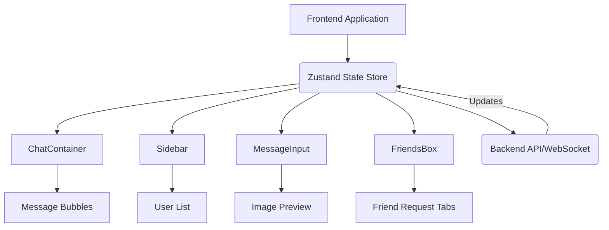

# Frontend Components

<TOC />

## Reusable UI Elements

The frontend of the application is built using React, leveraging a component-based architecture to create modular and reusable UI elements. These components encapsulate specific functionalities, manage their own state, and interact with global application state via Zustand for efficient data flow. This section details the core UI components that form the chat and friend management interfaces.

### Core Component Responsibilities

*   **`ChatContainer.jsx`**: Manages the display of messages for a selected user, handles real-time message updates, and integrates the message input form.
*   **`Sidebar.jsx`**: Displays a list of friends, indicates their online status, and allows users to filter by online status and select a conversation partner.
*   **`MessageInput.jsx`**: Provides an interface for typing and sending text messages, including functionality for attaching and previewing image files.
*   **`FriendsBox.jsx`**: A modal component that enables users to manage their friends, including sending, accepting, rejecting friend requests, and removing friends.

## Component Interaction Overview

The frontend components interact extensively with the application's state management system (Zustand) and leverage web sockets for real-time communication. This ensures a dynamic and responsive user experience, particularly for chat and friend request functionalities.





## Detailed Component Breakdown

### ChatContainer Component

The `ChatContainer` component is responsible for rendering the conversation view for the currently selected user. It fetches and displays messages, manages the auto-scrolling to the latest message, and subscribes to real-time message updates to ensure the chat view is always current.

*   **Message Display**: Iterates through the `messages` array from the `useChatStore` to display individual messages.
*   **Sender Identification**: Determines if a message was sent by the authenticated user or the selected contact to apply appropriate styling (`chat-end` or `chat-start`).
*   **Real-time Updates**: Uses `useEffect` to subscribe to new messages via `subscribeToMessages` and `unsubscribeFromMessages` methods from the `useChatStore`, ensuring messages are updated in real-time.
*   **Image Support**: Displays attached images within chat bubbles if `message.image` is present.
*   **Loading State**: Renders `MessageSkeleton` while messages are being loaded, providing a better user experience.
*   **Auto-scrolling**: Employs `useRef` and `useEffect` to automatically scroll to the bottom of the chat container when new messages arrive.

An excerpt from `ChatContainer.jsx` showing message rendering logic:
```jsx
// frontend/src/components/ChatContainer.jsx
// ... (imports)

const ChatContainer = () => {
    const { messages, getMessages, isMessagesLoading, selectedUser, subscribeToMessages, unsubscribeFromMessages } =
        useChatStore();
    const { authUser } = useAuthStore();
    const messageEndRef = useRef(null);

    useEffect(() => {
        getMessages(selectedUser._id);
        subscribeToMessages();

        return () => unsubscribeFromMessages();
    }, [selectedUser._id, getMessages, subscribeToMessages, unsubscribeFromMessages]);
    
    useEffect(() => {
        if(messageEndRef.current && messages){
            messageEndRef.current.scrollIntoView({behaviour : "smooth"})
        }
    }, [messages])

    if (isMessagesLoading)
        return (
            <div className="flex-1 flex flex-col overflow-auto">
                <ChatHeader />
                <MessageSkeleton />
                <MessageInput />
            </div>
        );
    return (
        <div className="flex-1 flex flex-col overflow-auto">
            <ChatHeader />
            <div className="flex-1 overflow-y-auto p-4 space-y-4">
                {messages.map((message) => (
                    <div
                        key={message._id}
                        className={`chat ${message.senderId == authUser._id ? "chat-end": "chat-start"} `}
                        ref={messageEndRef}
                    >
                        <div className="chat-image avatar">
                            <div className="size-9 rounded-full border">
                                
                            </div>
                        </div>
                        <div className="chat-header mb-1">
                            <time className="text-xs opacity-50 ml-1">{formatMessageTime(message.createdAt)}</time>
                        </div>
                        <div className="chat-bubble flex flex-col">
                            {message.image && (
                                
                            )}
                            {message.text && <p>{message.text}</p>}
                        </div>
                    </div>
                ))}
            </div>
            <MessageInput />
        </div>
    );
};

export default ChatContainer;
```
[View on GitHub](https://github.com/shinymack/Chat-App-MERN/blob/main/frontend/src/components/ChatContainer.jsx#L1-L80)

### Sidebar Component

The `Sidebar` component provides navigation and an overview of the user's friends. It fetches the list of friends, displays their online/offline status, and allows users to select a friend to initiate a chat.

*   **Friend List Display**: Fetches friends using `getFriends` from `useChatStore` and renders them in a scrollable list.
*   **Online Status**: Integrates with `onlineUsers` from `useAuthStore` to visually indicate which friends are currently online.
*   **Filtering**: Provides a checkbox to filter the displayed friends to show "online only" users.
*   **User Selection**: Allows users to click on a friend to set them as the `selectedUser` for conversation.
*   **Responsiveness**: Adapts its visibility based on `selectedUser` status, hiding itself on smaller screens when a user is selected.

Code snippet from `Sidebar.jsx` showing user rendering and online status:
```jsx
// frontend/src/components/Sidebar.jsx
// ... (imports)

const Sidebar = () => {
    const { getFriends, users, selectedUser, setSelectedUser, isUsersLoading } =
        useChatStore();

    const { onlineUsers } = useAuthStore();
    const [showOnlineOnly, setShowOnlineOnly] = useState(false);
    useEffect(() => {
        getFriends();
    }, [getFriends]);
    const filteredUsers = showOnlineOnly
        ? users.filter((user) => onlineUsers.includes(user._id))
        : users;
    if (isUsersLoading) return <SidebarSkeleton />;
    return (
        <div className={`h-full sm:w-72 sm:border-r border-base-300  flex-col transition-all duration-200 ${selectedUser ?
                                    "hidden sm:flex w-[100vw] "
                                    : ""}`}>
            {/* ... (header and filter) */}
            <div className="overflow-y-scroll h-[calc(100vh-14rem)] w-full flex flex-col py-3">
                {filteredUsers.map((user) => (
                    <button
                        key={user._id}
                        onClick={() => setSelectedUser(user)}
                        className={`sm:w-full w-[88vw] p-3 flex items-center gap-3 hover:bg-base-300 transition-colors
                        ${
                            selectedUser?._id === user._id
                                ? "bg-base-300 ring-1 ring-base-300"
                                : ""
                        }`}
                    >
                        <div className="relative mx-0">
                            
                            {onlineUsers.includes(user._id) && (
                                <span className="absolute bottom-0 right-0 size-3 bg-green-500 rounded-full ring-2 ring-zinc-900" />
                            )}
                        </div>
                        <div className=" block text-left min-w-0">
                            <div className=" font-medium truncate">
                                {user.username}
                            </div>
                            <div className="text-sm text-zinc-400">
                                {onlineUsers.includes(user._id)
                                    ? "Online"
                                    : "Offline"}
                            </div>
                        </div>
                    </button>
                ))}
            </div>
            {filteredUsers.length == 0 && (
                <div className="text-center text-zinc-500 py-4">No online friends</div>
            )}
        </div>
    );
};

export default Sidebar;
```
[View on GitHub](https://github.com/shinymack/Chat-App-MERN/blob/main/frontend/src/components/Sidebar.jsx#L1-L85)

### MessageInput Component

The `MessageInput` component facilitates sending messages, including text and image attachments. It manages local state for the message text and image preview, and interacts with the `useChatStore` to dispatch send message actions.

*   **Text Input**: A standard input field for typing text messages.
*   **Image Attachment**: Allows users to select an image file, displays a preview, and includes an option to remove the selected image.
*   **Validation**: Ensures that at least text or an image is present before attempting to send a message.
*   **State Management**: Uses local `useState` for `text` and `imagePreview`, and `useRef` for the file input to manage file selection.
*   **Error Handling**: Displays toast notifications for invalid file types.

Snippet showing image handling and form submission:
```jsx
// frontend/src/components/MessageInput.jsx
// ... (imports)

const MessageInput = () => {
    const [text, setText] = useState("");
    const [imagePreview, setImagePreview] = useState(null);
    const fileInputRef = useRef(null);
    const { sendMessage } = useChatStore();

    const handleImageChange = (e) => {
        const file = e.target.files[0];
        if (!file.type.startsWith("image/")) {
            toast.error("Please select an image file");
            return;
        }

        const reader = new FileReader();
        reader.onloadend = () => {
            setImagePreview(reader.result);
        };
        reader.readAsDataURL(file);
    };

    const removeImage = () => {
        setImagePreview(null);
        if (fileInputRef.current) fileInputRef.current.value = "";
    };

    const handleSendMessage = async (e) => {
        e.preventDefault();
        if (!text.trim() && !imagePreview) return;

        try {
            await sendMessage({
                text: text.trim(),
                image: imagePreview,
            });

            setText("");
            setImagePreview(null);
            if (fileInputRef.current) fileInputRef.current = "";
        } catch (error) {
            console.error("Failed to send message", error);
        }
    };

    return (
        <div className="p-4 w-full">
            {imagePreview && (
                <div className="mb-3 flex items-center gap-2">
                    <div className="relative">
                        
                        <button
                            onClick={removeImage}
                            className="absolute -top-1.5 -right-1.5 w-5 h-5 rounded-full bg-base-300
              flex items-center justify-center"
                            type="button"
                        >
                            <X className="size-3" />
                        </button>
                    </div>
                </div>
            )}

            <form
                onSubmit={handleSendMessage}
                className="flex items-center gap-2"
            >
                <div className="flex flex-1 gap-2">
                    <input
                        type="text"
                        className="w-full input input-bordered rounded-lg input-sm sm:input-md"
                        placeholder="Type a message..."
                        value={text}
                        onChange={(e) => setText(e.target.value)}
                    />
                    <input
                        type="file"
                        accept="image/*"
                        className="hidden"
                        ref={fileInputRef}
                        onChange={handleImageChange}
                    />

                    <button
                        type="button"
                        className={`hidden sm:flex btn btn-circle
                            ${
                                imagePreview
                                    ? "text-emerald-500"
                                    : "text-zinc-400"
                            }`}
                        onClick={
                            () => {
                                if (fileInputRef.current) {
                                    fileInputRef.current.click();
                                } else {
                                    console.error("fileInputRef is not attached");
                                }
                        }
                        }
                    >
                        <Image size={20} />
                    </button>
                </div>

                <button
                    type="submit"
                    className="btn btn-sm btn-circle"
                    disabled={!text.trim() && !imagePreview}
                >
                    <Send size={22} />
                </button>
            </form>
        </div>
    );
};

export default MessageInput;
```
[View on GitHub](https://github.com/shinymack/Chat-App-MERN/blob/main/frontend/src/components/MessageInput.jsx#L1-L148)

### FriendsBox Component

The `FriendsBox` component is a modal designed for comprehensive friend management. It allows users to view their current friends, pending friend requests, and sent friend requests, as well as initiate new requests and respond to existing ones.

*   **Tabbed Interface**: Organizes friend management into three tabs: "Friends", "Pending", and "Sent" requests.
*   **Friend Request Workflow**: Provides actions to `sendFriendRequest`, `acceptFriendRequest`, `rejectFriendRequest`, and `removeFriend` via the `useChatStore`.
*   **Dynamic Content**: `renderContent` function dynamically displays lists of friends or requests based on the active tab.
*   **Data Fetching**: Uses `useEffect` to fetch all relevant friend data (`getFriends`, `getPendingRequests`, `getSentRequests`) upon component mount.
*   **User Interface**: Incorporates input for adding friends by identifier (username or email).

Illustrative snippet of the `FriendsBox` tab rendering logic:
```jsx
// frontend/src/components/FriendsBox.jsx
// ... (imports)

const FriendsBox = () => {
    const { 
        toggleFriendsBox, 
        getFriends, users,
        getPendingRequests, pendingRequests,
        getSentRequests, sentRequests,
        sendFriendRequest, acceptFriendRequest, rejectFriendRequest, removeFriend
    } = useChatStore();

    const [activeTab, setActiveTab] = useState('friends');
    const [identifier, setIdentifier] = useState('');

    useEffect(() => {
        // Fetch all necessary data when the component mounts
        getFriends();
        getPendingRequests();
        getSentRequests();
    }, [getFriends, getPendingRequests, getSentRequests]);

    const handleAddFriend = (e) => {
        e.preventDefault();
        if (identifier.trim()) {
            sendFriendRequest(identifier);
            setIdentifier('');
        }
    };

    const renderContent = () => {
        switch (activeTab) {
            case 'pending':
                return (
                    <div className="space-y-2">
                        {pendingRequests.length > 0 ? pendingRequests.map(req => (
                            <div key={req._id} className="flex items-center justify-between p-2 rounded-lg bg-base-200">
                                <div className="flex items-center gap-3">
                                    
                                    <span>{req.username}</span>
                                </div>
                                <div className="flex gap-2">
                                    <button onClick={() => acceptFriendRequest(req._id)} className="btn btn-xs btn-success btn-circle"><Check size={16}/></button>
                                    <button onClick={() => rejectFriendRequest(req._id)} className="btn btn-xs btn-error btn-circle"><X size={16}/></button>
                                </div>
                            </div>
                        )) : <p className="text-center text-base-content/60 py-4">No pending requests.</p>}
                    </div>
                );
            case 'sent':
                return (
                    <div className="space-y-2">
                        {sentRequests.length > 0 ? sentRequests.map(req => (
                             <div key={req._id} className="flex items-center justify-between p-2 rounded-lg bg-base-200">
                                <div className="flex items-center gap-3">
                                    
                                    <span>{req.username}</span>
                                </div>
                                <span className="text-sm text-base-content/50">Pending</span>
                            </div>
                        )) : <p className="text-center text-base-content/60 py-4">No sent requests.</p>}
                    </div>
                );
            case 'friends':
            default:
                return (
                    <div className="space-y-2">
                        {users.length > 0 ? users.map(friend => (
                            <div key={friend._id} className="flex items-center justify-between p-2 rounded-lg bg-base-200">
                               <div className="flex items-center gap-3">
                                    
                                    <span>{friend.username}</span>
                                </div>
                                <button onClick={() => removeFriend(friend._id)} className="btn btn-xs btn-ghost btn-circle text-error"><Trash2 size={16}/></button>
                            </div>
                        )) : <p className="text-center text-base-content/60 py-4">You have no friends yet.</p>}
                    </div>
                );
        }
    };

    return (
        <div className="fixed inset-0 bg-black/50 z-50 flex items-center justify-center">
            <div className="bg-base-100 rounded-lg w-full max-w-md p-6 relative flex flex-col gap-4">
                <button onClick={toggleFriendsBox} className="btn btn-sm btn-circle btn-ghost absolute top-2 right-2"><X /></button>
                
                <h2 className="text-xl font-bold">Manage Friends</h2>

                {/* Add Friend Form */}
                <form onSubmit={handleAddFriend} className="flex gap-2">
                    <input 
                        type="text" 
                        placeholder="Enter username or email" 
                        className="input input-bordered w-full"
                        value={identifier}
                        onChange={(e) => setIdentifier(e.target.value)}
                    />
                    <button type="submit" className="btn btn-primary"><UserPlus /></button>
                </form>

                {/* Tabs */}
                <div role="tablist" className="tabs tabs-boxed">
                    <a role="tab" className={`tab ${activeTab === 'friends' ? 'tab-active' : ''}`} onClick={() => setActiveTab('friends')}>Friends ({users.length})</a>
                    <a role="tab" className={`tab ${activeTab === 'pending' ? 'tab-active' : ''}`} onClick={() => setActiveTab('pending')}>Pending ({pendingRequests.length})</a>
                    <a role="tab" className={`tab ${activeTab === 'sent' ? 'tab-active' : ''}`} onClick={() => setActiveTab('sent')}>Sent ({sentRequests.length})</a>
                </div>

                {/* Tab Content */}
                <div className="overflow-y-auto max-h-60 pr-2">
                    {renderContent()}
                </div>
            </div>
        </div>
    );
};

export default FriendsBox;
```
[View on GitHub](https://github.com/shinymack/Chat-App-MERN/blob/main/frontend/src/components/FriendsBox.jsx#L1-L162)

## Key Integration Points

The frontend components rely heavily on a well-defined integration strategy to deliver a seamless user experience.

*   **State Management (Zustand)**: All major components (`ChatContainer`, `Sidebar`, `MessageInput`, `FriendsBox`) interact with the `useChatStore` and `useAuthStore` to access and update global application state. This centralized state management simplifies data flow and ensures consistency across the UI. For instance, `ChatContainer` fetches `messages` and `selectedUser` from `useChatStore`, while `Sidebar` uses `users` and `onlineUsers` from `useChatStore` and `useAuthStore` respectively. This separation of concerns ensures that components remain focused on rendering and local interactions, delegating complex data operations to the stores.
*   **Real-time Communication (Socket.IO)**: `ChatContainer` demonstrates a crucial integration with real-time capabilities by subscribing to message updates (`subscribeToMessages`). This allows new messages to appear instantly without requiring page refreshes, which is fundamental for a chat application. `Sidebar` also uses `onlineUsers` to reflect real-time user status.
*   **API Flows**: The actions within `useChatStore` (e.g., `getFriends`, `sendMessage`, `sendFriendRequest`) abstract away direct API calls. Components simply invoke these store actions, which handle the asynchronous HTTP requests to the backend. This promotes a cleaner component structure and simplifies error handling and loading states.
*   **User Experience Best Practices**:
    *   **Loading Skeletons**: Implementing `MessageSkeleton` and `SidebarSkeleton` provides visual feedback during data fetching, preventing unresponsive UI and improving perceived performance.
    *   **Responsive Design**: The `Sidebar` component dynamically adjusts its visibility based on screen size and selected user, enhancing usability on various devices.
    *   **Toast Notifications**: Used in `MessageInput` for immediate feedback on actions like invalid image uploads, guiding the user without interrupting their workflow.
    *   **Auto-scrolling**: The `ChatContainer` automatically scrolls to the latest message, ensuring users always see new content in real-time without manual intervention.

Next: [Frontend State Management](./3.2_frontend_state_management.mdx)