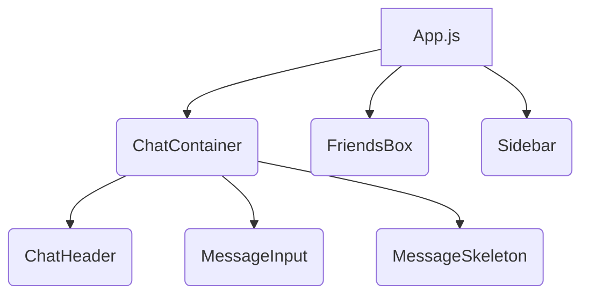
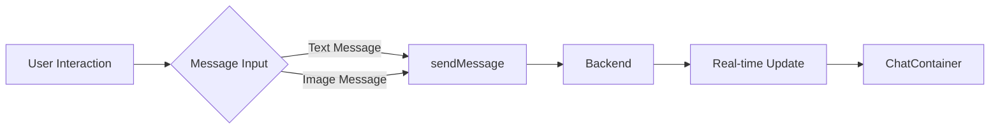

# Frontend Components

<TOC />

This section details the reusable UI components used in the frontend of the chat application.  These components are designed for modularity, reusability, and maintainability, promoting a clean and organized codebase.  The components heavily leverage the `useChatStore` and `useAuthStore` custom hooks for state management (detailed in a subsequent section).

## ChatContainer Component

The `ChatContainer` component [Source](https://github.com/shinymack/Chat-App-MERN/blob/main/frontend/src/components/ChatContainer.jsx) is the central display area for messages within a selected chat.  It fetches, displays, and updates messages in real-time.

### Functionality

* **Fetching Messages:**  On mount and when the `selectedUser` changes, it calls `getMessages` to retrieve messages from the backend for the selected user.
* **Real-time Updates:** It uses `subscribeToMessages` to establish a subscription for real-time updates, receiving new messages as they arrive.  The `unsubscribeFromMessages` function cleans up the subscription when the component unmounts, preventing memory leaks.
* **Message Display:** It iterates through the `messages` array and renders each message, differentiating between messages sent by the current user (`authUser`) and messages received from the selected user.  It handles both text and image messages.
* **Auto-Scrolling:** The `messageEndRef` ensures that the chat view automatically scrolls to the bottom when new messages arrive.

### Code Snippet

```jsx
useEffect(() => {
    getMessages(selectedUser._id);
    subscribeToMessages();

    return () => unsubscribeFromMessages();
}, [selectedUser._id, getMessages, subscribeToMessages, unsubscribeFromMessages]);

// ... (Message rendering logic) ...
```

This `useEffect` hook manages fetching messages, subscribing to real-time updates, and cleaning up the subscription on unmount.  The dependency array ensures that these actions are triggered only when necessary.


## MessageInput Component

The `MessageInput` component [Source](https://github.com/shinymack/Chat-App-MERN/blob/main/frontend/src/components/MessageInput.jsx) allows users to send text and image messages.

### Functionality

* **Text Input:** A text input field captures the user's message text.
* **Image Upload:**  A hidden file input allows users to select images.  The selected image is displayed as a preview before sending.
* **Message Sending:** The `sendMessage` function (from `useChatStore`) sends the message to the backend.  Error handling is included to catch potential issues.

### Code Snippet

```jsx
const handleSendMessage = async (e) => {
    e.preventDefault();
    if (!text.trim() && !imagePreview) return;

    try {
        await sendMessage({
            text: text.trim(),
            image: imagePreview,
        });

        setText("");
        setImagePreview(null);
        // ...
    } catch (error) {
        console.error("Failed to send message", error);
    }
};
```

This snippet shows the `handleSendMessage` function, which handles sending the message, clearing the input fields, and managing potential errors.


## FriendsBox Component

The `FriendsBox` component [Source](https://github.com/shinymack/Chat-App-MERN/blob/main/frontend/src/components/FriendsBox.jsx) displays a list of friends, allowing users to manage friend requests and remove friends.

### Functionality

* **Friend List:** Displays a list of friends fetched using `getFriends`.
* **Friend Request Management:**  Handles pending and sent friend requests using `getPendingRequests`, `getSentRequests`, `sendFriendRequest`, `acceptFriendRequest`, `rejectFriendRequest`, and `removeFriend`.
* **Tabs:** Uses tabs for organizing friends, pending requests, and sent requests.
* **Add Friend Functionality:**  Allows users to add friends by providing a username or email.

### Code Snippet

```jsx
const renderContent = () => {
    switch (activeTab) {
        case 'pending':
            return (
                <div className="space-y-2">
                    {pendingRequests.length > 0 ? pendingRequests.map(req => (
                        // ... (JSX for rendering pending requests) ...
                    )) : <p className="text-center text-base-content/60 py-4">No pending requests.</p>}
                </div>
            );
        // ... (Cases for 'sent' and 'friends') ...
    }
};
```

This snippet showcases the `renderContent` function, which dynamically renders the content based on the active tab.


## Sidebar Component

The `Sidebar` component [Source](https://github.com/shinymack/Chat-App-MERN/blob/main/frontend/src/components/Sidebar.jsx) displays a list of friends and allows users to select a friend to chat with.

### Functionality

* **Friend List:** Displays a list of friends fetched using `getFriends`.  Provides an option to filter for online friends only.
* **User Selection:** Allows selecting a friend, updating the `selectedUser` state in `useChatStore`.
* **Online Status Indication:** Shows whether a friend is online or offline.

### Code Snippet

```jsx
const filteredUsers = showOnlineOnly
    ? users.filter((user) => onlineUsers.includes(user._id))
    : users;
// ... (JSX for rendering the filtered user list) ...
```

This snippet shows how the user list is filtered based on the `showOnlineOnly` state.


`




`




Next: [Frontend State Management](./3.2_frontend_state.mdx)