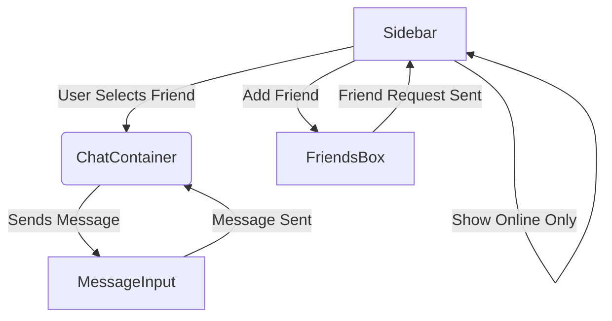

# Frontend Components

<TOC />

This document details the reusable UI components used in the frontend of the application.  Each component is designed with reusability, maintainability, and scalability in mind.  The components leverage React's functional component model and utilize a centralized state management system (detailed in a separate document).

## System Purpose

The frontend components are designed to provide a modular and efficient approach to building the user interface. This allows for easier maintenance, updates, and the addition of new features.  The components are built to be reusable across different sections of the application, reducing code duplication and promoting consistency in the user experience.

### Key Features

* **Modular Design:** Each component is self-contained and handles a specific UI task, promoting separation of concerns.
* **Reusability:** Components can be easily reused across multiple parts of the application.
* **Maintainability:** The modular nature simplifies debugging and updates.
* **Scalability:** The design facilitates the addition of new components and features without major restructuring.
* **Consistent UI:**  Components promote a consistent look and feel across the application.


## ChatContainer Component

The `ChatContainer` component [frontend/src/components/ChatContainer.jsx](https://github.com/shinymack/Chat-App-MERN/blob/main/frontend/src/components/ChatContainer.jsx) is responsible for displaying the chat messages for the currently selected user. It fetches messages, subscribes to real-time updates, and renders them efficiently.

### Key Features of ChatContainer

* **Real-time Updates:** Uses subscriptions to receive updates whenever new messages arrive.
* **Efficient Rendering:**  Only re-renders when necessary, optimizing performance.
* **Message Display:** Handles rendering of both text and image messages, along with sender information and timestamps.
* **Loading State:** Displays a skeleton loading indicator while messages are being fetched.
* **Scroll to Bottom:** Automatically scrolls to the bottom when new messages are added.

```jsx
useEffect(() => {
    getMessages(selectedUser._id);
    subscribeToMessages();

    return () => unsubscribeFromMessages();
}, [selectedUser._id, getMessages, subscribeToMessages, unsubscribeFromMessages]);

useEffect(() => {
    if(messageEndRef.current && messages){
        messageEndRef.current.scrollIntoView({behaviour : "smooth"})
    }
}, [messages])
```

This code snippet shows the `useEffect` hooks that handle fetching messages, subscribing to real-time updates, and scrolling to the bottom. The first `useEffect` fetches messages on mount and cleans up the subscription on unmount. The second ensures the chat always shows the latest message.

```jsx
{messages.map((message) => (
    <div
        key={message._id}
        className={`chat ${message.senderId == authUser._id ? "chat-end": "chat-start"} `}
        ref={messageEndRef}
    >
        {/* ... message rendering ... */}
    </div>
))}
```

This snippet demonstrates how messages are mapped and rendered, distinguishing between messages sent by the current user and other users using CSS classes (`chat-end`, `chat-start`).


## FriendsBox Component

The `FriendsBox` component [frontend/src/components/FriendsBox.jsx](https://github.com/shinymack/Chat-App-MERN/blob/main/frontend/src/components/FriendsBox.jsx) manages friend requests and displays the user's friend list.

### Key Features of FriendsBox

* **Friend List Management:**  Provides actions to add, accept, reject, and remove friends.
* **Tabbed Interface:** Uses tabs to separate friends, pending requests, and sent requests.
* **Real-time Updates:**  Reflects changes to the friend list in real-time (through the state management).
* **Add Friend Functionality:** Allows users to send friend requests by providing usernames or emails.


```jsx
const handleAddFriend = (e) => {
    e.preventDefault();
    if (identifier.trim()) {
        sendFriendRequest(identifier);
        setIdentifier('');
    }
};
```

This code shows the handler for sending friend requests. It prevents default form submission, validates the input, and then calls the `sendFriendRequest` action from the store.


## MessageInput Component

The `MessageInput` component [frontend/src/components/MessageInput.jsx](https://github.com/shinymack/Chat-App-MERN/blob/main/frontend/src/components/MessageInput.jsx) allows users to send text and image messages.

### Key Features of MessageInput

* **Text and Image Support:**  Handles both text and image messages.
* **Image Preview:** Shows a preview of the selected image before sending.
* **Input Validation:** Prevents sending empty messages.
* **Error Handling:** Includes basic error handling for message sending failures.


```jsx
const handleSendMessage = async (e) => {
    e.preventDefault();
    if (!text.trim() && !imagePreview) return;

    try {
        await sendMessage({
            text: text.trim(),
            image: imagePreview,
        });

        // ... reset input fields ...
    } catch (error) {
        console.error("Failed to send message", error);
    }
};
```

This snippet shows the function to send messages. It handles both text and image messages and includes error handling.


## Sidebar Component

The `Sidebar` component [frontend/src/components/Sidebar.jsx](https://github.com/shinymack/Chat-App-MERN/blob/main/frontend/src/components/Sidebar.jsx) displays a list of the user's friends, allowing them to select a friend to chat with.

### Key Features of Sidebar

* **Friend List Display:** Shows a list of friends with online status indicators.
* **User Selection:** Allows users to select a friend to start a chat.
* **Online/Offline Status:** Indicates which friends are currently online.
* **Filtering:** Allows filtering to display online users only.
* **Responsive Design:** Adapts to different screen sizes.

```jsx
const filteredUsers = showOnlineOnly
    ? users.filter((user) => onlineUsers.includes(user._id))
    : users;
```

This code snippet demonstrates how the list of friends is filtered based on the `showOnlineOnly` state.

```jsx
{onlineUsers.includes(user._id) && (
    <span className="absolute bottom-0 right-0 size-3 bg-green-500 rounded-full ring-2 ring-zinc-900" />
)}
```
This snippet shows how an online status indicator is added to the friend's avatar.


## Component Interaction Diagram





## Key Integration Points and Insights

The frontend components heavily rely on the centralized state management system for data fetching and updates.  The interaction between these components is crucial for providing a seamless user experience, particularly concerning real-time updates in the chat.  Error handling is integrated at multiple levels to ensure graceful degradation and user feedback.  The use of skeletons during loading states enhances the user experience by providing visual feedback of ongoing operations.


Next: [Frontend State Management](./3.2_frontend_state.mdx)