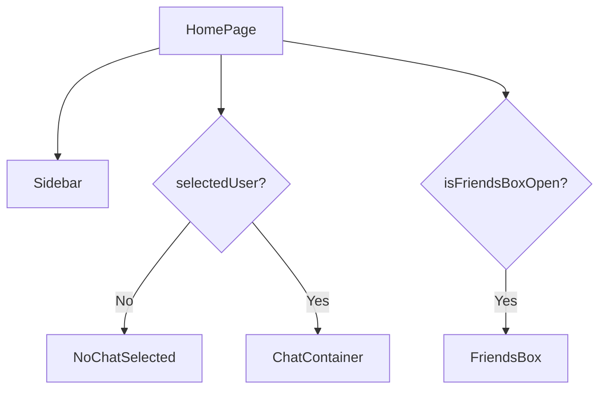
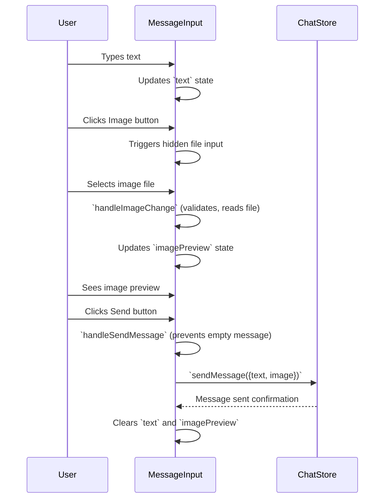

```mdx
---
title: "UI Components & Pages"
description: "Details the various reusable UI components and the main application pages."
sidebar_position: 31
---

# UI Components & Pages

This section provides an in-depth look at the core UI components and main application pages within the GitDex chat application's frontend. These components are built with React and leverage state management to create an interactive and responsive user experience.

## Homepage (`HomePage.jsx`)

The `HomePage.jsx` file defines the main layout and entry point for the chat application interface. It orchestrates the display of various components based on the current application state, particularly whether a user has been selected for chatting.

-   **File**: [`frontend/src/pages/HomePage.jsx`](https://github.com/shinymack/Chat-App-MERN/blob/main/frontend/src/pages/HomePage.jsx)

### Structure and Purpose

The `HomePage` component is responsible for:
-   **Overall Layout**: Providing the container for the entire chat application, including styling for centering and sizing.
-   **Conditional Rendering**: Dynamically rendering either the `ChatContainer` (if a user is selected) or `NoChatSelected` (if no user is selected).
-   **Sidebar Integration**: Always displaying the `Sidebar` for user selection.
-   **FriendsBox Integration**: Conditionally displaying the `FriendsBox` based on `isFriendsBoxOpen` state.

```jsx showLineNumbers
// frontend/src/pages/HomePage.jsx
import ChatContainer from "../components/ChatContainer";
import FriendsBox from "../components/FriendsBox";
import NoChatSelected from "../components/NoChatSelected";
import Sidebar from "../components/Sidebar";
import { useChatStore } from "../store/useChatStore"

const HomePage = () => {
  const { selectedUser } = useChatStore();
  const { isFriendsBoxOpen } = useChatStore();
  return (
      <div className="h-screen bg-base-200">
      <div className="flex items-center justify-center pt-20 px-4 w-full">
        <div className="bg-base-100 rounded-lg shadow-xl w-full max-w-6xl h-[calc(100vh-8rem)]">
          <div className="flex h-full rounded-lg overflow-hidden w-full">
            <Sidebar />
            {!selectedUser ? <NoChatSelected /> : <ChatContainer />}
            {isFriendsBoxOpen && <FriendsBox />}

          </div>

        </div>
      </div>
    </div>
  )
}

export default HomePage
```

### Component Interactions (HomePage)

The `HomePage` serves as the parent container, dictating the visibility and placement of its child components. The `selectedUser` state from `useChatStore` is crucial for determining which main content area (`ChatContainer` or `NoChatSelected`) is displayed, ensuring a focused user experience.





## Chat Container (`ChatContainer.jsx`)

The `ChatContainer.jsx` component is responsible for displaying the messages within a selected chat and allowing users to input new messages. It's the central hub for conversation interaction.

-   **File**: [`frontend/src/components/ChatContainer.jsx`](https://github.com/shinymack/Chat-App-MERN/blob/main/frontend/src/components/ChatContainer.jsx)

### Core Functionality

-   **Message Display**: Renders a list of messages for the currently selected user, distinguishing between sent and received messages.
-   **Real-time Updates**: Subscribes to new messages in real-time using Socket.IO, ensuring the chat feed is always up-to-date.
-   **Message Input**: Integrates the `MessageInput` component for composing and sending messages, including text and image attachments.
-   **Loading State**: Displays a `MessageSkeleton` while messages are being fetched.
-   **Auto-Scroll**: Automatically scrolls to the latest message when new messages arrive.

### Key Dependencies

The `ChatContainer` relies heavily on Zod for state management:

-   `useChatStore`: Provides access to `messages`, `getMessages`, `isMessagesLoading`, `selectedUser`, `subscribeToMessages`, and `unsubscribeFromMessages`.
-   `useAuthStore`: Provides `authUser` for distinguishing between sender and receiver.

```jsx showLineNumbers
// frontend/src/components/ChatContainer.jsx
import { useEffect } from "react";
import { useChatStore } from "../store/useChatStore";
import ChatHeader from "./ChatHeader";
import MessageInput from "./MessageInput";
import MessageSkeleton from "./skeletons/MessageSkeleton";
import { useAuthStore } from "../store/useAuthStore";
import { formatMessageTime } from "../lib/utils";
import { useRef } from "react";

const ChatContainer = () => {
    const { messages, getMessages, isMessagesLoading, selectedUser, subscribeToMessages, unsubscribeFromMessages } =
        useChatStore();
    const { authUser } = useAuthStore();
    const messageEndRef = useRef(null);


    useEffect(() => {
        getMessages(selectedUser._id);
        subscribeToMessages();

        return () => unsubscribeFromMessages();
    }, [selectedUser._id, getMessages, subscribeToMessages, unsubscribeFromMessages]);
    
    useEffect(() => {
        if(messageEndRef.current && messages){
            messageEndRef.current.scrollIntoView({behaviour : "smooth"})
        }
    }, [messages])

    if (isMessagesLoading)
        return (
            <div className="flex-1 flex flex-col overflow-auto">
                <ChatHeader />
                <MessageSkeleton />
                <MessageInput />
            </div>
        );
    return (
        <div className="flex-1 flex flex-col overflow-auto">
            <ChatHeader />
            <div className="flex-1 overflow-y-auto p-4 space-y-4">
                {messages.map((message) => (
                    <div
                        key={message._id}
                        className={`chat ${message.senderId == authUser._id ? "chat-end": "chat-start"} `}
                        ref={messageEndRef}
                    >
                        <div className="chat-image avatar">
                            <div className="size-9 rounded-full border">
                                
                            </div>
                        </div>
                        <div className="chat-header mb-1">
                            <time className="text-xs opacity-50 ml-1">{formatMessageTime(message.createdAt)}</time>
                        </div>
                        <div className="chat-bubble flex flex-col">
                            {message.image && (
                                
                            )}
                            {message.text && <p>{message.text}</p>}
                        </div>
                    </div>
                ))}
            </div>
            <MessageInput />
        </div>
    );
};

export default ChatContainer;
```

### Dynamic Styling and User Experience

-   Messages are styled using `chat-end` or `chat-start` classes based on `message.senderId == authUser._id`, providing a clear visual distinction between outgoing and incoming messages.
-   The `useEffect` hook handles fetching messages and setting up/tearing down real-time message subscriptions when the `selectedUser` changes, ensuring efficient resource usage.
-   The `messageEndRef` and its associated `useEffect` ensure that the chat view automatically scrolls to the bottom to show the most recent messages, enhancing usability.

## Message Input (`MessageInput.jsx`)

The `MessageInput.jsx` component provides the interface for users to compose and send messages, including text and image attachments.

-   **File**: [`frontend/src/components/MessageInput.jsx`](https://github.com/shinymack/Chat-App-MERN/blob/main/frontend/src/components/MessageInput.jsx)

### Features

-   **Text Input**: A standard text field for typing messages.
-   **Image Attachment**: Allows users to select an image file, view a preview, and attach it to the message.
-   **Image Preview and Removal**: Displays a preview of the selected image and provides a button to remove it before sending.
-   **Send Button**: Submits the message (text, image, or both) when clicked.
-   **Input Validation**: Ensures that only image files can be selected and prevents sending empty messages.

```jsx showLineNumbers
// frontend/src/components/MessageInput.jsx
import { useRef, useState } from "react";
import { useChatStore } from "../store/useChatStore";
import { Image, Send, X } from "lucide-react";
import toast from "react-hot-toast";

const MessageInput = () => {
    const [text, setText] = useState("");
    const [imagePreview, setImagePreview] = useState(null);
    const fileInputRef = useRef(null);
    const { sendMessage } = useChatStore();

    const handleImageChange = (e) => {
        const file = e.target.files[0];
        if (!file.type.startsWith("image/")) {
            toast.error("Please select an image file");
            return;
        }

        const reader = new FileReader();
        reader.onloadend = () => {
            setImagePreview(reader.result);
        };
        reader.readAsDataURL(file);
    };

    const removeImage = () => {
        setImagePreview(null);
        if (fileInputRef.current) fileInputRef.current.value = "";
    };

    const handleSendMessage = async (e) => {
        e.preventDefault();
        if (!text.trim() && !imagePreview) return;

        try {
            await sendMessage({
                text: text.trim(),
                image: imagePreview,
            });

            setText("");
            setImagePreview(null);
            if (fileInputRef.current) fileInputRef.current = "";
        } catch (error) {
            console.error("Failed to send message", error);
        }
    };
    // ... rest of the component (JSX)
    return (
        <div className="p-4 w-full">
            {imagePreview && (
                <div className="mb-3 flex items-center gap-2">
                    <div className="relative">
                        
                        <button
                            onClick={removeImage}
                            className="absolute -top-1.5 -right-1.5 w-5 h-5 rounded-full bg-base-300
              flex items-center justify-center"
                            type="button"
                        >
                            <X className="size-3" />
                        </button>
                    </div>
                </div>
            )}

            <form
                onSubmit={handleSendMessage}
                className="flex items-center gap-2"
            >
                <div className="flex flex-1 gap-2">
                    <input
                        type="text"
                        className="w-full input input-bordered rounded-lg input-sm sm:input-md"
                        placeholder="Type a message..."
                        value={text}
                        onChange={(e) => setText(e.target.value)}
                    />
                    <input
                        type="file"
                        accept="image/*"
                        className="hidden"
                        ref={fileInputRef}
                        onChange={handleImageChange}
                    />

                    <button
                        type="button"
                        className={`hidden sm:flex btn btn-circle
                            ${
                                imagePreview
                                    ? "text-emerald-500"
                                    : "text-zinc-400"
                            }`}
                        onClick={
                            () => {
                                if (fileInputRef.current) {
                                    fileInputRef.current.click();
                                } else {
                                    console.error("fileInputRef is not attached");
                                }
                        }
                        }
                    >
                        <Image size={20} />
                    </button>
                </div>

                <button
                    type="submit"
                    className="btn btn-sm btn-circle"
                    disabled={!text.trim() && !imagePreview}
                >
                    <Send size={22} />
                </button>
            </form>
        </div>
    );
};

export default MessageInput;
```

### Interaction Flow (MessageInput)





## Sidebar (`Sidebar.jsx`)

The `Sidebar.jsx` component displays a list of available friends (users) and allows the user to select a friend to initiate a chat. It also includes a filter for online users.

-   **File**: [`frontend/src/components/Sidebar.jsx`](https://github.com/shinymack/Chat-App-MERN/blob/main/frontend/src/components/Sidebar.jsx)

### Features and Responsibilities

-   **Friend List Display**: Fetches and displays a list of all registered users (friends).
-   **User Selection**: Allows the authenticated user to select a friend, updating the `selectedUser` state in the `useChatStore`.
-   **Online Status Indicator**: Visually distinguishes online users with a green dot and "Online" text.
-   **Online Filter**: Provides a checkbox to filter the list to show only online users.
-   **Responsive Layout**: Adjusts its visibility based on screen size and whether a user is `selectedUser` on smaller screens.
-   **Loading State**: Displays a `SidebarSkeleton` while friends are being fetched.

### Key Dependencies

-   `useChatStore`: Provides `getFriends`, `users`, `selectedUser`, `setSelectedUser`, and `isUsersLoading`.
-   `useAuthStore`: Provides `onlineUsers` for displaying online status.

```jsx showLineNumbers
// frontend/src/components/Sidebar.jsx
import { useEffect, useState } from "react";
import { useChatStore } from "../store/useChatStore";
import SidebarSkeleton from "./skeletons/SidebarSkeleton";
import { Users } from "lucide-react";
import { useAuthStore } from "../store/useAuthStore";

const Sidebar = () => {
    const { getFriends, users, selectedUser, setSelectedUser, isUsersLoading } =
        useChatStore();

    const { onlineUsers } = useAuthStore();
    const [showOnlineOnly, setShowOnlineOnly] = useState(false);
    useEffect(() => {
        getFriends();
    }, [getFriends]);
    const filteredUsers = showOnlineOnly
        ? users.filter((user) => onlineUsers.includes(user._id))
        : users;
    if (isUsersLoading) return <SidebarSkeleton />;
    return (
        <div className={`h-full sm:w-72 sm:border-r border-base-300  flex-col transition-all duration-200 ${selectedUser ?
                                    "hidden sm:flex w-[100vw] "
                                    : ""}`}>
            <div className="border-b border-base-300  p-5">
                <div className="flex items-center gap-2">
                    <Users className="size-6"></Users>
                    <span className="font-medium  lg:block">
                        Friends
                    </span>
                </div>
                <div className="mt-3 lg:flex items-center gap-2">
                    <label className="cursor-pointer flex items-center gap-2">
                        <input
                            type="checkbox"
                            checked={showOnlineOnly}
                            onChange={(e) =>
                                setShowOnlineOnly(e.target.checked)
                            }
                            className="checkbox checkbox-sm"
                        />
                        <span className="text-sm">Show online only</span>
                    </label>
                    <span className="text-xs text-zinc-500">
                          ({users.filter(friend => onlineUsers.includes(friend._id)).length} online)
                    </span>
                </div>
                <div className="overflow-y-scroll h-[calc(100vh-14rem)] w-full flex flex-col py-3">
                    {filteredUsers.map((user) => (
                        <button
                            key={user._id}
                            onClick={() => setSelectedUser(user)}
                            className={`sm:w-full w-[88vw] p-3 flex items-center gap-3 hover:bg-base-300 transition-colors
                            ${
                                selectedUser?._id === user._id
                                    ? "bg-base-300 ring-1 ring-base-300"
                                    : ""
                            }`}
                        >
                            <div className="relative mx-0">
                                
                                {onlineUsers.includes(user._id) && (
                                    <span className="absolute bottom-0 right-0 size-3 bg-green-500 rounded-full ring-2 ring-zinc-900" />
                                )}
                            </div>
                            <div className=" block text-left min-w-0">
                                <div className=" font-medium truncate">
                                    {user.username}
                                </div>
                                <div className="text-sm text-zinc-400">
                                    {onlineUsers.includes(user._id)
                                        ? "Online"
                                        : "Offline"}
                                </div>
                            </div>
                        </button>
                    ))}
                </div>
                {filteredUsers.length == 0 && (
                    <div className="text-center text-zinc-500 py-4">No online friends</div>
                )}
            </div>
        </div>
    );
};

export default Sidebar;
```

### Design Considerations

The responsive design using `hidden sm:flex` ensures that on small screens, the sidebar is hidden when a chat is selected, prioritizing the `ChatContainer` view. This improves mobile usability. The `useEffect` hook to `getFriends()` ensures that the list of available chat partners is always up-to-date when the component mounts.

## Key Integration Points and Insights

The UI components and pages are tightly integrated through the `useChatStore` and `useAuthStore` Zustand stores, ensuring a centralized and reactive state management system.

-   **Centralized State**: The `selectedUser` state in `useChatStore` acts as a crucial pivot, determining which components are rendered and what data they display. This promotes a single source of truth and simplifies data flow.
-   **Component Reusability**: Smaller components like `ChatHeader`, `MessageInput`, and the skeleton loaders are designed to be reusable and focused on a single responsibility.
-   **Real-time Communication**: The `ChatContainer`'s `subscribeToMessages` and `unsubscribeFromMessages` demonstrate a best practice for managing real-time connections, ensuring that listeners are active only when necessary.
-   **User Experience**: Features like auto-scrolling to the latest message, image previews, and online status indicators are implemented to provide a smooth and intuitive user experience.

These components demonstrate a clear separation of concerns, with each component focusing on a specific part of the UI, while leveraging shared state to maintain consistency and responsiveness across the application.

Next: [State Management & Utilities](./3.2_frontend_state_utilities.mdx)
```