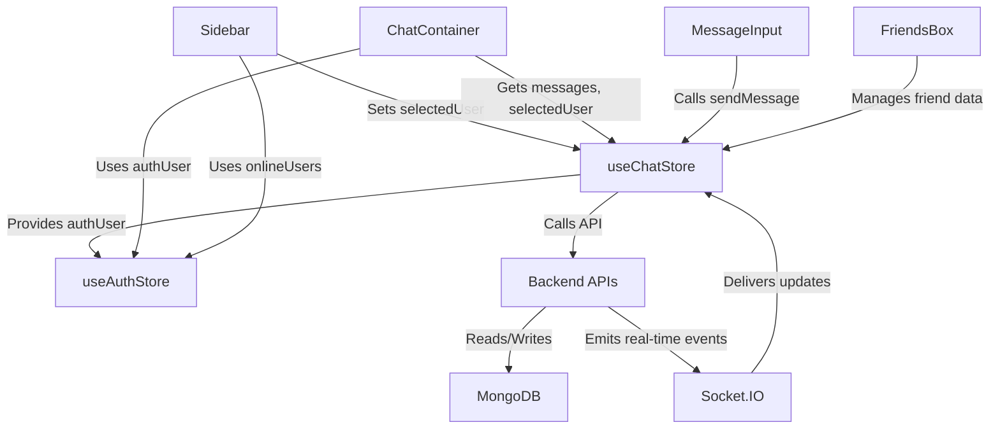

# User Interface Components
<TOC />

This section provides comprehensive documentation for the core user interface components of the chat application. These React components are built for reusability and maintainability, forming the visual and interactive elements users engage with daily. They are responsible for displaying chat conversations, managing friend relationships, facilitating message input, and navigating through contacts.

## Core UI Components Overview

The frontend of the chat application is composed of several key React components, each fulfilling a specific role in presenting information and enabling user interaction. These components are designed to be modular, integrating seamlessly with global state management for a dynamic user experience.

*   **`ChatContainer.jsx`**: This component is the primary view for displaying messages within a selected chat. It dynamically renders messages from a chosen friend, handles real-time updates, and manages the visual presentation of conversations, including user avatars, message times, and media attachments. It also incorporates auto-scrolling to the latest message.
    *   [View ChatContainer.jsx on GitHub](https://github.com/shinymack/Chat-App-MERN/blob/main/frontend/src/components/ChatContainer.jsx)
*   **`FriendsBox.jsx`**: A modal component that provides a centralized interface for managing friend relationships. Users can add new friends, accept or reject pending friend requests, view sent requests, and remove existing friends through a tabbed interface.
    *   [View FriendsBox.jsx on GitHub](https://github.com/shinymack/Chat-App-MERN/blob/main/frontend/src/components/FriendsBox.jsx)
*   **`MessageInput.jsx`**: Responsible for allowing users to compose and send messages. This includes support for both text and image attachments, providing a preview for images before sending.
    *   [View MessageInput.jsx on GitHub](https://github.com/shinymack/Chat-App-MERN/blob/main/frontend/src/components/MessageInput.jsx)
*   **`Sidebar.jsx`**: Displays a list of the user's friends, enabling selection of a chat partner. It indicates online/offline status, shows the number of online friends, and provides an option to filter for online users only.
    *   [View Sidebar.jsx on GitHub](https://github.com/shinymack/Chat-App-MERN/blob/main/frontend/src/components/Sidebar.jsx)

## Component Interaction & Data Flow

The UI components interact extensively with a global state management system (`useChatStore` and `useAuthStore`) to fetch and update data. This architecture ensures a clear separation of concerns, where components are primarily responsible for rendering and user input, while the stores handle data fetching, mutations, and synchronization with the backend.

For instance, the `Sidebar` selects a user, which updates the `selectedUser` in `useChatStore`. This change triggers the `ChatContainer` to fetch and display messages for that specific user. The `MessageInput` dispatches `sendMessage` actions to the store, which then communicates with the backend API. Real-time updates, crucial for a chat application, are managed through subscriptions defined in the state store, which then update the UI components like `ChatContainer` and `Sidebar` dynamically.





*Figure 1: High-level overview of UI component interactions with state stores and backend services.*

## Key Component Implementations

Each component plays a vital role, leveraging React hooks and state management for efficient data handling and rendering.

### ChatContainer Implementation

The `ChatContainer` is central to the user's messaging experience. It manages the display of conversations, including fetching historical messages and subscribing to real-time updates. The `useEffect` hook is critical here for managing the lifecycle of message data and subscriptions.

```jsx
// frontend/src/components/ChatContainer.jsx
import { useEffect, useRef } from "react";
import { useChatStore } from "../store/useChatStore";
import { useAuthStore } from "../store/useAuthStore";
import { formatMessageTime } from "../lib/utils"; // Assumed utility

const ChatContainer = () => {
    const { messages, getMessages, isMessagesLoading, selectedUser, subscribeToMessages, unsubscribeFromMessages } =
        useChatStore();
    const { authUser } = useAuthStore();
    const messageEndRef = useRef(null);

    // Effect to fetch messages and subscribe to real-time updates
    useEffect(() => {
        if (selectedUser?._id) { // Ensure a user is selected before fetching messages
            getMessages(selectedUser._id);
            subscribeToMessages();
        }

        return () => unsubscribeFromMessages(); // Cleanup subscription on unmount or user change
    }, [selectedUser?._id, getMessages, subscribeToMessages, unsubscribeFromMessages]);
    
    // Effect to scroll to the latest message
    useEffect(() => {
        if(messageEndRef.current && messages && messages.length > 0){
            messageEndRef.current.scrollIntoView({ behavior: "smooth" });
        }
    }, [messages]);

    // ... rest of the component rendering logic
};

export default ChatContainer;
```
[View ChatContainer.jsx#L8-L29](https://github.com/shinymack/Chat-App-MERN/blob/main/frontend/src/components/ChatContainer.jsx#L8-L29)
This snippet demonstrates the use of `useEffect` for data fetching and real-time subscription management. The `messageEndRef` ensures the chat view automatically scrolls to the latest message, providing a seamless user experience. The cleanup function in the first `useEffect` prevents memory leaks and ensures correct subscription behavior when the `selectedUser` changes or the component unmounts.

### FriendsBox Implementation

The `FriendsBox` component is a sophisticated modal for all friend-related interactions. It utilizes local state (`activeTab`) to manage its different views (Friends, Pending Requests, Sent Requests) and integrates heavily with `useChatStore` for all CRUD operations related to friends.

```jsx
// frontend/src/components/FriendsBox.jsx
import { useEffect, useState } from 'react';
import { useChatStore } from '../store/useChatStore';
import { X, UserPlus, Check, Trash2 } from 'lucide-react'; // Icon imports

const FriendsBox = () => {
    const { 
        toggleFriendsBox, getFriends, users,
        getPendingRequests, pendingRequests,
        getSentRequests, sentRequests,
        sendFriendRequest, acceptFriendRequest, rejectFriendRequest, removeFriend
    } = useChatStore();

    const [activeTab, setActiveTab] = useState('friends');
    const [identifier, setIdentifier] = useState('');

    useEffect(() => {
        // Fetch all necessary data when the component mounts
        getFriends();
        getPendingRequests();
        getSentRequests();
    }, [getFriends, getPendingRequests, getSentRequests]);

    const handleAddFriend = (e) => {
        e.preventDefault();
        if (identifier.trim()) {
            sendFriendRequest(identifier);
            setIdentifier('');
        }
    };

    const renderContent = () => {
        switch (activeTab) {
            case 'pending':
                // ... rendering logic for pending requests
            case 'sent':
                // ... rendering logic for sent requests
            case 'friends':
            default:
                // ... rendering logic for friends list
        }
    };

    return (
        // ... JSX structure for modal, tabs, and form
    );
};

export default FriendsBox;
```
[View FriendsBox.jsx#L8-L33](https://github.com/shinymack/Chat-App-MERN/blob/main/frontend/src/components/FriendsBox.jsx#L8-L33)
This excerpt shows the initial setup of the `FriendsBox` component, including fetching friend-related data on mount using `useEffect`. The `activeTab` state controls which list of friends (current, pending, sent) is displayed, enabling a multi-functional interface within a single component. The `handleAddFriend` function demonstrates how user input is processed to dispatch an action to the `useChatStore`.

### MessageInput Implementation

The `MessageInput` component provides the interface for composing and sending messages, including handling image uploads. It manages local state for the message text and image preview, and interacts with the `useChatStore` to dispatch the `sendMessage` action.

```jsx
// frontend/src/components/MessageInput.jsx
import { useRef, useState } from "react";
import { useChatStore } from "../store/useChatStore";
import { Image, Send, X } from "lucide-react";
import toast from "react-hot-toast";

const MessageInput = () => {
    const [text, setText] = useState("");
    const [imagePreview, setImagePreview] = useState(null);
    const fileInputRef = useRef(null);
    const { sendMessage } = useChatStore();

    const handleImageChange = (e) => {
        const file = e.target.files[0];
        if (!file.type.startsWith("image/")) {
            toast.error("Please select an image file");
            return;
        }

        const reader = new FileReader();
        reader.onloadend = () => {
            setImagePreview(reader.result);
        };
        reader.readAsDataURL(file);
    };

    const removeImage = () => {
        setImagePreview(null);
        if (fileInputRef.current) fileInputRef.current.value = "";
    };

    const handleSendMessage = async (e) => {
        e.preventDefault();
        if (!text.trim() && !imagePreview) return; // Prevent sending empty messages

        try {
            await sendMessage({
                text: text.trim(),
                image: imagePreview,
            });

            setText(""); // Clear input after sending
            setImagePreview(null); // Clear image preview
            if (fileInputRef.current) fileInputRef.current.value = ""; // Clear file input
        } catch (error) {
            console.error("Failed to send message", error);
            // Optionally show error toast to user
        }
    };

    return (
        // ... JSX for input field, image preview, and send button
    );
};

export default MessageInput;
```
[View MessageInput.jsx#L7-L51](https://github.com/shinymack/Chat-App-MERN/blob/main/frontend/src/components/MessageInput.jsx#L7-L51)
This snippet details the core logic for message composition. `useState` manages the input `text` and `imagePreview`, while `useRef` provides direct access to the hidden file input element for triggering image selection and clearing it. The `handleImageChange` function handles file validation and generates an image preview using `FileReader`, enhancing user feedback. The `handleSendMessage` function orchestrates the dispatch of the message (text and/or image) via `sendMessage` from `useChatStore` and resets the input fields.

### Sidebar Implementation

The `Sidebar` component displays the list of friends, allowing users to select a chat. It also integrates online status indicators and a filter to show only online friends.

```jsx
// frontend/src/components/Sidebar.jsx
import { useEffect, useState } from "react";
import { useChatStore } from "../store/useChatStore";
import { Users } from "lucide-react"; // Icon import
import { useAuthStore } from "../store/useAuthStore";

const Sidebar = () => {
    const { getFriends, users, selectedUser, setSelectedUser, isUsersLoading } =
        useChatStore();
    const { onlineUsers } = useAuthStore(); // Get online users from auth store
    const [showOnlineOnly, setShowOnlineOnly] = useState(false);

    useEffect(() => {
        getFriends(); // Fetch friends list on component mount
    }, [getFriends]);

    const filteredUsers = showOnlineOnly
        ? users.filter((user) => onlineUsers.includes(user._id))
        : users;

    if (isUsersLoading) return <SidebarSkeleton />; // Show skeleton while loading

    return (
        <div className={`h-full sm:w-72 sm:border-r border-base-300  flex-col transition-all duration-200 ${selectedUser ?
                                    "hidden sm:flex w-[100vw]" : ""}`}>
            <div className="border-b border-base-300  p-5">
                <div className="flex items-center gap-2">
                    <Users className="size-6"></Users>
                    <span className="font-medium lg:block">Friends</span>
                </div>
                {/* Online toggle filter */}
                <div className="mt-3 lg:flex items-center gap-2">
                    <label className="cursor-pointer flex items-center gap-2">
                        <input
                            type="checkbox"
                            checked={showOnlineOnly}
                            onChange={(e) => setShowOnlineOnly(e.target.checked)}
                            className="checkbox checkbox-sm"
                        />
                        <span className="text-sm">Show online only</span>
                    </label>
                    <span className="text-xs text-zinc-500">
                          ({users.filter(friend => onlineUsers.includes(friend._id)).length} online)
                    </span>
                </div>
                {/* User list rendering */}
                <div className="overflow-y-scroll h-[calc(100vh-14rem)] w-full flex flex-col py-3">
                    {filteredUsers.map((user) => (
                        <button
                            key={user._id}
                            onClick={() => setSelectedUser(user)}
                            className={`sm:w-full w-[88vw] p-3 flex items-center gap-3 hover:bg-base-300 transition-colors
                            ${
                                selectedUser?._id === user._id
                                    ? "bg-base-300 ring-1 ring-base-300"
                                    : ""
                            }`}
                        >
                            <div className="relative mx-0">
                                
                                {onlineUsers.includes(user._id) && (
                                    <span className="absolute bottom-0 right-0 size-3 bg-green-500 rounded-full ring-2 ring-zinc-900" />
                                )}
                            </div>
                            <div className="block text-left min-w-0">
                                <div className="font-medium truncate">{user.username}</div>
                                <div className="text-sm text-zinc-400">
                                    {onlineUsers.includes(user._id) ? "Online" : "Offline"}
                                </div>
                            </div>
                        </button>
                    ))}
                </div>
                {filteredUsers.length == 0 && (
                    <div className="text-center text-zinc-500 py-4">No online friends</div>
                )}
            </div>
        </div>
    );
};

export default Sidebar;
```
[View Sidebar.jsx#L7-L50](https://github.com/shinymack/Chat-App-MERN/blob/main/frontend/src/components/Sidebar.jsx#L7-L50)
This snippet highlights the core functionality of the `Sidebar`: fetching friends, displaying them with their online status, and allowing selection. The `useEffect` hook ensures the friends list is loaded on component mount. The `filteredUsers` computed property demonstrates client-side filtering based on the `showOnlineOnly` state. The component also dynamically adjusts its visibility based on `selectedUser` for responsive layouts (hiding on small screens when a chat is open).

## State Management Integration

The UI components heavily rely on global state management provided by Zustand stores (`useChatStore`, `useAuthStore`) to retrieve and update application data. This centralized approach simplifies data flow and keeps components lean, focusing purely on presentation and user interaction.


```mermaid
sequenceDiagram
    participant U as User
    participant MI as MessageInput
    participant CS as useChatStore
    participant API as Backend API
    participant DB as MongoDB
    participant SI as Socket.IO
    participant CC as ChatContainer

    U->>+MI: Types message & attaches image
    MI->>+CS: sendMessage({text, image})
    CS->>+API: POST /api/messages (text, image)
    API->>+DB: Save message data
    DB-->>-API: Message ID
    API->>+SI: Emit "newMessage" (messageData)
    API-->>-CS: Message sent confirmation
    CS-->>-MI: Confirmation
    MI->>-U: Clear input, show success

    SI-->>+CS: "newMessage" (messageData) broadcast
    CS->>CC: Update messages state
    CC->>-U: Display new message in UI
```


*Figure 2: Sequence diagram illustrating the message sending and real-time update flow.*

This sequence diagram visualizes how a message traverses from the user's input through the `MessageInput` component, `useChatStore`, the Backend API, `MongoDB`, and `Socket.IO` before finally being displayed in the `ChatContainer` for both the sender and receiver. This intricate dance ensures real-time communication is handled efficiently and robustly.

## Key Integration Points

The seamless operation of these UI components is a testament to their thoughtful integration with the application's underlying architecture.

*   **Global State Management**: `useChatStore` and `useAuthStore` are paramount. Components like `ChatContainer`, `Sidebar`, `MessageInput`, and `FriendsBox` consume relevant slices of state (e.g., `messages`, `selectedUser`, `users`, `onlineUsers`) and dispatch actions to modify state or trigger API calls. This centralizes data logic and ensures consistency across the UI.
*   **Real-time Communication**: The `ChatContainer` explicitly uses `subscribeToMessages` and `unsubscribeFromMessages` from `useChatStore`. This indicates a robust real-time layer, likely powered by `Socket.IO` in the backend, which pushes updates directly to connected clients, ensuring messages and online statuses are always current without manual refreshing.
*   **Backend API Interaction**: All data operations (fetching messages, sending messages, managing friends) are abstracted behind actions in `useChatStore`. These actions make HTTP requests to the backend API, which then interacts with the database. This clear separation makes the frontend highly decoupled from the backend implementation details.
*   **User Authentication Context**: `useAuthStore` provides crucial user information (`authUser`) and `onlineUsers`. This data is used by `ChatContainer` to determine message ownership and display correct profile pictures, and by `Sidebar` to indicate online statuses and filter contacts.
*   **Best Practices**:
    *   **Separation of Concerns**: Components are primarily concerned with UI rendering and user input, delegating data logic to Zustand stores. This promotes cleaner, more maintainable code.
    *   **Reusability**: Components like `MessageInput` and `FriendsBox` are self-contained units that could potentially be reused in other parts of the application or even different projects.
    *   **Performance Optimization**: `useEffect` dependencies are carefully managed to prevent unnecessary re-renders or API calls. The `useRef` hook for scrolling is a direct DOM manipulation optimization, avoiding state-induced re-renders for scroll position.
    *   **User Experience**: Features like image previews, auto-scrolling, and online status indicators significantly enhance the user experience by providing immediate feedback and a dynamic interface.

Next: [State Management & Routing](./3.2_frontend_state_routing.mdx)