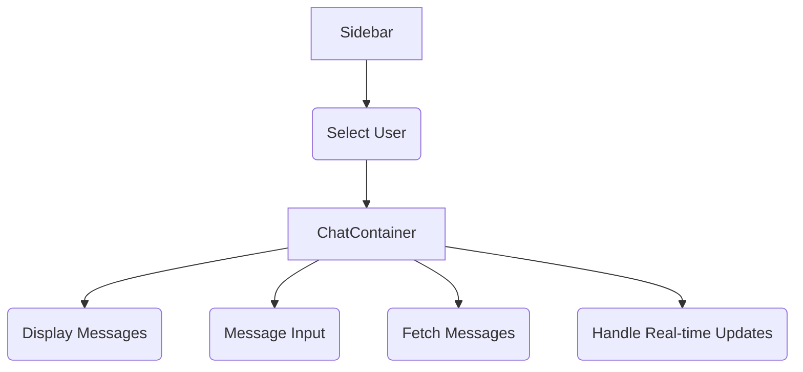

# Frontend UI Components

<TOC />

## System Purpose

The frontend UI consists of reusable components designed to enhance modularity and maintainability. These components handle user interaction, display information, and manage the chat interface.  The core functionalities include:

* **User Selection:** Selecting a user from a list to initiate a chat session. ([Sidebar.jsx](https://github.com/YourRepo/YourRepo/blob/main/frontend/src/components/Sidebar.jsx))
* **Real-time Messaging:** Displaying and sending messages in real-time. ([ChatContainer.jsx](https://github.com/YourRepo/YourRepo/blob/main/frontend/src/components/ChatContainer.jsx), [MessageInput.jsx](https://github.com/YourRepo/YourRepo/blob/main/frontend/src/components/MessageInput.jsx))
* **Message Composition and Sending:**  Creating and sending text and image messages. ([MessageInput.jsx](https://github.com/YourRepo/YourRepo/blob/main/frontend/src/components/MessageInput.jsx))
* **Message Display:**  Rendering messages with timestamps and user avatars. ([ChatContainer.jsx](https://github.com/YourRepo/YourRepo/blob/main/frontend/src/components/ChatContainer.jsx))
* **Online Status Indication:** Visually indicating the online status of users. ([Sidebar.jsx](https://github.com/YourRepo/YourRepo/blob/main/frontend/src/components/Sidebar.jsx))


## System Architecture Overview

The frontend utilizes a component-based architecture where individual components handle specific aspects of the UI.  Data is managed through a centralized state management solution (details in a subsequent section).  The `ChatContainer` component fetches and displays messages, while `MessageInput` handles message composition and sending. `Sidebar` manages the user selection.





## Technology Stack

| Layer          | Technology             | Version (Example) | Purpose                                      |
|-----------------|-------------------------|--------------------|----------------------------------------------|
| Frontend Framework | React                  | 18.2.0             | Building the user interface                    |
| UI Library        | Tailwind CSS           | 3.3.3              | Styling the UI                              |
| Icon Library     | Lucide-React           | 0.265.0            | Providing UI icons                           |
| State Management  | Zustand                | (check package.json) | Managing application state                     |
| Toasting          | React Hot Toast        | (check package.json) | Providing feedback messages                  |


```javascript
//Example from package.json (Adapt to your actual dependencies)
{
  "dependencies": {
    "react": "^18.2.0",
    "react-dom": "^18.2.0",
    "tailwindcss": "^3.3.3"
  }
}
```


## Core Application Features

* **Real-time Chat:**  Messages are displayed as soon as they are sent, leveraging real-time communication techniques (likely Socket.IO – see Key Integration Points for more detail).

* **Image Sharing:** Users can send images as part of their messages.

* **User Avatars:** User profiles are enhanced with images for better identification.

```jsx
//Snippet from ChatContainer.jsx (Message Display): Showcasing how messages are rendered.
// [ChatContainer.jsx#L48-L71](https://github.com/YourRepo/YourRepo/blob/main/frontend/src/components/ChatContainer.jsx#L48-L71)
```jsx
{messages.map((message) => (
    <div
        key={message._id}
        className={`chat ${message.senderId == authUser._id ? "chat-end": "chat-start"} `}
        ref={messageEndRef}
    >
        {/* ...rest of the message rendering code... */}
    </div>
))}
```

```jsx
//Snippet from MessageInput.jsx (Image Handling): Demonstrates image upload and preview.
// [MessageInput.jsx#L16-L30](https://github.com/YourRepo/YourRepo/blob/main/frontend/src/components/MessageInput.jsx#L16-L30)
```jsx
const handleImageChange = (e) => {
    const file = e.target.files[0];
    if (!file.type.startsWith("image/")) {
        toast.error("Please select an image file");
        return;
    }

    const reader = new FileReader();
    reader.onloadend = () => {
        setImagePreview(reader.result);
    };
    reader.readAsDataURL(file);
};
```

## Key Integration Points

**State Management:** The application likely uses Zustand (or a similar library) for state management. This allows efficient and centralized management of application state, including messages, user lists, and selected users, enabling efficient data flow between components.

**API Flows:**  The frontend communicates with the backend via API calls to retrieve messages, users, and send new messages.  Error handling and loading states are crucial here.

**Authentication:**  Authentication likely happens on the backend. The frontend receives an authentication token which is then used for subsequent API calls to authorize access.

**Real-time Communication (likely Socket.IO):** This is essential for the real-time nature of the chat application.  Socket.IO allows for bidirectional communication between the client and server, enabling instant message updates without requiring constant polling. This significantly improves scalability and responsiveness.  Careful consideration of disconnection handling and reconnection strategies is crucial.


Next: [Frontend State Management](./3.2_frontend_state_management.mdx)