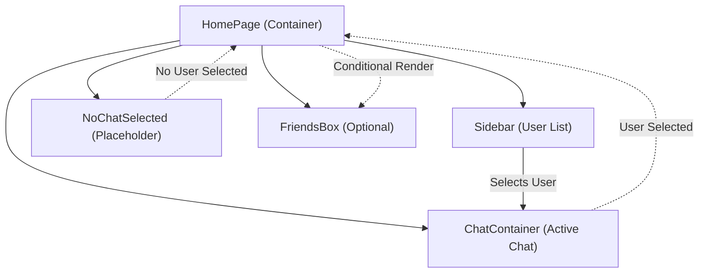
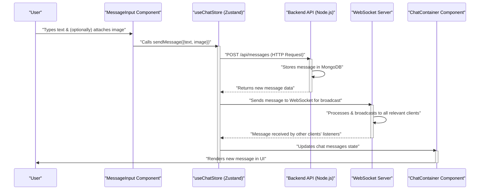

# UI Components and Layouts

<TOC />

This section details the primary UI components that form the chat application's user interface, along with their responsibilities and interactions. These components are designed for reusability and clarity, adhering to modern React practices.

## Overview

The chat application's frontend is structured around a main `HomePage` that orchestrates the display of various sub-components, including a `Sidebar` for user selection, a `ChatContainer` for active conversations, and a `MessageInput` for composing messages.

The following diagram illustrates the high-level page structure:





## Core UI Components

### `ChatContainer`

The `ChatContainer` component, located at `frontend/src/components/ChatContainer.jsx`, is responsible for displaying the messages of the currently selected chat and managing real-time updates.

#### Key Features:

*   **Message Display:** Renders individual messages, including sender's profile picture, timestamp, text content, and attached images.
*   **Real-time Updates:** Subscribes to new messages via WebSocket to provide an immediate chat experience.
*   **Auto-scrolling:** Automatically scrolls to the latest message when new messages arrive or the component mounts.
*   **Loading State:** Displays a skeleton loader (`MessageSkeleton`) while messages are being fetched.
*   **Integration:** Incorporates `ChatHeader` (for chat partner info) and `MessageInput` (for message composition).

#### Message Fetching and Real-time Subscription

The component uses `useEffect` hooks to manage message fetching and real-time subscriptions, ensuring that messages are loaded for the `selectedUser` and updates are received.

```jsx
import { useEffect } from "react";
import { useChatStore } from "../store/useChatStore";

const ChatContainer = () => {
    const { messages, getMessages, isMessagesLoading, selectedUser, subscribeToMessages, unsubscribeFromMessages } =
        useChatStore();
    // ... other code ...

    useEffect(() => {
        getMessages(selectedUser._id);
        subscribeToMessages();

        return () => unsubscribeFromMessages();
    }, [selectedUser._id, getMessages, subscribeToMessages, unsubscribeFromMessages]);

    // ... other code ...
};
```
This `useEffect` hook ensures that when a new user is selected, the chat messages are fetched, and the WebSocket subscription for real-time updates is established. The cleanup function unsubscribes from messages when the component unmounts or the `selectedUser` changes, preventing memory leaks and stale data.
[View on GitHub](https://github.com/shinymack/Chat-App-MERN/blob/main/frontend/src/components/ChatContainer.jsx#L15-L22)

#### Message Rendering and Auto-scrolling

Messages are mapped and rendered with dynamic styling (`chat-end` for the authenticated user, `chat-start` for others) and auto-scrolling to ensure the latest message is always visible.

```jsx
// ... inside ChatContainer's return statement ...
            <div className="flex-1 overflow-y-auto p-4 space-y-4">
                {messages.map((message) => (
                    <div
                        key={message._id}
                        className={`chat ${message.senderId == authUser._id ? "chat-end": "chat-start"} `}
                        ref={messageEndRef}
                    >
                        <div className="chat-image avatar">
                            <div className="size-9 rounded-full border">
                                
                            </div>
                        </div>
                        <div className="chat-header mb-1">
                            <time className="text-xs opacity-50 ml-1">{formatMessageTime(message.createdAt)}</time>
                        </div>
                        <div className="chat-bubble flex flex-col">
                            {message.image && (
                                
                            )}
                            {message.text && <p>{message.text}</p>}
                        </div>
                    </div>
                ))}
            </div>
// ...
```
This snippet demonstrates the core message rendering loop. It dynamically applies `chat-end` or `chat-start` classes based on the sender, shows avatars, timestamps, and conditionally renders attached images or text content within a chat bubble. The `messageEndRef` is attached to the last message to facilitate auto-scrolling.
[View on GitHub](https://github.com/shinymack/Chat-App-MERN/blob/main/frontend/src/components/ChatContainer.jsx#L38-L69)

---

### `MessageInput`

The `MessageInput` component, found at `frontend/src/components/MessageInput.jsx`, provides the interface for composing and sending messages, including text and image attachments.

#### Key Features:

*   **Text Input:** A standard text area for typing messages.
*   **Image Attachment:** Allows users to select an image file, view a preview, and attach it to the message.
*   **Image Preview & Removal:** Displays a preview of the attached image with an option to remove it before sending.
*   **Message Sending:** Dispatches the message (text and/or image) to the backend via `useChatStore`.
*   **Input Validation:** Ensures only image files can be attached and disables the send button if no content is present.

#### Handling Message Submission

The `handleSendMessage` function orchestrates the submission of messages, including clearing the input and resetting the image preview upon successful dispatch.

```jsx
import { useRef, useState } from "react";
import { useChatStore } from "../store/useChatStore";

const MessageInput = () => {
    const [text, setText] = useState("");
    const [imagePreview, setImagePreview] = useState(null);
    const fileInputRef = useRef(null);
    const { sendMessage } = useChatStore();

    // ... other functions ...

    const handleSendMessage = async (e) => {
        e.preventDefault();
        if (!text.trim() && !imagePreview) return; // Disable if no text and no image

        try {
            await sendMessage({
                text: text.trim(),
                image: imagePreview,
            });

            setText(""); // Clear text input
            setImagePreview(null); // Clear image preview
            if (fileInputRef.current) fileInputRef.current = ""; // Reset file input
        } catch (error) {
            console.error("Failed to send message", error);
        }
    };
    // ...
```
This `handleSendMessage` function is triggered on form submission. It prevents sending empty messages, calls the `sendMessage` action from `useChatStore` with the current text and image preview, and then resets the input fields.
[View on GitHub](https://github.com/shinymack/Chat-App-MERN/blob/main/frontend/src/components/MessageInput.jsx#L32-L48)

#### Conditional Image Preview

The component conditionally renders an image preview and a removal button if an image has been selected, providing visual feedback to the user.

```jsx
// ... inside MessageInput's return statement ...
            {imagePreview && (
                <div className="mb-3 flex items-center gap-2">
                    <div className="relative">
                        
                        <button
                            onClick={removeImage}
                            className="absolute -top-1.5 -right-1.5 w-5 h-5 rounded-full bg-base-300
              flex items-center justify-center"
                            type="button"
                        >
                            <X className="size-3" />
                        </button>
                    </div>
                </div>
            )}
// ...
```
This JSX fragment shows how the image preview is displayed only when `imagePreview` is not null. It includes the image itself and a small "X" button to call `removeImage`, allowing users to deselect an attached image.
[View on GitHub](https://github.com/shinymack/Chat-App-MERN/blob/main/frontend/src/components/MessageInput.jsx#L53-L72)

The message sending process can be visualized as follows:





---

### `Sidebar`

The `Sidebar` component (`frontend/src/components/Sidebar.jsx`) lists available chat partners (friends) and allows the user to select one to begin a conversation.

#### Key Features:

*   **Friends List:** Fetches and displays a list of users (`friends`).
*   **Online Status:** Shows an indicator if a user is currently online.
*   **User Selection:** Allows users to click on a friend to set them as the `selectedUser`, triggering the display of their chat.
*   **Online Filter:** Provides a checkbox to filter the list, showing only online friends.
*   **Responsive Hiding:** On small screens, the sidebar dynamically hides when a user is selected to maximize chat space.

#### Filtering Online Users

The `Sidebar` includes logic to filter the displayed users based on their online status, which is managed by the `useAuthStore`.

```jsx
import { useEffect, useState } from "react";
import { useChatStore } from "../store/useChatStore";
import { useAuthStore } from "../store/useAuthStore";

const Sidebar = () => {
    const { getFriends, users, selectedUser, setSelectedUser, isUsersLoading } =
        useChatStore();
    const { onlineUsers } = useAuthStore();
    const [showOnlineOnly, setShowOnlineOnly] = useState(false);

    useEffect(() => {
        getFriends(); // Fetch friends on component mount
    }, [getFriends]);

    const filteredUsers = showOnlineOnly
        ? users.filter((user) => onlineUsers.includes(user._id))
        : users;
    // ...
};
```
This snippet demonstrates how `filteredUsers` is derived. If `showOnlineOnly` is true, it filters the `users` array against the `onlineUsers` list from `useAuthStore`; otherwise, it displays all users. This allows for dynamic filtering of the friend list.
[View on GitHub](https://github.com/shinymack/Chat-App-MERN/blob/main/frontend/src/components/Sidebar.jsx#L11-L24)

---

### `HomePage`

The `HomePage` component (`frontend/src/pages/HomePage.jsx`) serves as the main layout for the chat application, integrating the `Sidebar`, `ChatContainer`, `NoChatSelected`, and `FriendsBox` components.

#### Key Features:

*   **Main Layout:** Provides the overall structure and styling for the chat interface.
*   **Conditional Rendering:** Dynamically renders either the `ChatContainer` (if a user is selected) or a `NoChatSelected` placeholder.
*   **Component Orchestration:** Brings together various UI components to form the complete chat application view.

#### Conditional Chat Display

The `HomePage` uses the `selectedUser` state from `useChatStore` to decide whether to show an active chat or a prompt to select a chat.

```jsx
import ChatContainer from "../components/ChatContainer";
import FriendsBox from "../components/FriendsBox";
import NoChatSelected from "../components/NoChatSelected";
import Sidebar from "../components/Sidebar";
import { useChatStore } from "../store/useChatStore"

const HomePage = () => {
  const { selectedUser } = useChatStore();
  const { isFriendsBoxOpen } = useChatStore();
  return (
      <div className="h-screen bg-base-200">
      <div className="flex items-center justify-center pt-20 px-4 w-full">
        <div className="bg-base-100 rounded-lg shadow-xl w-full max-w-6xl h-[calc(100vh-8rem)]">
          <div className="flex h-full rounded-lg overflow-hidden w-full">
            <Sidebar />
            {!selectedUser ? <NoChatSelected /> : <ChatContainer />} {/* Conditional rendering */}
            {isFriendsBoxOpen && <FriendsBox />} {/* Optional component */}
          </div>
        </div>
      </div>
    </div>
  )
}

export default HomePage
```
This snippet illustrates the core layout and conditional rendering within `HomePage`. The `Sidebar` is always present, but the main content area switches between `NoChatSelected` and `ChatContainer` based on whether a `selectedUser` is defined. The `FriendsBox` is also conditionally rendered, indicating a potential feature for managing friends.
[View on GitHub](https://github.com/shinymack/Chat-App-MERN/blob/main/frontend/src/pages/HomePage.jsx#L10-L24)

## Key Integration Points

*   **Centralized State (`useChatStore`):** All major UI components (`ChatContainer`, `MessageInput`, `Sidebar`, `HomePage`) heavily rely on the `useChatStore` for shared state management. This includes `selectedUser`, `messages`, `users` (friends), and actions like `getMessages`, `sendMessage`, `getFriends`, `setSelectedUser`. This ensures data consistency and simplifies data flow across the application.
*   **Real-time Communication:** The `ChatContainer` and `Sidebar` demonstrate critical integration with real-time features. `ChatContainer` directly subscribes to message updates, while `Sidebar` leverages `onlineUsers` from `useAuthStore` (which itself receives updates via WebSockets) to display live online statuses.
*   **Modular Design:** The components are designed to be independent and reusable. For instance, `MessageInput` can be easily placed in different contexts, and `ChatContainer` focuses solely on message display. `HomePage` acts as an orchestrator, demonstrating composition over monolithic components.
*   **Responsiveness:** The `Sidebar` component's conditional display based on `selectedUser` and screen size (`hidden sm:flex`) highlights consideration for responsive design, optimizing the user experience across various devices.

Next: [State Management and Utilities](./3.2_state-management-and-utilities.mdx)