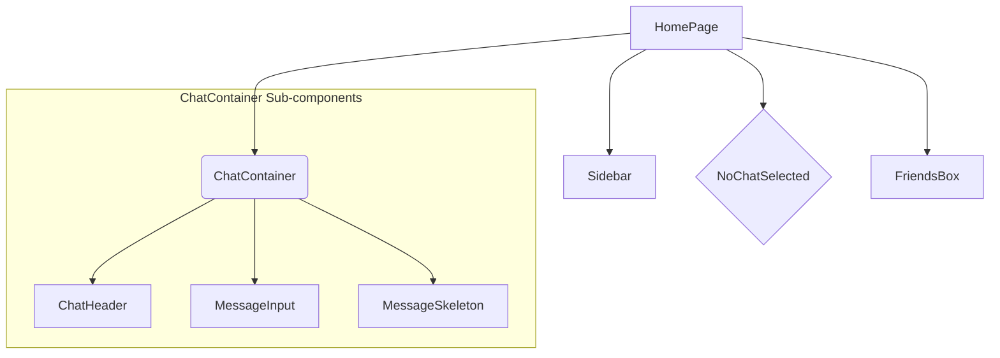

# UI Components & Pages

<TOC />

This section provides a detailed overview of the primary user interface components and pages that constitute the frontend of the ShinyChat application. We will explore their individual responsibilities, how they interact, their design rationale, and the underlying state management principles that drive their functionality. The components discussed here form the core visual and interactive elements users engage with daily, enabling real-time communication.

## 1. Application Page: HomePage

The `HomePage.jsx` component serves as the central hub of the ShinyChat application once a user is authenticated. It orchestrates the display of various chat-related components, adapting its layout based on user interactions and application state.

### 1.1. Purpose and Structure

The `HomePage` is responsible for rendering the main chat interface. It acts as a container for the `Sidebar`, `ChatContainer`, `NoChatSelected`, and `FriendsBox` components, ensuring they are displayed correctly and respond to changes in the chat application's state.

**Key Features:**

*   **Main Layout:** Establishes the overall layout for the chat application, including padding and background.
*   **Conditional Rendering:** Dynamically switches between displaying a placeholder (`NoChatSelected`) when no chat is active and the full `ChatContainer` when a user has been selected for conversation.
*   **Sidebar Integration:** Always renders the `Sidebar` to allow users to select a chat partner.
*   **Friends Box Integration:** Conditionally renders the `FriendsBox` component, which likely provides an alternative or supplementary view for managing friends.

**`HomePage.jsx` Rendering Logic:**

The core logic for conditionally rendering chat components is straightforward, relying on the `selectedUser` state from the global chat store.

```jsx
// frontend/src/pages/HomePage.jsx
import ChatContainer from "../components/ChatContainer";
import FriendsBox from "../components/FriendsBox";
import NoChatSelected from "../components/NoChatSelected";
import Sidebar from "../components/Sidebar";
import { useChatStore } from "../store/useChatStore"

const HomePage = () => {
  const { selectedUser } = useChatStore();
  const { isFriendsBoxOpen } = useChatStore();
  return (
      <div className="h-screen bg-base-200">
      <div className="flex items-center justify-center pt-20 px-4 w-full">
        <div className="bg-base-100 rounded-lg shadow-xl w-full max-w-6xl h-[calc(100vh-8rem)]">
          <div className="flex h-full rounded-lg overflow-hidden w-full">
            <Sidebar />
            {!selectedUser ? <NoChatSelected /> : <ChatContainer />} {/* Conditional rendering */}
            {isFriendsBoxOpen && <FriendsBox />}                     {/* Conditional rendering */}
          </div>
        </div>
      </div>
    </div>
  )
}

export default HomePage
```

[View full file `HomePage.jsx` on GitHub](https://github.com/shinymack/Chat-App-MERN/blob/main/frontend/src/pages/HomePage.jsx)

### 1.2. Component Hierarchy in HomePage

The `HomePage` acts as the root for several key UI components, establishing a clear hierarchy for the chat interface.





**Why this Design?**

This modular approach allows for a clean separation of concerns. `HomePage` focuses solely on arranging the main sections, while `Sidebar` manages friend lists, `ChatContainer` handles messages, and `NoChatSelected` provides user guidance. This makes the application easier to understand, test, and maintain.

## 2. Global UI Components

The application utilizes several reusable UI components that provide essential navigation and contextual information across different parts of the user experience.

### 2.1. Navbar Component

The `Navbar` component provides persistent navigation and user-specific actions at the top of the application interface.

**What it Does:**
It acts as a consistent header across the application, displaying the app's logo, navigation links to core sections like `Settings` and `Profile`, and user authentication actions like `Logout`. It also provides a button to toggle the `FriendsBox`.

**Why it's Designed This Way:**
*   **Global Access:** Centralizes primary navigation and user actions, making them accessible from any page.
*   **Branding & Identity:** Displays the "ShinyChat" logo, reinforcing brand presence.
*   **User Context:** Shows user-specific options (Profile, Logout) only when authenticated, enhancing security and user experience.
*   **Responsiveness:** The `sm:inline` classes suggest an intention for responsive design, hiding text labels on smaller screens to save space.

**How it Interacts:**
*   It uses `react-router-dom`'s `Link` component for declarative navigation.
*   It leverages the `useAuthStore` to access `authUser` (to conditionally display profile/logout) and the `logout` function.
*   It uses `useChatStore` to access `toggleFriendsBox`, allowing it to control the visibility of the `FriendsBox` component.

**`Navbar.jsx` Structure:**

```jsx
// frontend/src/components/Navbar.jsx
import { Link } from "react-router-dom";
import { useAuthStore } from "../store/useAuthStore";
import { LogOut, MessageSquare, Settings, User, Users } from "lucide-react"; // Icon imports
import { useChatStore } from "../store/useChatStore";

const Navbar = () => {
  const { logout, authUser } = useAuthStore();
  const { toggleFriendsBox } = useChatStore(); 

  return (
    <header className=" bg-base-100 border-b border-base-300 fixed w-full top-0 z-40 backdrop-blur-lg bg-base-100/80">
      <div className="container mx-auto px-4 h-16">
        <div className="flex items-center justify-between h-full">
          <div className="flex items-center gap-8">
            <Link to="/" className="flex items-center gap-2.5 hover:opacity-80 transition-all">
              <div className="size-9 rounded-lg bg-primary/10 flex items-center justify-center">
                <MessageSquare className="size-5 text-primary"></MessageSquare>
              </div>
              <h1 className="text-lg font-bold">ShinyChat</h1>
            </Link>
          </div>
          <div className="flex items-center gap-4">
            <button className="btn btn-sm gap-2" onClick={toggleFriendsBox}> {/* Toggle FriendsBox */}
              <Users className="size-5" />
              <span className="hidden sm:inline">Friends</span>
            </button>
            <Link to={"/settings"} className={`btn btn-sm gap-2 transition-colors`}>
                <Settings className="size-4"/>
                <span className="hidden sm:inline">Settings</span>
            </Link>
            {authUser && ( // Conditional rendering for authenticated users
              <>
                <Link to={"/profile"} className={`btn btn-sm gap-2`}>
                  <User className="size-5" />
                  <span className="hidden sm:inline">Profile</span>
                </Link>
                <button className="btn btn-sm flex gap-2 items-center" onClick={logout}>
                  <LogOut className="size-5" />
                  <span className="hidden sm:inline">Logout</span>
                </button>
              </>
            )}
          </div>
        </div>
      </div>
    </header>
  );
};

export default Navbar;
```

[View full file `Navbar.jsx` on GitHub](https://github.com/shinymack/Chat-App-MERN/blob/main/frontend/src/components/Navbar.jsx)

### 2.2. Sidebar Component

The `Sidebar` component displays a dynamic list of users (friends) available for chat, allowing users to select a conversation partner.

**What it Does:**
It fetches and displays a list of registered users. It highlights the currently selected user and indicates online/offline status. Users can filter the list to show only online friends.

**Why it's Designed This Way:**
*   **User Selection:** Provides a clear, persistent list for initiating and switching conversations.
*   **Real-time Presence:** Integrates with `onlineUsers` from `useAuthStore` to show real-time online status, enhancing the sense of presence.
*   **Responsiveness:** The conditional `hidden sm:flex w-[100vw]` class for small screens allows the `Sidebar` to take full width or hide when a chat is selected, optimizing space on mobile devices.
*   **Filtering:** The "Show online only" checkbox improves usability by allowing users to quickly find available contacts.

**How it Interacts:**
*   It fetches the list of friends using `getFriends` from `useChatStore` on component mount.
*   It uses `users`, `selectedUser`, and `setSelectedUser` from `useChatStore` to manage the list display and selection.
*   It consumes `onlineUsers` from `useAuthStore` to render online status indicators.
*   It uses `SidebarSkeleton` as a placeholder during loading states, providing a better user experience.

**`Sidebar.jsx` User List and Online Status Logic:**

```jsx
// frontend/src/components/Sidebar.jsx
import { useEffect, useState } from "react";
import { useChatStore } from "../store/useChatStore";
import SidebarSkeleton from "./skeletons/SidebarSkeleton";
import { Users } from "lucide-react";
import { useAuthStore } from "../store/useAuthStore";

const Sidebar = () => {
    const { getFriends, users, selectedUser, setSelectedUser, isUsersLoading } =
        useChatStore();
    const { onlineUsers } = useAuthStore();
    const [showOnlineOnly, setShowOnlineOnly] = useState(false);

    useEffect(() => {
        getFriends(); // Fetch friends on mount
    }, [getFriends]);

    const filteredUsers = showOnlineOnly
        ? users.filter((user) => onlineUsers.includes(user._id))
        : users;

    if (isUsersLoading) return <SidebarSkeleton />;
    return (
        <div className={`h-full sm:w-72 sm:border-r border-base-300  flex-col transition-all duration-200 ${selectedUser ?
                                    "hidden sm:flex w-[100vw] " // Responsive behavior
                                    : ""}`}>
            {/* ... (header and online filter UI) ... */}
            <div className="overflow-y-scroll h-[calc(100vh-14rem)] w-full flex flex-col py-3">
                {filteredUsers.map((user) => (
                    <button
                        key={user._id}
                        onClick={() => setSelectedUser(user)} // Set selected user
                        className={`sm:w-full w-[88vw] p-3 flex items-center gap-3 hover:bg-base-300 transition-colors
                        ${selectedUser?._id === user._id ? "bg-base-300 ring-1 ring-base-300" : ""}`}
                    >
                        <div className="relative mx-0">
                            
                            {onlineUsers.includes(user._id) && ( // Online indicator
                                <span className="absolute bottom-0 right-0 size-3 bg-green-500 rounded-full ring-2 ring-zinc-900" />
                            )}
                        </div>
                        <div className=" block text-left min-w-0">
                            <div className=" font-medium truncate">
                                {user.username}
                            </div>
                            <div className="text-sm text-zinc-400">
                                {onlineUsers.includes(user._id) ? "Online" : "Offline"}
                            </div>
                        </div>
                    </button>
                ))}
            </div>
            {/* ... (no online friends message) ... */}
        </div>
    );
};

export default Sidebar;
```

[View full file `Sidebar.jsx` on GitHub](https://github.com/shinymack/Chat-App-MERN/blob/main/frontend/src/components/Sidebar.jsx)

### 2.3. ChatContainer Component

The `ChatContainer` component is the main interface for viewing and sending messages within an active conversation.

**What it Does:**
It displays the messages exchanged between the authenticated user and the `selectedUser`. It fetches messages, subscribes to real-time updates, handles message input, and ensures the chat view automatically scrolls to the latest message. It also supports displaying images within messages.

**Why it's Designed This Way:**
*   **Real-time Communication:** Utilizes `subscribeToMessages` to ensure messages are updated instantly, crucial for a chat application.
*   **User Experience:** Auto-scrolling to the latest message (`messageEndRef`) prevents users from manually scrolling down after every new message.
*   **Loading Feedback:** Displays `MessageSkeleton` during loading to inform the user that content is being fetched, improving perceived performance.
*   **Clear Attribution:** Messages are clearly attributed to the sender (start vs. end, profile pictures), making conversations easy to follow.

**How it Interacts:**
*   It uses `useChatStore` to access `messages`, `getMessages`, `isMessagesLoading`, `selectedUser`, `subscribeToMessages`, and `unsubscribeFromMessages`.
*   It uses `useAuthStore` to access `authUser` for identifying the current user's messages.
*   It integrates `ChatHeader` (displays selected user's info) and `MessageInput` (for sending new messages).
*   `useEffect` hooks manage message fetching, real-time subscription, and auto-scrolling.

**`ChatContainer.jsx` Message Display and Real-time Logic:**

```jsx
// frontend/src/components/ChatContainer.jsx
import { useEffect, useRef } from "react";
import { useChatStore } from "../store/useChatStore";
import ChatHeader from "./ChatHeader";
import MessageInput from "./MessageInput";
import MessageSkeleton from "./skeletons/MessageSkeleton";
import { useAuthStore } from "../store/useAuthStore";
import { formatMessageTime } from "../lib/utils";

const ChatContainer = () => {
    const { messages, getMessages, isMessagesLoading, selectedUser, subscribeToMessages, unsubscribeFromMessages } =
        useChatStore();
    const { authUser } = useAuthStore();
    const messageEndRef = useRef(null); // Ref for auto-scrolling

    // Effect for fetching and subscribing to messages
    useEffect(() => {
        getMessages(selectedUser._id);
        subscribeToMessages();

        return () => unsubscribeFromMessages(); // Cleanup on unmount/selectedUser change
    }, [selectedUser._id, getMessages, subscribeToMessages, unsubscribeFromMessages]);
    
    // Effect for auto-scrolling to the latest message
    useEffect(() => {
        if(messageEndRef.current && messages){
            messageEndRef.current.scrollIntoView({behaviour : "smooth"})
        }
    }, [messages]) // Re-scroll whenever messages array changes

    if (isMessagesLoading) // Loading state UI
        return (
            <div className="flex-1 flex flex-col overflow-auto">
                <ChatHeader />
                <MessageSkeleton />
                <MessageInput />
            </div>
        );
    return (
        <div className="flex-1 flex flex-col overflow-auto">
            <ChatHeader />
            <div className="flex-1 overflow-y-auto p-4 space-y-4">
                {messages.map((message) => (
                    <div
                        key={message._id}
                        className={`chat ${message.senderId == authUser._id ? "chat-end": "chat-start"} `} // Sender/receiver styling
                        ref={messageEndRef} // Latest message ref
                    >
                        <div className="chat-image avatar">
                            <div className="size-9 rounded-full border">
                                
                            </div>
                        </div>
                        <div className="chat-header mb-1">
                            <time className="text-xs opacity-50 ml-1">{formatMessageTime(message.createdAt)}</time>
                        </div>
                        <div className="chat-bubble flex flex-col">
                            {message.image && ( // Display image attachment
                                
                            )}
                            {message.text && <p>{message.text}</p>} {/* Display text content */}
                        </div>
                    </div>
                ))}
            </div>
            <MessageInput />
        </div>
    );
};

export default ChatContainer;
```

[View full file `ChatContainer.jsx` on GitHub](https://github.com/shinymack/Chat-App-MERN/blob/main/frontend/src/components/ChatContainer.jsx)

### 2.4. Data Flow within ChatContainer

The `ChatContainer` demonstrates a dynamic interaction pattern involving state management, real-time updates, and user input.


```mermaid
graph TD
    UI[User Interaction] --> MI[MessageInput Component]
    MI --> CSM[useChatStore: sendMessage]
    CSM --> BE[Backend API / Socket.IO]
    BE --> CSH[useChatStore: handle real-time updates]
    CSH --> CC[ChatContainer Component]
    CC --> RMD[Render Messages Dynamically]
    CC --> AUTOSCROLL[Auto-scroll to New Message]

    subgraph ChatContainer Internal Flow
        CC --> CH[ChatHeader]
        CC --> MS[MessageSkeleton (Loading State)]
        RMD --> MDF[Message Display (Text/Image)]
    end
```


**Why this Flow?**

This flow ensures that:
1.  User actions (sending messages) are immediately processed.
2.  Messages are sent to the backend and potentially broadcast to other users in real-time.
3.  The UI is updated efficiently with new messages, both local and remote.
4.  Loading states are handled gracefully, and the user experience is optimized with auto-scrolling.

## 3. Other Supporting Components

Several smaller, specialized components play crucial roles in completing the UI experience:

*   **`NoChatSelected.jsx`**: A simple placeholder component displayed in `HomePage` when no user is currently selected for a chat. It provides a friendly message guiding the user to select a contact from the sidebar.
*   **`FriendsBox.jsx`**: (Although not provided in the files, its presence in `HomePage` and `Navbar` suggests its role). This component likely provides an alternative or supplementary interface for managing or viewing friends, possibly as a modal or slide-out panel, toggled by the `Navbar`.
*   **`ChatHeader.jsx`**: Displays information about the currently selected user within the `ChatContainer`, typically including their profile picture and username.
*   **`MessageInput.jsx`**: The input field and send button located at the bottom of the `ChatContainer`, responsible for composing and dispatching new messages.
*   **`MessageSkeleton.jsx` & `SidebarSkeleton.jsx`**: These are loading state components that render animated placeholders while messages or friend lists are being fetched, providing visual feedback to the user instead of a blank screen.

## 4. Key Integration Points and Insights

*   **Zustand for Global State:** The use of `useAuthStore` and `useChatStore` (powered by Zustand) is pivotal. It centralizes authentication data (`authUser`, `onlineUsers`) and chat-specific data (`selectedUser`, `messages`, `users`), making it easily accessible to all UI components without prop drilling.
*   **Separation of Concerns:** Each component has a distinct responsibility: `Navbar` for global navigation, `Sidebar` for contact selection, `ChatContainer` for message display, and `HomePage` for overall page composition. This promotes maintainability and scalability.
*   **Responsive Design:** Elements like the `Sidebar`'s conditional hiding on small screens and `Navbar`'s `sm:inline` class indicate a thoughtful approach to ensuring the application is usable across various device sizes.
*   **Real-time Capabilities:** The explicit `subscribeToMessages` and `unsubscribeFromMessages` in `ChatContainer` highlight the application's real-time messaging capabilities, likely leveraging WebSockets (e.g., Socket.IO) on the backend for instant message delivery.
*   **User Experience Focus:** Features like loading skeletons, auto-scrolling, and online status indicators demonstrate an emphasis on a smooth and informative user experience.

These UI components collectively form the interactive facade of ShinyChat, enabling users to effortlessly navigate, manage contacts, and engage in real-time conversations. Their modular design, coupled with efficient state management, lays a strong foundation for a robust and user-friendly application.

Next: [State Management & Data Interaction](./3.2_state_management_data_interaction.mdx)