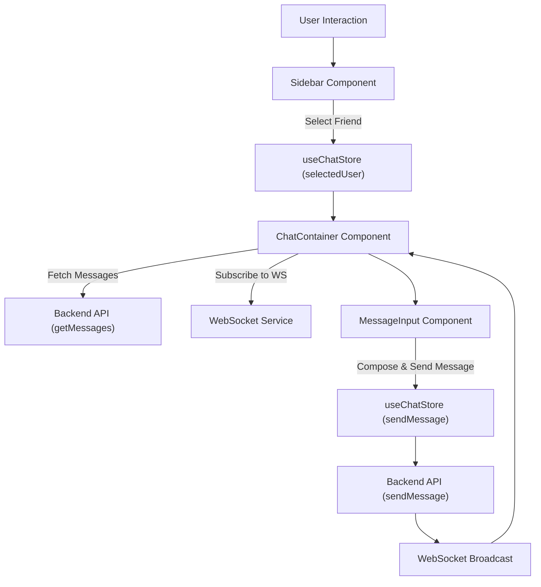
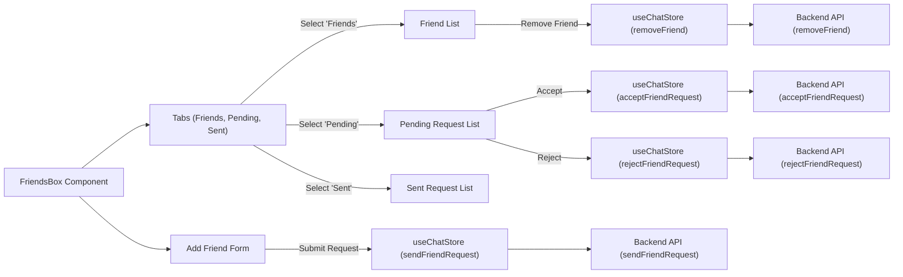

# User Interface Components

<TOC />

This section details the primary React components that compose the user interface of the application. These components are designed for reusability and maintainability, interacting with the application's state management layer to provide a dynamic and responsive user experience.

## Overview

The user interface is built using a component-based architecture, leveraging React to create modular and interactive elements. Each component serves a specific purpose, from displaying chat messages to managing friend requests. They utilize global state (`useChatStore`, `useAuthStore`) to fetch and display data, and to trigger actions such as sending messages or managing friendships.

## Core Components

### `ChatContainer.jsx`

The `ChatContainer` component is responsible for displaying messages within a chat session for a `selectedUser`. It fetches messages for the currently selected user and subscribes to real-time message updates. It also handles the dynamic scrolling to the latest message.

-   **File Path**: `frontend/src/components/ChatContainer.jsx`
-   **Purpose**: Renders the conversation history, including sender information, message content (text and images), and timestamps.
-   **Key Features**:
    *   Fetches and displays messages for the `selectedUser`.
    *   Subscribes to real-time message updates using WebSockets.
    *   Automatically scrolls to the bottom of the chat on new messages or initial load.
    *   Differentiates between sent and received messages for styling.
    *   Integrates `ChatHeader` and `MessageInput` components.

```jsx title="frontend/src/components/ChatContainer.jsx" {26-29, 36-39}
// ...imports
const ChatContainer = () => {
    const { messages, getMessages, isMessagesLoading, selectedUser, subscribeToMessages, unsubscribeFromMessages } =
        useChatStore();
    const { authUser } = useAuthStore();
    const messageEndRef = useRef(null);

    // Effect to fetch messages and subscribe to real-time updates for the selected user
    useEffect(() => {
        getMessages(selectedUser._id);
        subscribeToMessages();

        return () => unsubscribeFromMessages(); // Cleanup on component unmount or selectedUser change
    }, [selectedUser._id, getMessages, subscribeToMessages, unsubscribeFromMessages]);
    
    // Effect to scroll to the latest message
    useEffect(() => {
        if(messageEndRef.current && messages){
            messageEndRef.current.scrollIntoView({behaviour : "smooth"})
        }
    }, [messages])

    if (isMessagesLoading)
        return (
            <div className="flex-1 flex flex-col overflow-auto">
                <ChatHeader />
                <MessageSkeleton />
                <MessageInput />
            </div>
        );
    return (
        <div className="flex-1 flex flex-col overflow-auto">
            <ChatHeader />
            <div className="flex-1 overflow-y-auto p-4 space-y-4">
                {messages.map((message, index) => (
                    <div
                        key={message._id}
                        // Apply 'chat-end' for authenticated user's messages, 'chat-start' for others
                        className={`chat ${message.senderId == authUser._id ? "chat-end": "chat-start"} `}
                        ref={index === messages.length - 1 ? messageEndRef : null} // Only last message gets the ref
                    >
                        {/* ...message content rendering */}
                    </div>
                ))}
            </div>
            <MessageInput />
        </div>
    );
};
export default ChatContainer;
```
[View on GitHub](https://github.com/shinymack/Chat-App-MERN/blob/main/frontend/src/components/ChatContainer.jsx)

The `useEffect` hook handles fetching messages and setting up real-time subscriptions, ensuring that the chat data is always up-to-date for the currently `selectedUser`. Another `useEffect` manages the auto-scrolling to the latest message, providing a smooth user experience.

### `FriendsBox.jsx`

The `FriendsBox` component provides a modal interface for managing friend relationships, including sending requests, accepting/rejecting pending requests, and removing friends.

-   **File Path**: `frontend/src/components/FriendsBox.jsx`
-   **Purpose**: Facilitates friend management within the application.
-   **Key Features**:
    *   Displays tabs for "Friends," "Pending Requests," and "Sent Requests."
    *   Allows users to send friend requests by entering a username or email.
    *   Provides actions to accept or reject pending friend requests.
    *   Allows users to remove existing friends.
    *   Utilizes `useChatStore` for all friend-related data and actions.

```jsx title="frontend/src/components/FriendsBox.jsx" {23-28, 48-52, 102-106}
// ...imports
const FriendsBox = () => {
    const { 
        toggleFriendsBox, 
        getFriends, users,
        getPendingRequests, pendingRequests,
        getSentRequests, sentRequests,
        sendFriendRequest, acceptFriendRequest, rejectFriendRequest, removeFriend
    } = useChatStore();

    const [activeTab, setActiveTab] = useState('friends');
    const [identifier, setIdentifier] = useState('');

    useEffect(() => {
        // Fetch all necessary data when the component mounts
        getFriends();
        getPendingRequests();
        getSentRequests();
    }, [getFriends, getPendingRequests, getSentRequests]);

    const handleAddFriend = (e) => {
        e.preventDefault();
        if (identifier.trim()) {
            sendFriendRequest(identifier); // Action to send a friend request
            setIdentifier('');
        }
    };

    const renderContent = () => {
        switch (activeTab) {
            case 'pending':
                return (
                    <div className="space-y-2">
                        {pendingRequests.length > 0 ? pendingRequests.map(req => (
                            <div key={req._id} className="flex items-center justify-between p-2 rounded-lg bg-base-200">
                                <div className="flex items-center gap-3">
                                    
                                    <span>{req.username}</span>
                                </div>
                                <div className="flex gap-2">
                                    <button onClick={() => acceptFriendRequest(req._id)} className="btn btn-xs btn-success btn-circle"><Check size={16}/></button>
                                    <button onClick={() => rejectFriendRequest(req._id)} className="btn btn-xs btn-error btn-circle"><X size={16}/></button>
                                </div>
                            </div>
                        )) : <p className="text-center text-base-content/60 py-4">No pending requests.</p>}
                    </div>
                );
            // ...cases for 'sent' and 'friends'
        }
    };

    return (
        <div className="fixed inset-0 bg-black/50 z-50 flex items-center justify-center">
            <div className="bg-base-100 rounded-lg w-full max-w-md p-6 relative flex flex-col gap-4">
                <button onClick={toggleFriendsBox} className="btn btn-sm btn-circle btn-ghost absolute top-2 right-2"><X /></button>
                
                <h2 className="text-xl font-bold">Manage Friends</h2>

                {/* Add Friend Form */}
                <form onSubmit={handleAddFriend} className="flex gap-2">
                    <input 
                        type="text" 
                        placeholder="Enter username or email" 
                        className="input input-bordered w-full"
                        value={identifier}
                        onChange={(e) => setIdentifier(e.target.value)}
                    />
                    <button type="submit" className="btn btn-primary"><UserPlus /></button>
                </form>

                {/* Tabs */}
                <div role="tablist" className="tabs tabs-boxed">
                    <a role="tab" className={`tab ${activeTab === 'friends' ? 'tab-active' : ''}`} onClick={() => setActiveTab('friends')}>Friends ({users.length})</a>
                    <a role="tab" className={`tab ${activeTab === 'pending' ? 'tab-active' : ''}`} onClick={() => setActiveTab('pending')}>Pending ({pendingRequests.length})</a>
                    <a role="tab" className={`tab ${activeTab === 'sent' ? 'tab-active' : ''}`} onClick={() => setActiveTab('sent')}>Sent ({sentRequests.length})</a>
                </div>

                {/* Tab Content */}
                <div className="overflow-y-auto max-h-60 pr-2">
                    {renderContent()}
                </div>
            </div>
        </div>
    );
};

export default FriendsBox;
```
[View on GitHub](https://github.com/shinymack/Chat-App-MERN/blob/main/frontend/src/components/FriendsBox.jsx)

### `MessageInput.jsx`

The `MessageInput` component provides the interface for users to compose and send messages, including text and image attachments.

-   **File Path**: `frontend/src/components/MessageInput.jsx`
-   **Purpose**: Enables users to send text messages and image files.
-   **Key Features**:
    *   Text input field for message composition.
    *   Image attachment functionality with a preview.
    *   Validation for image file types.
    *   Removes image preview if the user decides not to send it.
    *   Disables send button if both text and image are empty.
    *   Integrates with `useChatStore` for sending messages.

```jsx title="frontend/src/components/MessageInput.jsx" {26-29, 41-45}
// ...imports
const MessageInput = () => {
    const [text, setText] = useState("");
    const [imagePreview, setImagePreview] = useState(null);
    const fileInputRef = useRef(null);
    const { sendMessage } = useChatStore();

    const handleImageChange = (e) => {
        const file = e.target.files[0];
        if (!file.type.startsWith("image/")) {
            toast.error("Please select an image file");
            return;
        }

        const reader = new FileReader();
        reader.onloadend = () => {
            setImagePreview(reader.result);
        };
        reader.readAsDataURL(file);
    };

    const removeImage = () => {
        setImagePreview(null);
        if (fileInputRef.current) fileInputRef.current.value = "";
    };

    const handleSendMessage = async (e) => {
        e.preventDefault();
        if (!text.trim() && !imagePreview) return; // Prevent sending empty messages

        try {
            await sendMessage({ // Calls the sendMessage action from useChatStore
                text: text.trim(),
                image: imagePreview,
            });

            setText("");
            setImagePreview(null);
            if (fileInputRef.current) fileInputRef.current = ""; // Clear file input
        } catch (error) {
            console.error("Failed to send message", error);
        }
    };

    return (
        <div className="p-4 w-full">
            {imagePreview && (
                <div className="mb-3 flex items-center gap-2">
                    <div className="relative">
                        
                        <button
                            onClick={removeImage}
                            className="absolute -top-1.5 -right-1.5 w-5 h-5 rounded-full bg-base-300
              flex items-center justify-center"
                            type="button"
                        >
                            <X className="size-3" />
                        </button>
                    </div>
                </div>
            )}

            <form
                onSubmit={handleSendMessage}
                className="flex items-center gap-2"
            >
                <div className="flex flex-1 gap-2">
                    <input
                        type="text"
                        className="w-full input input-bordered rounded-lg input-sm sm:input-md"
                        placeholder="Type a message..."
                        value={text}
                        onChange={(e) => setText(e.target.value)}
                    />
                    <input
                        type="file"
                        accept="image/*"
                        className="hidden"
                        ref={fileInputRef}
                        onChange={handleImageChange}
                    />

                    <button
                        type="button"
                        className={`hidden sm:flex btn btn-circle
                            ${
                                imagePreview
                                    ? "text-emerald-500"
                                    : "text-zinc-400"
                            }`}
                        onClick={
                            () => {
                                if (fileInputRef.current) {
                                    fileInputRef.current.click();
                                } else {
                                    console.error("fileInputRef is not attached");
                                }
                        }
                        }
                    >
                        <Image size={20} />
                    </button>
                </div>

                <button
                    type="submit"
                    className="btn btn-sm btn-circle"
                    disabled={!text.trim() && !imagePreview}
                >
                    <Send size={22} />
                </button>
            </form>
        </div>
    );
};

export default MessageInput;
```
[View on GitHub](https://github.com/shinymack/Chat-App-MERN/blob/main/frontend/src/components/MessageInput.jsx)

### `Sidebar.jsx`

The `Sidebar` component displays a list of the user's friends and allows selection of a chat partner. It also includes functionality to filter for online friends.

-   **File Path**: `frontend/src/components/Sidebar.jsx`
-   **Purpose**: Navigates between different chat conversations.
-   **Key Features**:
    *   Fetches and displays a list of friends.
    *   Highlights the currently `selectedUser`.
    *   Indicates online/offline status for each friend.
    *   Provides a toggle to filter the list to show only online friends.
    *   Integrates with `useChatStore` for user selection and `useAuthStore` for online status.

```jsx title="frontend/src/components/Sidebar.jsx" {18-21, 51-54}
// ...imports
const Sidebar = () => {
    const { getFriends, users, selectedUser, setSelectedUser, isUsersLoading } =
        useChatStore();

    const { onlineUsers } = useAuthStore();
    const [showOnlineOnly, setShowOnlineOnly] = useState(false);

    useEffect(() => {
        getFriends(); // Fetches the list of friends on component mount
    }, [getFriends]);

    const filteredUsers = showOnlineOnly
        ? users.filter((user) => onlineUsers.includes(user._id)) // Filter for online users
        : users;

    if (isUsersLoading) return <SidebarSkeleton />;
    return (
        <div className={`h-full sm:w-72 sm:border-r border-base-300  flex-col transition-all duration-200 ${selectedUser ?
                                    "hidden sm:flex w-[100vw] "
                                    : ""}`}>
            <div className="border-b border-base-300  p-5">
                <div className="flex items-center gap-2">
                    <Users className="size-6"></Users>
                    <span className="font-medium  lg:block">
                        Friends
                    </span>
                </div>
                {/* Online toggle filter remaining */}
                <div className="mt-3 lg:flex items-center gap-2">
                    <label className="cursor-pointer flex items-center gap-2">
                        <input
                            type="checkbox"
                            checked={showOnlineOnly}
                            onChange={(e) =>
                                setShowOnlineOnly(e.target.checked)
                            }
                            className="checkbox checkbox-sm"
                        />
                        <span className="text-sm">Show online only</span>
                    </label>
                    <span className="text-xs text-zinc-500">
                          ({users.filter(friend => onlineUsers.includes(friend._id)).length} online)
                    </span>
                </div>
                <div className="overflow-y-scroll h-[calc(100vh-14rem)] w-full flex flex-col py-3">
                    {filteredUsers.map((user) => (
                        <button
                            key={user._id}
                            onClick={() => setSelectedUser(user)} // Sets the selected user for chat
                            className={`sm:w-full w-[88vw] p-3 flex items-center gap-3 hover:bg-base-300 transition-colors
                            ${
                                selectedUser?._id === user._id
                                    ? "bg-base-300 ring-1 ring-base-300"
                                    : ""
                            }`}
                        >
                            <div className="relative mx-0">
                                
                                {onlineUsers.includes(user._id) && (
                                    <span className="absolute bottom-0 right-0 size-3 bg-green-500 rounded-full ring-2 ring-zinc-900" />
                                )}
                            </div>
                            <div className=" block text-left min-w-0">
                                <div className=" font-medium truncate">
                                    {user.username}
                                </div>
                                <div className="text-sm text-zinc-400">
                                    {onlineUsers.includes(user._id)
                                        ? "Online"
                                        : "Offline"}
                                </div>
                            </div>
                        </button>
                    ))}
                </div>
                {filteredUsers.length == 0 && (
                    <div className="text-center text-zinc-500 py-4">No online friends</div>
                )}
            </div>
        </div>
    );
};

export default Sidebar;
```
[View on GitHub](https://github.com/shinymack/Chat-App-MERN/blob/main/frontend/src/components/Sidebar.jsx)

## Component Interaction Flow

The components interact seamlessly, driven by user actions and updates from the application's state management. This diagram illustrates a typical flow for a user initiating and participating in a chat.





## Friends Management Workflow

The `FriendsBox` component encapsulates a comprehensive workflow for managing friendships. It uses a tabbed interface to organize different states of friend relationships and provides clear actions for each.





## Key Integration Points

*   **Global State Management**: All mentioned components heavily rely on `useChatStore` and `useAuthStore` to manage chat state, selected users, message data, online status, and friend relationships. This centralized state management ensures data consistency and simplifies component logic.
*   **Real-time Communication**: `ChatContainer` integrates with WebSockets via `subscribeToMessages` to receive new messages in real-time, providing an immediate and interactive chat experience.
*   **API Interaction**: Actions like `getMessages`, `sendMessage`, `getFriends`, `sendFriendRequest`, `acceptFriendRequest`, `rejectFriendRequest`, and `removeFriend` within `useChatStore` abstract the actual API calls, allowing components to focus on rendering and user interaction.
*   **User Interface Responsiveness**: Components like `Sidebar` are designed with responsive layouts, hiding on smaller screens when a user is selected to maximize chat real estate, then reappearing or allowing navigation back.
*   **Utility Functions**: The `formatMessageTime` utility (from `src/lib/utils`) is used in `ChatContainer` to display message timestamps in a user-friendly format, demonstrating the integration of helper functions.

Next: [Frontend State Management and Services](./3.2_frontend-state-management-services.mdx)