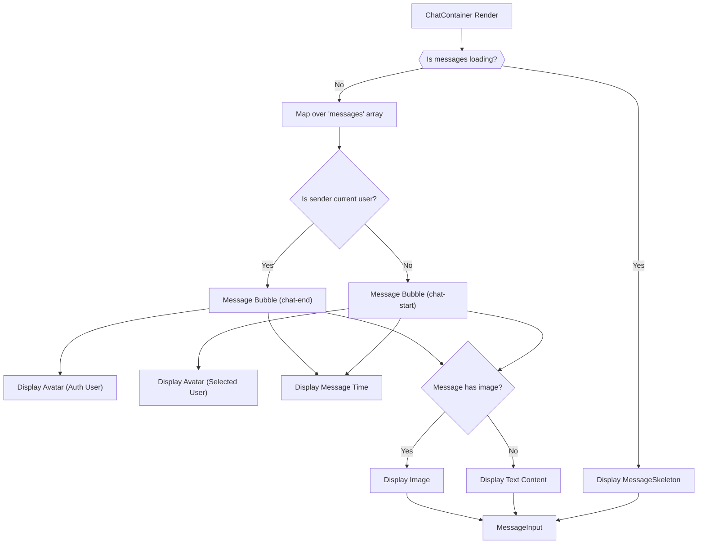
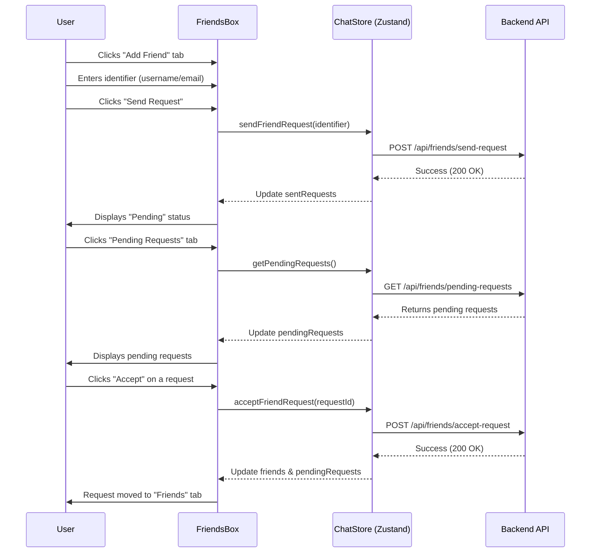

---
title: "User Interface Components"
description: "Detailed look at the reusable UI components that build the chat interface."
sidebar_position: 31
---

# User Interface Components

<TOC />

This section provides a comprehensive overview of the core user interface (UI) components that constitute the chat application's frontend. These components are designed for reusability, modularity, and a responsive user experience, adhering to modern React development practices and integrating with Zustand for global state management.

## Component Overview

The frontend user interface is composed of several key React components, each responsible for a specific part of the chat application's visual and interactive experience. They work in conjunction to provide a seamless messaging interface, friend management, and real-time updates.

### ChatContainer Component

The `ChatContainer` component ([frontend/src/components/ChatContainer.jsx](https://github.com/shinymack/Chat-App-MERN/blob/main/frontend/src/components/ChatContainer.jsx)) serves as the primary display area for messages in a chat conversation. It handles fetching and displaying messages for a `selectedUser`, manages real-time message subscriptions, and ensures the message feed automatically scrolls to the latest message.

#### Features

*   **Message Display**: Renders individual chat messages, distinguishing between messages sent by the authenticated user and those received from the `selectedUser`.
*   **Real-time Updates**: Utilizes `useEffect` to subscribe to and unsubscribe from message updates, ensuring the conversation is always current.
*   **Auto-Scroll**: Employs `useRef` and `useEffect` to automatically scroll the message feed to the bottom when new messages arrive.
*   **Loading State**: Displays a `MessageSkeleton` component while messages are being fetched, improving perceived performance.
*   **Media Support**: Displays inline images within messages if an `image` URL is present.
*   **Dynamic Styling**: Applies CSS classes (`chat-end` or `chat-start`) based on the message sender, visually differentiating outgoing and incoming messages.

#### Core Logic

The `ChatContainer` orchestrates message retrieval and display. Upon selection of a new user or initial mount, it fetches messages and establishes a WebSocket connection for real-time updates.

```jsx
// frontend/src/components/ChatContainer.jsx#L10-L16
    useEffect(() => {
        getMessages(selectedUser._id);
        subscribeToMessages();

        return () => unsubscribeFromMessages();
    }, [selectedUser._id, getMessages, subscribeToMessages, unsubscribeFromMessages]);
    
    useEffect(() => {
        if(messageEndRef.current && messages){
            messageEndRef.current.scrollIntoView({behaviour : "smooth"})
        }
    }, [messages])
```
[View on GitHub](https://github.com/shinymack/Chat-App-MERN/blob/main/frontend/src/components/ChatContainer.jsx)

This snippet demonstrates the two main `useEffect` hooks. The first manages the lifecycle of message fetching and real-time subscription, reacting to changes in `selectedUser`. The cleanup function returned by `useEffect` is crucial for preventing memory leaks by unsubscribing when the component unmounts or dependencies change. The second `useEffect` ensures that the view automatically scrolls to the latest message whenever the `messages` array is updated, providing a smooth user experience.

#### Message Rendering Flow





### FriendsBox Component

The `FriendsBox` component ([frontend/src/components/FriendsBox.jsx](https://github.com/shinymack/Chat-App-MERN/blob/main/frontend/src/components/FriendsBox.jsx)) provides a modal interface for managing friend relationships within the application. Users can view their existing friends, pending friend requests, and sent friend requests, as well as initiate new requests.

#### Features

*   **Tabbed Navigation**: Organizes friend management into three tabs: "Friends", "Pending Requests", and "Sent Requests".
*   **Friend Request Management**: Allows users to send new friend requests, accept incoming requests, reject incoming requests, and remove existing friends.
*   **Dynamic Data Fetching**: Fetches all relevant friend data (`friends`, `pendingRequests`, `sentRequests`) upon component mount.
*   **User Interaction**: Provides clear buttons for actions like `Accept`, `Reject`, `Remove`, and `Add Friend`.
*   **Modal Display**: Renders as a full-screen overlay, ensuring focus on friend management tasks.

#### Core Logic

The component uses local state to manage the active tab and the identifier for adding new friends. It interacts heavily with the `useChatStore` to perform actions and retrieve data.

```jsx
// frontend/src/components/FriendsBox.jsx#L18-L23
    useEffect(() => {
        // Fetch all necessary data when the component mounts
        getFriends();
        getPendingRequests();
        getSentRequests();
    }, [getFriends, getPendingRequests, getSentRequests]);
```
[View on GitHub](https://github.com/shinymack/Chat-App-MERN/blob/main/frontend/src/components/FriendsBox.jsx)

This `useEffect` hook ensures that all friend-related data is loaded as soon as the `FriendsBox` component is rendered. This is crucial for presenting up-to-date information on friends, pending requests, and sent requests to the user. The dependencies array ensures these fetches only occur once on mount, as the `getFriends`, `getPendingRequests`, and `getSentRequests` functions are stable references from the Zustand store.

#### Friend Request Flow





### MessageInput Component

The `MessageInput` component ([frontend/src/components/MessageInput.jsx](https://github.com/shinymack/Chat-App-MERN/blob/main/frontend/src/components/MessageInput.jsx)) provides the interface for users to compose and send messages, including both text and image attachments.

#### Features

*   **Text Input**: A standard input field for typing text messages.
*   **Image Attachment**: Allows users to select an image file to include with their message.
*   **Image Preview**: Displays a thumbnail of the selected image before sending, with an option to remove it.
*   **Input Validation**: Ensures only image files are selected for attachments.
*   **Message Sending**: Triggers the `sendMessage` action from the chat store when the message is submitted.
*   **State Management**: Manages local state for the message text and image preview.

#### Core Logic

The component manages the state of the message input and image preview. It handles file selection, preview generation, and clearing the inputs after a message is sent.

```jsx
// frontend/src/components/MessageInput.jsx#L42-L60
    const handleSendMessage = async (e) => {
        e.preventDefault();
        if (!text.trim() && !imagePreview) return;

        try {
            await sendMessage({
                text: text.trim(),
                image: imagePreview,
            });

            setText("");
            setImagePreview(null);
            if (fileInputRef.current) fileInputRef.current = ""; // Clear file input
        } catch (error) {
            console.error("Failed to send message", error);
        }
    };
```
[View on GitHub](https://github.com/shinymack/Chat-App-MERN/blob/main/frontend/src/components/MessageInput.jsx)

This `handleSendMessage` function is the heart of the `MessageInput`. It prevents default form submission, validates that there's content (either text or an image), calls the `sendMessage` function from the `useChatStore`, and then resets the component's local state and the file input. The `try-catch` block is essential for error handling during the message sending process.

```jsx
// frontend/src/components/MessageInput.jsx#L71-L86
            {imagePreview && (
                <div className="mb-3 flex items-center gap-2">
                    <div className="relative">
                        
                        <button
                            onClick={removeImage}
                            className="absolute -top-1.5 -right-1.5 w-5 h-5 rounded-full bg-base-300
              flex items-center justify-center"
                            type="button"
                        >
                            <X className="size-3" />
                        </button>
                    </div>
                </div>
            )}
```
[View on GitHub](https://github.com/shinymack/Chat-App-MERN/blob/main/frontend/src/components/MessageInput.jsx)

This JSX block conditionally renders an image preview. When `imagePreview` has a value (meaning an image has been selected), it displays the image thumbnail along with a small "X" button. This button allows the user to easily remove the selected image before sending, providing a clear and intuitive interaction for managing attachments.

### Sidebar Component

The `Sidebar` component ([frontend/src/components/Sidebar.jsx](https://github.com/shinymack/Chat-App-MERN/blob/main/frontend/src/components/Sidebar.jsx)) displays a list of the user's friends, allowing them to select a friend to initiate or continue a chat. It also provides filtering options and indicates online/offline status.

#### Features

*   **Friend List Display**: Shows a list of the authenticated user's friends.
*   **User Selection**: Allows clicking on a friend to set them as the `selectedUser` for the chat container.
*   **Online Status Indicator**: Displays a green dot next to online users and explicitly states "Online" or "Offline".
*   **Online Filter**: Provides a checkbox to filter the list, showing only online friends.
*   **Responsive Layout**: Adjusts its visibility and width based on whether a user is selected, particularly on smaller screens.
*   **Loading State**: Presents a `SidebarSkeleton` while the friends list is being loaded.

#### Core Logic

The `Sidebar` fetches the list of friends on mount and maintains local state for the online-only filter. It uses both `useChatStore` and `useAuthStore` to access friend data and online user information.

```jsx
// frontend/src/components/Sidebar.jsx#L13-L15
    useEffect(() => {
        getFriends();
    }, [getFriends]);
```
[View on GitHub](https://github.com/shinymack/Chat-App-MERN/blob/main/frontend/src/components/Sidebar.jsx)

This `useEffect` hook ensures that the list of friends is fetched when the `Sidebar` component mounts. `getFriends` is a function from the `useChatStore`, and including it in the dependency array prevents unnecessary re-fetches while still satisfying React's linter. This initial fetch is critical for populating the sidebar with contacts.

```jsx
// frontend/src/components/Sidebar.jsx#L37-L50
                <div className="overflow-y-scroll h-[calc(100vh-14rem)] w-full flex flex-col py-3">
                    {filteredUsers.map((user) => (
                        <button
                            key={user._id}
                            onClick={() => setSelectedUser(user)}
                            className={`sm:w-full w-[88vw] p-3 flex items-center gap-3 hover:bg-base-300 transition-colors
                            ${
                                selectedUser?._id === user._id
                                    ? "bg-base-300 ring-1 ring-base-300"
                                    : ""
                            }`}
                        >
                            <div className="relative mx-0">
                                
                                {onlineUsers.includes(user._id) && (
                                    <span className="absolute bottom-0 right-0 size-3 bg-green-500 rounded-full ring-2 ring-zinc-900" />
                                )}
                            </div>
                            <div className=" block text-left min-w-0">
                                <div className=" font-medium truncate">
                                    {user.username}
                                </div>
                                <div className="text-sm text-zinc-400">
                                    {onlineUsers.includes(user._id)
                                        ? "Online"
                                        : "Offline"}
                                </div>
                            </div>
                        </button>
                    ))}
                </div>
```
[View on GitHub](https://github.com/shinymack/Chat-App-MERN/blob/main/frontend/src/components/Sidebar.jsx)

This code block demonstrates the rendering of each friend in the sidebar. It maps over `filteredUsers` (which respects the "show online only" filter), creating a clickable button for each user. It dynamically applies a background color if the user is currently `selectedUser` and displays an online indicator if the user's ID is present in the `onlineUsers` array from `useAuthStore`. This combines presentation with interactive functionality, allowing users to easily select and identify online contacts.

## Technology Stack

The UI components leverage a modern React ecosystem for robust and efficient development.

| Layer           | Technology/Library | Purpose                                                                 |
| :-------------- | :----------------- | :---------------------------------------------------------------------- |
| **Framework**   | React              | Building declarative user interfaces.                                   |
| **State Mgmt.** | Zustand            | Lightweight, fast, and scalable state management for global state.      |
| **Styling**     | Tailwind CSS       | Utility-first CSS framework for rapid UI development.                   |
|                 | DaisyUI            | Tailwind CSS component library for pre-built UI elements.               |
| **Icons**       | Lucide React       | Customizable and accessible icon library for React.                     |
| **Utilities**   | `react-hot-toast`  | Library for simple, responsive, and customizable toast notifications.   |
| **Refs**        | `useRef`           | Accessing DOM elements directly, e.g., for auto-scrolling or file input. |
| **Hooks**       | `useEffect`, `useState` | Managing component lifecycle, side effects, and local state.            |

## Key Integration Points

The UI components are tightly integrated with the application's state management and backend APIs.

*   **Zustand State Management**: All components rely heavily on `useChatStore` and `useAuthStore` to access and modify global application state, such as `messages`, `selectedUser`, `users` (friends), `pendingRequests`, `sentRequests`, `authUser`, and `onlineUsers`. This centralizes state logic and simplifies data flow.
*   **API Interaction**: Actions like `getMessages`, `sendMessage`, `getFriends`, `sendFriendRequest`, `acceptFriendRequest`, `rejectFriendRequest`, and `removeFriend` are dispatched via the Zustand store. These actions encapsulate the logic for making asynchronous calls to the backend API, abstracting it away from the UI components.
*   **Real-time Communication**: The `ChatContainer` and `Sidebar` implicitly interact with real-time updates managed by the `useAuthStore` (for `onlineUsers`) and `useChatStore` (for `subscribeToMessages`). This ensures that the UI reflects the most current state of conversations and user presence without manual refreshes.
*   **User Experience**: Components like `MessageInput` handle client-side validation and provide immediate visual feedback (e.g., image previews, disabled send button) before backend interaction, contributing to a fluid user experience. `react-hot-toast` is used for non-blocking notifications for actions like image selection errors or successful friend requests.
*   **Scalability**: By isolating concerns (e.g., `ChatContainer` for messages, `FriendsBox` for friend management), the application design allows for easier maintenance and scaling. New features can be added by creating new components or extending existing ones without affecting unrelated parts of the UI.

Next: [State Management and Utilities](./3.2_state-management-and-utilities.mdx)
```