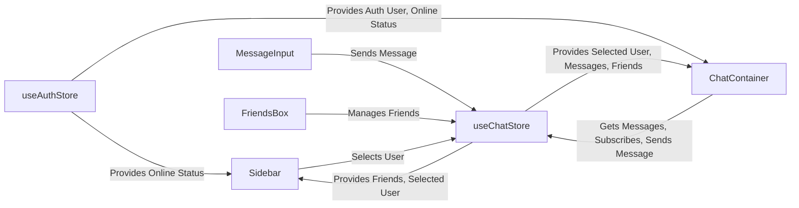
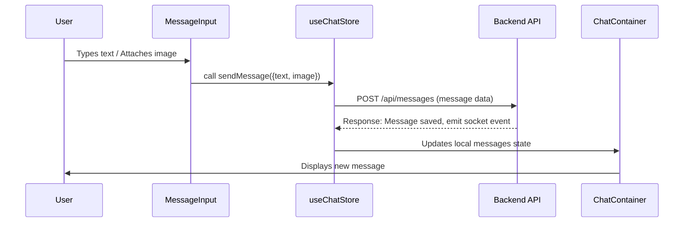

# User Interface Components

<TOC />

This section provides a detailed overview of the core React components that constitute the application's user interface. These components are responsible for rendering chat conversations, managing friend lists, handling message input, and providing a seamless user experience. Designed with a modular approach, each component focuses on a specific UI functionality, leveraging shared state management for dynamic data updates and real-time interactions.

## 1. Core UI Components

The frontend architecture heavily relies on a component-based structure, where individual UI elements are encapsulated and reusable. This section details the primary components responsible for the chat application's user interface.

### 1.1. ChatContainer

The `ChatContainer` component is the central view for active conversations. It dynamically displays messages, handles loading states, and ensures that the chat view automatically scrolls to the latest message. It integrates seamlessly with global state management to fetch and subscribe to messages in real-time.

**[View on GitHub](https://github.com/shinymack/Chat-App-MERN/blob/main/frontend/src/components/ChatContainer.jsx)**

#### Features

*   **Real-time Message Display:** Fetches and subscribes to messages for the currently selected user, updating the UI instantly upon new message arrival.
*   **Automatic Scroll:** Automatically scrolls to the bottom of the chat window to show the most recent messages.
*   **Sender/Receiver Differentiation:** Clearly distinguishes between messages sent by the authenticated user and those received from the selected chat partner using conditional styling and avatar display.
*   **Image Attachment Display:** Renders image attachments directly within the chat bubble.
*   **Loading Skeleton:** Provides a `MessageSkeleton` component during message fetching to enhance perceived performance.

#### Key Logic

The component utilizes `useEffect` hooks for side effects like data fetching and subscription management. The `useRef` hook manages the scroll-to-bottom functionality, ensuring a smooth user experience as new messages appear.

```jsx title="frontend/src/components/ChatContainer.jsx"
import { useEffect, useRef } from "react";
import { useChatStore } from "../store/useChatStore";
import ChatHeader from "./ChatHeader";
import MessageInput from "./MessageInput";
import MessageSkeleton from "./skeletons/MessageSkeleton";
import { useAuthStore } from "../store/useAuthStore";
import { formatMessageTime } from "../lib/utils";

const ChatContainer = () => {
    const { messages, getMessages, isMessagesLoading, selectedUser, subscribeToMessages, unsubscribeFromMessages } =
        useChatStore();
    const { authUser } = useAuthStore();
    const messageEndRef = useRef(null);

    useEffect(() => {
        getMessages(selectedUser._id);
        subscribeToMessages();

        return () => unsubscribeFromMessages();
    }, [selectedUser._id, getMessages, subscribeToMessages, unsubscribeFromMessages]);
    
    useEffect(() => {
        if(messageEndRef.current && messages){
            messageEndRef.current.scrollIntoView({behaviour : "smooth"})
        }
    }, [messages])
    // ...
};
```
**Code Snippet 1: Message Fetching and Real-time Subscription** ([frontend/src/components/ChatContainer.jsx#L6-L23](https://github.com/shinymack/Chat-App-MERN/blob/main/frontend/src/components/ChatContainer.jsx#L6-L23))
This snippet demonstrates the core `useEffect` hooks. The first hook is responsible for initiating message fetching for the `selectedUser` and subscribing to real-time message updates. The cleanup function ensures proper unsubscription to prevent memory leaks. The second `useEffect` manages the automatic scrolling to the latest message whenever the `messages` array updates, improving the user experience during active conversations.

```jsx title="frontend/src/components/ChatContainer.jsx"
    // ...
    return (
        <div className="flex-1 flex flex-col overflow-auto">
            <ChatHeader />
            <div className="flex-1 overflow-y-auto p-4 space-y-4">
                {messages.map((message) => (
                    <div
                        key={message._id}
                        className={`chat ${message.senderId == authUser._id ? "chat-end": "chat-start"} `}
                        ref={messageEndRef}
                    >
                        <div className="chat-image avatar">
                            <div className="size-9 rounded-full border">
                                
                            </div>
                        </div>
                        <div className="chat-header mb-1">
                            <time className="text-xs opacity-50 ml-1">{formatMessageTime(message.createdAt)}</time>
                        </div>
                        <div className="chat-bubble flex flex-col">
                            {message.image && (
                                
                            )}
                            {message.text && <p>{message.text}</p>}
                        </div>
                    </div>
                ))}
            </div>
            <MessageInput />
        </div>
    );
};
```
**Code Snippet 2: Dynamic Message Rendering** ([frontend/src/components/ChatContainer.jsx#L31-L60](https://github.com/shinymack/Chat-App-MERN/blob/main/frontend/src/components/ChatContainer.jsx#L31-L60))
This excerpt illustrates how `ChatContainer` iterates through the `messages` array to render individual chat bubbles. It conditionally applies `chat-end` or `chat-start` CSS classes based on `message.senderId === authUser._id`, visually distinguishing messages sent by the user from those received. It also handles the display of both text and image content within messages.

### 1.2. MessageInput

The `MessageInput` component provides the interface for users to compose and send messages, including text and image attachments. It ensures a robust way for users to interact with the chat system.

**[View on GitHub](https://github.com/shinymack/Chat-App-MERN/blob/main/frontend/src/components/MessageInput.jsx)**

#### Features

*   **Text Message Input:** A standard text area for typing messages.
*   **Image Attachment:** Allows users to select and attach image files to their messages.
*   **Image Preview:** Displays a preview of the attached image before sending, with an option to remove it.
*   **Input Validation:** Ensures only image files can be selected for attachment and provides feedback on invalid selections.
*   **Send Button Control:** The send button is disabled if both text and image fields are empty, preventing empty messages.

#### Key Logic

The component manages local state for the message text and image preview. It leverages `FileReader` for image preview generation and `useChatStore`'s `sendMessage` action to dispatch messages to the backend.

```jsx title="frontend/src/components/MessageInput.jsx"
import { useRef, useState } from "react";
import { useChatStore } from "../store/useChatStore";
import { Image, Send, X } from "lucide-react";
import toast from "react-hot-toast";

const MessageInput = () => {
    const [text, setText] = useState("");
    const [imagePreview, setImagePreview] = useState(null);
    const fileInputRef = useRef(null);
    const { sendMessage } = useChatStore();

    const handleImageChange = (e) => {
        const file = e.target.files[0];
        if (!file.type.startsWith("image/")) {
            toast.error("Please select an image file");
            return;
        }

        const reader = new FileReader();
        reader.onloadend = () => {
            setImagePreview(reader.result);
        };
        reader.readAsDataURL(file);
    };

    const removeImage = () => {
        setImagePreview(null);
        if (fileInputRef.current) fileInputRef.current.value = "";
    };
    // ...
};
```
**Code Snippet 3: Image Attachment Handling** ([frontend/src/components/MessageInput.jsx#L6-L28](https://github.com/shinymack/Chat-App-MERN/blob/main/frontend/src/components/MessageInput.jsx#L6-L28))
This snippet details the `handleImageChange` function, which processes a selected image file to generate a preview using `FileReader`, and `removeImage`, which clears the preview and resets the file input. This provides immediate visual feedback to the user and control over their attachments.

```jsx title="frontend/src/components/MessageInput.jsx"
    // ...
    const handleSendMessage = async (e) => {
        e.preventDefault();
        if (!text.trim() && !imagePreview) return;

        try {
            await sendMessage({
                text: text.trim(),
                image: imagePreview,
            });

            setText("");
            setImagePreview(null);
            if (fileInputRef.current) fileInputRef.current = "";
        } catch (error) {
            console.error("Failed to send message", error);
        }
    };
    // ...
};
```
**Code Snippet 4: Message Sending Logic** ([frontend/src/components/MessageInput.jsx#L30-L46](https://github.com/shinymack/Chat-App-MERN/blob/main/frontend/src/components/MessageInput.jsx#L30-L46))
The `handleSendMessage` function is responsible for dispatching the message. It prevents sending empty messages, calls the `sendMessage` action from `useChatStore` with both text and image data, and then resets the input fields and image preview upon successful transmission. This ensures a clean slate for the next message.

### 1.3. Sidebar

The `Sidebar` component displays the user's friend list, enabling them to select a conversation partner. It also provides visual cues for online status and filtering options.

**[View on GitHub](https://github.com/shinymack/Chat-App-MERN/blob/main/frontend/src/components/Sidebar.jsx)**

#### Features

*   **Friend List Display:** Shows a list of all friends.
*   **Online Status Indicator:** Displays a small green dot for online friends and an "Online/Offline" text status.
*   **User Selection:** Allows users to select a friend to open a chat conversation, updating the `selectedUser` in the global state.
*   **Online Filter:** A checkbox to filter the friend list to show only online users.
*   **Loading Skeleton:** Renders `SidebarSkeleton` while friend data is being fetched.

#### Key Logic

The `Sidebar` fetches friend data using `getFriends` from `useChatStore` and leverages `onlineUsers` from `useAuthStore` to determine real-time online presence. Local state (`showOnlineOnly`) manages the filtering functionality.

```jsx title="frontend/src/components/Sidebar.jsx"
    // ...
    const filteredUsers = showOnlineOnly
        ? users.filter((user) => onlineUsers.includes(user._id))
        : users;
    if (isUsersLoading) return <SidebarSkeleton />;
    return (
        <div className={`h-full sm:w-72 sm:border-r border-base-300  flex-col transition-all duration-200 ${selectedUser ?
                                    "hidden sm:flex w-[100vw] "
                                    : ""}`}>
            <div className="border-b border-base-300  p-5">
                {/* ... (Header and Online Toggle) ... */}
                <div className="overflow-y-scroll h-[calc(100vh-14rem)] w-full flex flex-col py-3">
                    {filteredUsers.map((user) => (
                        <button
                            key={user._id}
                            onClick={() => setSelectedUser(user)}
                            className={`sm:w-full w-[88vw] p-3 flex items-center gap-3 hover:bg-base-300 transition-colors
                            ${
                                selectedUser?._id === user._id
                                    ? "bg-base-300 ring-1 ring-base-300"
                                    : ""
                            }`}
                        >
                            <div className="relative mx-0">
                                
                                {onlineUsers.includes(user._id) && (
                                    <span className="absolute bottom-0 right-0 size-3 bg-green-500 rounded-full ring-2 ring-zinc-900" />
                                )}
                            </div>
                            <div className=" block text-left min-w-0">
                                <div className=" font-medium truncate">
                                    {user.username}
                                </div>
                                <div className="text-sm text-zinc-400">
                                    {onlineUsers.includes(user._id)
                                        ? "Online"
                                        : "Offline"}
                                </div>
                            </div>
                        </button>
                    ))}
                </div>
                {filteredUsers.length == 0 && (
                    <div className="text-center text-zinc-500 py-4">No online friends</div>
                )}
            </div>
        </div>
    );
};
```
**Code Snippet 5: Friend Listing with Online Status** ([frontend/src/components/Sidebar.jsx#L20-L81](https://github.com/shinymack/Chat-App-MERN/blob/main/frontend/src/components/Sidebar.jsx#L20-L81))
This excerpt from the `Sidebar` component shows how `filteredUsers` (either all friends or only online ones) are mapped to display each friend. Each friend entry is a clickable button that sets the `selectedUser` in the global chat store. Crucially, it conditionally renders an online indicator and text status based on whether the `user._id` is present in the `onlineUsers` array provided by `useAuthStore`.

### 1.4. FriendsBox

The `FriendsBox` component provides a modal interface for managing friend relationships, including sending, accepting, and rejecting friend requests, as well as removing existing friends.

**[View on GitHub](https://github.com/shinymack/Chat-App-MERN/blob/main/frontend/src/components/FriendsBox.jsx)**

#### Features

*   **Modal Interface:** Appears as an overlay, allowing users to manage friends without leaving the main chat view.
*   **Tabbed Navigation:** Organizes friend management into "Friends", "Pending Requests", and "Sent Requests" tabs.
*   **Add Friend Functionality:** An input field to send friend requests by entering a username or email.
*   **Request Management:** Buttons to accept or reject pending friend requests.
*   **Remove Friend:** Option to remove an existing friend from the list.
*   **Dynamic Updates:** Fetches and updates friend-related data (`friends`, `pendingRequests`, `sentRequests`) upon mounting and interaction.

#### Key Logic

The component uses local state (`activeTab`, `identifier`) to control the UI. It integrates extensively with `useChatStore` for all friend-related actions (`sendFriendRequest`, `acceptFriendRequest`, `rejectFriendRequest`, `removeFriend`).

```jsx title="frontend/src/components/FriendsBox.jsx"
    // ...
    const renderContent = () => {
        switch (activeTab) {
            case 'pending':
                return (
                    <div className="space-y-2">
                        {pendingRequests.length > 0 ? pendingRequests.map(req => (
                            <div key={req._id} className="flex items-center justify-between p-2 rounded-lg bg-base-200">
                                <div className="flex items-center gap-3">
                                    
                                    <span>{req.username}</span>
                                </div>
                                <div className="flex gap-2">
                                    <button onClick={() => acceptFriendRequest(req._id)} className="btn btn-xs btn-success btn-circle"><Check size={16}/></button>
                                    <button onClick={() => rejectFriendRequest(req._id)} className="btn btn-xs btn-error btn-circle"><X size={16}/></button>
                                </div>
                            </div>
                        )) : <p className="text-center text-base-content/60 py-4">No pending requests.</p>}
                    </div>
                );
            case 'sent':
                return (
                    <div className="space-y-2">
                        {sentRequests.length > 0 ? sentRequests.map(req => (
                             <div key={req._id} className="flex items-center justify-between p-2 rounded-lg bg-base-200">
                                <div className="flex items-center gap-3">
                                    
                                    <span>{req.username}</span>
                                </div>
                                <span className="text-sm text-base-content/50">Pending</span>
                            </div>
                        )) : <p className="text-center text-base-content/60 py-4">No sent requests.</p>}
                    </div>
                );
            case 'friends':
            default:
                return (
                    <div className="space-y-2">
                        {users.length > 0 ? users.map(friend => (
                            <div key={friend._id} className="flex items-center justify-between p-2 rounded-lg bg-base-200">
                               <div className="flex items-center gap-3">
                                    
                                    <span>{friend.username}</span>
                                </div>
                                <button onClick={() => removeFriend(friend._id)} className="btn btn-xs btn-ghost btn-circle text-error"><Trash2 size={16}/></button>
                            </div>
                        )) : <p className="text-center text-base-content/60 py-4">You have no friends yet.</p>}
                    </div>
                );
        }
    };
    // ...
};
```
**Code Snippet 6: Tabbed Content Rendering** ([frontend/src/components/FriendsBox.jsx#L29-L74](https://github.com/shinymack/Chat-App-MERN/blob/main/frontend/src/components/FriendsBox.jsx#L29-L74))
This snippet from `FriendsBox` showcases the `renderContent` function, which dynamically renders different UI elements based on the `activeTab` state. It includes distinct layouts for "pending" requests (with accept/reject buttons), "sent" requests (showing pending status), and "friends" (with a remove friend button), effectively managing complex friend relationships within a single modal.

## 2. Component Interactions and Data Flow

The various UI components, while distinct in their functionalities, are intricately linked through shared state and props to create a cohesive user experience. They primarily interact with the global state management layers (`useChatStore`, `useAuthStore`) to retrieve and update data.

### 2.1. UI Component Interaction Flow

The following diagram illustrates how the main UI components interact with each other and with the central state management stores.





**Diagram 1: UI Component Interaction**
This flowchart demonstrates the dependencies and data flow between the primary UI components and the application's global state stores. The `useChatStore` acts as a central hub for conversation-specific and friend-related data, while `useAuthStore` provides authentication and real-time online status, which are consumed by multiple components.

### 2.2. Message Sending Workflow

The process of sending a message involves several steps, from user input to backend processing and UI update, facilitated by a well-defined sequence of interactions.





**Diagram 2: Message Sending Sequence**
This sequence diagram illustrates the flow from a user composing a message to its display in the chat window. The `MessageInput` captures user input, which is then sent via `useChatStore` to the `Backend API`. The API processes the message, stores it, and often emits a real-time event (e.g., via WebSockets) to notify active clients. `useChatStore` receives this update and propagates it to `ChatContainer` for rendering.

## 3. Key Integration Points

The effectiveness of these UI components is largely due to their tight integration with specific parts of the application architecture, ensuring a responsive and robust chat experience.

### 3.1. Client-Side State Management

The `useChatStore` and `useAuthStore` are pivotal for centralizing and managing application state. Components like `ChatContainer`, `Sidebar`, `MessageInput`, and `FriendsBox` directly interact with these stores to:
*   **Fetch Data:** Retrieve messages, friend lists, pending requests.
*   **Update State:** Select a user, send messages, manage friend relationships.
*   **Subscribe to Real-time Updates:** Receive new messages and online status changes.

This approach ensures that state is consistent across the application and that components automatically re-render when relevant data changes.

### 3.2. Real-time Communication

The integration with WebSocket-based real-time communication (managed implicitly by `useChatStore`'s `subscribeToMessages` and `useAuthStore`'s `onlineUsers`) is crucial for a responsive chat application. This allows messages to appear instantly without manual refreshes and for user online statuses to update in real-time, enhancing the interactive feel.

### 3.3. User Experience (UX) Considerations

Best practices for UX are evident in components like `ChatContainer` (auto-scrolling, loading skeletons) and `MessageInput` (image previews, disabled send button for empty messages). These small but significant details contribute to a smooth and intuitive user interaction. The `FriendsBox` modal provides a focused context for friend management, reducing clutter in the main interface.

### 3.4. Scalability and Best Practices

The component-based architecture inherently supports scalability by promoting modularity and reusability. By separating concerns (e.g., `MessageInput` for input, `ChatContainer` for display), individual parts can be developed, tested, and maintained independently. The use of global state stores like `Zustand` (implied by `useChatStore`/`useAuthStore`) minimizes prop drilling and allows for efficient data sharing. For improved performance under heavy load, techniques such as message virtualization (not explicitly shown but a common pattern for chat apps with many messages) could be implemented in the `ChatContainer`. Additionally, optimizing image uploads and storage (e.g., using CDN, compression) would be vital for performance and scalability in a production environment.

---
Next: [Client-Side State Management](./3.2_client-side-state-management.mdx)