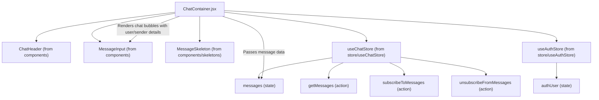
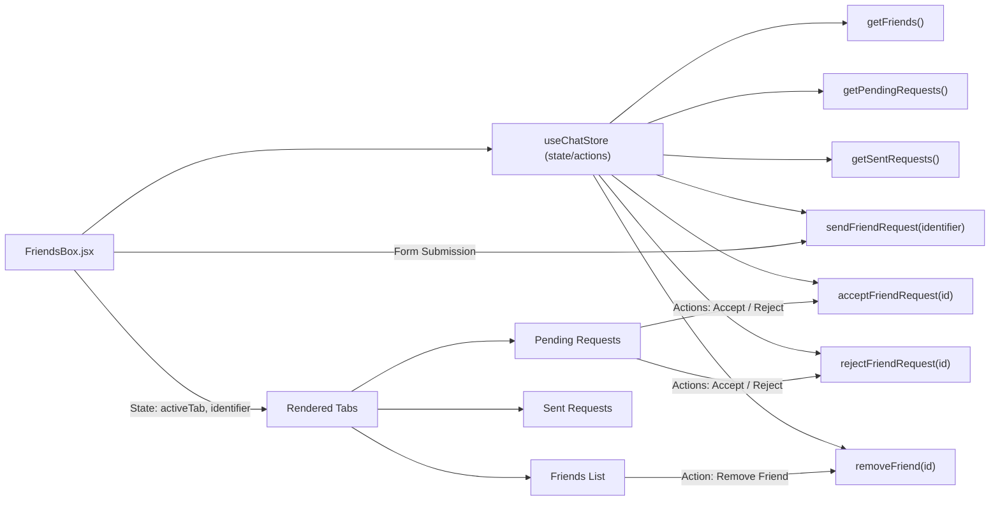

---
title: "User Interface Components"
description: "Detailed look at reusable React components forming the application's UI."
sidebar_position: 31
---

# User Interface Components
<TOC />

This section provides an in-depth analysis of the core React components that constitute the frontend user interface of the application. These components are designed for reusability, maintainability, and a responsive user experience, adhering to modern React best practices and leveraging state management for dynamic interactions.

## Chat Container (`ChatContainer.jsx`)

The `ChatContainer` component, located at [`frontend/src/components/ChatContainer.jsx`](https://github.com/shinymack/Chat-App-MERN/blob/main/frontend/src/components/ChatContainer.jsx), serves as the primary display area for messages within a selected chat. It dynamically renders messages, manages real-time updates, and provides a seamless scrolling experience.

### System Purpose

*   **Message Display:** Renders a list of messages for the currently selected user, distinguishing between messages sent by the authenticated user and those received from the selected user.
*   **Real-time Updates:** Subscribes to and unsubscribes from real-time message updates to ensure the chat always reflects the latest conversations.
*   **Scroll Management:** Automatically scrolls to the newest message upon load or when new messages arrive, enhancing usability.
*   **Loading State:** Displays a skeleton loader while messages are being fetched, providing visual feedback to the user.

### Architecture

The `ChatContainer` orchestrates several sub-components and integrates with global state management.





### Features

*   **Message Rendering with Avatars:**
    Each message displays the sender's profile picture and username, correctly aligning messages to the left (`chat-start`) for received messages and to the right (`chat-end`) for sent messages.

    ```jsx
    // From frontend/src/components/ChatContainer.jsx#L34-L63
    {messages.map((message) => (
        <div
            key={message._id}
            className={`chat ${message.senderId == authUser._id ? "chat-end": "chat-start"} `}
            ref={messageEndRef}
        >
            <div className="chat-image avatar">
                <div className="size-9 rounded-full border">
                    
                </div>
            </div>
            <div className="chat-header mb-1">
                <time className="text-xs opacity-50 ml-1">{formatMessageTime(message.createdAt)}</time>
            </div>
            <div className="chat-bubble flex flex-col">
                {message.image && (
                    
                )}
                {message.text && <p>{message.text}</p>}
            </div>
        </div>
    ))}
    ```

*   **Real-time Message Subscription:**
    Utilizes `useEffect` to subscribe to and unsubscribe from real-time message updates, ensuring efficient resource management and preventing memory leaks.

    ```jsx
    // From frontend/src/components/ChatContainer.jsx#L15-L20
    useEffect(() => {
        getMessages(selectedUser._id);
        subscribeToMessages();

        return () => unsubscribeFromMessages();
    }, [selectedUser._id, getMessages, subscribeToMessages, unsubscribeFromMessages]);
    ```

*   **Automatic Scroll to Bottom:**
    A second `useEffect` hook, combined with `useRef`, automatically scrolls the message area to the bottom whenever new messages are added, providing a smooth chat experience.

    ```jsx
    // From frontend/src/components/ChatContainer.jsx#L22-L26
    useEffect(() => {
        if(messageEndRef.current && messages){
            messageEndRef.current.scrollIntoView({behaviour : "smooth"})
        }
    }, [messages])
    ```

## Friends Box (`FriendsBox.jsx`)

The `FriendsBox` component, found at [`frontend/src/components/FriendsBox.jsx`](https://github.com/shinymack/Chat-App-MERN/blob/main/frontend/src/components/FriendsBox.jsx), provides an interface for managing user friendships, including viewing friends, handling friend requests, and sending new requests.

### System Purpose

*   **Friend Management:** Allows users to view their friends, accept/reject pending friend requests, and remove existing friends.
*   **Friend Request System:** Enables sending friend requests to other users via their username or email.
*   **Tabbed Interface:** Organizes friend-related data into distinct tabs (Friends, Pending, Sent) for better user navigation.

### Architecture

The `FriendsBox` interacts heavily with the `useChatStore` for all friend-related data and actions.





### Features

*   **Dynamic Tabbed Navigation:**
    Uses a `useState` hook to manage the active tab, rendering different content based on the user's selection (`friends`, `pending`, `sent`).

    ```jsx
    // From frontend/src/components/FriendsBox.jsx#L18-L20
    const [activeTab, setActiveTab] = useState('friends');
    const [identifier, setIdentifier] = useState('');
    ```

*   **Friend Request Submission:**
    A dedicated form allows users to send friend requests by entering a username or email.

    ```jsx
    // From frontend/src/components/FriendsBox.jsx#L106-L116
    <form onSubmit={handleAddFriend} className="flex gap-2">
        <input 
            type="text" 
            placeholder="Enter username or email" 
            className="input input-bordered w-full"
            value={identifier}
            onChange={(e) => setIdentifier(e.target.value)}
        />
        <button type="submit" className="btn btn-primary"><UserPlus /></button>
    </form>
    ```

*   **Request Management (Accept/Reject):**
    Pending requests are displayed with options to accept or reject, directly invoking actions from the `useChatStore`.

    ```jsx
    // From frontend/src/components/FriendsBox.jsx#L34-L47
    case 'pending':
        return (
            <div className="space-y-2">
                {pendingRequests.length > 0 ? pendingRequests.map(req => (
                    <div key={req._id} className="flex items-center justify-between p-2 rounded-lg bg-base-200">
                        <div className="flex items-center gap-3">
                            
                            <span>{req.username}</span>
                        </div>
                        <div className="flex gap-2">
                            <button onClick={() => acceptFriendRequest(req._id)} className="btn btn-xs btn-success btn-circle"><Check size={16}/></button>
                            <button onClick={() => rejectFriendRequest(req._id)} className="btn btn-xs btn-error btn-circle"><X size={16}/></button>
                        </div>
                    </div>
                )) : <p className="text-center text-base-content/60 py-4">No pending requests.</p>}
            </div>
        );
    ```

## Message Input (`MessageInput.jsx`)

The `MessageInput` component, located at [`frontend/src/components/MessageInput.jsx`](https://github.com/shinymack/Chat-App-MERN/blob/main/frontend/src/components/MessageInput.jsx), provides the interface for users to compose and send messages, including text and image attachments.

### System Purpose

*   **Text Input:** Allows users to type and send text messages.
*   **Image Attachment:** Supports attaching images to messages with a preview functionality.
*   **Message Submission:** Handles the submission of both text-only and multimedia messages.
*   **Error Handling:** Provides basic validation for image file types.

### Features

*   **Image Preview and Removal:**
    When an image is selected, a preview is displayed, and a button allows the user to remove the image before sending.

    ```jsx
    // From frontend/src/components/MessageInput.jsx#L42-L60
    {imagePreview && (
        <div className="mb-3 flex items-center gap-2">
            <div className="relative">
                
                <button
                    onClick={removeImage}
                    className="absolute -top-1.5 -right-1.5 w-5 h-5 rounded-full bg-base-300
              flex items-center justify-center"
                    type="button"
                >
                    <X className="size-3" />
                </button>
            </div>
        </div>
    )}
    ```

*   **Integrated Send and Attachment Buttons:**
    A single input field combined with send and image attachment buttons offers a streamlined user experience.

    ```jsx
    // From frontend/src/components/MessageInput.jsx#L62-L101
    <form
        onSubmit={handleSendMessage}
        className="flex items-center gap-2"
    >
        <div className="flex flex-1 gap-2">
            <input
                type="text"
                className="w-full input input-bordered rounded-lg input-sm sm:input-md"
                placeholder="Type a message..."
                value={text}
                onChange={(e) => setText(e.target.value)}
            />
            <input
                type="file"
                accept="image/*"
                className="hidden"
                ref={fileInputRef}
                onChange={handleImageChange}
            />

            <button
                type="button"
                className={`hidden sm:flex btn btn-circle
                    ${
                        imagePreview
                            ? "text-emerald-500"
                            : "text-zinc-400"
                    }`}
                onClick={
                    () => {
                        if (fileInputRef.current) {
                            fileInputRef.current.click();
                        } else {
                            console.error("fileInputRef is not attached");
                        }
                }
                }
            >
                <Image size={20} />
            </button>
        </div>

        <button
            type="submit"
            className="btn btn-sm btn-circle"
            disabled={!text.trim() && !imagePreview}
        >
            <Send size={22} />
        </button>
    </form>
    ```

## Sidebar (`Sidebar.jsx`)

The `Sidebar` component, located at [`frontend/src/components/Sidebar.jsx`](https://github.com/shinymack/Chat-App-MERN/blob/main/frontend/src/components/Sidebar.jsx), displays a list of the user's friends and allows for selecting a chat recipient. It also includes filtering capabilities for online users.

### System Purpose

*   **Friend List Display:** Shows a list of the authenticated user's friends.
*   **Chat Selection:** Allows users to select a friend to initiate or continue a chat.
*   **Online Status Indication:** Visually indicates which friends are currently online.
*   **Online Filter:** Provides a checkbox to filter the friend list to show only online users.
*   **Responsiveness:** Adapts its visibility based on whether a user is selected on smaller screens.

### Features

*   **Dynamic Friend List and Online Status:**
    Renders each friend with their profile picture, username, and an online/offline status indicator, including a green dot for online users.

    ```jsx
    // From frontend/src/components/Sidebar.jsx#L46-L77
    {filteredUsers.map((user) => (
        <button
            key={user._id}
            onClick={() => setSelectedUser(user)}
            className={`sm:w-full w-[88vw] p-3 flex items-center gap-3 hover:bg-base-300 transition-colors
            ${
                selectedUser?._id === user._id
                    ? "bg-base-300 ring-1 ring-base-300"
                    : ""
            }`}
        >
            <div className="relative mx-0">
                
                {onlineUsers.includes(user._id) && (
                    <span className="absolute bottom-0 right-0 size-3 bg-green-500 rounded-full ring-2 ring-zinc-900" />
                )}
            </div>
            <div className=" block text-left min-w-0">
                <div className=" font-medium truncate">
                    {user.username}
                </div>
                <div className="text-sm text-zinc-400">
                    {onlineUsers.includes(user._id)
                        ? "Online"
                        : "Offline"}
                </div>
            </div>
        </button>
    ))}
    ```

*   **Online User Filter:**
    A checkbox allows users to toggle between viewing all friends and only those who are currently online.

    ```jsx
    // From frontend/src/components/Sidebar.jsx#L29-L40
    <div className="mt-3 lg:flex items-center gap-2">
        <label className="cursor-pointer flex items-center gap-2">
            <input
                type="checkbox"
                checked={showOnlineOnly}
                onChange={(e) =>
                    setShowOnlineOnly(e.target.checked)
                }
                className="checkbox checkbox-sm"
            />
            <span className="text-sm">Show online only</span>
        </label>
        <span className="text-xs text-zinc-500">
              ({users.filter(friend => onlineUsers.includes(friend._id)).length} online)
        </span>
    </div>
    ```

## Key Integration Points

These UI components extensively leverage **Zustand** for state management, specifically `useChatStore` for chat-related data (messages, selected user, friends, requests) and `useAuthStore` for authentication details and online user status.

*   **State Management:** All components retrieve and update their necessary data through global stores, centralizing business logic and enabling seamless data flow across the application.
*   **Real-time Communication:** The `ChatContainer` demonstrates the integration of real-time messaging capabilities by subscribing to WebSocket events, ensuring that messages appear instantly without manual refreshes.
*   **User Experience (UX) Enhancements:** Features like automatic scrolling, loading skeletons, and image previews significantly improve the user experience by providing visual feedback and intuitive interactions.
*   **Scalability Insights:** The modular design of these components, coupled with a robust state management solution, allows for easy expansion. For instance, adding new chat features (e.g., group chats, reactions) would primarily involve extending the state store and adding new UI elements, without extensive refactoring of existing core components. The use of `useEffect` for data fetching and cleanup is crucial for preventing performance issues as the application scales.

Next: [State Management and Stores](./3.2_state-management-and-stores.mdx)
```