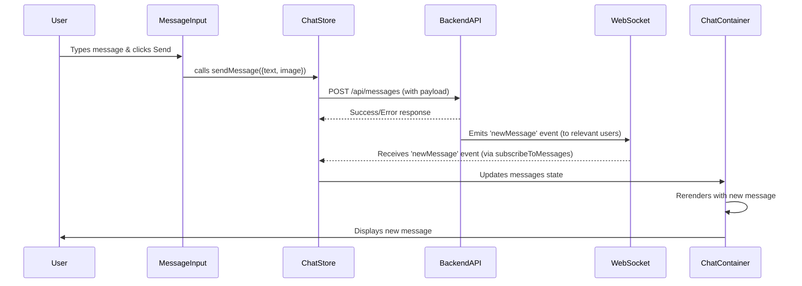

# User Interface Components
<TOC />

This section delves into the core reusable React components that construct the application's user interface. These components are designed for modularity, reusability, and efficient interaction with the application's state management layer, providing a seamless user experience for chat and friend management functionalities.

## ChatContainer

The `ChatContainer` component is the primary interface for displaying messages within a selected chat. It orchestrates the rendering of individual messages, handles loading states, and ensures an intuitive scrolling experience.

### Purpose and Functionality

*   **Message Display**: Renders a list of messages for the currently selected user, distinguishing between messages sent by the authenticated user and those received from the selected contact.
*   **Real-time Updates**: Subscribes to new messages in real-time, ensuring the chat view is always up-to-date.
*   **Automatic Scrolling**: Automatically scrolls to the bottom of the chat view when new messages arrive or when the component initially loads, enhancing usability.
*   **Loading State**: Displays a skeleton loader (`MessageSkeleton`) while messages are being fetched.
*   **Media Support**: Capable of rendering both text and image messages.

### Key Features

*   **Dynamic Message Rendering**: Messages are mapped and rendered, with conditional styling (`chat-end` or `chat-start`) based on the sender to clearly delineate conversations.
*   **User Avatars**: Displays the profile picture of the sender or receiver alongside each message.
*   **Message Timestamps**: Includes a timestamp for each message, formatted using the `formatMessageTime` utility.
*   **Image Previews**: If a message includes an image, it is displayed within the chat bubble.
*   **Persistent Input**: Integrates the `MessageInput` component at the bottom for continuous message composition.

### Code Snippet: Message Rendering Logic

The core logic for rendering messages involves iterating through the `messages` array from the chat store and applying conditional styling and content based on the sender and message type.

```jsx {19-48}
// frontend/src/components/ChatContainer.jsx
import { useEffect } from "react";
import { useChatStore } from "../store/useChatStore";
import ChatHeader from "./ChatHeader";
import MessageInput from "./MessageInput";
import MessageSkeleton from "./skeletons/MessageSkeleton";
import { useAuthStore } from "../store/useAuthStore";
import { formatMessageTime } from "../lib/utils";
import { useRef } from "react";

const ChatContainer = () => {
    const { messages, getMessages, isMessagesLoading, selectedUser, subscribeToMessages, unsubscribeFromMessages } =
        useChatStore();
    const { authUser } = useAuthStore();
    const messageEndRef = useRef(null);


    useEffect(() => {
        getMessages(selectedUser._id);
        subscribeToMessages();

        return () => unsubscribeFromMessages();
    }, [selectedUser._id, getMessages, subscribeToMessages, unsubscribeFromMessages]);
    
    useEffect(() => {
        if(messageEndRef.current && messages){
            messageEndRef.current.scrollIntoView({behaviour : "smooth"})
        }
    }, [messages])

    if (isMessagesLoading)
        return (
            <div className="flex-1 flex flex-col overflow-auto">
                <ChatHeader />
                <MessageSkeleton />
                <MessageInput />
            </div>
        );
    return (
        <div className="flex-1 flex flex-col overflow-auto">
            <ChatHeader />
            <div className="flex-1 overflow-y-auto p-4 space-y-4">
                {messages.map((message) => (
                    <div
                        key={message._id}
                        className={`chat ${message.senderId == authUser._id ? "chat-end": "chat-start"} `}
                        ref={messageEndRef}
                    >
                        <div className="chat-image avatar">
                            <div className="size-9 rounded-full border">
                                
                            </div>
                        </div>
                        <div className="chat-header mb-1">
                            <time className="text-xs opacity-50 ml-1">{formatMessageTime(message.createdAt)}</time>
                        </div>
                        <div className="chat-bubble flex flex-col">
                            {message.image && (
                                
                            )}
                            {message.text && <p>{message.text}</p>}
                        </div>
                    </div>
                ))}
            </div>
            <MessageInput />
        </div>
    );
};

export default ChatContainer;
```
[View on GitHub](https://github.com/shinymack/Chat-App-MERN/blob/main/frontend/src/components/ChatContainer.jsx#L19-L48)

This snippet demonstrates the iteration over `messages`, applying the `chat-end` or `chat-start` class based on `message.senderId` compared to `authUser._id`. It also conditionally renders an image or text content within the `chat-bubble`. The `messageEndRef` is attached to the last message to enable automatic scrolling.

## FriendsBox

The `FriendsBox` component provides a modal interface for managing friend relationships, including viewing friends, handling pending requests, and sending new requests.

### Purpose and Functionality

*   **Friend Management**: Centralized UI for all friend-related actions.
*   **Tabbed Navigation**: Organizes friend lists into 'Friends', 'Pending Requests', and 'Sent Requests' tabs for easy navigation.
*   **Friend Request System**: Allows users to send new friend requests by entering a username or email.
*   **Request Actions**: Provides actions to accept or reject pending friend requests and remove existing friends.
*   **Overlay**: Displays as a fixed overlay, ensuring focus on friend management tasks.

### Key Features

*   **Dynamic Tab Content**: Content changes based on the active tab, displaying different lists (friends, pending, sent) retrieved from `useChatStore`.
*   **Add Friend Form**: An input field and button to initiate friend requests.
*   **Interactive Buttons**: Icons for accepting, rejecting, or removing friends, providing clear calls to action.
*   **State Synchronization**: Fetches `friends`, `pendingRequests`, and `sentRequests` on mount to ensure the data is current.

### Code Snippet: Tab-based Content Rendering

The `renderContent` function is crucial for conditionally displaying the correct list based on the `activeTab` state.

```jsx {43-98}
// frontend/src/components/FriendsBox.jsx
import { useEffect, useState } from 'react';
import { useChatStore } from '../store/useChatStore';
import { X, UserPlus, Check, Trash2 } from 'lucide-react';

const FriendsBox = () => {
    const { 
        toggleFriendsBox, 
        getFriends, users,
        getPendingRequests, pendingRequests,
        getSentRequests, sentRequests,
        sendFriendRequest, acceptFriendRequest, rejectFriendRequest, removeFriend
    } = useChatStore();

    const [activeTab, setActiveTab] = useState('friends');
    const [identifier, setIdentifier] = useState('');

    useEffect(() => {
        // Fetch all necessary data when the component mounts
        getFriends();
        getPendingRequests();
        getSentRequests();
    }, [getFriends, getPendingRequests, getSentRequests]);

    const handleAddFriend = (e) => {
        e.preventDefault();
        if (identifier.trim()) {
            sendFriendRequest(identifier);
            setIdentifier('');
        }
    };

    const renderContent = () => {
        switch (activeTab) {
            case 'pending':
                return (
                    <div className="space-y-2">
                        {pendingRequests.length > 0 ? pendingRequests.map(req => (
                            <div key={req._id} className="flex items-center justify-between p-2 rounded-lg bg-base-200">
                                <div className="flex items-center gap-3">
                                    
                                    <span>{req.username}</span>
                                </div>
                                <div className="flex gap-2">
                                    <button onClick={() => acceptFriendRequest(req._id)} className="btn btn-xs btn-success btn-circle"><Check size={16}/></button>
                                    <button onClick={() => rejectFriendRequest(req._id)} className="btn btn-xs btn-error btn-circle"><X size={16}/></button>
                                </div>
                            </div>
                        )) : <p className="text-center text-base-content/60 py-4">No pending requests.</p>}
                    </div>
                );
            case 'sent':
                return (
                    <div className="space-y-2">
                        {sentRequests.length > 0 ? sentRequests.map(req => (
                             <div key={req._id} className="flex items-center justify-between p-2 rounded-lg bg-base-200">
                                <div className="flex items-center gap-3">
                                    
                                    <span>{req.username}</span>
                                </div>
                                <span className="text-sm text-base-content/50">Pending</span>
                            </div>
                        )) : <p className="text-center text-base-content/60 py-4">No sent requests.</p>}
                    </div>
                );
            case 'friends':
            default:
                return (
                    <div className="space-y-2">
                        {users.length > 0 ? users.map(friend => (
                            <div key={friend._id} className="flex items-center justify-between p-2 rounded-lg bg-base-200">
                               <div className="flex items-center gap-3">
                                    
                                    <span>{friend.username}</span>
                                </div>
                                <button onClick={() => removeFriend(friend._id)} className="btn btn-xs btn-ghost btn-circle text-error"><Trash2 size={16}/></button>
                            </div>
                        )) : <p className="text-center text-base-content/60 py-4">You have no friends yet.</p>}
                    </div>
                );
        }
    };

    return (
        <div className="fixed inset-0 bg-black/50 z-50 flex items-center justify-center">
            <div className="bg-base-100 rounded-lg w-full max-w-md p-6 relative flex flex-col gap-4">
                <button onClick={toggleFriendsBox} className="btn btn-sm btn-circle btn-ghost absolute top-2 right-2"><X /></button>
                
                <h2 className="text-xl font-bold">Manage Friends</h2>

                {/* Add Friend Form */}
                <form onSubmit={handleAddFriend} className="flex gap-2">
                    <input 
                        type="text" 
                        placeholder="Enter username or email" 
                        className="input input-bordered w-full"
                        value={identifier}
                        onChange={(e) => setIdentifier(e.target.value)}
                    />
                    <button type="submit" className="btn btn-primary"><UserPlus /></button>
                </form>

                {/* Tabs */}
                <div role="tablist" className="tabs tabs-boxed">
                    <a role="tab" className={`tab ${activeTab === 'friends' ? 'tab-active' : ''}`} onClick={() => setActiveTab('friends')}>Friends ({users.length})</a>
                    <a role="tab" className={`tab ${activeTab === 'pending' ? 'tab-active' : ''}`} onClick={() => setActiveTab('pending')}>Pending ({pendingRequests.length})</a>
                    <a role="tab" className={`tab ${activeTab === 'sent' ? 'tab-active' : ''}`} onClick={() => setActiveTab('sent')}>Sent ({sentRequests.length})</a>
                </div>

                {/* Tab Content */}
                <div className="overflow-y-auto max-h-60 pr-2">
                    {renderContent()}
                </div>
            </div>
        </div>
    );
};

export default FriendsBox;
```
[View on GitHub](https://github.com/shinymack/Chat-App-MERN/blob/main/frontend/src/components/FriendsBox.jsx#L43-L98)

## MessageInput

The `MessageInput` component is responsible for collecting user input for sending messages, supporting both text and image attachments.

### Purpose and Functionality

*   **Message Composition**: Provides a text input field for typing messages.
*   **Image Attachment**: Allows users to select and preview image files to send as attachments.
*   **Input Validation**: Ensures only image files can be attached.
*   **Message Sending**: Triggers the `sendMessage` action in the `useChatStore` when a message (text or image) is ready to be sent.
*   **Clear Input**: Clears the input field and image preview after a message is successfully sent.

### Key Features

*   **Responsive Input**: Adjusts input size for different screen sizes (`input-sm sm:input-md`).
*   **Image Preview**: Displays a small preview of the selected image before sending, with an option to remove it.
*   **Disabled Send Button**: The send button is disabled if both the text input is empty and no image is attached, preventing empty messages.
*   **Toast Notifications**: Uses `react-hot-toast` to provide feedback, e.g., for invalid file types.

### Code Snippet: Image Handling and Send Logic

This snippet illustrates how images are handled—from selection and preview to being cleared after sending.

```jsx {10-39}
// frontend/src/components/MessageInput.jsx
import { useRef, useState } = "react";
import { useChatStore } from "../store/useChatStore";
import { Image, Send, X } from "lucide-react";
import toast from "react-hot-toast";

const MessageInput = () => {
    const [text, setText] = useState("");
    const [imagePreview, setImagePreview] = useState(null);
    const fileInputRef = useRef(null);
    const { sendMessage } = useChatStore();

    const handleImageChange = (e) => {
        const file = e.target.files[0];
        if (!file.type.startsWith("image/")) {
            toast.error("Please select an image file");
            return;
        }

        const reader = new FileReader();
        reader.onloadend = () => {
            setImagePreview(reader.result);
        };
        reader.readAsDataURL(file);
    };

    const removeImage = () => {
        setImagePreview(null);
        if (fileInputRef.current) fileInputRef.current.value = "";
    };

    const handleSendMessage = async (e) => {
        e.preventDefault();
        if (!text.trim() && !imagePreview) return;

        try {
            await sendMessage({
                text: text.trim(),
                image: imagePreview,
            });

            setText("");
            setImagePreview(null);
            if (fileInputRef.current) fileInputRef.current = "";
        } catch (error) {
            console.error("Failed to send message", error);
        }
    };

    return (
        <div className="p-4 w-full">
            {imagePreview && (
                <div className="mb-3 flex items-center gap-2">
                    <div className="relative">
                        
                        <button
                            onClick={removeImage}
                            className="absolute -top-1.5 -right-1.5 w-5 h-5 rounded-full bg-base-300
              flex items-center justify-center"
                            type="button"
                        >
                            <X className="size-3" />
                        </button>
                    </div>
                </div>
            )}

            <form
                onSubmit={handleSendMessage}
                className="flex items-center gap-2"
            >
                <div className="flex flex-1 gap-2">
                    <input
                        type="text"
                        className="w-full input input-bordered rounded-lg input-sm sm:input-md"
                        placeholder="Type a message..."
                        value={text}
                        onChange={(e) => setText(e.target.value)}
                    />
                    <input
                        type="file"
                        accept="image/*"
                        className="hidden"
                        ref={fileInputRef}
                        onChange={handleImageChange}
                    />

                    <button
                        type="button"
                        className={`hidden sm:flex btn btn-circle
                            ${
                                imagePreview
                                    ? "text-emerald-500"
                                    : "text-zinc-400"
                            }`}
                        onClick={
                            () => {
                                if (fileInputRef.current) {
                                    fileInputRef.current.click();
                                } else {
                                    console.error("fileInputRef is not attached");
                                }
                        }
                        }
                    >
                        <Image size={20} />
                    </button>
                </div>

                <button
                    type="submit"
                    className="btn btn-sm btn-circle"
                    disabled={!text.trim() && !imagePreview}
                >
                    <Send size={22} />
                </button>
            </form>
        </div>
    );
};

export default MessageInput;
```
[View on GitHub](https://github.com/shinymack/Chat-App-MERN/blob/main/frontend/src/components/MessageInput.jsx#L10-L39)

## Sidebar

The `Sidebar` component displays a list of the user's friends, allowing for selection to initiate or continue a chat. It also provides filtering options based on online status.

### Purpose and Functionality

*   **Friend List Display**: Shows all friends retrieved from the `useChatStore`.
*   **User Selection**: Allows clicking on a friend to set them as the `selectedUser`, which then populates the `ChatContainer`.
*   **Online Status Indicator**: Visually indicates whether a friend is currently online using a green dot and text status.
*   **Online Filter**: Provides a checkbox to filter the list to show only online friends.
*   **Responsiveness**: Adjusts its visibility based on whether a user is selected on smaller screens to optimize chat view.

### Key Features

*   **Dynamic Friend List**: Fetches friends on component mount and updates based on `users` state.
*   **Conditional Styling**: Highlights the `selectedUser` and applies an online indicator for online friends.
*   **Friend Avatars**: Displays profile pictures for each friend.
*   **Online Count**: Shows a count of currently online friends.
*   **Skeleton Loader**: Uses `SidebarSkeleton` during the loading of the friend list.

### Code Snippet: Friend List Rendering and Online Status

This snippet demonstrates the rendering of the friend list, including conditional display of online status and active user selection.

```jsx {30-58}
// frontend/src/components/Sidebar.jsx
import { useEffect, useState } from "react";
import { useChatStore } from "../store/useChatStore";
import SidebarSkeleton from "./skeletons/SidebarSkeleton";
import { Users } from "lucide-react";
import { useAuthStore } from "../store/useAuthStore";

const Sidebar = () => {
    const { getFriends, users, selectedUser, setSelectedUser, isUsersLoading } =
        useChatStore();

    const { onlineUsers } = useAuthStore();
    const [showOnlineOnly, setShowOnlineOnly] = useState(false);
    useEffect(() => {
        getFriends();
    }, [getFriends]);
    const filteredUsers = showOnlineOnly
        ? users.filter((user) => onlineUsers.includes(user._id))
        : users;
    if (isUsersLoading) return <SidebarSkeleton />;
    return (
        <div className={`h-full sm:w-72 sm:border-r border-base-300  flex-col transition-all duration-200 ${selectedUser ?
                                    "hidden sm:flex w-[100vw] "
                                    : ""}`}>
            <div className="border-b border-base-300  p-5">
                <div className="flex items-center gap-2">
                    <Users className="size-6"></Users>
                    <span className="font-medium  lg:block">
                        Friends
                    </span>
                </div>
                {/* Online toggle filter remaining */}
                <div className="mt-3 lg:flex items-center gap-2">
                    <label className="cursor-pointer flex items-center gap-2">
                        <input
                            type="checkbox"
                            checked={showOnlineOnly}
                            onChange={(e) =>
                                setShowOnlineOnly(e.target.checked)
                            }
                            className="checkbox checkbox-sm"
                        />
                        <span className="text-sm">Show online only</span>
                    </label>
                    <span className="text-xs text-zinc-500">
                          ({users.filter(friend => onlineUsers.includes(friend._id)).length} online)
                    </span>
                </div>
                <div className="overflow-y-scroll h-[calc(100vh-14rem)] w-full flex flex-col py-3">
                    {filteredUsers.map((user) => (
                        <button
                            key={user._id}
                            onClick={() => setSelectedUser(user)}
                            className={`sm:w-full w-[88vw] p-3 flex items-center gap-3 hover:bg-base-300 transition-colors
                            ${
                                selectedUser?._id === user._id
                                    ? "bg-base-300 ring-1 ring-base-300"
                                    : ""
                            }`}
                        >
                            <div className="relative mx-0">
                                
                                {onlineUsers.includes(user._id) && (
                                    <span className="absolute bottom-0 right-0 size-3 bg-green-500 rounded-full ring-2 ring-zinc-900" />
                                )}
                            </div>
                            <div className=" block text-left min-w-0">
                                <div className=" font-medium truncate">
                                    {user.username}
                                </div>
                                <div className="text-sm text-zinc-400">
                                    {onlineUsers.includes(user._id)
                                        ? "Online"
                                        : "Offline"}
                                </div>
                            </div>
                        </button>
                    ))}
                </div>
                {filteredUsers.length == 0 && (
                    <div className="text-center text-zinc-500 py-4">No online friends</div>
                )}
            </div>
        </div>
    );
};

export default Sidebar;
```
[View on GitHub](https://github.com/shinymack/Chat-App-MERN/blob/main/frontend/src/components/Sidebar.jsx#L30-L58)

## Technology Stack and Dependencies

These components are built using React and leverage specific libraries for state management, UI, and utility functions.

| Layer             | Technology/Dependency     | Purpose                                                     |
| :---------------- | :------------------------ | :---------------------------------------------------------- |
| **Framework**     | React                     | Core library for building user interfaces                   |
| **State Mgmt.**   | Zustand (`useChatStore`, `useAuthStore`) | Global and local state management for chat data and authentication |
| **UI Kit**        | DaisyUI (via TailwindCSS) | Styling and pre-built component classes                     |
| **Icons**         | `lucide-react`            | Vector icons for various UI elements                        |
| **Utilities**     | `formatMessageTime` (from `lib/utils`) | Helper for formatting timestamps                            |
| **Notifications** | `react-hot-toast`         | Lightweight, customizable toast notifications               |

## Architecture of UI Component Interaction

The UI components interact primarily with the Zustand stores to manage and react to application state. This diagram illustrates the high-level data flow within the frontend.


```mermaid
graph TD
    A[User Action] --> B[UI Component<br>(e.g., MessageInput, FriendsBox)]
    B --> C[Zustand Store Action<br>(e.g., useChatStore.sendMessage)]
    C -- API Request --> D[Backend API]
    D -- Data Response / WebSocket Event --> E[Zustand Store State Update<br>(e.g., messages, users)]
    E -- State Change --> F[UI Component Re-render<br>(e.g., ChatContainer, Sidebar)]
```


## Key Integration Points

### State Management with Zustand

The `useChatStore` and `useAuthStore` are central to these UI components. They provide a unified source of truth for all chat-related data (`messages`, `users`, `selectedUser`, `pendingRequests`, `sentRequests`) and authentication status (`authUser`, `onlineUsers`). Components like `ChatContainer`, `FriendsBox`, `MessageInput`, and `Sidebar` consume this state and trigger actions (e.g., `sendMessage`, `getFriends`, `acceptFriendRequest`) to modify it. This reactive pattern ensures that any change in the store immediately propagates to the relevant UI components.

### Real-time Communication

Real-time functionality is critical for a chat application. `ChatContainer` explicitly subscribes to message updates using `subscribeToMessages` and `unsubscribeFromMessages` from `useChatStore`. Similarly, `Sidebar` uses `onlineUsers` from `useAuthStore` to display real-time online/offline statuses for friends. This integration with a WebSocket service (managed by the store) provides an immediate and dynamic user experience, eliminating the need for manual refreshes.

### API Interaction Flows

Each component initiates API calls indirectly through the Zustand store actions. For instance, `MessageInput` calls `sendMessage`, `FriendsBox` calls `sendFriendRequest`, `acceptFriendRequest`, etc., and `Sidebar` calls `getFriends`. This abstraction keeps the UI components lean and focused on rendering, delegating data fetching and manipulation logic to the store, which then interacts with the backend API.

### Scalability Considerations

While the current implementation effectively handles typical usage, for a chat application scaling to thousands of users and millions of messages, performance optimizations would be crucial:
*   **Message Virtualization**: For `ChatContainer`, implementing windowing or virtualization libraries (e.g., `react-window`, `react-virtualized`) would prevent rendering all messages at once, improving performance for long chat histories.
*   **Friend List Pagination/Search**: For `Sidebar` and `FriendsBox`, if the number of friends or requests grows very large, pagination, infinite scrolling, or client-side search could enhance user experience and reduce initial load times.
*   **Debouncing/Throttling**: Actions like `sendFriendRequest` might benefit from debouncing to prevent multiple rapid requests.

### User Experience and Best Practices

*   **Responsive Design**: The use of TailwindCSS and conditional rendering (`selectedUser ? "hidden sm:flex w-[100vw]" : ""`) in `Sidebar` ensures the application adapts well to different screen sizes.
*   **Loading Indicators**: Components like `ChatContainer` and `Sidebar` provide immediate feedback with skeleton loaders (`MessageSkeleton`, `SidebarSkeleton`) during data fetching, preventing a blank screen and improving perceived performance.
*   **Clear Call to Actions**: Icons and clear button labels across `FriendsBox` provide intuitive interaction for managing relationships.
*   **Form Validation & Feedback**: `MessageInput` validates image file types and uses `react-hot-toast` for user notifications, enhancing robustness.

### Message Sending Flow
The following sequence diagram illustrates the detailed flow when a user sends a message, from the UI component to its display in the chat.





Next: [State Management](./3.2_state-management.mdx)