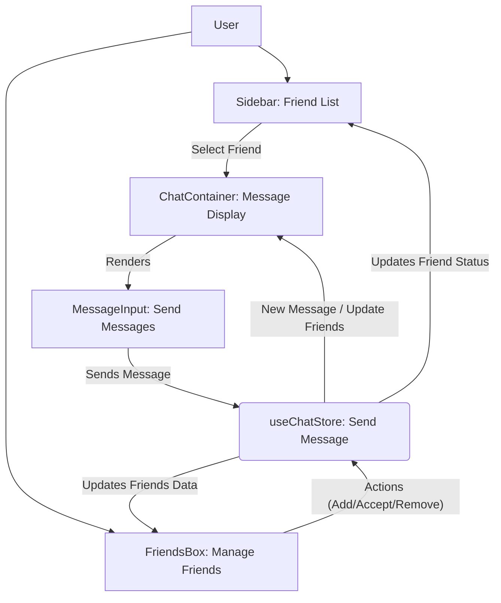

---
title: "User Interface Components"
description: "Overview and usage of key reusable React components forming the application's user interface."
sidebar_position: 31
---

# User Interface Components

This section details the core reusable React components that form the user interface of the application. These components are designed for modularity, reusability, and maintainability, leveraging React's functional component pattern and state management with Zustand.

<TOC />

## Component Overview

The application's frontend is built upon a set of specialized React components, each serving a distinct purpose in delivering a rich and interactive user experience. These components interact with the application's global state and backend services to fetch, display, and update data in real-time.

### ChatContainer

The `ChatContainer` component ([View on GitHub](https://github.com/shinymack/Chat-App-MERN/blob/main/frontend/src/components/ChatContainer.jsx)) is responsible for displaying the conversation history for a selected user. It dynamically renders messages, distinguishes between sender and receiver, and provides real-time updates through WebSocket subscriptions.

#### Functionality
-   **Message Display**: Renders individual chat messages, including text and image attachments.
-   **Sender Identification**: Visually differentiates messages sent by the authenticated user from those received from the selected user.
-   **Real-time Updates**: Subscribes to new messages via WebSocket to ensure the chat view is always current.
-   **Auto-Scroll**: Automatically scrolls to the latest message upon loading or receiving new messages.
-   **Loading State**: Displays a skeleton loader while messages are being fetched.
-   **Integration with `MessageInput`**: Includes the `MessageInput` component at the bottom for composing and sending messages.

#### Usage Insights

The `ChatContainer` demonstrates effective use of React hooks, specifically `useEffect` and `useRef`, for managing side effects and DOM interactions. The `useEffect` for fetching and subscribing to messages highlights a pattern for handling dynamic data based on selected entities (like `selectedUser._id`). The auto-scroll functionality implemented with `useRef` ensures a smooth user experience as new messages arrive.

```jsx
// frontend/src/components/ChatContainer.jsx
import { useEffect, useRef } from "react";
import { useChatStore } from "../store/useChatStore";
import ChatHeader from "./ChatHeader";
import MessageInput from "./MessageInput";
import MessageSkeleton from "./skeletons/MessageSkeleton";
import { useAuthStore } from "../store/useAuthStore";
import { formatMessageTime } from "../lib/utils";

const ChatContainer = () => {
    const { messages, getMessages, isMessagesLoading, selectedUser, subscribeToMessages, unsubscribeFromMessages } =
        useChatStore();
    const { authUser } = useAuthStore();
    const messageEndRef = useRef(null);

    useEffect(() => {
        getMessages(selectedUser._id);
        subscribeToMessages();

        return () => unsubscribeFromMessages();
    }, [selectedUser._id, getMessages, subscribeToMessages, unsubscribeFromMessages]);
    
    useEffect(() => {
        if(messageEndRef.current && messages){
            messageEndRef.current.scrollIntoView({behaviour : "smooth"})
        }
    }, [messages])

    // ... (rest of the component)
};
```
[View on GitHub](https://github.com/shinymack/Chat-App-MERN/blob/main/frontend/src/components/ChatContainer.jsx#L1-L29)

This snippet illustrates the core data fetching and real-time subscription logic. The cleanup function in the first `useEffect` is crucial for preventing memory leaks and ensuring that subscriptions are properly closed when the component unmounts or the `selectedUser` changes. The second `useEffect` ensures the latest message is always visible.

### FriendsBox

The `FriendsBox` component ([View on GitHub](https://github.com/shinymack/Chat-App-MERN/blob/main/frontend/src/components/FriendsBox.jsx)) provides a comprehensive interface for managing friend relationships within the application. It allows users to view their friends list, pending friend requests, and sent friend requests, as well as send new requests, accept/reject incoming requests, and remove existing friends.

#### Functionality
-   **Tabbed Navigation**: Organizes friend management into three tabs: "Friends", "Pending Requests", and "Sent Requests".
-   **Friend Search/Add**: Provides an input field to send friend requests by username or email.
-   **Request Management**: Allows users to accept or reject pending friend requests.
-   **Friend Removal**: Enables users to remove friends from their list.
-   **Real-time Updates**: Fetches and displays the latest friend data upon component mount.
-   **Overlay Modal**: Renders as a fixed overlay, ensuring it's a prominent and accessible feature.

#### Usage Insights

The `FriendsBox` is a prime example of a modal component that handles complex user interactions and state management. The use of `useState` for `activeTab` and `identifier` demonstrates local component state management, while interactions with `useChatStore` for `getFriends`, `sendFriendRequest`, etc., show integration with global application state. The structured `renderContent` function based on `activeTab` promotes code organization and readability.

```jsx
// frontend/src/components/FriendsBox.jsx
import { useEffect, useState } from 'react';
import { useChatStore } from '../store/useChatStore';
import { X, UserPlus, Check, Trash2 } from 'lucide-react';

const FriendsBox = () => {
    const { 
        toggleFriendsBox, 
        getFriends, users,
        getPendingRequests, pendingRequests,
        getSentRequests, sentRequests,
        sendFriendRequest, acceptFriendRequest, rejectFriendRequest, removeFriend
    } = useChatStore();

    const [activeTab, setActiveTab] = useState('friends');
    const [identifier, setIdentifier] = useState('');

    useEffect(() => {
        getFriends();
        getPendingRequests();
        getSentRequests();
    }, [getFriends, getPendingRequests, getSentRequests]);

    const handleAddFriend = (e) => {
        e.preventDefault();
        if (identifier.trim()) {
            sendFriendRequest(identifier);
            setIdentifier('');
        }
    };

    // ... (renderContent and JSX)
};
```
[View on GitHub](https://github.com/shinymack/Chat-App-MERN/blob/main/frontend/src/components/FriendsBox.jsx#L1-L32)

This excerpt highlights the initialization of component state and the `useEffect` hook for fetching all necessary friend-related data when the `FriendsBox` is rendered. The `handleAddFriend` function demonstrates how user input is processed to trigger a global state action for sending friend requests.

### MessageInput

The `MessageInput` component ([View on GitHub](https://github.com/shinymack/Chat-App-MERN/blob/main/frontend/src/components/MessageInput.jsx)) provides the interface for users to compose and send messages, including both text and image attachments.

#### Functionality
-   **Text Input**: A standard text area for typing messages.
-   **Image Attachment**: Allows users to select and preview image files before sending.
-   **Image Preview and Removal**: Displays a thumbnail of the attached image and provides an option to remove it.
-   **Send Button**: Sends the composed message and/or attached image.
-   **Input Validation**: Ensures that only image files can be attached and prevents sending empty messages.

#### Usage Insights

This component combines controlled input fields (`useState` for `text` and `imagePreview`) with file input handling. The use of `useRef` for `fileInputRef` to programmatically trigger the file input dialog is a common pattern for custom file upload buttons. The `handleImageChange` function demonstrates client-side image validation and preview generation using `FileReader`.

```jsx
// frontend/src/components/MessageInput.jsx
import { useRef, useState } from "react";
import { useChatStore } from "../store/useChatStore";
import { Image, Send, X } from "lucide-react";
import toast from "react-hot-toast";

const MessageInput = () => {
    const [text, setText] = useState("");
    const [imagePreview, setImagePreview] = useState(null);
    const fileInputRef = useRef(null);
    const { sendMessage } = useChatStore();

    const handleImageChange = (e) => {
        const file = e.target.files[0];
        if (!file.type.startsWith("image/")) {
            toast.error("Please select an image file");
            return;
        }

        const reader = new FileReader();
        reader.onloadend = () => {
            setImagePreview(reader.result);
        };
        reader.readAsDataURL(file);
    };

    const removeImage = () => {
        setImagePreview(null);
        if (fileInputRef.current) fileInputRef.current.value = "";
    };

    // ... (handleSendMessage and JSX)
};
```
[View on GitHub](https://github.com/shinymack/Chat-App-MERN/blob/main/frontend/src/components/MessageInput.jsx#L1-L35)

This code snippet focuses on the image handling logic, from selecting a file and validating its type to generating a preview and providing functionality to clear the selection. This detailed client-side validation and preview enhance the user experience by providing immediate feedback.

### Sidebar

The `Sidebar` component ([View on GitHub](https://github.com/shinymack/Chat-App-MERN/blob/main/frontend/src/components/Sidebar.jsx)) displays a list of the authenticated user's friends, allowing for selection to initiate or view a chat. It also indicates online status and provides a filter to show only online friends.

#### Functionality
-   **Friend List Display**: Lists all friends of the authenticated user.
-   **User Selection**: Allows clicking on a friend to set them as the `selectedUser` for chatting.
-   **Online Status Indicator**: Visually indicates whether a friend is currently online.
-   **Online Filter**: Provides a checkbox to filter the list to show only online friends.
-   **Responsive Visibility**: Hides itself on smaller screens when a user is selected, providing more space for the `ChatContainer`.
-   **Loading State**: Displays a skeleton loader while the friend list is being fetched.

#### Usage Insights

The `Sidebar` effectively combines fetching data (`getFriends`), reacting to global state changes (`onlineUsers`, `selectedUser`), and managing local UI state (`showOnlineOnly`). The `filteredUsers` computed property based on `showOnlineOnly` demonstrates efficient rendering logic without unnecessary re-renders of the entire list. The responsive design (`hidden sm:flex`) ensures a good user experience across different device sizes.

```jsx
// frontend/src/components/Sidebar.jsx
import { useEffect, useState } from "react";
import { useChatStore } from "../store/useChatStore";
import SidebarSkeleton from "./skeletons/SidebarSkeleton";
import { Users } from "lucide-react";
import { useAuthStore } from "../store/useAuthStore";

const Sidebar = () => {
    const { getFriends, users, selectedUser, setSelectedUser, isUsersLoading } =
        useChatStore();

    const { onlineUsers } = useAuthStore();
    const [showOnlineOnly, setShowOnlineOnly] = useState(false);
    useEffect(() => {
        getFriends();
    }, [getFriends]);
    const filteredUsers = showOnlineOnly
        ? users.filter((user) => onlineUsers.includes(user._id))
        : users;
    if (isUsersLoading) return <SidebarSkeleton />;
    return (
        <div className={`h-full sm:w-72 sm:border-r border-base-300  flex-col transition-all duration-200 ${selectedUser ?
                                    "hidden sm:flex w-[100vw] "
                                    : ""}`}>
            {/* ... (rest of the component) */}
        </div>
    );
};
```
[View on GitHub](https://github.com/shinymack/Chat-App-MERN/blob/main/frontend/src/components/Sidebar.jsx#L1-L26)

This snippet demonstrates the initial data fetching and the state management for filtering users. The conditional rendering for the sidebar's visibility based on `selectedUser` and screen size (`sm:flex`) showcases a common responsive design pattern in single-page applications.

### Component Interaction Flow

The following diagram illustrates how the primary UI components interact within the application's frontend.





This diagram illustrates the core flow of user interaction and component dependencies, highlighting how data flows through the Zustand stores and impacts UI updates across different components.

## Key Integration Points

### State Management with Zustand

All presented components heavily rely on Zustand for global state management. `useChatStore` and `useAuthStore` are central to accessing and modifying application data, such as:
-   `messages`, `selectedUser`, `users` (friends list), `pendingRequests`, `sentRequests` from `useChatStore`.
-   `authUser`, `onlineUsers` from `useAuthStore`.

This centralized state management simplifies data flow and ensures consistency across the application. When an action is dispatched (e.g., `sendMessage`, `acceptFriendRequest`), the Zustand store updates, which in turn triggers re-renders in dependent components.

### API and WebSocket Communication

Components like `ChatContainer` and `FriendsBox` trigger asynchronous actions (e.g., `getMessages`, `getFriends`, `sendFriendRequest`) that interact with the backend API. For real-time features, `ChatContainer` specifically subscribes to WebSocket events via `subscribeToMessages` to receive new messages without needing to poll the server, ensuring a responsive chat experience.

### User Experience Best Practices

-   **Loading Skeletons**: `ChatContainer` and `Sidebar` use skeleton components (`MessageSkeleton`, `SidebarSkeleton`) to improve perceived performance during data fetching, providing a smoother user experience.
-   **Toast Notifications**: `MessageInput` uses `react-hot-toast` to provide immediate feedback to the user, for example, when an invalid file type is selected for an attachment.
-   **Responsive Design**: The `Sidebar` dynamically adjusts its visibility based on screen size and selected user, optimizing space utilization on mobile devices.
-   **Auto-Scroll**: The `ChatContainer`'s auto-scroll to the latest message enhances usability in active conversations.

### Scalability Considerations

The component-based architecture, coupled with Zustand for state management and WebSockets for real-time updates, lays a strong foundation for scalability.
-   **Modular Design**: Each component is focused on a specific part of the UI, making it easier to develop, test, and maintain independently.
-   **Efficient Data Fetching**: `useEffect` hooks with dependency arrays ensure that data fetching and subscriptions are optimized, running only when necessary.
-   **Real-time Efficiency**: WebSockets reduce server load compared to traditional polling, which is crucial for a chat application's scalability with a growing user base.
-   **Optimistic UI Updates**: While not explicitly shown in these snippets, integrating optimistic UI updates (updating the UI immediately after an action, then confirming with the server) could further enhance perceived performance, especially for sending messages.

Next: [Pages and Navigation](./3.2_pages-navigation.mdx)
```