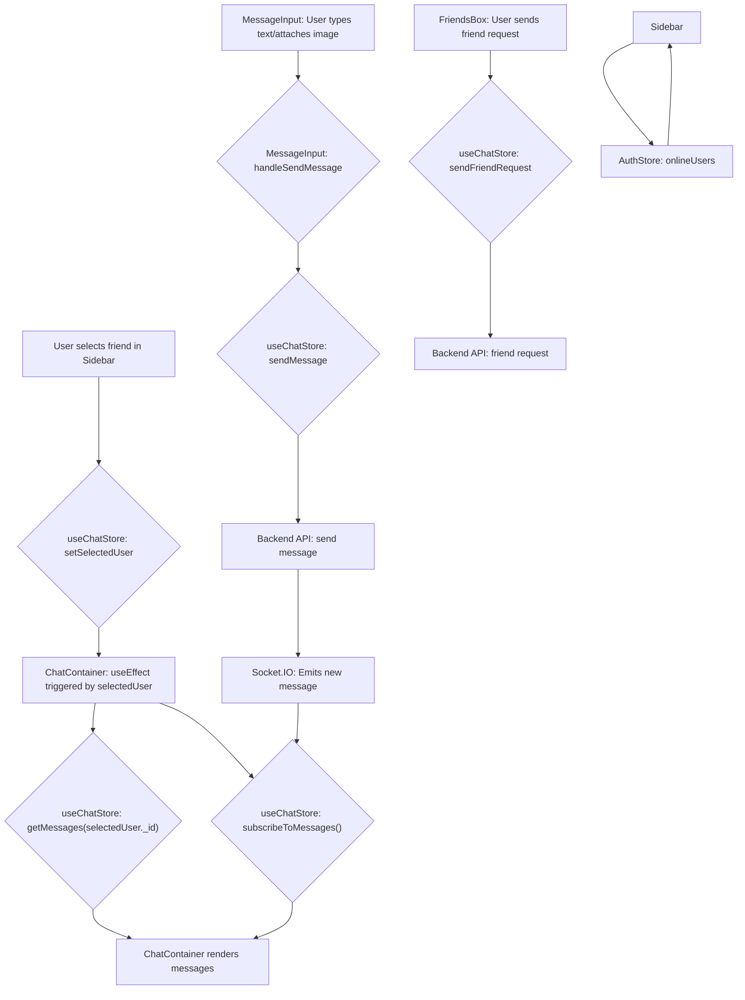

---
title: "User Interface Components"
description: "Details the reusable React components that form the application's user interface."
sidebar_position: 31
---

# User Interface Components

<TOC />

The user interface of the application is built using a modular approach with reusable React components. These components interact with the Zustand store for state management, providing a dynamic and responsive user experience. This section details the core UI components, their functionalities, and how they contribute to the overall application flow.

## Core Chat Components

The primary components for chat interaction are `ChatContainer`, `MessageInput`, and `Sidebar`. They work in tandem to display messages, allow message composition, and manage friend lists.

### ChatContainer

The `ChatContainer` component is responsible for displaying the conversation history for the currently selected user. It fetches messages, renders them, and handles real-time updates through WebSockets.

**Key Features:**

*   **Message Display:** Iterates through the `messages` array from `useChatStore` and renders each message.
*   **Real-time Updates:** Subscribes to new messages via `subscribeToMessages` and `unsubscribeFromMessages` in a `useEffect` hook.
*   **Auto-Scroll:** Uses `useRef` and a `useEffect` to automatically scroll to the latest message.
*   **Loading State:** Displays a `MessageSkeleton` when messages are being fetched.
*   **User Context:** Distinguishes between messages sent by the authenticated user and the selected chat partner to render them on appropriate sides (chat-end/chat-start).
*   **Media Support:** Renders image attachments within chat bubbles.

**Code Snippet: `ChatContainer` structure and message rendering**

```jsx
// frontend/src/components/ChatContainer.jsx
// Line 25-58 (approx)
// View on GitHub: https://github.com/shinymack/Chat-App-MERN/blob/main/frontend/src/components/ChatContainer.jsx#L25-L58
    if (isMessagesLoading)
        return (
            <div className="flex-1 flex flex-col overflow-auto">
                <ChatHeader />
                <MessageSkeleton />
                <MessageInput />
            </div>
        );
    return (
        <div className="flex-1 flex flex-col overflow-auto">
            <ChatHeader />
            <div className="flex-1 overflow-y-auto p-4 space-y-4">
                {messages.map((message) => (
                    <div
                        key={message._id}
                        className={`chat ${message.senderId == authUser._id ? "chat-end": "chat-start"} `}
                        ref={messageEndRef}
                    >
                        <div className="chat-image avatar">
                            <div className="size-9 rounded-full border">
                                
                            </div>
                        </div>
                        <div className="chat-header mb-1">
                            <time className="text-xs opacity-50 ml-1">{formatMessageTime(message.createdAt)}</time>
                        </div>
                        <div className="chat-bubble flex flex-col">
                            {message.image && (
                                
                            )}
                            {message.text && <p>{message.text}</p>}
                        </div>
                    </div>
                ))}
            </div>
            <MessageInput />
        </div>
    );
};
```

### MessageInput

The `MessageInput` component provides the interface for users to compose and send messages. It supports both text and image attachments.

**Key Features:**

*   **Text Input:** A standard text area for typing messages.
*   **Image Upload:** Allows users to select image files, displays a preview, and handles image removal.
*   **Message Sending:** Dispatches the `sendMessage` action from `useChatStore`, sending both text and image data.
*   **State Management:** Manages its own local state for `text` and `imagePreview`.

**Code Snippet: `MessageInput` image handling**

```jsx
// frontend/src/components/MessageInput.jsx
// Line 11-28 (approx)
// View on GitHub: https://github.com/shinymack/Chat-App-MERN/blob/main/frontend/src/components/MessageInput.jsx#L11-L28
    const [text, setText] = useState("");
    const [imagePreview, setImagePreview] = useState(null);
    const fileInputRef = useRef(null);
    const { sendMessage } = useChatStore();

    const handleImageChange = (e) => {
        const file = e.target.files[0];
        if (!file.type.startsWith("image/")) {
            toast.error("Please select an image file");
            return;
        }

        const reader = new FileReader();
        reader.onloadend = () => {
            setImagePreview(reader.result);
        };
        reader.readAsDataURL(file);
    };

    const removeImage = () => {
        setImagePreview(null);
        if (fileInputRef.current) fileInputRef.current.value = "";
    };
```

### Sidebar

The `Sidebar` component displays the list of friends for the authenticated user, allowing selection of a chat partner.

**Key Features:**

*   **Friend List Display:** Fetches and displays a list of friends using `getFriends` from `useChatStore`.
*   **User Selection:** Allows users to select a friend, updating `selectedUser` in the store, which then triggers the `ChatContainer` to load messages for that user.
*   **Online Status Indicator:** Shows an online/offline status for each friend, dynamically updated based on `onlineUsers` from `useAuthStore`.
*   **Filter Option:** Provides a checkbox to filter and display only online friends.
*   **Loading State:** Presents a `SidebarSkeleton` during friend list loading.

**Code Snippet: `Sidebar` online status and filtering**

```jsx
// frontend/src/components/Sidebar.jsx
// Line 19-38 (approx)
// View on GitHub: https://github.com/shinymack/Chat-App-MERN/blob/main/frontend/src/components/Sidebar.jsx#L19-L38
    const { onlineUsers } = useAuthStore();
    const [showOnlineOnly, setShowOnlineOnly] = useState(false);
    useEffect(() => {
        getFriends();
    }, [getFriends]);
    const filteredUsers = showOnlineOnly
        ? users.filter((user) => onlineUsers.includes(user._id))
        : users;
    if (isUsersLoading) return <SidebarSkeleton />;
    return (
        <div className={`h-full sm:w-72 sm:border-r border-base-300  flex-col transition-all duration-200 ${selectedUser ?
                                    "hidden sm:flex w-[100vw] "
                                    : ""}`}>
            <div className="border-b border-base-300  p-5">
                <div className="flex items-center gap-2">
                    <Users className="size-6"></Users>
                    <span className="font-medium  lg:block">
                        Friends
                    </span>
                </div>
                {/* Online toggle filter remaining */}
                <div className="mt-3 lg:flex items-center gap-2">
                    <label className="cursor-pointer flex items-center gap-2">
                        <input
                            type="checkbox"
                            checked={showOnlineOnly}
                            onChange={(e) =>
                                setShowOnlineOnly(e.target.checked)
                            }
                            className="checkbox checkbox-sm"
                        />
                        <span className="text-sm">Show online only</span>
                    </label>
                    <span className="text-xs text-zinc-500">
                          ({users.filter(friend => onlineUsers.includes(friend._id)).length} online)
                    </span>
                </div>
```

## FriendsBox Component

The `FriendsBox` component provides a comprehensive interface for managing friends, including adding new friends, viewing pending requests, and handling sent requests.

**Key Features:**

*   **Tabbed Interface:** Organizes friend management into "Friends," "Pending," and "Sent" request tabs.
*   **Add Friend Functionality:** Allows users to send friend requests by entering a username or email.
*   **Request Management:** Provides actions to accept, reject, or remove friends.
*   **State Synchronization:** Utilizes `useEffect` to fetch friends, pending requests, and sent requests upon component mount.
*   **Modal Overlay:** Renders as a fixed overlay, typical for modal dialogues.

**Code Snippet: `FriendsBox` request handling**

```jsx
// frontend/src/components/FriendsBox.jsx
// Line 25-30 (approx)
// View on GitHub: https://github.com/shinymack/Chat-App-MERN/blob/main/frontend/src/components/FriendsBox.jsx#L25-L30
    const handleAddFriend = (e) => {
        e.preventDefault();
        if (identifier.trim()) {
            sendFriendRequest(identifier);
            setIdentifier('');
        }
    };
```

**Code Snippet: `FriendsBox` tab rendering logic**

```jsx
// frontend/src/components/FriendsBox.jsx
// Line 32-88 (approx)
// View on GitHub: https://github.com/shinymack/Chat-App-MERN/blob/main/frontend/src/components/FriendsBox.jsx#L32-L88
    const renderContent = () => {
        switch (activeTab) {
            case 'pending':
                return (
                    <div className="space-y-2">
                        {pendingRequests.length > 0 ? pendingRequests.map(req => (
                            <div key={req._id} className="flex items-center justify-between p-2 rounded-lg bg-base-200">
                                <div className="flex items-center gap-3">
                                    
                                    <span>{req.username}</span>
                                </div>
                                <div className="flex gap-2">
                                    <button onClick={() => acceptFriendRequest(req._id)} className="btn btn-xs btn-success btn-circle"><Check size={16}/></button>
                                    <button onClick={() => rejectFriendRequest(req._id)} className="btn btn-xs btn-error btn-circle"><X size={16}/></button>
                                </div>
                            </div>
                        )) : <p className="text-center text-base-content/60 py-4">No pending requests.</p>}
                    </div>
                );
            case 'sent':
                return (
                    <div className="space-y-2">
                        {sentRequests.length > 0 ? sentRequests.map(req => (
                             <div key={req._id} className="flex items-center justify-between p-2 rounded-lg bg-base-200">
                                <div className="flex items-center gap-3">
                                    
                                    <span>{req.username}</span>
                                </div>
                                <span className="text-sm text-base-content/50">Pending</span>
                            </div>
                        )) : <p className="text-center text-base-content/60 py-4">No sent requests.</p>}
                    </div>
                );
            case 'friends':
            default:
                return (
                    <div className="space-y-2">
                        {users.length > 0 ? users.map(friend => (
                            <div key={friend._id} className="flex items-center justify-between p-2 rounded-lg bg-base-200">
                               <div className="flex items-center gap-3">
                                    
                                    <span>{friend.username}</span>
                                </div>
                                <button onClick={() => removeFriend(friend._id)} className="btn btn-xs btn-ghost btn-circle text-error"><Trash2 size={16}/></button>
                            </div>
                        )) : <p className="text-center text-base-content/60 py-4">You have no friends yet.</p>}
                    </div>
                );
        }
    };
```

## Component Interaction Flow

The components are designed to work together seamlessly, primarily driven by state changes in the Zustand stores.





## Key Integration Points

The UI components integrate deeply with the application's Zustand stores (`useChatStore`, `useAuthStore`) and the Socket.IO client for real-time capabilities.

*   **State-driven Rendering:** Components like `ChatContainer` and `Sidebar` are highly reactive to changes in `selectedUser`, `messages`, `users` (friends), and `onlineUsers` from their respective Zustand stores. This ensures the UI always reflects the current application state.
*   **Real-time Communication:** `ChatContainer` explicitly subscribes and unsubscribes from WebSocket events, allowing it to receive new messages without manual refreshes. The `onlineUsers` state in `useAuthStore` also updates in real-time through WebSockets, affecting the `Sidebar`'s display.
*   **Action Dispatching:** User interactions (e.g., sending a message, selecting a user, accepting a friend request) trigger actions defined in the Zustand stores, which then interact with the backend API.
*   **Modular Design:** Each component focuses on a specific part of the UI/UX, making them reusable and easier to maintain. For instance, `MessageInput` can be used in any context where a message needs to be composed, not just within the `ChatContainer`.
*   **Lifecycle Management:** `useEffect` hooks are crucial for managing data fetching, subscriptions, and DOM manipulations (like auto-scrolling) linked to the component's lifecycle and dependencies.

This architecture ensures a clear separation of concerns, with UI components focused on presentation and interaction, while business logic and state management are handled by the Zustand stores and backend services.

Next: [Page Structure and Routing](./3.2_page-structure-and-routing.mdx)
```