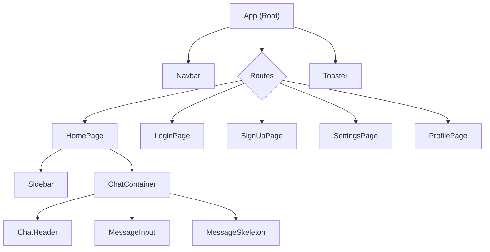
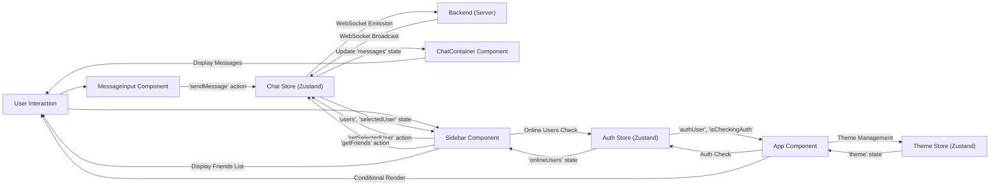

# User Interface Components

<TOC />

This section details the primary User Interface (UI) components of the client-side application. These React components are the building blocks that users interact with, handling everything from navigation and authentication flows to displaying chat messages and managing user lists. They are designed for reusability and maintainability, leveraging React hooks and Zustand for state management, and often interacting with backend APIs.

## Application Root (`App.jsx`)

The `App.jsx` file serves as the main entry point for the React application, orchestrating the global layout, routing, authentication status, and theme management. It conditionally renders different pages based on the user's authentication status and the current URL path.

**Key Responsibilities:**

*   **Global Layout:** Wraps the entire application, applying the current theme.
*   **Routing:** Defines application routes using `react-router-dom`, directing users to `HomePage`, `LoginPage`, `SignUpPage`, `SettingsPage`, and `ProfilePage`.
*   **Authentication Flow:** Checks the user's authentication status (`checkAuth`) on mount and redirects unauthenticated users to the login page for protected routes. Displays a loading spinner during the authentication check.
*   **Global State Integration:** Utilizes `useThemeStore` and `useAuthStore` to access and manage global application state for theme and authentication.
*   **Notifications:** Integrates `react-hot-toast` for displaying global notifications.

```jsx title="frontend/src/App.jsx" showLineNumbers
import Navbar from './components/Navbar'
import { Routes, Route, Navigate } from 'react-router-dom'
import { useEffect } from 'react'
import HomePage from './pages/HomePage'
// ... (other page imports)
import { useThemeStore } from './store/useThemeStore'
import { useAuthStore } from './store/useAuthStore';
import { Loader } from 'lucide-react'
import { Toaster } from 'react-hot-toast'

const App = () => {
  const { authUser, checkAuth, isCheckingAuth, onlineUsers } = useAuthStore();
  const { theme } = useThemeStore();
  useEffect(() => {
    checkAuth();
  }, [checkAuth]);

  if(isCheckingAuth && !authUser) return (
      <div className='flex items-center justify-center h-screen'>
        <Loader className='size-10 animate-spin' />
      </div>
  )

  return (
    <div className='' data-theme={theme}>
      <Navbar />
      <Toaster />
      <Routes>
        <Route path='/' element={authUser ? <HomePage />: <Navigate to='/login' />} />
        <Route path='/signup' element={ !authUser ? <SignUpPage />: <Navigate to='/' />} />
        <Route path='/login' element={!authUser ? <LoginPage />: <Navigate to='/' />} />
        <Route path='/settings' element={<SettingsPage />} />
        <Route path='/profile' element={authUser ? <ProfilePage />: <Navigate to='/login' />} />
      </Routes>
    </div>
  )
}

export default App
```
This snippet from `App.jsx` ([View on GitHub](https://github.com/shinymack/Chat-App-MERN/blob/main/frontend/src/App.jsx#L15-L48)) illustrates the core routing logic and conditional rendering based on authentication status and loading states. It ensures that users are either redirected to authentication pages or allowed to access protected content.

## Chat Container (`ChatContainer.jsx`)

The `ChatContainer` component is responsible for displaying the chat messages between the authenticated user and a currently selected user. It manages the fetching and real-time subscription of messages, ensuring the chat view is always up-to-date and scrolled to the latest message.

**Key Responsibilities:**

*   **Message Display:** Renders a list of messages, distinguishing between messages sent by the authenticated user and the selected user.
*   **Real-time Updates:** Subscribes to new messages in real-time using `subscribeToMessages` from `useChatStore`.
*   **Auto-scrolling:** Automatically scrolls to the bottom of the chat view when new messages arrive.
*   **Loading State:** Displays a skeleton loader (`MessageSkeleton`) while messages are being fetched.
*   **Component Composition:** Integrates `ChatHeader` (not provided in context but inferred) for displaying chat participant information, and `MessageInput` for sending new messages.

```jsx title="frontend/src/components/ChatContainer.jsx" showLineNumbers
import { useEffect } from "react";
import { useChatStore } from "../store/useChatStore";
import ChatHeader from "./ChatHeader";
import MessageInput from "./MessageInput";
import MessageSkeleton from "./skeletons/MessageSkeleton";
import { useAuthStore } from "../store/useAuthStore";
import { formatMessageTime } from "../lib/utils";
import { useRef } from "react";

const ChatContainer = () => {
    const { messages, getMessages, isMessagesLoading, selectedUser, subscribeToMessages, unsubscribeFromMessages } =
        useChatStore();
    const { authUser } = useAuthStore();
    const messageEndRef = useRef(null);

    useEffect(() => {
        getMessages(selectedUser._id);
        subscribeToMessages();
        return () => unsubscribeFromMessages();
    }, [selectedUser._id, getMessages, subscribeToMessages, unsubscribeFromMessages]);
    
    useEffect(() => {
        if(messageEndRef.current && messages){
            messageEndRef.current.scrollIntoView({behaviour : "smooth"})
        }
    }, [messages])

    if (isMessagesLoading) // ... (loading skeleton)

    return (
        <div className="flex-1 flex flex-col overflow-auto">
            <ChatHeader />
            <div className="flex-1 overflow-y-auto p-4 space-y-4">
                {messages.map((message) => (
                    <div
                        key={message._id}
                        className={`chat ${message.senderId == authUser._id ? "chat-end": "chat-start"} `}
                        ref={messageEndRef}
                    >
                        <div className="chat-image avatar">
                            <div className="size-9 rounded-full border">
                                
                            </div>
                        </div>
                        <div className="chat-header mb-1">
                            <time className="text-xs opacity-50 ml-1">{formatMessageTime(message.createdAt)}</time>
                        </div>
                        <div className="chat-bubble flex flex-col">
                            {message.image && ( /* ... */ )}
                            {message.text && <p>{message.text}</p>}
                        </div>
                    </div>
                ))}
            </div>
            <MessageInput />
        </div>
    );
};

export default ChatContainer;
```
The `useEffect` hooks in `ChatContainer.jsx` ([View on GitHub](https://github.com/shinymack/Chat-App-MERN/blob/main/frontend/src/components/ChatContainer.jsx#L10-L24)) are crucial for fetching messages for the `selectedUser` and setting up/tearing down the real-time message subscription. The `messageEndRef` ensures the view automatically scrolls to the latest message.

## Message Input (`MessageInput.jsx`)

The `MessageInput` component provides the interface for users to compose and send messages. It supports both text and image attachments, offering a preview for images before sending.

**Key Responsibilities:**

*   **Text Input:** Allows users to type their message content.
*   **Image Attachment:** Provides an option to attach an image file, displaying a preview and allowing removal before sending.
*   **Message Sending:** Handles the submission of messages (text and/or image) via the `sendMessage` action from `useChatStore`.
*   **Input Validation:** Prevents sending empty messages.
*   **UI Feedback:** Clears the input and image preview after a successful send.

```jsx title="frontend/src/components/MessageInput.jsx" showLineNumbers
import { useRef, useState } from "react";
import { useChatStore } from "../store/useChatStore";
import { Image, Send, X } from "lucide-react";
import toast from "react-hot-toast";

const MessageInput = () => {
    const [text, setText] = useState("");
    const [imagePreview, setImagePreview] = useState(null);
    const fileInputRef = useRef(null);
    const { sendMessage } = useChatStore();

    const handleImageChange = (e) => {
        const file = e.target.files[0];
        if (!file.type.startsWith("image/")) {
            toast.error("Please select an image file");
            return;
        }
        const reader = new FileReader();
        reader.onloadend = () => {
            setImagePreview(reader.result);
        };
        reader.readAsDataURL(file);
    };

    const removeImage = () => {
        setImagePreview(null);
        if (fileInputRef.current) fileInputRef.current.value = "";
    };

    const handleSendMessage = async (e) => {
        e.preventDefault();
        if (!text.trim() && !imagePreview) return;

        try {
            await sendMessage({
                text: text.trim(),
                image: imagePreview,
            });
            setText("");
            setImagePreview(null);
            if (fileInputRef.current) fileInputRef.current.value = ""; // Fix: clear file input
        } catch (error) {
            console.error("Failed to send message", error);
        }
    };

    return (
        <div className="p-4 w-full">
            {imagePreview && ( /* ... Image preview display ... */ )}
            <form
                onSubmit={handleSendMessage}
                className="flex items-center gap-2"
            >
                <div className="flex flex-1 gap-2">
                    <input
                        type="text"
                        className="w-full input input-bordered rounded-lg input-sm sm:input-md"
                        placeholder="Type a message..."
                        value={text}
                        onChange={(e) => setText(e.target.value)}
                    />
                    <input
                        type="file"
                        accept="image/*"
                        className="hidden"
                        ref={fileInputRef}
                        onChange={handleImageChange}
                    />

                    <button
                        type="button"
                        className={`hidden sm:flex btn btn-circle /* ... styling ... */ `}
                        onClick={() => fileInputRef.current?.click()}
                    >
                        <Image size={20} />
                    </button>
                </div>
                <button
                    type="submit"
                    className="btn btn-sm btn-circle"
                    disabled={!text.trim() && !imagePreview}
                >
                    <Send size={22} />
                </button>
            </form>
        </div>
    );
};

export default MessageInput;
```
This section of `MessageInput.jsx` ([View on GitHub](https://github.com/shinymack/Chat-App-MERN/blob/main/frontend/src/components/MessageInput.jsx#L19-L55)) demonstrates the `handleSendMessage` function, which orchestrates sending the message payload, including text and image, and then resetting the input fields. The `fileInputRef` is used to programmatically trigger the hidden file input.

## Sidebar (`Sidebar.jsx`)

The `Sidebar` component displays a list of available users (friends) with whom the authenticated user can chat. It provides visual cues for online/offline status and allows filtering the list to show only online users.

**Key Responsibilities:**

*   **User Listing:** Fetches and displays a list of users, including their profile picture, username, and online status.
*   **User Selection:** Allows the authenticated user to select a chat partner, which updates the `selectedUser` in the chat state.
*   **Online Status:** Integrates `onlineUsers` from `useAuthStore` to indicate which users are currently online.
*   **Filtering:** Provides a checkbox to filter the user list, showing only online friends.
*   **Loading State:** Displays a skeleton loader (`SidebarSkeleton`) while the user list is being fetched.
*   **Responsiveness:** Hides itself on smaller screens if a user is already selected, providing a full-width chat experience.

```jsx title="frontend/src/components/Sidebar.jsx" showLineNumbers
import { useEffect, useState } from "react";
import { useChatStore } from "../store/useChatStore";
import SidebarSkeleton from "./skeletons/SidebarSkeleton";
import { Users } from "lucide-react";
import { useAuthStore } from "../store/useAuthStore";

const Sidebar = () => {
    const { getFriends, users, selectedUser, setSelectedUser, isUsersLoading } =
        useChatStore();
    const { onlineUsers } = useAuthStore();
    const [showOnlineOnly, setShowOnlineOnly] = useState(false);

    useEffect(() => {
        getFriends();
    }, [getFriends]);

    const filteredUsers = showOnlineOnly
        ? users.filter((user) => onlineUsers.includes(user._id))
        : users;

    if (isUsersLoading) return <SidebarSkeleton />;

    return (
        <div className={`h-full sm:w-72 sm:border-r border-base-300  flex-col transition-all duration-200 ${selectedUser ?
                                    "hidden sm:flex w-[100vw] "
                                    : ""}`}>
            <div className="border-b border-base-300  p-5">
                <div className="flex items-center gap-2">
                    <Users className="size-6"></Users>
                    <span className="font-medium  lg:block">
                        Friends
                    </span>
                </div>
                <div className="mt-3 lg:flex items-center gap-2">
                    <label className="cursor-pointer flex items-center gap-2">
                        <input
                            type="checkbox"
                            checked={showOnlineOnly}
                            onChange={(e) =>
                                setShowOnlineOnly(e.target.checked)
                            }
                            className="checkbox checkbox-sm"
                        />
                        <span className="text-sm">Show online only</span>
                    </label>
                    <span className="text-xs text-zinc-500">
                          ({users.filter(friend => onlineUsers.includes(friend._id)).length} online)
                    </span>
                </div>
                <div className="overflow-y-scroll h-[calc(100vh-14rem)] w-full flex flex-col py-3">
                    {filteredUsers.map((user) => (
                        <button
                            key={user._id}
                            onClick={() => setSelectedUser(user)}
                            className={`sm:w-full w-[88vw] p-3 flex items-center gap-3 hover:bg-base-300 transition-colors
                            ${
                                selectedUser?._id === user._id
                                    ? "bg-base-300 ring-1 ring-base-300"
                                    : ""
                            }`}
                        >
                            <div className="relative mx-0">
                                
                                {onlineUsers.includes(user._id) && (
                                    <span className="absolute bottom-0 right-0 size-3 bg-green-500 rounded-full ring-2 ring-zinc-900" />
                                )}
                            </div>
                            <div className=" block text-left min-w-0">
                                <div className=" font-medium truncate">
                                    {user.username}
                                </div>
                                <div className="text-sm text-zinc-400">
                                    {onlineUsers.includes(user._id)
                                        ? "Online"
                                        : "Offline"}
                                </div>
                            </div>
                        </button>
                    ))}
                </div>
                {filteredUsers.length == 0 && (
                    <div className="text-center text-zinc-500 py-4">No online friends</div>
                )}
            </div>
        </div>
    );
};

export default Sidebar;
```
The `Sidebar.jsx` component ([View on GitHub](https://github.com/shinymack/Chat-App-MERN/blob/main/frontend/src/components/Sidebar.jsx#L18-L67)) efficiently manages the display and filtering of users. The `useEffect` hook ensures the friend list is fetched upon component mount, while `useState` for `showOnlineOnly` dynamically updates the `filteredUsers` list. The conditional styling for `selectedUser` highlights the active chat partner.

## UI Component Hierarchy

This diagram illustrates the hierarchical relationship and composition of the main UI components, showing how they fit together to form the application's user interface.





## UI Component Interaction Flow

This diagram visualizes the primary interactions and data flow between key UI components and the Zustand stores they utilize, highlighting how user actions trigger state updates and render changes.





## Key Integration Points

*   **Zustand for Global State:** The components heavily rely on Zustand stores (`useAuthStore`, `useChatStore`, `useThemeStore`) to manage application-wide state. This pattern simplifies state access and updates, preventing prop-drilling and centralizing state logic. For instance, `App.jsx` uses `useAuthStore` to determine user authentication, while `ChatContainer` and `Sidebar` use `useChatStore` for chat-specific data.
*   **React Router for Navigation:** `react-router-dom` is fundamental for structuring the application's navigation. `App.jsx` defines the routes, and `Navigate` components enforce access control based on `authUser` status, ensuring a smooth user experience.
*   **Real-time Communication (via `useChatStore`):** The `ChatContainer` demonstrates a critical integration point for real-time features. It subscribes to WebSocket events via `subscribeToMessages` from `useChatStore` to instantly display new messages without requiring page refreshes, providing a dynamic chat experience.
*   **Component Composition:** The UI components are designed to be composable. `ChatContainer` integrates `ChatHeader` and `MessageInput`, demonstrating how smaller, focused components combine to create a richer UI section. This promotes modularity and reusability.
*   **Conditional Rendering:** Many components, particularly `App.jsx`, use conditional rendering extensively based on loading states (`isCheckingAuth`, `isMessagesLoading`, `isUsersLoading`) or data availability (`authUser`, `messages`, `users`). This ensures a responsive UI that provides feedback to the user during asynchronous operations.

Next: [State Management](./3.2_state-management.mdx)