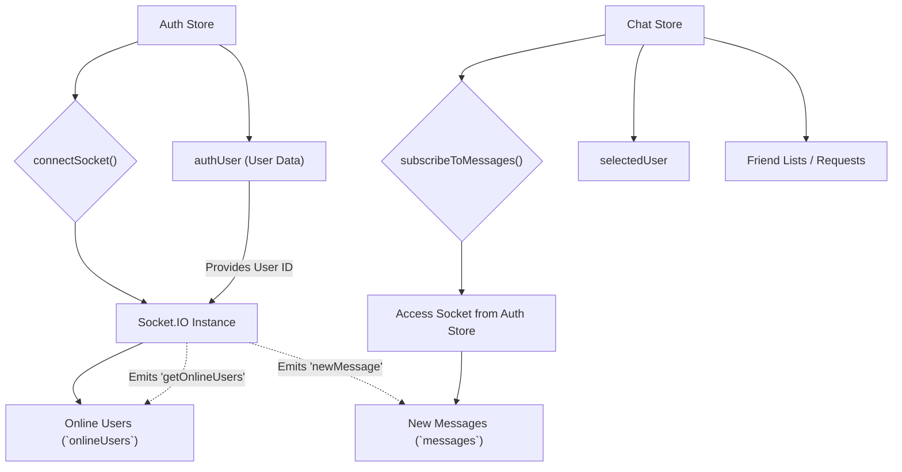
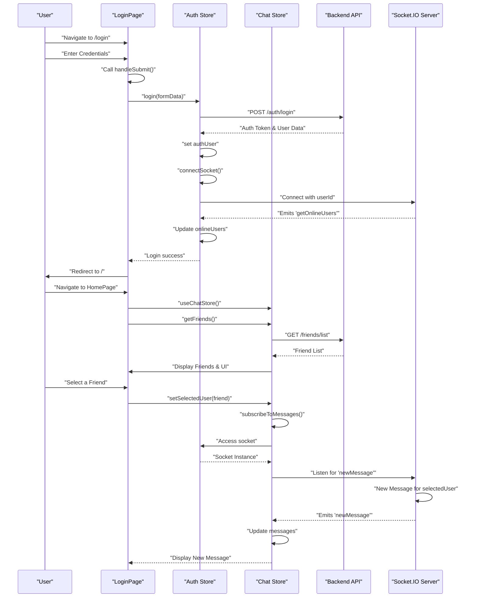

# Frontend State Management and Pages

<TOC />

This section delves into the frontend's architecture for managing global state and routing, focusing on [Zustand](https://zustand-bear.pmnd.rs/) for state management and how it integrates with different application pages. We will explore the `useAuthStore` and `useChatStore` to understand their roles in managing user authentication, online status, chat messages, and friend-related functionalities. Additionally, we will examine the `LoginPage` and `HomePage` to see how these stores are consumed to render dynamic UI.

## Global State Management with Zustand

Zustand is a lightweight, fast, and scalable state-management solution for React. It uses a hook-based API, making it easy to create and consume global stores. In this application, two primary Zustand stores are implemented: `useAuthStore` and `useChatStore`.

### 1. `useAuthStore`: Authentication and User Status

The `useAuthStore` manages all aspects related to user authentication, registration, profile updates, and real-time online status via WebSocket. It handles user login, signup, logout, and stores the authenticated user's data. Crucially, it initializes and manages the Socket.IO connection, which is essential for real-time features like online user tracking.

```javascript filename="frontend/src/store/useAuthStore.js" {1, 13-17, 85-95}
import { create } from "zustand";
import { axiosInstance } from "../lib/axios";
import toast from "react-hot-toast";
import { io } from "socket.io-client";

const BASE_URL = import.meta.env.MODE == "development" ? "http://localhost:5001": "/";

export const useAuthStore = create((set, get) => ({
    authUser: null,
    isSigningUp: false,
    isLoggingIn: false,
    isUpdatingProfile: false,
    isCheckingAuth: true,
    onlineUsers: [], // Stores IDs of online users
    socket: null, // Socket.IO instance

    checkAuth: async () => {
        // ... (API call to check user's authentication status) ...
    },

    signup: async (data) => {
        // ... (API call for user registration) ...
    },

    logout: async () => {
        // ... (API call to log out user, then disconnects socket) ...
    },

    login: async (data) => {
        // ... (API call for user login, then connects socket) ...
    },
    updateProfile: async (data) => {
        // ... (API call to update user profile) ...
    },

    connectSocket: () => {
        const { authUser } = get();
        if(!authUser || get().socket?.connected) return;

        const socket = io(BASE_URL, { // Initialize Socket.IO connection
            query: {
                userId : authUser._id, // Pass userId for server-side identification
            },
        });
        socket.connect();
        set({socket: socket});

        socket.on("getOnlineUsers", (userIds) => { // Listener for online users
            set({onlineUsers: userIds})
        }); 
    },

    disconnectSocket : () => {
        if(get().socket?.connected) get().socket.disconnect();
    }
}));
```
[View on GitHub](https://github.com/shinymack/Chat-App-MERN/blob/main/frontend/src/store/useAuthStore.js#L1-L95)

Key aspects:
*   **`authUser`**: Stores the currently authenticated user's data.
*   **`onlineUsers`**: An array of user IDs that are currently online, updated via Socket.IO.
*   **`socket`**: Holds the Socket.IO client instance, responsible for real-time communication.
*   **`connectSocket`**: Initializes the Socket.IO connection upon successful authentication, passing the `userId` as a query parameter. It also sets up a listener for the `getOnlineUsers` event.
*   **`disconnectSocket`**: Closes the Socket.IO connection, typically called on logout.

This store is fundamental for user sessions and real-time user presence.

### 2. `useChatStore`: Chat and Friend Management

The `useChatStore` is dedicated to managing all chat-related state, including messages, user lists, friend requests, and the currently selected chat partner. It also includes methods for sending/receiving messages and handling friend relationships.

```javascript filename="frontend/src/store/useChatStore.js" {1, 12, 16-20, 101-112}
import toast from "react-hot-toast";
import { create } from "zustand";
import { axiosInstance } from "../lib/axios";
import { useAuthStore } from "./useAuthStore"; // Access to auth store's socket

export const useChatStore = create((set, get) => ({
    messages:[], // Current chat messages
    users: [], // Friends list
    pendingRequests: [],
    sentRequests: [],
    selectedUser: null, // The user currently being chatted with
    isUsersLoading: false,
    isMessagesLoading: false,
    isFriendBoxOpen: false,

    toggleFriendsBox: () => set(state => ({ isFriendsBoxOpen: !state.isFriendsBoxOpen })),

    getFriends: async () => { /* ... API call ... */ },
    getPendingRequests: async () => { /* ... API call ... */ },
    getSentRequests: async () => { /* ... API call ... */ },
    sendFriendRequest: async (identifier) => { /* ... API call ... */ },
    acceptFriendRequest: async (senderId) => { /* ... API call ... */ },
    rejectFriendRequest: async (senderId) => { /* ... API call ... */ },
    removeFriend: async (friendId) => { /* ... API call ... */ },
    getMessages: async (userId) => { /* ... API call ... */ },
    sendMessage: async (messageData) => { /* ... API call ... */ },

    subscribeToMessages: () => {
        const { selectedUser } = get();
        if(!selectedUser) return;
        
        // Access socket instance from useAuthStore
        const socket = useAuthStore.getState().socket; 
        socket.on("newMessage", (newMessage) => {
            if(newMessage.senderId !== selectedUser._id) return
            set({
                messages: [...get().messages, newMessage]
            })
        })
    },

    unsubscribeFromMessages: () => {
        const socket = useAuthStore.getState().socket;
        socket.off("newMessage");
    },
    
    setSelectedUser: (selectedUser) => set({selectedUser})
}));
```
[View on GitHub](https://github.com/shinymack/Chat-App-MERN/blob/main/frontend/src/store/useChatStore.js#L1-L112)

Key aspects:
*   **`messages`**: An array holding the messages for the currently selected chat.
*   **`users`**: Represents the list of friends.
*   **`selectedUser`**: The user object representing the currently active chat conversation.
*   **`subscribeToMessages` / `unsubscribeFromMessages`**: These methods manage listeners for new messages via Socket.IO. They obtain the `socket` instance directly from `useAuthStore`'s state using `useAuthStore.getState().socket`, demonstrating cross-store communication for shared resources.
*   **`setSelectedUser`**: Updates the `selectedUser` state, triggering UI changes to display the correct chat.

### State Management Flow
This diagram illustrates how the Zustand stores interact, particularly regarding the Socket.IO connection.





## Application Pages

The frontend features distinct pages for user authentication and the main chat application experience.

### 1. `LoginPage.jsx`: User Authentication

The `LoginPage` provides the interface for users to sign in to their accounts. It integrates with `useAuthStore` to handle login functionality, displaying loading states and error messages as needed. It also supports Google OAuth authentication, redirecting users to the backend's Google authentication endpoint.

```javascript filename="frontend/src/pages/LoginPage.jsx" {1, 9, 30-33, 114}
import { useState } from "react"
import { useAuthStore } from "../store/useAuthStore";
import { Eye, EyeOff, Loader2, Lock, Mail, MessageSquare } from "lucide-react";
import { Link } from "react-router-dom";
import AuthImagePattern from "../components/AuthImagePattern";
import { FcGoogle } from "react-icons/fc";

const LoginPage = () => {
  const [showPassword, setShowPassword] = useState(false);
  const [formData, setFormData] = useState({
    email: "",
    password: "",
  })
  const { login, isLoggingIn } = useAuthStore(); // Consumes auth store

  const handleSubmit = async (e) => {
    e.preventDefault();
    login(formData); // Calls login action from Zustand store
  }
  const backendDomain = import.meta.env.VITE_BACKEND_URL;
  const googleAuthUrl = `${backendDomain}/api/auth/google`; // Google OAuth URL
  return (
    <div className="h-screen grid lg:grid-cols-2">
      {/* Left Side - Form */}
      <div className="flex flex-col justify-center items-center p-6 sm:p-12">
        <div className="w-full max-w-md space-y-8">
          {/* Logo */}
          {/* ... */}
          {/* Form */}
          <form onSubmit={handleSubmit} className="space-y-6">
            {/* Email input ... */}
            {/* Password input ... */}
            <button type="submit" className="btn btn-primary w-full" disabled={isLoggingIn}>
              {isLoggingIn ? (
                <>
                  <Loader2 className="h-5 w-5 animate-spin" />
                  Loading...
                </>
              ) : (
                "Sign in"
              )}
            </button>
          </form>
          <div className="divider text-base-content/60 my-4">OR</div>

          <a
            href={googleAuthUrl} // Link to your backend Google auth route
            className="btn btn-primary btn-outline w-full"
          >
            <FcGoogle className="size-5 mr-2" />
            Sign in with Google
          </a>

          <div className="text-center">
            <p className="text-base-content/60">
              Don&apos;t have an account?{" "}
              <Link to="/signup" className="link link-primary">
                Create account
              </Link>
            </p>
          </div>
        </div>
      </div>

      {/* Right Side - Image/Pattern */}
      <AuthImagePattern
        title={"Welcome back!"}
        subtitle={"Sign in to continue your conversations and catch up with your messages."}
      />
    </div>
  )
}

export default LoginPage
```
[View on GitHub](https://github.com/shinymack/Chat-App-MERN/blob/main/frontend/src/pages/LoginPage.jsx#L1-L114)

Key elements:
*   **`useAuthStore` consumption**: `login` action and `isLoggingIn` state are destructured from `useAuthStore` to manage form submission and UI feedback.
*   **Google OAuth**: A direct link to the backend's Google authentication route (`googleAuthUrl`) is provided, initiating the OAuth flow.

### 2. `HomePage.jsx`: Main Chat Application Interface

The `HomePage` serves as the central hub for the chat application after a user has authenticated. It composes various components to provide a full chat experience, including a sidebar for navigation, a chat area, and a friends box. It dynamically renders the chat view based on the `selectedUser` state from `useChatStore`.

```javascript filename="frontend/src/pages/HomePage.jsx" {1, 6, 11-12, 18-19}
// import React from 'react'

import ChatContainer from "../components/ChatContainer";
import FriendsBox from "../components/FriendsBox";
import NoChatSelected from "../components/NoChatSelected";
import Sidebar from "../components/Sidebar";
import { useChatStore } from "../store/useChatStore" // Consumes chat store

const HomePage = () => {
  const { selectedUser } = useChatStore(); // Get selected user from state
  const { isFriendsBoxOpen } = useChatStore(); // Check if friends box is open
  return (
      <div className="h-screen bg-base-200">
      <div className="flex items-center justify-center pt-20 px-4 w-full">
        <div className="bg-base-100 rounded-lg shadow-xl w-full max-w-6xl h-[calc(100vh-8rem)]">
          <div className="flex h-full rounded-lg overflow-hidden w-full">
            <Sidebar />
            {!selectedUser ? <NoChatSelected /> : <ChatContainer />} {/* Conditional rendering */}
            {isFriendsBoxOpen && <FriendsBox />} {/* Conditional rendering */}
          </div>
        </div>
      </div>
    </div>
  )
}

export default HomePage
```
[View on GitHub](https://github.com/shinymack/Chat-App-MERN/blob/main/frontend/src/pages/HomePage.jsx#L1-L26)

Key elements:
*   **`useChatStore` consumption**: `selectedUser` and `isFriendsBoxOpen` are retrieved from the `useChatStore` to control the display of various UI components.
*   **Conditional Rendering**:
    *   If no `selectedUser` is present, the `NoChatSelected` component is displayed, prompting the user to select a chat.
    *   If a `selectedUser` is active, the `ChatContainer` component loads, showing the message history and input for that user.
    *   The `FriendsBox` is conditionally rendered based on the `isFriendsBoxOpen` state, allowing users to manage friends and requests.

### Page Flow
This sequence diagram illustrates the typical user journey through the login and home pages.





## Key Integration Points

*   **Zustand for Global State**: The `useAuthStore` and `useChatStore` are central to managing the entire frontend's dynamic data. They encapsulate related logic and state, making components clean and focused on rendering.
*   **Cross-Store Communication**: `useChatStore` demonstrates how to access state and even shared resources (like the `socket` instance) from another Zustand store (`useAuthStore`) using `useAuthStore.getState().socket`. This pattern is crucial for stores that depend on the state or services managed by others.
*   **Real-time with Socket.IO**: The `useAuthStore` initializes and manages the primary Socket.IO connection, providing online status updates. `useChatStore` then leverages this existing socket instance to subscribe to and receive new messages in real-time.
*   **Conditional UI Rendering**: Pages like `HomePage` dynamically adjust their content based on Zustand states (`selectedUser`, `isFriendsBoxOpen`), providing a responsive and intuitive user experience.
*   **Asynchronous Actions**: Both stores heavily rely on asynchronous actions (e.g., `login`, `getFriends`, `sendMessage`) that interact with the backend API (`axiosInstance`), updating the state upon successful data retrieval or error. `react-hot-toast` is used to provide user feedback for these operations.

This structured approach ensures a maintainable and scalable frontend, where state concerns are clearly separated and easily accessible across the application.

Next: [Frontend Utilities and Styling](./3.3_frontend-utilities-and-styling.mdx)