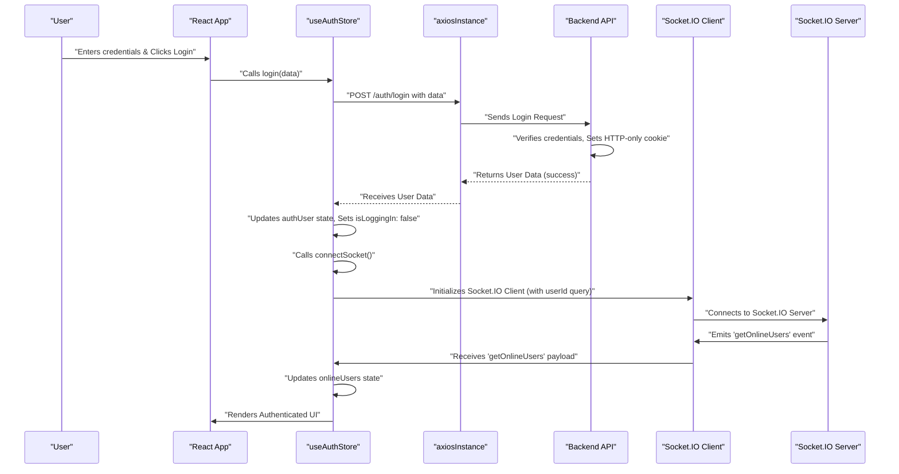

---
title: "Frontend State Management and Services"
description: "Details the Zustand-based state management, Axios-based API interactions, and other client-side utilities."
sidebar_position: 32
---

# Frontend State Management and Services

<TOC />

This section delves into the core client-side architecture for managing application state, handling API interactions, and implementing real-time features. We leverage **Zustand** for efficient and scalable state management, **Axios** for robust HTTP requests, and **Socket.IO** for real-time communication, ensuring a dynamic and responsive user experience.

## State Management with Zustand

Zustand is a small, fast, and scalable state management solution that uses simplified flux principles. It's particularly well-suited for React applications due to its hook-based API and minimal boilerplate. In this application, two primary Zustand stores manage most of the global state: `useAuthStore` and `useChatStore`.

### useAuthStore

The `useAuthStore` handles all authentication-related state and actions, including user data, login/signup processes, profile updates, and Socket.IO connection management.

**Key State Variables:**

*   `authUser`: Stores the currently authenticated user's data.
*   `isSigningUp`, `isLoggingIn`, `isUpdatingProfile`, `isCheckingAuth`: Boolean flags to manage loading states for various authentication operations.
*   `onlineUsers`: An array of user IDs currently online, received via Socket.IO.
*   `socket`: The active Socket.IO client instance.

**Core Actions:**

*   **`checkAuth()`**: Verifies the user's authentication status on application load.
*   **`signup(data)`**: Registers a new user.
*   **`login(data)`**: Authenticates an existing user.
*   **`logout()`**: Clears user session and disconnects from Socket.IO.
*   **`updateProfile(data)`**: Modifies the `authUser`'s profile information.
*   **`connectSocket()`**: Initializes and connects the Socket.IO client, passing the `authUser._id` as a query parameter. It also subscribes to the `getOnlineUsers` event.
*   **`disconnectSocket()`**: Disconnects the active Socket.IO client.

#### Example: `checkAuth` Implementation

The `checkAuth` function is crucial for maintaining user sessions across page loads. It makes a GET request to the `/auth/check` endpoint and, if successful, updates the `authUser` state and initiates the Socket.IO connection.

```javascript showLineNumbers {13-22}
// frontend/src/store/useAuthStore.js
import { create } from "zustand";
import { axiosInstance } from "../lib/axios";
import toast from "react-hot-toast";
import { io } from "socket.io-client";

const BASE_URL = import.meta.env.MODE == "development" ? "http://localhost:5001": "/";

export const useAuthStore = create((set, get) => ({
    authUser: null,
    // ... other state variables
    isCheckingAuth: true,
    // ... other state variables

    checkAuth: async () => {
        try {
            const res = await axiosInstance.get("/auth/check");
            set({ authUser: res.data });
            get().connectSocket(); // Connect socket if auth is successful
        } catch (error) {
            set({ authUser: null });
            console.log("Error in checkAuth: ", error);
        } finally {
            set({ isCheckingAuth: false });
        }
    },
    // ... other actions
}));
```
[View on GitHub](https://github.com/shinymack/Chat-App-MERN/blob/main/frontend/src/store/useAuthStore.js#L13-L27)

### useChatStore

The `useChatStore` manages all chat-related state, including messages, user lists (friends, pending requests), and actions related to sending/receiving messages and managing friendships.

**Key State Variables:**

*   `messages`: An array of messages for the currently selected chat.
*   `users`: A list of the authenticated user's friends.
*   `pendingRequests`: Friend requests received by the user.
*   `sentRequests`: Friend requests sent by the user.
*   `selectedUser`: The user currently selected for chatting.
*   `isUsersLoading`, `isMessagesLoading`: Loading states for fetching users and messages.
*   `isFriendBoxOpen`: Boolean to control the visibility of the friend management box.

**Core Actions:**

*   **`toggleFriendsBox()`**: Toggles the visibility of the friends management UI.
*   **`getFriends()`**: Fetches the list of the authenticated user's friends.
*   **`getPendingRequests()`**: Retrieves incoming friend requests.
*   **`getSentRequests()`**: Retrieves outgoing friend requests.
*   **`sendFriendRequest(identifier)`**: Sends a friend request to another user.
*   **`acceptFriendRequest(senderId)`**: Accepts a pending friend request.
*   **`rejectFriendRequest(senderId)`**: Rejects a pending friend request.
*   **`removeFriend(friendId)`**: Removes an existing friend.
*   **`getMessages(userId)`**: Fetches chat messages for a specific user.
*   **`sendMessage(messageData)`**: Sends a new message to the `selectedUser`.
*   **`subscribeToMessages()`**: Subscribes to `newMessage` Socket.IO events for the `selectedUser`.
*   **`unsubscribeFromMessages()`**: Unsubscribes from `newMessage` events.
*   **`setSelectedUser(user)`**: Sets the currently active chat partner.

#### Example: `sendMessage` and `subscribeToMessages`

Sending messages involves an API call via Axios, while receiving new messages in real-time for the active chat relies on Socket.IO. The `subscribeToMessages` action leverages the `socket` instance from `useAuthStore`.

```javascript showLineNumbers {13-20, 23-31}
// frontend/src/store/useChatStore.js
import toast from "react-hot-toast";
import { create } from "zustand";
import { axiosInstance } from "../lib/axios";
import { useAuthStore } from "./useAuthStore";

export const useChatStore = create((set, get) => ({
    messages:[],
    selectedUser: null,
    // ... other state variables and actions

    sendMessage: async (messageData) => {
        const {selectedUser, messages} = get();
        try {
            const res = await axiosInstance.post(`/messages/send/${selectedUser._id}`, messageData);
            set({messages : [...messages, res.data]});
        } catch (error){
            toast.error(error.response.data.message);
        }
    },

    subscribeToMessages: () => {
        const { selectedUser } = get();
        if(!selectedUser) return;

        const socket = useAuthStore.getState().socket; // Accessing socket from auth store
        socket.on("newMessage", (newMessage) => {
            if(newMessage.senderId !== selectedUser._id) return
            set({
                messages: [...get().messages, newMessage]
            })
        })
    },
    // ... other actions
}));
```
[View on GitHub](https://github.com/shinymack/Chat-App-MERN/blob/main/frontend/src/store/useChatStore.js#L107-L127)

## API Interactions with Axios

Axios is a promise-based HTTP client used throughout the frontend for making requests to the backend API. A custom `axiosInstance` is configured to handle base URLs and credentials automatically.

### `axiosInstance` Configuration

The `axiosInstance` is configured with a base URL that adapts between development (localhost) and production environments. It also includes `withCredentials: true` to ensure that cookies (like the JWT for authentication) are sent with every request, which is essential for session management.

```javascript showLineNumbers {3-6}
// frontend/src/lib/axios.js
import axios from "axios";

export const axiosInstance = axios.create({
    baseURL: import.meta.env.MODE == "development" ? "http://localhost:5001/api": "/api",
    withCredentials: true, // Crucial for sending authentication cookies
});
```
[View on GitHub](https://github.com/shinymack/Chat-App-MERN/blob/main/frontend/src/lib/axios.js#L3-L6)

## Client-Side Utilities

A `utils.js` file provides helper functions that enhance the user experience, such as message time formatting.

### `formatMessageTime`

This utility function takes a date object or string and formats it into a user-friendly local time string, including year, month, day, hour, and minute with AM/PM indicator.

```javascript showLineNumbers {1-10}
// frontend/src/lib/utils.js
export function formatMessageTime(date) {
    return new Date(date).toLocaleTimeString("en-US", {
        year: "numeric",
        month: "short",
        day:"2-digit",
        hour: "2-digit",
        minute: "2-digit",
        hour12: true,
    });
}
```
[View on GitHub](https://github.com/shinymack/Chat-App-MERN/blob/main/frontend/src/lib/utils.js#L1-L10)

## Frontend Architectural Overview

This diagram illustrates the primary components and their interactions within the frontend application, highlighting the roles of Zustand stores, Axios, and Socket.IO.


```mermaid
graph TD
    A["Frontend Application (React)"]
    B["useAuthStore (Zustand)"]
    C["useChatStore (Zustand)"]
    D["axiosInstance"]
    E["Socket.IO Client"]
    F["Backend API"]
    G["Socket.IO Server"]

    A -- "Uses" --> B
    A -- "Uses" --> C
    B -- "Authentication/User State" --> A
    C -- "Chat/Friend State" --> A

    B -- "Auth API Calls" --> D
    C -- "Chat/Friend API Calls" --> D
    D --> F["Backend API"]

    B -- "Connects/Manages" --> E
    E -- "Real-time Events" --> G["Socket.IO Server"]
    G -- "Push Updates" --> E
    E -- "Updates onlineUsers" --> B
    E -- "New Messages" --> C

    C -.-> B: "Accesses socket from auth store"
```


## Authentication Flow

This sequence diagram details the typical login process, from the user's action to the server's response and subsequent Socket.IO connection.





## Key Integration Points

*   **Zustand-Axios Synergy**: Both `useAuthStore` and `useChatStore` extensively use `axiosInstance` for all their backend communication. This centralizes API logic and ensures consistent credential handling. Error handling often involves `react-hot-toast` for user feedback.
*   **Zustand-Socket.IO Interaction**: `useAuthStore` is responsible for initializing and managing the primary `socket` connection. `useChatStore` then *accesses* this `socket` instance (via `useAuthStore.getState().socket`) to subscribe to chat-specific events like `newMessage`. This pattern ensures a single, managed Socket.IO connection throughout the application.
*   **Real-time Updates**: The `getOnlineUsers` event (managed by `useAuthStore`) provides a global list of online users, while `newMessage` events (managed by `useChatStore` for the `selectedUser`) drive real-time chat updates. Disconnection logic in `logout` ensures clean session termination.
*   **Modular Store Design**: Separating `useAuthStore` and `useChatStore` prevents monolithic state and promotes clear separation of concerns, even though they interact for real-time features. This modularity makes the application easier to understand, maintain, and extend.

Next: [Pages and Navigation](./3.3_pages-navigation.mdx)
```