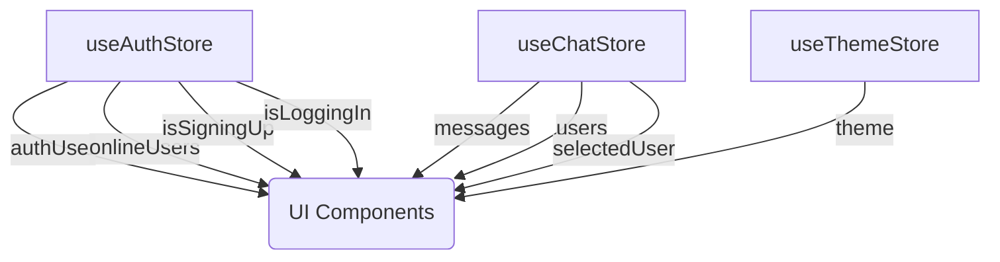

# Frontend State Management

<TOC />

## System Purpose

This document details the frontend state management system implemented using Zustand, a small, fast, and scalable state-management solution.  The system manages application state across various components, including authentication, chat functionalities, and theme preferences.  This approach promotes maintainability, code reusability, and a more predictable application behavior.


### Key Features

* **Centralized State:**  Zustand provides a single source of truth for application-wide state, eliminating the need for prop drilling and simplifying data flow.
* **Asynchronous Actions:** The state management handles asynchronous operations (API calls) seamlessly, updating the UI accordingly during loading, success, and error states.
* **Modular Design:** State is logically divided into separate stores (`useAuthStore`, `useChatStore`, `useThemeStore`), enhancing organization and facilitating independent development and testing.
* **Real-time Updates (via Socket.IO):**  The `useAuthStore` integrates with Socket.IO to manage real-time updates for online users and new chat messages.
* **Error Handling:** Robust error handling is integrated into all asynchronous actions, displaying user-friendly error messages via `react-hot-toast`.
* **Local Storage for Theme:** The theme preference is persisted using `localStorage`, ensuring consistency across user sessions.


## Architecture

The frontend state management architecture is built on three core Zustand stores:





This diagram illustrates how each Zustand store (`useAuthStore`, `useChatStore`, `useThemeStore`) provides data to UI components.


##  `useAuthStore.js` [frontend/src/store/useAuthStore.js](https://github.com/shinymack/Chat-App-MERN/blob/main/frontend/src/store/useAuthStore.js)

This store manages the authentication state, including user information, login/signup status, and socket connection.

### Key Code Snippet: Authentication Functions

```javascript
    signup: async (data) => {
        set({ isSigningUp: true });
        try {
            const res = await axiosInstance.post("/auth/signup", data);
            set({ authUser: res.data });
            toast.success("Account created successfully");
            get().connectSocket();
        } catch (error) {
            toast.error(error.response.data.message);
        } finally {
            set({ isSigningUp: false });
        }
    },

    login: async (data) => {
        set({ isLoggingIn: true });
        try {
            const res = await axiosInstance.post("/auth/login", data);
            set({ authUser: res.data });
            get().connectSocket();
            toast.success("Logged in successfully");
        } catch (error) {
            toast.error(error.response.data.message);
        } finally {
            set({ isLoggingIn: false });
        }
    },
```

This snippet shows the `signup` and `login` functions.  Both use `axiosInstance` to interact with the backend API, update the `authUser` state, and display success/error messages using `react-hot-toast`. The `finally` block ensures that the loading indicators (`isSigningUp`, `isLoggingIn`) are reset regardless of success or failure.


### Key Code Snippet: Socket.IO Integration

```javascript
    connectSocket: () => {
        const { authUser } = get();
        if(!authUser || get().socket?.connected) return;

        const socket = io(BASE_URL, {
            query: {
                userId : authUser._id,
            },
        });
        socket.connect();
        set({socket: socket});

        socket.on("getOnlineUsers", (userIds) => {
            set({onlineUsers: userIds})
        }); 

    },
```
This code establishes a Socket.IO connection to the backend.  The `userId` is passed as a query parameter for identification. The `getOnlineUsers` event handler updates the `onlineUsers` state with the list received from the server.  The function avoids redundant connections and only connects if the user is authenticated and a connection doesn't already exist.


## `useChatStore.js` [frontend/src/store/useChatStore.js](https://github.com/shinymack/Chat-App-MERN/blob/main/frontend/src/store/useChatStore.js)

This store manages chat-related data, including messages, users, friend requests, and the currently selected user.

### Key Code Snippet: Friend Request Handling

```javascript
    sendFriendRequest: async (identifier) => {
        try {
            const res = await axiosInstance.post("/friends/request/send", { identifier });
            toast.success(res.data.message);
            get().getSentRequests();
        } catch (error) {
            toast.error(error.response?.data?.message || "Failed to send request");
        }
    },
```

This snippet demonstrates the `sendFriendRequest` function. After sending the request, it refreshes the `sentRequests` list using `get().getSentRequests()`.


### Key Code Snippet: Message Handling

```javascript
    sendMessage: async (messageData) => {
        const {selectedUser, messages} = get();
        try {
            const res = await axiosInstance.post(`/messages/send/${selectedUser._id}`, messageData);
            set({messages : [...messages, res.data]});
        } catch (error){
            toast.error(error.response.data.message);
        }

    },
```

This shows how messages are sent.  The function uses the `selectedUser` to determine the recipient, updates the `messages` state locally after successfully sending the message, and handles any errors.


## `useThemeStore.js` [frontend/src/store/useThemeStore.js](https://github.com/shinymack/Chat-App-MERN/blob/main/frontend/src/store/useThemeStore.js)


This simple store manages the application theme, persisting the selection in `localStorage`.


## Key Integration Points and Insights

* **Data Flow:** The stores interact primarily through the UI components.  `useAuthStore` provides authentication status and user data, `useChatStore` manages chat-related data, and `useThemeStore` determines the UI theme.
* **Asynchronous Operations:** All API calls are handled asynchronously to prevent UI blocking and to provide feedback to the user (loading indicators, success/error messages).
* **Error Handling:** Consistent error handling across all stores ensures a user-friendly experience even during API failures.
* **Separation of Concerns:**  The modular design separates concerns effectively, leading to cleaner, more maintainable code.


Next: [Deployment and Setup](./4_deployment.mdx)