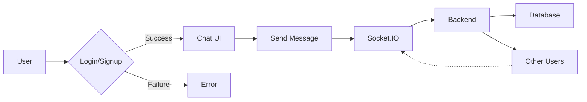

# Frontend State Management

<TOC />

## System Purpose

The frontend utilizes Zustand, a small, fast, and scalable state-management solution, to manage application state across different components.  Key functionalities managed include:

* **User Authentication:**  Handles user signup, login, logout, and profile updates ([`useAuthStore.js`](https://github.com/YOUR_GITHUB_USERNAME/YOUR_REPO_NAME/blob/main/frontend/src/store/useAuthStore.js)).
* **Chat Data:** Manages real-time chat messages, user lists, friend requests, and the currently selected user for conversation ([`useChatStore.js`](https://github.com/YOUR_GITHUB_USERNAME/YOUR_REPO_NAME/blob/main/frontend/src/store/useChatStore.js)).
* **Theme Management:** Allows users to switch between dark and light themes, persisting the selection using local storage ([`useThemeStore.js`](https://github.com/YOUR_GITHUB_USERNAME/YOUR_REPO_NAME/blob/main/frontend/src/store/useThemeStore.js)).

## System Architecture Overview

The frontend employs a client-side architecture where the Zustand stores manage the application's state.  These stores interact with the backend API for data fetching and updates, and use Socket.IO for real-time communication.  The communication flow is as follows:


```mermaid
graph TD
    A[Frontend (React)] -->|API Calls| B(Backend (Node.js/Express))
    B -->|Database Queries| C{MongoDB}
    A -->|Real-time Communication| D(Socket.IO)
    A -.-> E[Zustand Stores]
    E --> A
```


## Technology Stack

| Layer          | Technology         | Version (Example) | Purpose                                          |
|-----------------|---------------------|--------------------|------------------------------------------------------|
| Frontend        | React               | 18.2.0             | User interface                                      |
| State Management | Zustand             | 4.x                | Component state management                         |
| API Interaction | Axios               | 1.4.0              | HTTP requests to the backend                       |
| UI Feedback    | react-hot-toast    | 2.4.1              | User feedback (toasts)                              |
| Real-time      | Socket.IO-client    | 4.x                | Real-time communication with the backend             |


```json
{
  "dependencies": {
    "zustand": "^4.3.7",
    "axios": "^1.4.0",
    "react-hot-toast": "^2.4.1",
    "socket.io-client": "^4.7.1"
  }
}
```

## Core Application Features

**Authentication:**

* **Signup:** Allows new users to create accounts, using a POST request to `/auth/signup`.
* **Login:** Enables existing users to log in using a POST request to `/auth/login`.
* **Logout:** Logs out the current user, performing a POST request to `/auth/logout` and clearing the authentication state.
* **Profile Update:** Lets users update their profile information via a PUT request to `/auth/update-profile`.

```jsx
// useAuthStore.js (Signup excerpt)
signup: async (data) => {
    set({ isSigningUp: true });
    try {
        const res = await axiosInstance.post("/auth/signup", data);
        set({ authUser: res.data });
        toast.success("Account created successfully");
        get().connectSocket();
    } catch (error) {
        toast.error(error.response.data.message);
    } finally {
        set({ isSigningUp: false });
    }
},
```
[`useAuthStore.js#L28-L41`](https://github.com/YOUR_GITHUB_USERNAME/YOUR_REPO_NAME/blob/main/frontend/src/store/useAuthStore.js#L28-L41)

**Chatting:**

* **Real-time Messaging:** Uses Socket.IO for real-time message delivery and updates.
* **Friend Management:** Allows users to send, accept, reject, and remove friend requests.
* **Message History:** Fetches and displays message history between users.

```jsx
// useChatStore.js (sendMessage excerpt)
sendMessage: async (messageData) => {
    const {selectedUser, messages} = get();
    try {
        const res = await axiosInstance.post(`/messages/send/${selectedUser._id}`, messageData);
        set({messages : [...messages, res.data]});
    } catch (error){
        toast.error(error.response.data.message);
    }
},
```
[`useChatStore.js#L145-L154`](https://github.com/YOUR_GITHUB_USERNAME/YOUR_REPO_NAME/blob/main/frontend/src/store/useChatStore.js#L145-L154)

**Theme Switching:**

* **Persistent Theme:** Stores the selected theme in local storage for persistence across sessions.
* **Easy Toggle:** Provides a simple function to switch between themes.


```jsx
// useThemeStore.js
setTheme: (theme) => {
    localStorage.setItem("chat-theme", theme);
    set({theme});
}
```
[`useThemeStore.js#L5-L8`](https://github.com/YOUR_GITHUB_USERNAME/YOUR_REPO_NAME/blob/main/frontend/src/store/useThemeStore.js#L5-L8)





## Project Structure

```
frontend/
├── src/
│   ├── store/
│   │   ├── useAuthStore.js
│   │   ├── useChatStore.js
│   │   └── useThemeStore.js
│   ├── lib/
│   │   └── axios.js
│   └── ...
└── ...
```


## Key Integration Points

The frontend seamlessly integrates with the backend API via Axios for data persistence and Socket.IO for real-time communication.  Authentication is handled using JWTs, ensuring secure access to protected resources.  Zustand's efficient state management allows for smooth updates across components.  The use of `react-hot-toast` provides a good user experience by presenting feedback in an intuitive and user-friendly manner.  The system is designed for scalability due to the use of Socket.IO for real-time interactions, which offloads much of the load management to the Socket.IO server. The separation of concerns via Zustand stores keeps the application manageable and maintainable as it scales.

Next: [Deployment and Setup](./4_deployment_setup.mdx)