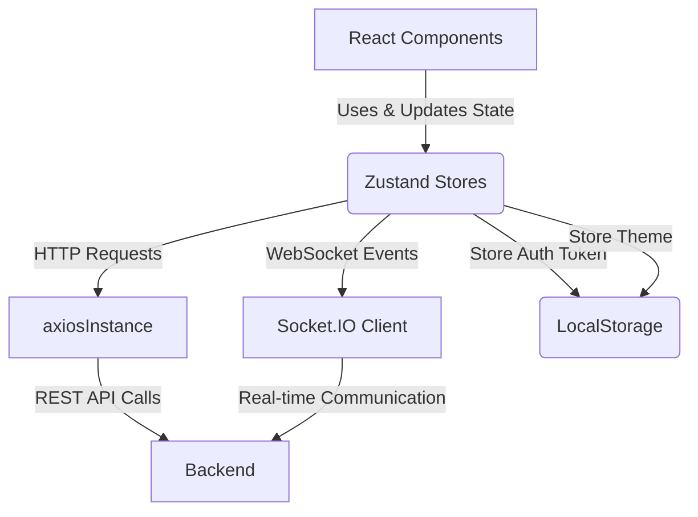

```mdx
---
title: "Frontend State Management"
description: "Describes how application-wide state, including user and chat data, is managed using Zustand."
sidebar_position: 32
---

# Frontend State Management
<TOC />

## Core State Management with Zustand
The frontend application leverages Zustand, a fast and lightweight state management library, to manage global application state. This includes authentication status, user information, chat messages, and UI-related states like theme preferences and modal visibility. Zustand stores are designed to be simple and highly performant, providing a reactive way to update and consume state across React components without the overhead of larger alternatives.

### Authentication and User State
The `useAuthStore` manages all authentication-related state and actions. This includes storing the authenticated user's data, handling login, signup, logout processes, profile updates, and managing the WebSocket connection for real-time features. It also tracks loading states for various authentication operations and maintains a list of `onlineUsers`.

**Features:**
*   **User Authentication:** Handles `signup`, `login`, and `logout` operations, persisting user data upon successful authentication.
*   **Profile Management:** Facilitates `updateProfile` functionality, allowing users to modify their personal information.
*   **Authentication Check:** `checkAuth` verifies the user's authentication status on application load.
*   **Real-time Connectivity:** Manages `connectSocket` and `disconnectSocket` for WebSocket interactions, enabling real-time features like `onlineUsers` tracking.
*   **Loading Indicators:** Provides `isSigningUp`, `isLoggingIn`, `isUpdatingProfile`, and `isCheckingAuth` flags for UI feedback.
*   **Online Users:** Tracks `onlineUsers` received from the WebSocket server.

**Relevant Files:**
*   [frontend/src/store/useAuthStore.js](https://github.com/shinymack/Chat-App-MERN/blob/main/frontend/src/store/useAuthStore.js)

### Chat and Friends State
The `useChatStore` centralizes all state and logic related to messaging and friend management. This includes lists of friends, pending requests, sent requests, current messages for a selected conversation, and loading indicators for fetching data. It also handles actions like sending friend requests, accepting/rejecting requests, removing friends, fetching messages, and sending new messages.

**Features:**
*   **Conversation Management:** Stores `messages` for the currently selected user and facilitates fetching (`getMessages`) and sending (`sendMessage`) messages.
*   **User Selection:** Manages `selectedUser` to indicate the active chat partner.
*   **Friends List:** Maintains `users` (friends list) and provides `getFriends` to fetch them.
*   **Friend Request Management:** Tracks `pendingRequests` and `sentRequests`, with actions to `sendFriendRequest`, `acceptFriendRequest`, `rejectFriendRequest`, and `removeFriend`.
*   **Loading Indicators:** `isUsersLoading` and `isMessagesLoading` provide feedback during data fetching.
*   **UI Toggles:** `isFriendBoxOpen` controls the visibility of the friend management UI.
*   **Real-time Message Subscription:** `subscribeToMessages` and `unsubscribeFromMessages` handle listening for new messages via Socket.IO.

**Relevant Files:**
*   [frontend/src/store/useChatStore.js](https://github.com/shinymack/Chat-App-MERN/blob/main/frontend/src/store/useChatStore.js)

### Theme Management
The `useThemeStore` is a simple Zustand store dedicated to managing the application's theme (e.g., 'dark' or 'light'). It persists the selected theme to `localStorage` to ensure consistency across sessions.

**Features:**
*   **Theme Storage:** Stores the `theme` preference, initialized from `localStorage`.
*   **Theme Setter:** `setTheme` updates the current theme and saves it to `localStorage`.

**Relevant Files:**
*   [frontend/src/store/useThemeStore.js](https://github.com/shinymack/Chat-App-MERN/blob/main/frontend/src/store/useThemeStore.js)

## Frontend State Architecture Overview
The frontend state is organized around distinct concerns, using Zustand to create modular and reusable stores. These stores interact with the backend via `axiosInstance` for RESTful API calls and `socket.io-client` for real-time communication.





## Technology Stack
The frontend state management heavily relies on Zustand for state orchestration and integrates with `axios` for HTTP requests and `socket.io-client` for real-time updates.

| Layer                   | Technology      | Purpose                                            |
| :---------------------- | :-------------- | :------------------------------------------------- |
| State Management        | Zustand         | Centralized, lightweight, and reactive state management |
| HTTP Client             | Axios           | Promise-based HTTP client for API interactions     |
| Real-time Communication | Socket.IO Client| Bidirectional communication for live updates       |
| Notifications           | React Hot Toast | User-friendly toast notifications                  |

### Zustand Store Creation
Zustand stores are created using the `create` function, defining the initial state and actions that modify it. Actions can be synchronous or asynchronous.

```jsx
import { create } from "zustand";
import { axiosInstance } from "../lib/axios";
import toast from "react-hot-toast";
import { io } from "socket.io-client";

const BASE_URL = import.meta.env.MODE == "development" ? "http://localhost:5001": "/";

export const useAuthStore = create((set, get) => ({
    authUser: null,
    isSigningUp: false,
    isLoggingIn: false,
    isUpdatingProfile: false,
    isCheckingAuth: true,
    onlineUsers: [],
    socket: null,

    checkAuth: async () => {
        try {
            const res = await axiosInstance.get("/auth/check");
            set({ authUser: res.data });
            get().connectSocket();
        } catch (error) {
            set({ authUser: null });
            console.log("Error in checkAuth: ", error);
        } finally {
            set({ isCheckingAuth: false });
        }
    },
    // ... other actions
}));
```
[frontend/src/store/useAuthStore.js#L1-L32](https://github.com/shinymack/Chat-App-MERN/blob/main/frontend/src/store/useAuthStore.js#L1-L32)

### Real-time Message Subscription
The `useChatStore` includes methods to subscribe and unsubscribe from real-time message events via Socket.IO. This ensures that the chat UI updates immediately when a new message is received for the currently selected conversation.

```jsx
// From useChatStore.js
export const useChatStore = create((set, get) => ({
    // ... other state and actions
    subscribeToMessages: () => {
        const { selectedUser } = get();
        if(!selectedUser) return;
        
        const socket = useAuthStore.getState().socket; // Access socket from auth store
        socket.on("newMessage", (newMessage) => {
            if(newMessage.senderId !== selectedUser._id) return
            set({
                messages: [...get().messages, newMessage]
            })
        })
    },

    unsubscribeFromMessages: () => {
        const socket = useAuthStore.getState().socket;
        socket.off("newMessage");
    },
    
    setSelectedUser: (selectedUser) => set({selectedUser})

}))
```
[frontend/src/store/useChatStore.js#L125-L144](https://github.com/shinymack/Chat-App-MERN/blob/main/frontend/src/store/useChatStore.js#L125-L144)

## Core Application Features: State Flow
The state management design facilitates various core features, from user authentication to real-time chat interactions. The interaction between different stores ensures a cohesive user experience.


```mermaid
flowchart LR
    User -->|Initiates Action| Component[React Component]
    Component -->|Calls Action| AuthStore[useAuthStore]
    AuthStore -->|API Request (Axios)| Backend[Backend API]
    Backend -->|Response| AuthStore
    AuthStore -->|Updates authUser & Socket State| Component
    Component -->|Selects User| ChatStore[useChatStore]
    ChatStore -->|Fetches Messages| Backend
    ChatStore -->|Subscribes to Socket| AuthStoreSocket[useAuthStore.socket]
    AuthStoreSocket -->|Receives newMessage event| ChatStore
    ChatStore -->|Updates messages state| Component
    Component -->|Renders Chat UI| ChatUI((Chat Display))
```


## Key Integration Points
The state management architecture is crucial for connecting various parts of the application:

*   **Authentication Flow:** The `useAuthStore` manages the entire authentication lifecycle. Upon successful login or signup, it not only sets the `authUser` but also initiates the WebSocket connection via `connectSocket`. This is a critical integration point, as real-time features depend on an authenticated and connected user.
*   **API Interaction:** Both `useAuthStore` and `useChatStore` extensively use `axiosInstance` for making HTTP requests to the backend. This ensures a consistent approach to data fetching and mutations, leveraging Axios's interceptors for error handling and potential token management (though not shown in snippets, often a best practice).
*   **Real-time Messaging:** The `useAuthStore` establishes and manages the core Socket.IO connection. The `useChatStore` then subscribes to specific events (`newMessage`) on this shared socket instance to receive real-time updates for conversations. This demonstrates a clear separation of concerns: `useAuthStore` owns the socket, while `useChatStore` consumes its events for chat-specific functionality.
*   **Data Consistency:** Actions within the stores (e.g., `acceptFriendRequest` in `useChatStore`) often trigger cascading updates to maintain data consistency. For instance, accepting a request refreshes both the `friends` list and `pendingRequests`, ensuring the UI reflects the latest state.
*   **UI Feedback:** The `is...Loading` flags in both stores are vital for providing immediate feedback to the user, improving the perceived performance and usability of the application during asynchronous operations.
*   **Local Storage for Persistence:** `useThemeStore` utilizes `localStorage` to persist the user's theme preference, demonstrating a simple yet effective way to maintain UI settings across sessions without backend involvement.

**Best Practices and Insights:**
*   **Separation of Concerns:** Each Zustand store focuses on a distinct domain (auth, chat, theme), promoting modularity and maintainability.
*   **Single Source of Truth:** Zustand stores act as a single source of truth for their respective domains, simplifying state management logic.
*   **Asynchronous Actions:** All API interactions are handled asynchronously within store actions, managing loading states and error notifications effectively with `react-hot-toast`.
*   **Optimistic UI Updates (Potential):** While not explicitly shown for all actions, a common best practice with Zustand and API calls is optimistic UI updates, where the UI is updated immediately, and a rollback occurs only if the API call fails. This can significantly improve user experience.
*   **Context for Socket:** The `useAuthStore` serving as the central point for the Socket.IO instance, which is then accessed by other stores (like `useChatStore` using `useAuthStore.getState().socket`), is an effective pattern for managing a single global real-time connection.

Next: [Frontend Pages & Routes](./3.3_frontend_pages_routes.mdx)
```