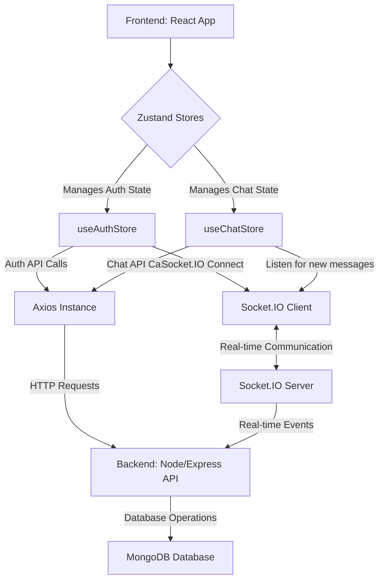

```mdx
---
title: "State Management & Routing"
description: "Explains how global state is managed using Zustand and how different pages are routed."
sidebar_position: 32
---

# State Management & Routing
<TOC />

## Global State Management with Zustand

The application employs [Zustand](https://zustand.pm/) for efficient and scalable global state management. Zustand is a lightweight, fast, and simple state management solution that leverages React hooks, providing a straightforward API for creating and consuming stores. This design choice promotes a clear separation of concerns, allowing UI components to remain focused on rendering while state logic is centralized and testable.

Two primary Zustand stores, `useAuthStore` and `useChatStore`, manage distinct parts of the application's global state:

*   **`useAuthStore.js`**: Manages all authentication-related state, including the authenticated user (`authUser`), loading states for various auth operations (`isSigningUp`, `isLoggingIn`, `isUpdatingProfile`, `isCheckingAuth`), a list of `onlineUsers`, and the [Socket.IO](https://socket.io/) client instance. It encapsulates methods for `signup`, `login`, `logout`, `updateProfile`, `checkAuth`, and `connectSocket`/`disconnectSocket` to manage real-time connections.
    *   [View `useAuthStore.js` on GitHub](https://github.com/shinymack/Chat-App-MERN/blob/main/frontend/src/store/useAuthStore.js)
*   **`useChatStore.js`**: Handles all chat and friend-related state. This includes `messages` for the currently selected chat, `users` (friends list), `pendingRequests`, `sentRequests`, and the `selectedUser` for conversation. It provides actions for `getFriends`, `getPendingRequests`, `getSentRequests`, `sendFriendRequest`, `acceptFriendRequest`, `rejectFriendRequest`, `removeFriend`, `getMessages`, `sendMessage`, and `setSelectedUser`. It also integrates with Socket.IO for real-time message updates.
    *   [View `useChatStore.js` on GitHub](https://github.com/shinymack/Chat-App-MERN/blob/main/frontend/src/store/useChatStore.js)

This modular approach ensures that each part of the application's state is managed independently, leading to a more maintainable and predictable codebase.

## Application Routing and Page Structure

The application's navigation is handled through `react-router-dom` (inferred from `Link` component usage in `LoginPage.jsx`), enabling a Single Page Application (SPA) experience. Pages are rendered conditionally or via routes, creating distinct views for authentication and core chat functionalities.

### Key Pages:

*   **`LoginPage.jsx`**: This component serves as the entry point for users to authenticate. It manages local form state for email and password, integrates with `useAuthStore` to perform login operations, and provides options for traditional email/password login as well as Google OAuth. It also includes navigation to the signup page.
    *   [View `LoginPage.jsx` on GitHub](https://github.com/shinymack/Chat-App-MERN/blob/main/frontend/src/pages/LoginPage.jsx)
*   **`HomePage.jsx`**: The main interface for authenticated users. It dynamically renders different components based on the global state managed by `useChatStore`, specifically the `selectedUser` and `isFriendsBoxOpen` states. This allows for a responsive UI that adapts to the user's current interaction (e.g., viewing a chat, seeing a list of friends, or a "no chat selected" prompt).
    *   [View `HomePage.jsx` on GitHub](https://github.com/shinymack/Chat-App-MERN/blob/main/frontend/src/pages/HomePage.jsx)

The interplay between global state and page rendering is crucial. For instance, after a successful login via `LoginPage`, the `useAuthStore` updates `authUser`, which then triggers a redirect to `HomePage`. On the `HomePage`, the presence of a `selectedUser` from `useChatStore` determines whether the `ChatContainer` or `NoChatSelected` component is displayed, providing a seamless user experience.

### System Architecture Overview

The application follows a typical client-server architecture with a clear separation of frontend, backend, and database layers, augmented with real-time capabilities.





## Technology Stack

The state management and routing functionalities are built upon a robust set of modern JavaScript technologies:

| Layer              | Technology       | Purpose                                                    | Relevant Files                                                                       |
| :----------------- | :--------------- | :--------------------------------------------------------- | :----------------------------------------------------------------------------------- |
| **State Management** | Zustand          | Lightweight, performant global state management for React. | [useAuthStore.js](https://github.com/shinymack/Chat-App-MERN/blob/main/frontend/src/store/useAuthStore.js), [useChatStore.js](https://github.com/shinymack/Chat-App-MERN/blob/main/frontend/src/store/useChatStore.js) |
| **Routing**        | React Router DOM | Declarative routing for React applications.                | [LoginPage.jsx](https://github.com/shinymack/Chat-App-MERN/blob/main/frontend/src/pages/LoginPage.jsx#L88) (implicit in `Link`)                                         |
| **API Client**     | Axios            | Promise-based HTTP client for making API requests.         | [useAuthStore.js](https://github.com/shinymack/Chat-App-MERN/blob/main/frontend/src/store/useAuthStore.js#L14), [useChatStore.js](https://github.com/shinymack/Chat-App-MERN/blob/main/frontend/src/store/useChatStore.js#L12) |
| **Real-time Comm.**| Socket.IO Client | Enables real-time, bidirectional event-based communication. | [useAuthStore.js](https://github.com/shinymack/Chat-App-MERN/blob/main/frontend/src/store/useAuthStore.js#L106)                                      |
| **UI Framework**   | React            | Declarative JavaScript library for building user interfaces. | [HomePage.jsx](https://github.com/shinymack/Chat-App-MERN/blob/main/frontend/src/pages/HomePage.jsx), [LoginPage.jsx](https://github.com/shinymack/Chat-App-MERN/blob/main/frontend/src/pages/LoginPage.jsx) |
| **Notifications**  | React Hot Toast  | Lightweight and customizable toast notifications.          | [useAuthStore.js](https://github.com/shinymack/Chat-App-MERN/blob/main/frontend/src/store/useAuthStore.js#L10), [useChatStore.js](https://github.com/shinymack/Chat-App-MERN/blob/main/frontend/src/store/useChatStore.js#L2) |

### Zustand Store Creation

Zustand stores are created using the `create` function, accepting a callback that returns the initial state and actions. This snippet from `useAuthStore.js` illustrates the fundamental structure:

```jsx
// frontend/src/store/useAuthStore.js
import { create } from "zustand";
import { axiosInstance } from "../lib/axios";
import toast from "react-hot-toast";
import { io } from "socket.io-client";

const BASE_URL = import.meta.env.MODE == "development" ? "http://localhost:5001": "/";

export const useAuthStore = create((set, get) => ({
    authUser: null,
    isSigningUp: false,
    isLoggingIn: false,
    isUpdatingProfile: false,
    isCheckingAuth: true,
    onlineUsers: [],
    socket: null,

    checkAuth: async () => { /* ... */ },
    signup: async (data) => { /* ... */ },
    logout: async () => { /* ... */ },
    login: async (data) => { /* ... */ },
    updateProfile: async (data) => { /* ... */ },
    connectSocket: () => { /* ... */ },
    disconnectSocket : () => { /* ... */ }
}));
```
[View `useAuthStore.js#L7-L30` on GitHub](https://github.com/shinymack/Chat-App-MERN/blob/main/frontend/src/store/useAuthStore.js#L7-L30)
This setup allows defining state variables (e.g., `authUser`, `isLoggingIn`) and actions (e.g., `checkAuth`, `login`) within a single, coherent object, making them easily accessible throughout the application.

## Core Application Features and State Interactions

### User Authentication and Session Management

Authentication is a critical feature, managed primarily through `LoginPage.jsx` and `useAuthStore.js`.

*   **Login Process**:
    *   `LoginPage.jsx` captures user credentials (email, password) using local `useState` for form fields.
    *   Upon form submission, the `handleSubmit` function calls the `login` action from `useAuthStore`.
    *   The `login` action makes an asynchronous POST request to the backend `/api/auth/login` endpoint via `axiosInstance`.
    *   State variables like `isLoggingIn` are used to provide UI feedback (e.g., a loading spinner on the button).
    *   On successful login, `useAuthStore` updates `authUser` with the user's data and initiates a Socket.IO connection.
    *   Error messages from the backend are displayed using `react-hot-toast`.
    *   Google OAuth is also provided, redirecting to a backend endpoint for external authentication.

```jsx
// frontend/src/pages/LoginPage.jsx
const LoginPage = () => {
  const [showPassword, setShowPassword] = useState(false);
  const [formData, setFormData] = useState({
    email: "",
    password: "",
  })
  const { login, isLoggingIn } = useAuthStore(); // Accessing Zustand store actions and state

  const handleSubmit = async (e) => {
    e.preventDefault();
    login(formData); // Calling the login action
  }
  const backendDomain = import.meta.env.VITE_BACKEND_URL;
  const googleAuthUrl = `${backendDomain}/api/auth/google`;
  return (
    <div className="h-screen grid lg:grid-cols-2">
      {/* ... form elements ... */}
      <form onSubmit={handleSubmit} className="space-y-6">
        {/* ... email and password inputs ... */}
        <button type="submit" className="btn btn-primary w-full" disabled={isLoggingIn}>
          {isLoggingIn ? (
            <>
              <Loader2 className="h-5 w-5 animate-spin" />
              Loading...
            </>
          ) : (
            "Sign in"
          )}
        </button>
      </form>
      <div className="divider text-base-content/60 my-4">OR</div>
      <a href={googleAuthUrl} className="btn btn-primary btn-outline w-full">
        <FcGoogle className="size-5 mr-2" />
        Sign in with Google
      </a>
      {/* ... signup link ... */}
    </div>
  )
}
```
[View `LoginPage.jsx#L13-L89` on GitHub](https://github.com/shinymack/Chat-App-MERN/blob/main/frontend/src/pages/LoginPage.jsx#L13-L89)

### Real-time Chat and User Presence

The application leverages Socket.IO for real-time communication, managed within `useAuthStore` for connection and `useChatStore` for message handling.

*   **Socket Connection**: Upon successful authentication (`login` or `checkAuth`), `useAuthStore` calls `connectSocket` to establish a persistent WebSocket connection with the backend. User ID is passed as a query parameter for identification.
*   **Online Users**: The Socket.IO server emits a `getOnlineUsers` event, which updates the `onlineUsers` state in `useAuthStore`, allowing the UI to display user presence.
*   **Message Exchange**:
    *   When a user selects a chat, `getMessages` (from `useChatStore`) fetches historical messages.
    *   `sendMessage` (from `useChatStore`) sends new messages to the backend.
    *   The `subscribeToMessages` action listens for `newMessage` events from the Socket.IO server. If the incoming message is from the currently selected user, it's appended to the `messages` array in `useChatStore`, instantly updating the chat UI.

```jsx
// frontend/src/store/useChatStore.js
// ... (imports)
export const useChatStore = create((set, get) => ({
    // ... (state variables)
    getMessages: async (userId) => {
        set({isMessagesLoading: true});
        try {
            const res = await axiosInstance.get(`/messages/${userId}`);
            set({messages: res.data});
        } catch (error) {
            toast.error(error.response.data.message);
        } finally {
            set({isMessagesLoading: false});
        }
    },
    sendMessage: async (messageData) => {
        const {selectedUser, messages} = get();
        try {
            const res = await axiosInstance.post(`/messages/send/${selectedUser._id}`, messageData);
            set({messages : [...messages, res.data]});
        } catch (error){
            toast.error(error.response.data.message);
        }
    },
    subscribeToMessages: () => {
        const { selectedUser } = get();
        if(!selectedUser) return;
        
        const socket = useAuthStore.getState().socket;
        socket.on("newMessage", (newMessage) => {
            if(newMessage.senderId !== selectedUser._id) return
            set({
                messages: [...get().messages, newMessage]
            })
        })
    },
    unsubscribeFromMessages: () => {
        const socket = useAuthStore.getState().socket;
        socket.off("newMessage");
    },
    setSelectedUser: (selectedUser) => set({selectedUser})
}));
```
[View `useChatStore.js#L95-L135` on GitHub](https://github.com/shinymack/Chat-App-MERN/blob/main/frontend/src/store/useChatStore.js#L95-L135)

### Dynamic UI Rendering on HomePage

`HomePage.jsx` demonstrates responsive UI rendering based on the global chat state:

```jsx
// frontend/src/pages/HomePage.jsx
import ChatContainer from "../components/ChatContainer";
import FriendsBox from "../components/FriendsBox";
import NoChatSelected from "../components/NoChatSelected";
import Sidebar from "../components/Sidebar";
import { useChatStore } from "../store/useChatStore"

const HomePage = () => {
  const { selectedUser } = useChatStore(); // Get selected user from chat store
  const { isFriendsBoxOpen } = useChatStore(); // Get friends box visibility state

  return (
      <div className="h-screen bg-base-200">
      <div className="flex items-center justify-center pt-20 px-4 w-full">
        <div className="bg-base-100 rounded-lg shadow-xl w-full max-w-6xl h-[calc(100vh-8rem)]">
          <div className="flex h-full rounded-lg overflow-hidden w-full">
            <Sidebar />
            {!selectedUser ? <NoChatSelected /> : <ChatContainer />} {/* Conditional rendering */}
            {isFriendsBoxOpen && <FriendsBox />} {/* Conditional rendering */}
          </div>
        </div>
      </div>
    </div>
  )
}

export default HomePage
```
[View `HomePage.jsx#L1-L29` on GitHub](https://github.com/shinymack/Chat-App-MERN/blob/main/frontend/src/pages/HomePage.jsx#L1-L29)
Here, the `ChatContainer` is rendered only if `selectedUser` is not null, otherwise `NoChatSelected` is shown. Similarly, `FriendsBox` appears based on `isFriendsBoxOpen`. This pattern ensures that the user interface is always relevant to the current application state.

### Feature Flow: Authentication to Chat Initiation


```mermaid
flowchart LR
    User[User] --> A{Enter Credentials/Google}
    A -->|Submits Form| B[LoginPage]
    B -->|Calls login(formData)| C[useAuthStore.login]
    C -->|POST /auth/login via Axios| D[Backend API]
    D -->|Authenticates & Returns User| C
    C -->|Set authUser & Call connectSocket()| E[useAuthStore]
    E -->|Connects to WS Server| F[Socket.IO Client]
    F <--> G[Socket.IO Server]
    E -->|Redirects to| H[HomePage]
    H -->|Renders Sidebar| I[Sidebar]
    I -->|Selects User| J[useChatStore.setSelectedUser]
    J -->|Updates selectedUser| K[HomePage]
    K -->|selectedUser not null| L[ChatContainer]
    L -->|Fetches Messages| M[useChatStore.getMessages]
    M -->|GET /messages/:userId via Axios| D
    D -->|Returns Messages| M
    M -->|Updates messages state| L
    L -->|Sends Message| N[useChatStore.sendMessage]
    N -->|POST /messages/send/:userId via Axios| D
    D -->|Emits 'newMessage' via Socket.IO| G
    G -->|Receives 'newMessage'| O[useChatStore.subscribeToMessages]
    O -->|Updates messages state| L
```


## Key Integration Points and Best Practices

*   **Separation of Concerns**: The use of Zustand stores (`useAuthStore`, `useChatStore`) effectively isolates state logic from UI components. This promotes cleaner code, easier testing, and more modular development, aligning with the principle of separation of concerns.
*   **Scalability with Real-time**: Integrating Socket.IO directly within `useAuthStore` for connection management and `useChatStore` for message subscription demonstrates a robust approach to handling real-time features. Centralizing socket management ensures that all components can react to real-time events, while efficient message updates prevent unnecessary re-renders.
*   **Robust Authentication Flow**: The authentication process integrates local state for form inputs with global state for authentication status (`isLoggingIn`, `authUser`). This provides immediate user feedback and a consistent global state across the application, combined with secure API calls using `axiosInstance` and environment variables (`import.meta.env.VITE_BACKEND_URL`).
*   **Dynamic UI**: The `HomePage` exemplifies how global state (`selectedUser`, `isFriendsBoxOpen`) can drive dynamic UI rendering, allowing the application to present relevant content without full page reloads. This enhances the user experience by making the interface feel more interactive and responsive.
*   **Consistent API Interaction**: All backend communication uses a configured `axiosInstance`, ensuring consistent headers, error handling, and base URLs. This pattern is crucial for maintaining a clean and manageable API layer.
*   **User Feedback**: The widespread use of `react-hot-toast` for displaying success or error messages provides immediate and clear feedback to the user, significantly improving usability.

Next: [Frontend Styling & Utilities](./3.3_frontend_styling_utils.mdx)
```