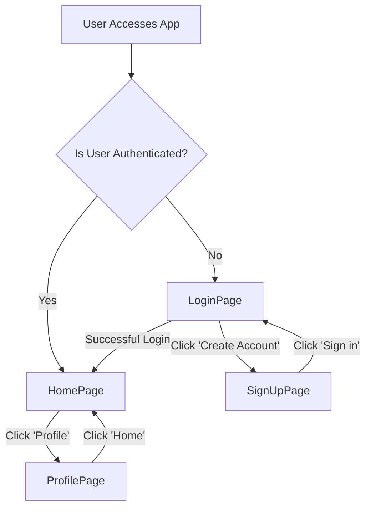
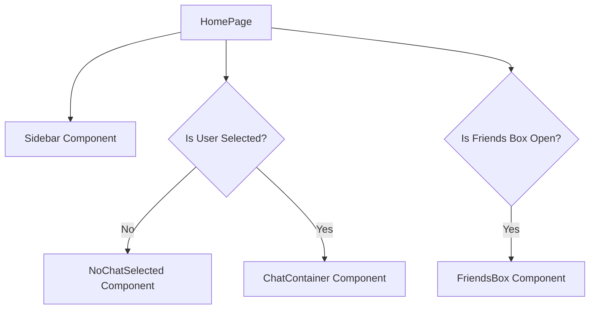

# Page Structure and Routing

<TOC />

This section details the primary pages of the application, how they are structured, and the mechanisms employed for navigation. The frontend of this application is built with React and utilizes `react-router-dom` for handling client-side routing.

## Core Application Pages

The application is structured around several key pages, each serving a distinct purpose:

*   **Login Page**: Handles user authentication and sign-in.
*   **Sign Up Page**: Facilitates new user registration.
*   **Home Page**: The main application interface, displaying chat functionality.
*   **Profile Page**: Allows users to view and manage their profile information.

These pages are located within the `frontend/src/pages/` directory.

### Routing Overview

The application's routing is managed by `react-router-dom`, providing a seamless single-page application experience. Navigation between pages is primarily handled through `<Link>` components for internal application routes and direct `window.location` changes for external authentication flows (e.g., Google OAuth).

Here's a high-level overview of the application's page flow:





## LoginPage (`frontend/src/pages/LoginPage.jsx`)

The `LoginPage` component is responsible for user authentication. It provides a form for users to enter their email and password, and also offers the option to sign in using Google OAuth.

**Key Features:**

*   **Form Submission**: Handles email/password authentication using `useAuthStore`.
*   **Google OAuth Integration**: Redirects users to the backend's Google authentication endpoint.
*   **Password Visibility Toggle**: Allows users to show/hide their password.
*   **Loading State**: Provides visual feedback during the login process.

```jsx title="frontend/src/pages/LoginPage.jsx - Form Submission and Google Auth" {30-33,63-70,111-115}
import { useState } from "react"
import { useAuthStore } from "../store/useAuthStore";
import { Eye, EyeOff, Loader2, Lock, Mail, MessageSquare } from "lucide-react";
import { Link } from "react-router-dom";
import AuthImagePattern from "../components/AuthImagePattern";
import { FcGoogle } from "react-icons/fc";

const LoginPage = () => {
  const [showPassword, setShowPassword] = useState(false);
  const [formData, setFormData] = useState({
    email: "",
    password: "",
  })
  const { login, isLoggingIn } = useAuthStore();

  const handleSubmit = async (e) => {
    e.preventDefault();
    login(formData);
  }
  const backendDomain = import.meta.env.VITE_BACKEND_URL;
  const googleAuthUrl = `${backendDomain}/api/auth/google`;
  return (
    <div className="h-screen grid lg:grid-cols-2">
      {/* Left Side - Form */}
      <div className="flex flex-col justify-center items-center p-6 sm:p-12">
        <div className="w-full max-w-md space-y-8">
          {/* Logo */}
          <div className="text-center mb-8">
            <div className="flex flex-col items-center gap-2 group">
              <div
                className="w-12 h-12 rounded-xl bg-primary/10 flex items-center justify-center group-hover:bg-primary/20
              transition-colors"
              >
                <MessageSquare className="w-6 h-6 text-primary" />
              </div>
              <h1 className="text-2xl font-bold mt-2">Welcome Back</h1>
              <p className="text-base-content/60">Sign in to your account</p>
            </div>
          </div>

          {/* Form */}
          <form onSubmit={handleSubmit} className="space-y-6">
            <div className="form-control">
              <label className="label">
                <span className="label-text font-medium">Email</span>
              </label>
              <div className="relative">
                <div className="absolute inset-y-0 left-0 pl-3 flex items-center pointer-events-none">
                  <Mail className="h-5 w-5 text opacity-40" />
                </div>
                <input
                  type="email"
                  className={`input input-bordered w-full pl-10`}
                  placeholder="you@example.com"
                  value={formData.email}
                  onChange={(e) => setFormData({ ...formData, email: e.target.value })}
                />
              </div>
            </div>

            <div className="form-control">
              <label className="label">
                <span className="label-text font-medium">Password</span>
              </label>
              <div className="relative">
                <div className="absolute inset-y-0 left-0 pl-3 flex items-center pointer-events-none">
                  <Lock className="h-5 w-5 text-base-content/40" />
                </div>
                <input
                  type={showPassword ? "text" : "password"}
                  className={`input input-bordered w-full pl-10`}
                  placeholder="••••••••"
                  value={formData.password}
                  onChange={(e) => setFormData({ ...formData, password: e.target.value })}
                />
                <button
                  type="button"
                  className="absolute inset-y-0 right-0 pr-3 flex items-center"
                  onClick={() => setShowPassword(!showPassword)}
                >
                  {showPassword ? (
                    <EyeOff className="h-5 w-5 text-base-content/40" />
                  ) : (
                    <Eye className="h-5 w-5 text-base-content/40" />
                  )}
                </button>
              </div>
            </div>

            <button type="submit" className="btn btn-primary w-full" disabled={isLoggingIn}>
              {isLoggingIn ? (
                <>
                  <Loader2 className="h-5 w-5 animate-spin" />
                  Loading...
                </>
              ) : (
                "Sign in"
              )}
            </button>
          </form>
          <div className="divider text-base-content/60 my-4">OR</div>

          <a
            href={googleAuthUrl} // Link to your backend Google auth route
            className="btn btn-primary btn-outline w-full"
          >
            <FcGoogle className="size-5 mr-2" />
            Sign in with Google
          </a>

          <div className="text-center">
            <p className="text-base-content/60">
              Don&apos;t have an account?{" "}
              <Link to="/signup" className="link link-primary">
                Create account
              </Link>
            </p>
          </div>
        </div>
      </div>

      {/* Right Side - Image/Pattern */}
      <AuthImagePattern
        title={"Welcome back!"}
        subtitle={"Sign in to continue your conversations and catch up with your messages."}
      />
    </div>
  )
}

export default LoginPage
```
<p align="right">
  [<a href="https://github.com/shinymack/Chat-App-MERN/blob/main/frontend/src/pages/LoginPage.jsx" target="_blank">View on GitHub</a>]
</p>

## SignUpPage (`frontend/src/pages/SignUpPage.jsx`)

The `SignUpPage` component allows new users to register an account. Similar to the login page, it includes a form for username, email, and password, alongside a Google OAuth option.

**Key Features:**

*   **User Registration Form**: Collects username, email, and password.
*   **Form Validation**: Client-side validation for input fields.
*   **Google OAuth**: Integration for signing up with Google.
*   **Loading State**: Indicates when a registration is in progress.

```jsx title="frontend/src/pages/SignUpPage.jsx - Form Validation and Submission" {20-29,32-35}
import { useState } from "react";
import { useAuthStore } from "../store/useAuthStore";
import { MessageSquare, User, Mail, Lock, EyeOff, Eye, Loader2 } from "lucide-react";
import { Link } from "react-router-dom";
import AuthImagePattern from "../components/AuthImagePattern";
import toast from "react-hot-toast";

import { FcGoogle } from "react-icons/fc";
const SignUpPage = () => {
  const [showPassword, setShowPassword] = useState(false);
  const [formData, setFormData] = useState({
    username: "",
    email: "",
    password: "",
  });

  const { signup, IsSigningUp } = useAuthStore();

  const validateForm = () => {
    if(!formData.username.trim()) return toast.error("Username is required");
    if(!formData.email.trim()) return toast.error("Email is required");
    if (!/\S+@\S+\.\S+/.test(formData.email)) return toast.error("Invalid email format");
    if (!formData.password) return toast.error("Password is required");
    if (formData.password.length < 6) return toast.error("Password must be at least 6 characters");

    return true;
  };

  const handleSubmit = (e) => {
    e.preventDefault();

    const success = validateForm();
    if(success===true) signup(formData);
  };
  
  const backendDomain = import.meta.env.VITE_BACKEND_URL;
  const googleAuthUrl = `${backendDomain}/api/auth/google`;
  return (
    <div className="min-h-screen grid lg:grid-cols-2">
      {/* left side */}
      <div className="flex flex-col justify-center items-center p-6 sm:p-12">
        <div className="w-full max-w-md space-y-8">
          {/* LOGO */}
          <div className="text-center mb-8">
            <div className="flex flex-col items-center gap-2 group">
              <div
                className="size-12 rounded-xl bg-primary/10 flex items-center justify-center 
              group-hover:bg-primary/20 transition-colors"
              >
                <MessageSquare className="size-6 text-primary" />
              </div>
              <h1 className="text-2xl font-bold mt-2">Create Account</h1>
              <p className="text-base-content/60">Get started with your free account</p>
            </div>
          </div>

          <form onSubmit={handleSubmit} className="space-y-6">
            <div className="form-control">
              <label className="label">
                <span className="label-text font-medium">Username</span>
              </label>
              <div className="relative">
                <div className="absolute inset-y-0 left-0 pl-3 flex items-center pointer-events-none">
                  <User className="size-5 text-base-content/40" />
                </div>
                <input
                  type="text"
                  className={`input input-bordered w-full pl-10`}
                  placeholder="johndoe"
                  value={formData.username}
                  onChange={(e) => setFormData({ ...formData, username: e.target.value })}
                />
              </div>
            </div>

            <div className="form-control">
              <label className="label">
                <span className="label-text font-medium">Email</span>
              </label>
              <div className="relative">
                <div className="absolute inset-y-0 left-0 pl-3 flex items-center pointer-events-none">
                  <Mail className="size-5 text-base-content/40" />
                </div>
                <input
                  type="email"
                  className={`input input-bordered w-full pl-10`}
                  placeholder="you@example.com"
                  value={formData.email}
                  onChange={(e) => setFormData({ ...formData, email: e.target.value })}
                />
              </div>
            </div>

            <div className="form-control">
              <label className="label">
                <span className="label-text font-medium">Password</span>
              </label>
              <div className="relative">
                <div className="absolute inset-y-0 left-0 pl-3 flex items-center pointer-events-none">
                  <Lock className="size-5 text-base-content/40" />
                </div>
                <input
                  type={showPassword ? "text" : "password"}
                  className={`input input-bordered w-full pl-10`}
                  placeholder="••••••••"
                  value={formData.password}
                  onChange={(e) => setFormData({ ...formData, password: e.target.value })}
                />
                <button
                  type="button"
                  className="absolute inset-y-0 right-0 pr-3 flex items-center"
                  onClick={() => setShowPassword(!showPassword)}
                >
                  {showPassword ? (
                    <EyeOff className="size-5 text-base-content/40" />
                  ) : (
                    <Eye className="size-5 text-base-content/40" />
                  )}
                </button>
              </div>
            </div>

            <button type="submit" className="btn btn-primary w-full" disabled={IsSigningUp}>
              {IsSigningUp ? (
                <>
                  <Loader2 className="size-5 animate-spin" />
                  Loading...
                </>
              ) : (
                "Create Account"
              )}
            </button>
          </form>
          <div className="divider text-base-content/60 my-4">OR</div>

          <a
            href={googleAuthUrl} // Link to your backend Google auth route
            className="btn btn-primary btn-outline w-full" 
          >
            <FcGoogle className="size-5 mr-2" /> 
            Sign up with Google
          </a>

          <div className="text-center">
            <p className="text-base-content/60">
              Already have an account?{" "}
              <Link to="/login" className="link link-primary">
                Sign in
              </Link>
            </p>
          </div>
        </div>
      </div>
      
      {/* right side */}

      <AuthImagePattern
        title="Join our community"
        subtitle="Connect with friends, share moments, and stay in touch with your loved ones."
      />
    </div>
  );
};
export default SignUpPage;
```
<p align="right">
  [<a href="https://github.com/shinymack/Chat-App-MERN/blob/main/frontend/src/pages/SignUpPage.jsx" target="_blank">View on GitHub</a>]
</p>

## HomePage (`frontend/src/pages/HomePage.jsx`)

The `HomePage` serves as the central hub for the chat application, displayed after a successful login. It dynamically renders different components based on the user's interaction, such as selecting a chat or opening the friends list.

**Key Features:**

*   **Dynamic Content Display**: Shows `NoChatSelected`, `ChatContainer`, or `FriendsBox` based on application state.
*   **Sidebar Integration**: Includes the main `Sidebar` for navigation and user actions.
*   **State Management Integration**: Uses `useChatStore` to determine which content to display.

```jsx title="frontend/src/pages/HomePage.jsx - Dynamic Content Rendering" {12-16}
// import React from 'react'

import ChatContainer from "../components/ChatContainer";
import FriendsBox from "../components/FriendsBox";
import NoChatSelected from "../components/NoChatSelected";
import Sidebar from "../components/Sidebar";
import { useChatStore } from "../store/useChatStore"

const HomePage = () => {
  const { selectedUser } = useChatStore();
  const { isFriendsBoxOpen } = useChatStore();
  return (
      <div className="h-screen bg-base-200">
      <div className="flex items-center justify-center pt-20 px-4 w-full">
        <div className="bg-base-100 rounded-lg shadow-xl w-full max-w-6xl h-[calc(100vh-8rem)]">
          <div className="flex h-full rounded-lg overflow-hidden w-full">
            <Sidebar />
            {!selectedUser ? <NoChatSelected /> : <ChatContainer />}
            {isFriendsBoxOpen && <FriendsBox />}

          </div>

        </div>
      </div>
    </div>
  )
}

export default HomePage
```
<p align="right">
  [<a href="https://github.com/shinymack/Chat-App-MERN/blob/main/frontend/src/pages/HomePage.jsx#L12-L16" target="_blank">View on GitHub (lines 12-16)</a>]
</p>

The internal structure of the `HomePage` demonstrates how different components collaborate to form the main chat interface:





## ProfilePage (`frontend/src/pages/ProfilePage.jsx`)

The `ProfilePage` allows authenticated users to view and update their personal information, such as their profile picture and username. It features editable fields and real-time validation for the username.

**Key Features:**

*   **Profile Picture Upload**: Users can update their profile image, which is then uploaded and saved.
*   **Editable Username**: Allows users to change their username with real-time availability checks.
*   **Account Details Display**: Shows static information like email, member since date, and account status.
*   **State Management**: Integrates with `useAuthStore` to fetch and update user data.

```jsx title="frontend/src/pages/ProfilePage.jsx - Username Editing Logic" {31-36,58-75,99-106}
import { useState, useEffect, useRef } from "react";
import { useAuthStore } from "../store/useAuthStore";
import { Camera, Mail, User, Edit, Save, X, Loader2 } from "lucide-react";
import toast from "react-hot-toast";
import { axiosInstance } from "../lib/axios"; // Assuming you have this configured instance

const ProfilePage = () => {
	const { authUser, isUpdatingProfile, updateProfile } = useAuthStore();
	const [selectedImg, setSelectedImg] = useState(null);

	const [isEditingUsername, setIsEditingUsername] = useState(false);
	const [newUsername, setNewUsername] = useState(authUser?.username || "");
	const [usernameStatus, setUsernameStatus] = useState({
		checking: false,
		available: true,
		message: "",
	});
	const debounceTimeout = useRef(null);


	const handleImageUpload = async (e) => {
		const file = e.target.files[0];
		if (!file) return;

		const reader = new FileReader();
		reader.readAsDataURL(file);

		reader.onload = async () => {
			const base64Image = reader.result;
			setSelectedImg(base64Image);
			// Let's call updateProfile from here
			await updateProfile({ profilePic: base64Image });
			// No need to call it again from the save button if you have one
		};
	};

	// --- Debounced Username Check ---
	useEffect(() => {
		// Clear any existing timer when newUsername changes
		clearTimeout(debounceTimeout.current);

		if (!newUsername.trim() || newUsername.trim().length < 3) {
			setUsernameStatus({ checking: false, available: false, message: "Must be 3+ characters." });
			return;
		}

		if (newUsername === authUser.username) {
			setUsernameStatus({ checking: false, available: true, message: "" });
			return;
		}

		setUsernameStatus((prev) => ({ ...prev, checking: true, message: "Checking..." }));

		debounceTimeout.current = setTimeout(async () => {
			try {
				const res = await axiosInstance.get(`/auth/username/check/${newUsername}`);
				setUsernameStatus({
					checking: false,
					available: res.data.available,
					message: res.data.message,
				});
			} catch (error) {
				const message = error.response?.data?.message || "Error checking username.";
				setUsernameStatus({ checking: false, available: false, message });
			}
		}, 500); // 500ms debounce delay

		// Cleanup function to clear timeout on component unmount
		return () => clearTimeout(debounceTimeout.current);
	}, [newUsername, authUser.username]);
	// ---------------------------------

	const handleSaveUsername = async () => {
		if (!usernameStatus.available || newUsername === authUser.username) {
			toast.error("Cannot save. Username is either unavailable or unchanged.");
			return;
		}
		await updateProfile({ username: newUsername });
		setIsEditingUsername(false); // Exit edit mode on success
	};

	const handleCancelEdit = () => {
		setIsEditingUsername(false);
		setNewUsername(authUser.username); // Reset to original username
		setUsernameStatus({ checking: false, available: true, message: "" }); // Reset status
	};

	return (
		<div className="h-screen pt-20">
			<div className="max-w-2xl mx-auto p-4 py-8">
				<div className="bg-base-300 rounded-xl p-6 space-y-8">
					<div className="text-center">
						<h1 className="text-2xl font-semibold">Profile</h1>
						<p className="mt-2 ">Your profile information</p>
					</div>

					{/* profilePic section */}
					<div className="flex flex-col items-center gap-4">
						<div className="relative">
							
							<label
								htmlFor="avatar-upload"
								className={`
                  absolute bottom-0 right-0 
                  bg-base-content hover:scale-105
                  p-2 rounded-full cursor-pointer 
                  transition-all duration-200
                  ${isUpdatingProfile ? "animate-pulse pointer-events-none" : ""}
                `}
							>
								<Camera className="w-5 h-5 text-base-200" />
								<input
									type="file"
									id="avatar-upload"
									className="hidden"
									accept="image/*"
									onChange={handleImageUpload}
									disabled={isUpdatingProfile}
								/>
							</label>
						</div>
						<p className="text-sm text-zinc-400">
							{isUpdatingProfile ? "Updating profile..." : "Click the camera icon to update your photo"}
						</p>
					</div>

					{/* User Info section  */}
					<div className="space-y-6">
						<div className="space-y-1.5">
							<div className="text-sm text-zinc-400 flex items-center gap-2">
								<User className="w-4 h-4" />
								Username
							</div>

							{/* --- Conditional Username Display/Edit --- */}
							{!isEditingUsername ? (
								<div className="flex items-center gap-2">
									<p className="px-4 py-2.5 bg-base-200 rounded-lg border flex-grow">
										{authUser?.username}
									</p>
									<button onClick={() => setIsEditingUsername(true)} className="btn btn-ghost btn-sm">
										<Edit className="w-4 h-4" />
									</button>
								</div>
							) : (
								<div className="space-y-2">
									<div className="flex items-center gap-2">
										<input
											type="text"
											value={newUsername}
											onChange={(e) => setNewUsername(e.target.value.toLowerCase())}
											className="input input-bordered w-full"
										/>
										<button onClick={handleSaveUsername} className="btn btn-success btn-sm" disabled={!usernameStatus.available || usernameStatus.checking || isUpdatingProfile}>
											{isUpdatingProfile ? <Loader2 className="w-4 h-4 animate-spin" /> : <Save className="w-4 h-4" />}
										</button>
										<button onClick={handleCancelEdit} className="btn btn-error btn-sm">
											<X className="w-4 h-4" />
										</button>
									</div>
									<div className={`text-xs h-4 ${usernameStatus.available ? 'text-green-500' : 'text-error'}`}>
										{usernameStatus.checking ? <Loader2 className="w-3 h-3 animate-spin inline-block mr-1" /> : null}
										{usernameStatus.message}
									</div>
								</div>
							)}
							{/* ------------------------------------------- */}
						</div>

						<div className="space-y-1.5">
							<div className="text-sm text-zinc-400 flex items-center gap-2">
								<Mail className="w-4 h-4" />
								Email Address
							</div>
							<p className="px-4 py-2.5 bg-base-200 rounded-lg border">{authUser?.email}</p>
						</div>
					</div>

					{/* Account Info Section */}
					<div className="mt-6 bg-base-300 rounded-xl p-6">
						<h2 className="text-lg font-medium  mb-4">Account Information</h2>
						<div className="space-y-3 text-sm">
							<div className="flex items-center justify-between py-2 border-b border-zinc-700">
								<span>Member Since</span>
								<span>{authUser.createdAt?.split("T")[0]}</span>
							</div>
							<div className="flex items-center justify-between py-2">
								<span>Account Status</span>
								<span className="text-green-500">Active</span>
							</div>
						</div>
					</div>
				</div>
			</div>
		</div>
	);
};

export default ProfilePage;
```
<p align="right">
  [<a href="https://github.com/shinymack/Chat-App-MERN/blob/main/frontend/src/pages/ProfilePage.jsx#L31-L75" target="_blank">View on GitHub (lines 31-75)</a>]
</p>

## Key Integration Points

**React Router DOM for Navigation**:
The application relies heavily on `react-router-dom` for defining routes and navigating between pages. The `<Link>` component is used for client-side navigation without full page reloads, as seen in `LoginPage.jsx` and `SignUpPage.jsx` to switch between authentication forms.

**Centralized State Management (`Zustand`)**:
Page components leverage Zustand stores (`useAuthStore`, `useChatStore`) to manage application state.
For example, `HomePage` uses `selectedUser` from `useChatStore` to conditionally render `NoChatSelected` or `ChatContainer`. This ensures that the UI reflects the current application state without direct prop drilling through many layers. The `ProfilePage` also uses `useAuthStore` to fetch and update user details, demonstrating a clear separation of concerns between UI logic and data management.

**Backend API Interaction (`axiosInstance`)**:
Authentication pages (`LoginPage`, `SignUpPage`) interact with the backend API for user login and registration. The `ProfilePage` also makes API calls to update user information (e.g., username, profile picture). The `axiosInstance` is utilized for these interactions, ensuring consistent API calls and handling of authentication tokens.

**Environment Variables for Configuration**:
Sensitive or environment-specific configurations like `VITE_BACKEND_URL` are managed via environment variables (e.g., `import.meta.env.VITE_BACKEND_URL`). This practice enhances security and flexibility, allowing the application to adapt to different deployment environments without code changes.

Next: [Frontend State Management](./3.3_frontend-state-management.mdx)