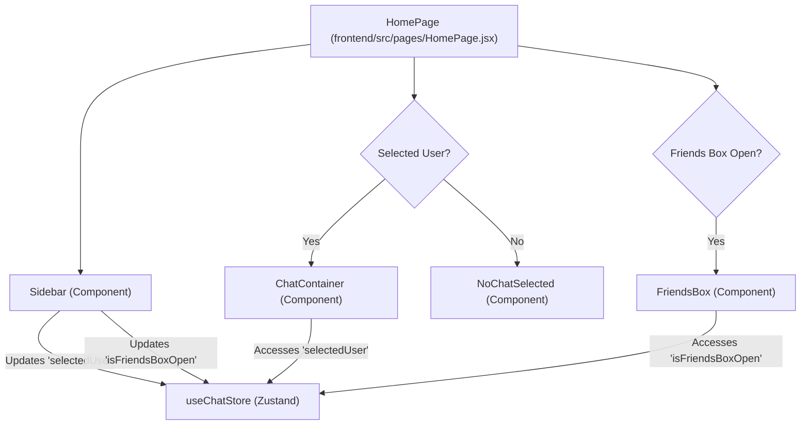

# Page Structure and Routing

<TOC />

This section details the structure and organization of the frontend pages within the application, focusing on how different user interfaces are laid out and how navigation is managed. The core pages include the `HomePage`, `LoginPage`, `SignUpPage`, and `ProfilePage`, each serving a distinct user interaction flow.

## Core Pages Overview

The application utilizes a clear separation of concerns for its main views, encapsulating specific functionalities within dedicated page components.

### `HomePage.jsx`

The `HomePage` serves as the central hub for authenticated users, displaying the main chat interface. It conditionally renders different components based on the application's state, managed by Zustand.

<div className="card bg-base-200 shadow-xl my-4">
    <div className="card-body">
        <h3 className="card-title">Homepage Structure</h3>
        <p>The homepage dynamically renders chat or a placeholder based on selection, and manages friend list visibility.</p>





    </div>
</div>

**Key Features:**

*   **Main Layout:** Provides the overall structure for the chat application, including the sidebar and the main content area.
*   **Conditional Rendering:** Dynamically switches between displaying an active `ChatContainer` when a user is selected or a `NoChatSelected` placeholder.
*   **Friends Box Integration:** Integrates the `FriendsBox` component, which can be toggled open or closed to display the user's friend list.

```jsx showLineNumbers
// frontend/src/pages/HomePage.jsx
import ChatContainer from "../components/ChatContainer";
import FriendsBox from "../components/FriendsBox";
import NoChatSelected from "../components/NoChatSelected";
import Sidebar from "../components/Sidebar";
import { useChatStore } from "../store/useChatStore" // highlight-line

const HomePage = () => {
  const { selectedUser } = useChatStore(); // highlight-line
  const { isFriendsBoxOpen } = useChatStore(); // highlight-line
  return (
      <div className="h-screen bg-base-200">
      <div className="flex items-center justify-center pt-20 px-4 w-full">
        <div className="bg-base-100 rounded-lg shadow-xl w-full max-w-6xl h-[calc(100vh-8rem)]">
          <div className="flex h-full rounded-lg overflow-hidden w-full">
            <Sidebar />
            {!selectedUser ? <NoChatSelected /> : <ChatContainer />} // highlight-line
            {isFriendsBoxOpen && <FriendsBox />} // highlight-line

          </div>

        </div>
      </div>
    </div>
  )
}

export default HomePage
```
[View on GitHub](https://github.com/shinymack/Chat-App-MERN/blob/main/frontend/src/pages/HomePage.jsx#L1-L26)

### `LoginPage.jsx`

This page handles user authentication, allowing existing users to sign in using their credentials or via Google OAuth.

**Key Features:**

*   **Form-based Authentication:** Provides input fields for email and password.
*   **Password Visibility Toggle:** Allows users to show/hide their password for better usability.
*   **Google OAuth Integration:** Offers a "Sign in with Google" option, redirecting to the backend's Google authentication endpoint.
*   **Navigation to Sign Up:** Includes a link for new users to create an account.

```jsx showLineNumbers
// frontend/src/pages/LoginPage.jsx
import { useState } from "react"
import { useAuthStore } from "../store/useAuthStore"; // highlight-line
import { Eye, EyeOff, Loader2, Lock, Mail, MessageSquare } from "lucide-react";
import { Link } from "react-router-dom"; // highlight-line
import AuthImagePattern from "../components/AuthImagePattern";
import { FcGoogle } from "react-icons/fc";

const LoginPage = () => {
  const [showPassword, setShowPassword] = useState(false);
  const [formData, setFormData] = useState({
    email: "",
    password: "",
  })
  const { login, isLoggingIn } = useAuthStore(); // highlight-line

  const handleSubmit = async (e) => {
    e.preventDefault();
    login(formData); // highlight-line
  }
  const backendDomain = import.meta.env.VITE_BACKEND_URL;
  const googleAuthUrl = `${backendDomain}/api/auth/google`; // highlight-line
  return (
    <div className="h-screen grid lg:grid-cols-2">
      {/* Left Side - Form */}
      <div className="flex flex-col justify-center items-center p-6 sm:p-12">
        <div className="w-full max-w-md space-y-8">
          {/* Logo */}
          <div className="text-center mb-8">
            <div className="flex flex-col items-center gap-2 group">
              <div
                className="w-12 h-12 rounded-xl bg-primary/10 flex items-center justify-center group-hover:bg-primary/20
              transition-colors"
              >
                <MessageSquare className="w-6 h-6 text-primary" />
              </div>
              <h1 className="text-2xl font-bold mt-2">Welcome Back</h1>
              <p className="text-base-content/60">Sign in to your account</p>
            </div>
          </div>

          {/* Form */}
          <form onSubmit={handleSubmit} className="space-y-6">
            {/* ... email and password input fields ... */}
            <button type="submit" className="btn btn-primary w-full" disabled={isLoggingIn}>
              {isLoggingIn ? (
                <>
                  <Loader2 className="h-5 w-5 animate-spin" />
                  Loading...
                </>
              ) : (
                "Sign in"
              )}
            </button>
          </form>
          <div className="divider text-base-content/60 my-4">OR</div>

          <a
            href={googleAuthUrl} // Link to your backend Google auth route // highlight-line
            className="btn btn-primary btn-outline w-full"
          >
            <FcGoogle className="size-5 mr-2" />
            Sign in with Google
          </a>

          <div className="text-center">
            <p className="text-base-content/60">
              Don&apos;t have an account?{" "}
              <Link to="/signup" className="link link-primary"> // highlight-line
                Create account
              </Link>
            </p>
          </div>
        </div>
      </div>

      {/* Right Side - Image/Pattern */}
      <AuthImagePattern
        title={"Welcome back!"}
        subtitle={"Sign in to continue your conversations and catch up with your messages."}
      />
    </div>
  )
}

export default LoginPage
```
[View on GitHub](https://github.com/shinymack/Chat-App-MERN/blob/main/frontend/src/pages/LoginPage.jsx#L1-L122)

### `SignUpPage.jsx`

This page is dedicated to new user registration, allowing them to create an account with a username, email, and password, or via Google OAuth.

**Key Features:**

*   **Registration Form:** Collects username, email, and password from new users.
*   **Form Validation:** Basic client-side validation for required fields, email format, and password length.
*   **Password Visibility Toggle:** Allows users to show/hide their password.
*   **Google OAuth Integration:** Offers a "Sign up with Google" option, similar to the login page.
*   **Navigation to Login:** Provides a link for users who already have an account to sign in.

```jsx showLineNumbers
// frontend/src/pages/SignUpPage.jsx
import { useState } from "react";
import { useAuthStore } from "../store/useAuthStore"; // highlight-line
import { MessageSquare, User, Mail, Lock, EyeOff, Eye, Loader2 } from "lucide-react";
import { Link } from "react-router-dom"; // highlight-line
import AuthImagePattern from "../components/AuthImagePattern";
import toast from "react-hot-toast";

import { FcGoogle } from "react-icons/fc";
const SignUpPage = () => {
  const [showPassword, setShowPassword] = useState(false);
  const [formData, setFormData] = useState({
    username: "",
    email: "",
    password: "",
  });

  const { signup, IsSigningUp } = useAuthStore(); // highlight-line

  const validateForm = () => { // highlight-start
    if(!formData.username.trim()) return toast.error("Username is required");
    if(!formData.email.trim()) return toast.error("Email is required");
    if (!/\S+@\S+\.\S+/.test(formData.email)) return toast.error("Invalid email format");
    if (!formData.password) return toast.error("Password is required");
    if (formData.password.length < 6) return toast.error("Password must be at least 6 characters");

    return true;
  }; // highlight-end

  const handleSubmit = (e) => {
    e.preventDefault();

    const success = validateForm(); // highlight-line
    if(success===true) signup(formData); // highlight-line
  };
  
  const backendDomain = import.meta.env.VITE_BACKEND_URL;
  const googleAuthUrl = `${backendDomain}/api/auth/google`; // highlight-line
  return (
    <div className="min-h-screen grid lg:grid-cols-2">
      {/* left side */}
      <div className="flex flex-col justify-center items-center p-6 sm:p-12">
        <div className="w-full max-w-md space-y-8">
          {/* LOGO */}
          {/* ... logo section ... */}

          <form onSubmit={handleSubmit} className="space-y-6">
            {/* ... username, email, password input fields ... */}
            <button type="submit" className="btn btn-primary w-full" disabled={IsSigningUp}>
              {IsSigningUp ? (
                <>
                  <Loader2 className="size-5 animate-spin" />
                  Loading...
                </>
              ) : (
                "Create Account"
              )}
            </button>
          </form>
          <div className="divider text-base-content/60 my-4">OR</div>

          <a
            href={googleAuthUrl} // Link to your backend Google auth route // highlight-line
            className="btn btn-primary btn-outline w-full" 
          >
            <FcGoogle className="size-5 mr-2" /> 
            Sign up with Google
          </a>

          <div className="text-center">
            <p className="text-base-content/60">
              Already have an account?{" "}
              <Link to="/login" className="link link-primary"> // highlight-line
                Sign in
              </Link>
            </p>
          </div>
        </div>
      </div>
      
      {/* right side */}
      <AuthImagePattern
        title="Join our community"
        subtitle="Connect with friends, share moments, and stay in touch with your loved ones."
      />
    </div>
  );
};
export default SignUpPage;
```
[View on GitHub](https://github.com/shinymack/Chat-App-MERN/blob/main/frontend/src/pages/SignUpPage.jsx#L1-L136)

### `ProfilePage.jsx`

The `ProfilePage` allows authenticated users to view and update their profile information, including their profile picture and username.

**Key Features:**

*   **Profile Picture Update:** Users can upload a new profile picture.
*   **Username Editing:** Allows users to edit their username with debounced validation against the backend to check availability.
*   **Display User Information:** Shows the user's email, username, member since date, and account status.
*   **Integration with `useAuthStore`:** Utilizes the authentication store for profile data and update operations.

```jsx showLineNumbers
// frontend/src/pages/ProfilePage.jsx
import { useState, useEffect, useRef } from "react";
import { useAuthStore } from "../store/useAuthStore"; // highlight-line
import { Camera, Mail, User, Edit, Save, X, Loader2 } from "lucide-react";
import toast from "react-hot-toast";
import { axiosInstance } from "../lib/axios"; // Assuming you have this configured instance // highlight-line

const ProfilePage = () => {
	const { authUser, isUpdatingProfile, updateProfile } = useAuthStore(); // highlight-line
	const [selectedImg, setSelectedImg] = useState(null);

	const [isEditingUsername, setIsEditingUsername] = useState(false);
	const [newUsername, setNewUsername] = useState(authUser?.username || "");
	const [usernameStatus, setUsernameStatus] = useState({
		checking: false,
		available: true,
		message: "",
	});
	const debounceTimeout = useRef(null);


	const handleImageUpload = async (e) => { // highlight-start
		const file = e.target.files[0];
		if (!file) return;

		const reader = new FileReader();
		reader.readAsDataURL(file);

		reader.onload = async () => {
			const base64Image = reader.result;
			setSelectedImg(base64Image);
			await updateProfile({ profilePic: base64Image });
		};
	}; // highlight-end

	// --- Debounced Username Check --- // highlight-start
	useEffect(() => {
		clearTimeout(debounceTimeout.current);

		if (!newUsername.trim() || newUsername.trim().length < 3) {
			setUsernameStatus({ checking: false, available: false, message: "Must be 3+ characters." });
			return;
		}

		if (newUsername === authUser.username) {
			setUsernameStatus({ checking: false, available: true, message: "" });
			return;
		}

		setUsernameStatus((prev) => ({ ...prev, checking: true, message: "Checking..." }));

		debounceTimeout.current = setTimeout(async () => {
			try {
				const res = await axiosInstance.get(`/auth/username/check/${newUsername}`); // highlight-line
				setUsernameStatus({
					checking: false,
					available: res.data.available,
					message: res.data.message,
				});
			} catch (error) {
				const message = error.response?.data?.message || "Error checking username.";
				setUsernameStatus({ checking: false, available: false, message });
			}
		}, 500);

		return () => clearTimeout(debounceTimeout.current);
	}, [newUsername, authUser.username]);
	// --------------------------------- // highlight-end

	const handleSaveUsername = async () => { // highlight-start
		if (!usernameStatus.available || newUsername === authUser.username) {
			toast.error("Cannot save. Username is either unavailable or unchanged.");
			return;
		}
		await updateProfile({ username: newUsername });
		setIsEditingUsername(false);
	}; // highlight-end

	const handleCancelEdit = () => {
		setIsEditingUsername(false);
		setNewUsername(authUser.username);
		setUsernameStatus({ checking: false, available: true, message: "" });
	};

	return (
		<div className="h-screen pt-20">
			<div className="max-w-2xl mx-auto p-4 py-8">
				<div className="bg-base-300 rounded-xl p-6 space-y-8">
					<div className="text-center">
						<h1 className="text-2xl font-semibold">Profile</h1>
						<p className="mt-2 ">Your profile information</p>
					</div>

					{/* profilePic section */}
					<div className="flex flex-col items-center gap-4">
						<div className="relative">
							
							<label
								htmlFor="avatar-upload"
								className={`
                  absolute bottom-0 right-0 
                  bg-base-content hover:scale-105
                  p-2 rounded-full cursor-pointer 
                  transition-all duration-200
                  ${isUpdatingProfile ? "animate-pulse pointer-events-none" : ""}
                `}
							>
								<Camera className="w-5 h-5 text-base-200" />
								<input
									type="file"
									id="avatar-upload"
									className="hidden"
									accept="image/*"
									onChange={handleImageUpload}
									disabled={isUpdatingProfile}
								/>
							</label>
						</div>
						<p className="text-sm text-zinc-400">
							{isUpdatingProfile ? "Updating profile..." : "Click the camera icon to update your photo"}
						</p>
					</div>

					{/* User Info section  */}
					<div className="space-y-6">
						<div className="space-y-1.5">
							<div className="text-sm text-zinc-400 flex items-center gap-2">
								<User className="w-4 h-4" />
								Username
							</div>

							{/* --- Conditional Username Display/Edit --- */}
							{!isEditingUsername ? (
								<div className="flex items-center gap-2">
									<p className="px-4 py-2.5 bg-base-200 rounded-lg border flex-grow">
										{authUser?.username}
									</p>
									<button onClick={() => setIsEditingUsername(true)} className="btn btn-ghost btn-sm">
										<Edit className="w-4 h-4" />
									</button>
								</div>
							) : (
								<div className="space-y-2">
									<div className="flex items-center gap-2">
										<input
											type="text"
											value={newUsername}
											onChange={(e) => setNewUsername(e.target.value.toLowerCase())}
											className="input input-bordered w-full"
										/>
										<button onClick={handleSaveUsername} className="btn btn-success btn-sm" disabled={!usernameStatus.available || usernameStatus.checking || isUpdatingProfile}>
											{isUpdatingProfile ? <Loader2 className="w-4 h-4 animate-spin" /> : <Save className="w-4 h-4" />}
										</button>
										<button onClick={handleCancelEdit} className="btn btn-error btn-sm">
											<X className="w-4 h-4" />
										</button>
									</div>
									<div className={`text-xs h-4 ${usernameStatus.available ? 'text-green-500' : 'text-error'}`}>
										{usernameStatus.checking ? <Loader2 className="w-3 h-3 animate-spin inline-block mr-1" /> : null}
										{usernameStatus.message}
									</div>
								</div>
							)}
							{/* ------------------------------------------- */}
						</div>

						<div className="space-y-1.5">
							<div className="text-sm text-zinc-400 flex items-center gap-2">
								<Mail className="w-4 h-4" />
								Email Address
							</div>
							<p className="px-4 py-2.5 bg-base-200 rounded-lg border">{authUser?.email}</p>
						</div>
					</div>

					{/* Account Info Section */}
					<div className="mt-6 bg-base-300 rounded-xl p-6">
						<h2 className="text-lg font-medium  mb-4">Account Information</h2>
						<div className="space-y-3 text-sm">
							<div className="flex items-center justify-between py-2 border-b border-zinc-700">
								<span>Member Since</span>
								<span>{authUser.createdAt?.split("T")[0]}</span>
							</div>
							<div className="flex items-center justify-between py-2">
								<span>Account Status</span>
								<span className="text-green-500">Active</span>
							</div>
						</div>
					</div>
				</div>
			</div>
		</div>
	);
};

export default ProfilePage;
```
[View on GitHub](https://github.com/shinymack/Chat-App-MERN/blob/main/frontend/src/pages/ProfilePage.jsx#L1-L245)

## Key Integration Points

### Authentication Flow

The authentication pages (`LoginPage`, `SignUpPage`) are crucial for user access and integrate deeply with the `useAuthStore` (Zustand) for state management. They also interact with the backend API for credential verification and Google OAuth.

<div className="card bg-base-200 shadow-xl my-4">
    <div className="card-body">
        <h3 className="card-title">Authentication Process</h3>
        <p>User authentication flow, including local and Google sign-in/sign-up.</p>


```mermaid
sequenceDiagram
    participant U as "User"
    participant A as "Auth Pages"
    participant Z as "useAuthStore (Zustand)"
    participant B as "Backend API"
    participant G as "Google OAuth"

    U->>+A: "Navigate to /login or /signup"
    A->>Z: "Calls 'login()' or 'signup()'"
    Z->>B: "POST /api/auth/login or /api/auth/signup"
    B-->>Z: "Auth Token / User Data"
    Z-->>-A: "Updates 'authUser' state"
    A->>U: "Redirects to HomePage"

    U->>+A: "Clicks 'Sign in with Google'"
    A->>B: "Redirect to /api/auth/google"
    B->>+G: "Initiate OAuth Flow"
    G-->>-B: "Auth Callback & User Info"
    B-->>Z: "Sets Auth Token (Cookie)"
    Z-->>-A: "Updates 'authUser' state"
    A->>U: "Redirects to HomePage"
```


    </div>
</div>

### Profile Management

The `ProfilePage` demonstrates how user-specific data can be managed and updated. It leverages `useAuthStore` to fetch the current user's details and to dispatch updates. The username editing feature showcases a debounced API call using `axiosInstance` for real-time validation, enhancing user experience by preventing duplicate usernames without excessive server requests.

### Routing and Navigation

The application uses `react-router-dom` (implied by `Link` components) for declarative routing. Authenticated and unauthenticated routes are typically handled at a higher level (e.g., in `App.jsx` or a dedicated `Router.jsx` file) to ensure users can only access appropriate pages. For example, users attempting to access the `HomePage` without being authenticated would be redirected to `LoginPage`.

Next: [State Management and Utilities](./3.3_state-management-and-utilities.mdx)