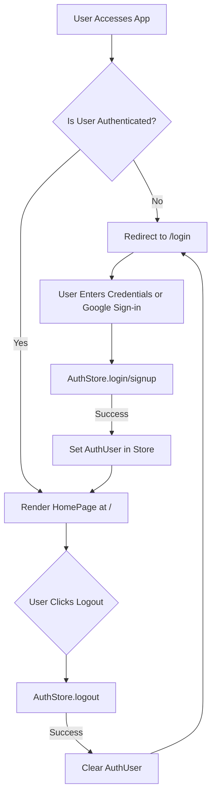
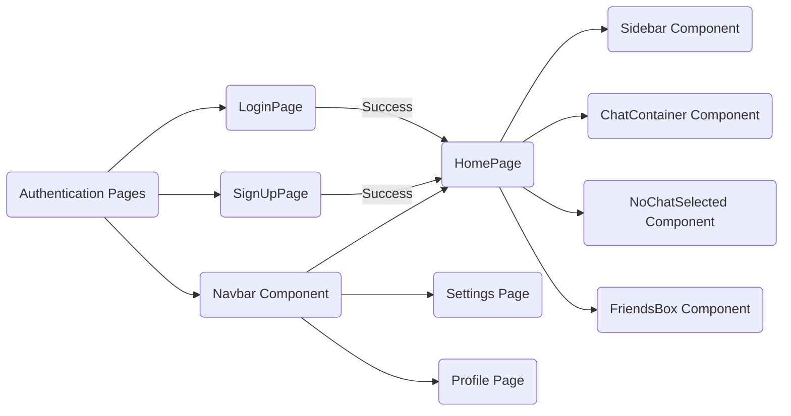

---
title: "Pages and Navigation"
description: "Structure and functionality of the main application pages and client-side routing."
sidebar_position: 32
---

# Pages and Navigation

<TOC />

This section details the structure and functionality of the main application pages and client-side routing in ShinyChat. It covers how users navigate through the application, interact with different views, and the underlying mechanisms that enable a seamless single-page application experience.

## Application Pages

ShinyChat's frontend is organized around several key pages, each serving a specific purpose in the user experience. These pages are designed to be intuitive and responsive, providing clear pathways for user interaction.

### Home Page

The `HomePage` component ([frontend/src/pages/HomePage.jsx](https://github.com/shinymack/Chat-App-MERN/blob/main/frontend/src/pages/HomePage.jsx)) serves as the primary interface for logged-in users. It aggregates various chat-related components to provide a comprehensive view of ongoing conversations and available contacts.

The home page dynamically renders either a `ChatContainer` or a `NoChatSelected` component based on whether a user has an active chat selected. It also conditionally displays a `FriendsBox` for managing contacts, enhancing the user's ability to switch between chats and manage their network.

```jsx
// frontend/src/pages/HomePage.jsx
import ChatContainer from "../components/ChatContainer";
import FriendsBox from "../components/FriendsBox";
import NoChatSelected from "../components/NoChatSelected";
import Sidebar from "../components/Sidebar";
import { useChatStore } from "../store/useChatStore"

const HomePage = () => {
  const { selectedUser } = useChatStore();
  const { isFriendsBoxOpen } = useChatStore();
  return (
      <div className="h-screen bg-base-200">
      <div className="flex items-center justify-center pt-20 px-4 w-full">
        <div className="bg-base-100 rounded-lg shadow-xl w-full max-w-6xl h-[calc(100vh-8rem)]">
          <div className="flex h-full rounded-lg overflow-hidden w-full">
            <Sidebar />
            {!selectedUser ? <NoChatSelected /> : <ChatContainer />}
            {isFriendsBoxOpen && <FriendsBox />}

          </div>

        </div>
      </div>
    </div>
  )
}

export default HomePage
```
[View on GitHub](https://github.com/shinymack/Chat-App-MERN/blob/main/frontend/src/pages/HomePage.jsx#L1-L29)

### Login Page

The `LoginPage` component ([frontend/src/pages/LoginPage.jsx](https://github.com/shinymack/Chat-App-MERN/blob/main/frontend/src/pages/LoginPage.jsx)) handles user authentication, allowing existing users to sign into their accounts. It features email/password authentication and integrates with Google for third-party authentication.

The form includes input validation and visual feedback during the login process, using a loading spinner for `isLoggingIn` state. The design also incorporates a "forgot password" link (though not implemented in the provided snippet) and a clear call to action for new users to sign up.

```jsx
// frontend/src/pages/LoginPage.jsx
const LoginPage = () => {
  const [showPassword, setShowPassword] = useState(false);
  const [formData, setFormData] = useState({
    email: "",
    password: "",
  })
  const { login, isLoggingIn } = useAuthStore();

  const handleSubmit = async (e) => {
    e.preventDefault();
    login(formData);
  }
  const backendDomain = import.meta.env.VITE_BACKEND_URL;
  const googleAuthUrl = `${backendDomain}/api/auth/google`;
  return (
    <div className="h-screen grid lg:grid-cols-2">
      <div className="flex flex-col justify-center items-center p-6 sm:p-12">
        <div className="w-full max-w-md space-y-8">
          <div className="text-center mb-8">
            <div className="flex flex-col items-center gap-2 group">
              <div
                className="w-12 h-12 rounded-xl bg-primary/10 flex items-center justify-center group-hover:bg-primary/20
              transition-colors"
              >
                <MessageSquare className="w-6 h-6 text-primary" />
              </div>
              <h1 className="text-2xl font-bold mt-2">Welcome Back</h1>
              <p className="text-base-content/60">Sign in to your account</p>
            </div>
          </div>

          <form onSubmit={handleSubmit} className="space-y-6">
            <div className="form-control">
              <label className="label">
                <span className="label-text font-medium">Email</span>
              </label>
              <div className="relative">
                <div className="absolute inset-y-0 left-0 pl-3 flex items-center pointer-events-none">
                  <Mail className="h-5 w-5 text opacity-40" />
                </div>
                <input
                  type="email"
                  className={`input input-bordered w-full pl-10`}
                  placeholder="you@example.com"
                  value={formData.email}
                  onChange={(e) => setFormData({ ...formData, email: e.target.value })}
                />
              </div>
            </div>
            {/* ... password input ... */}
            <button type="submit" className="btn btn-primary w-full" disabled={isLoggingIn}>
              {isLoggingIn ? (
                <>
                  <Loader2 className="h-5 w-5 animate-spin" />
                  Loading...
                </>
              ) : (
                "Sign in"
              )}
            </button>
          </form>
          <div className="divider text-base-content/60 my-4">OR</div>

          <a
            href={googleAuthUrl}
            className="btn btn-primary btn-outline w-full"
          >
            <FcGoogle className="size-5 mr-2" />
            Sign in with Google
          </a>

          <div className="text-center">
            <p className="text-base-content/60">
              Don&apos;t have an account?{" "}
              <Link to="/signup" className="link link-primary">
                Create account
              </Link>
            </p>
          </div>
        </div>
      </div>
      <AuthImagePattern
        title={"Welcome back!"}
        subtitle={"Sign in to continue your conversations and catch up with your messages."}
      />
    </div>
  )
}
```
[View on GitHub](https://github.com/shinymack/Chat-App-MERN/blob/main/frontend/src/pages/LoginPage.jsx#L1-L100)

### Sign Up Page

The `SignUpPage` component ([frontend/src/pages/SignUpPage.jsx](https://github.com/shinymack/Chat-App-MERN/blob/main/frontend/src/pages/SignUpPage.jsx)) facilitates new user registration. It collects essential information such as username, email, and password, and includes client-side validation for form inputs.

Similar to the login page, it supports both traditional sign-up and Google authentication. The `validateForm` function ensures data integrity before submission, improving the user experience by providing immediate feedback on invalid inputs.

```jsx
// frontend/src/pages/SignUpPage.jsx
import { useState } from "react";
import { useAuthStore } from "../store/useAuthStore";
import { MessageSquare, User, Mail, Lock, EyeOff, Eye, Loader2 } from "lucide-react";
import { Link } from "react-router-dom";
import AuthImagePattern from "../components/AuthImagePattern";
import toast from "react-hot-toast";

import { FcGoogle } from "react-icons/fc";
const SignUpPage = () => {
  const [showPassword, setShowPassword] = useState(false);
  const [formData, setFormData] = useState({
    username: "",
    email: "",
    password: "",
  });

  const { signup, IsSigningUp } = useAuthStore();

  const validateForm = () => {
    if(!formData.username.trim()) return toast.error("Username is required");
    if(!formData.email.trim()) return toast.error("Email is required");
    if (!/\S+@\S+\.\S+/.test(formData.email)) return toast.error("Invalid email format");
    if (!formData.password) return toast.error("Password is required");
    if (formData.password.length < 6) return toast.error("Password must be at least 6 characters");

    return true;
  };

  const handleSubmit = (e) => {
    e.preventDefault();

    const success = validateForm();
    if(success===true) signup(formData);
  };
  
  const backendDomain = import.meta.env.VITE_BACKEND_URL;
  const googleAuthUrl = `${backendDomain}/api/auth/google`;
  return (
    <div className="min-h-screen grid lg:grid-cols-2">
      {/* left side */}
      <div className="flex flex-col justify-center items-center p-6 sm:p-12">
        <div className="w-full max-w-md space-y-8">
          {/* LOGO */}
          <div className="text-center mb-8">
            <div className="flex flex-col items-center gap-2 group">
              <div
                className="size-12 rounded-xl bg-primary/10 flex items-center justify-center 
              group-hover:bg-primary/20 transition-colors"
              >
                <MessageSquare className="size-6 text-primary" />
              </div>
              <h1 className="text-2xl font-bold mt-2">Create Account</h1>
              <p className="text-base-content/60">Get started with your free account</p>
            </div>
          </div>

          <form onSubmit={handleSubmit} className="space-y-6">
            <div className="form-control">
              <label className="label">
                <span className="label-text font-medium">Username</span>
              </label>
                {/* ... username, email, password inputs ... */}
            </div>
            <button type="submit" className="btn btn-primary w-full" disabled={IsSigningUp}>
              {IsSigningUp ? (
                <>
                  <Loader2 className="size-5 animate-spin" />
                  Loading...
                </>
              ) : (
                "Create Account"
              )}
            </button>
          </form>
          <div className="divider text-base-content/60 my-4">OR</div>

          <a
            href={googleAuthUrl} 
            className="btn btn-primary btn-outline w-full" 
          >
            <FcGoogle className="size-5 mr-2" /> 
            Sign up with Google
          </a>

          <div className="text-center">
            <p className="text-base-content/60">
              Already have an account?{" "}
              <Link to="/login" className="link link-primary">
                Sign in
              </Link>
            </p>
          </div>
        </div>
      </div>
      <AuthImagePattern
        title="Join our community"
        subtitle="Connect with friends, share moments, and stay in touch with your loved ones."
      />
    </div>
  );
};
export default SignUpPage;
```
[View on GitHub](https://github.com/shinymack/Chat-App-MERN/blob/main/frontend/src/pages/SignUpPage.jsx#L1-L125)

## Navigation Structure

The application's navigation is primarily managed through the `Navbar` component and `react-router-dom` for client-side routing.

### Navbar Component

The `Navbar` component ([frontend/src/components/Navbar.jsx](https://github.com/shinymack/Chat-App-MERN/blob/main/frontend/src/components/Navbar.jsx)) is a persistent header that provides global navigation links and user-specific actions. It dynamically adjusts its content based on the authentication status of the user, offering "Profile" and "Logout" options only when a user is logged in.

This component integrates with `useAuthStore` to manage user authentication state and `useChatStore` for specific chat functionalities like toggling the friends list.

```jsx
// frontend/src/components/Navbar.jsx
import { Link } from "react-router-dom";
import { useAuthStore } from "../store/useAuthStore";
import { LogOut, MessageSquare, Settings, User, Users } from "lucide-react";
import { useChatStore } from "../store/useChatStore";

const Navbar = () => {
  const { logout, authUser } = useAuthStore();
  const { toggleFriendsBox } = useChatStore(); 

  return (
    <header
      className=" bg-base-100 border-b border-base-300 fixed w-full top-0 z-40
        backdrop-blur-lg bg-base-100/80"
    >
      <div className="container mx-auto px-4 h-16">
        <div className="flex items-center justify-between h-full">
          <div className="flex items-center gap-8">
            <Link
              to="/"
              className="flex items-center gap-2.5 hover:opacity-80 transition-all"
            >
              <div className="size-9 rounded-lg bg-primary/10 flex items-center justify-center">
                <MessageSquare className="size-5 text-primary"></MessageSquare>
              </div>
              <h1 className="text-lg font-bold">ShinyChat</h1>
            </Link>
          </div>
          <div className="flex items-center gap-4">
            <button className="btn btn-sm gap-2" onClick={toggleFriendsBox}>
              <Users className="size-5" />
              <span className="hidden sm:inline">Friends</span>
            </button>
            <Link to={"/settings"}
            className={`btn btn-sm gap-2 transition-colors`}>
            <Settings className="size-4"/>
            <span className="hidden sm:inline">Settings</span>

            </Link>
            {authUser && (
              <>
                <Link to={"/profile"} className={`btn btn-sm gap-2`}>
                  <User className="size-5" />
                  <span className="hidden sm:inline">Profile</span>
                </Link>

                <button className="btn btn-sm flex gap-2 items-center" onClick={logout}>
                  <LogOut className="size-5" />
                  <span className="hidden sm:inline">Logout</span>
                </button>
              </>
            )}
          </div>
        </div>
      </div>
    </header>
  );
};

export default Navbar;
```
[View on GitHub](https://github.com/shinymack/Chat-App-MERN/blob/main/frontend/src/components/Navbar.jsx#L1-L69)

## Client-Side Routing

Client-side routing is handled by `react-router-dom`, enabling a single-page application experience where navigation between pages does not require a full page reload. This improves performance and user experience by keeping the application state consistent and rendering updates efficiently.

### Routing Flow for Authentication

The authentication flow demonstrates how different pages are presented to the user based on their login status, and how `react-router-dom` facilitates this navigation.





This diagram illustrates the conditional rendering and redirection logic. If a user is not authenticated, they are redirected to the `/login` page. Upon successful login, the `HomePage` is rendered. The `Navbar` dynamically displays authentication-specific links and actions, such as "Logout" when `authUser` is present.

### Page Navigation and Component Interaction

The application design ensures that core components, such as `Navbar` and the main page content, interact smoothly through shared state and routing.





This flowchart details how the `Navbar` provides access to various primary pages and how `HomePage` orchestrates the display of its sub-components based on application state. The authentication pages (`LoginPage`, `SignUpPage`) are entry points that lead to the `HomePage` upon successful authentication, integrating into the overall navigation structure.

## Key Integration Points

### State Management
Centralized state management with `useAuthStore` and `useChatStore` is crucial for managing user authentication status (`authUser`) and chat-specific data (`selectedUser`, `isFriendsBoxOpen`). This ensures that UI components like the `Navbar` and `HomePage` can react dynamically to changes in the user's login state or chat selection. For example, the `Navbar` conditionally renders "Profile" and "Logout" buttons based on `authUser` and the `HomePage` switches between `ChatContainer` and `NoChatSelected` based on `selectedUser`.

### Client-side Routing
`react-router-dom` provides the backbone for seamless client-side navigation. It maps URLs to specific components, allowing the application to function as a single-page application. This approach reduces server load and enhances user experience by avoiding full page reloads. The use of `<Link>` components from `react-router-dom` in the `Navbar` ensures that navigation is performed efficiently without disrupting the application state.

### Authentication Flow
The authentication process, encompassing both `LoginPage` and `SignUpPage`, demonstrates a well-structured flow for user entry into the application. It includes client-side validation, integration with an external authentication provider (Google), and robust error handling through `react-hot-toast`. Upon successful authentication, the `useAuthStore` updates the `authUser` state, triggering a redirect to the `HomePage` and updating the `Navbar` to reflect the user's logged-in status. This ensures a secure and user-friendly onboarding experience.

### Component Reusability
Components like `AuthImagePattern` are reused across `LoginPage` and `SignUpPage`, demonstrating a clean component architecture. This promotes maintainability and consistency in the UI, especially for common elements across different authentication flows.

Next: [State Management and API Communication](./3.3_state-management-api-communication.mdx)
```