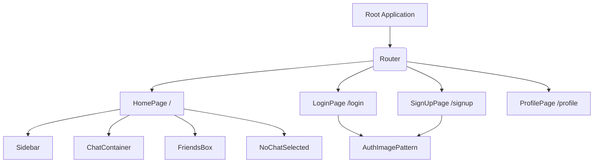
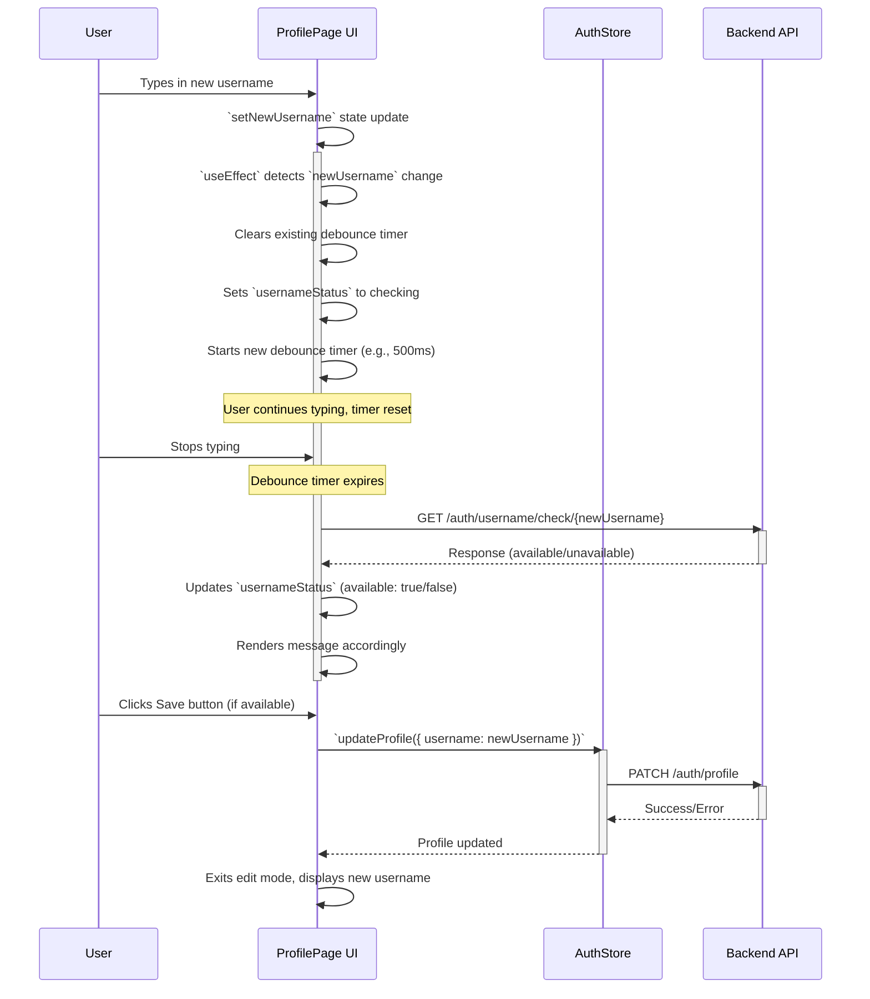

# Pages & Routing

This section details the primary pages within the frontend application, outlining their purpose, composition, and how navigation is managed to provide a seamless user experience. The application employs React for its UI, with `react-router-dom` implicitly used for client-side routing, enabling navigation between different sections of the application without full page reloads.

<TOC />

## Application Structure & Routing Overview

The frontend architecture organizes pages under the `frontend/src/pages` directory, representing distinct views or functionalities of the application. Each page component is responsible for rendering specific UI elements and interacting with global state or backend services to fetch and display data.

### Routing Mechanism

While `react-router-dom` configuration isn't explicitly provided in the snippets, its usage is inferred by the presence of `Link` components in authentication pages (`LoginPage`, `SignUpPage`) that point to other routes. This indicates a standard client-side routing setup where different URLs map to different React components. The overall structure can be visualized as:





### Key Considerations

-   **Authentication Guarding**: It's a common best practice in React applications to protect routes (`HomePage`, `ProfilePage`) that require user authentication. This is typically achieved using route guards or higher-order components (HOCs) that check the `authUser` state from `useAuthStore` before rendering the protected page.
-   **Lazy Loading**: For performance optimization, pages can be lazy-loaded using `React.lazy` and `Suspense`, especially for larger applications, to reduce the initial bundle size.

## HomePage

The `HomePage` serves as the main dashboard for authenticated users, displaying the core chat functionality. It dynamically renders chat interfaces based on user selections and manages the visibility of supplementary components like the friends list.

-   **File**: [`frontend/src/pages/HomePage.jsx`](https://github.com/shinymack/Chat-App-MERN/blob/main/frontend/src/pages/HomePage.jsx)

### Components and Interaction

The `HomePage` is a composite page, integrating several key components to form its layout and functionality:

-   **Sidebar**: Displays user's profile, navigation options, and potentially a list of chat conversations.
-   **ChatContainer**: Renders the active chat interface when a user or group is selected.
-   **NoChatSelected**: A placeholder component shown when no chat is active, guiding the user to select one.
-   **FriendsBox**: A dynamic overlay or section displaying the user's friends list, controlled by a state variable.

```jsx
// frontend/src/pages/HomePage.jsx
import ChatContainer from "../components/ChatContainer";
import FriendsBox from "../components/FriendsBox";
import NoChatSelected from "../components/NoChatSelected";
import Sidebar from "../components/Sidebar";
import { useChatStore } from "../store/useChatStore"

const HomePage = () => {
  const { selectedUser } = useChatStore();
  const { isFriendsBoxOpen } = useChatStore();
  return (
      <div className="h-screen bg-base-200">
      <div className="flex items-center justify-center pt-20 px-4 w-full">
        <div className="bg-base-100 rounded-lg shadow-xl w-full max-w-6xl h-[calc(100vh-8rem)]">
          <div className="flex h-full rounded-lg overflow-hidden w-full">
            <Sidebar />
            {!selectedUser ? <NoChatSelected /> : <ChatContainer />}
            {isFriendsBoxOpen && <FriendsBox />}

          </div>

        </div>
      </div>
    </div>
  )
}
export default HomePage
```

### State Management Integration

The `HomePage` leverages the `useChatStore` for managing application-wide chat-related state:

-   `selectedUser`: Determines whether `ChatContainer` or `NoChatSelected` is displayed, indicating if a conversation is active.
-   `isFriendsBoxOpen`: Controls the visibility of the `FriendsBox` component, likely toggled via an action within the `Sidebar`.

This design promotes a modular and responsive UI where components react to global state changes for dynamic rendering.

## LoginPage

The `LoginPage` provides the interface for existing users to authenticate and gain access to the application. It supports both traditional email/password login and Google OAuth.

-   **File**: [`frontend/src/pages/LoginPage.jsx`](https://github.com/shinymack/Chat-App-MERN/blob/main/frontend/src/pages/LoginPage.jsx)

### Authentication Flow

1.  **Form Submission**: Users enter their email and password, which are then handled by the `handleSubmit` function.
2.  **State Management**: The `useAuthStore().login()` action is dispatched with the form data, initiating the authentication process.
3.  **Loading State**: The `isLoggingIn` state from `useAuthStore` provides visual feedback to the user during the login attempt, disabling the submit button and showing a spinner.
4.  **Google OAuth**: A direct link to the backend's Google authentication endpoint (`/api/auth/google`) facilitates third-party login, abstracting the OAuth flow details from the frontend component.

```jsx
// frontend/src/pages/LoginPage.jsx
const LoginPage = () => {
  const [showPassword, setShowPassword] = useState(false);
  const [formData, setFormData] = useState({
    email: "",
    password: "",
  })
  const { login, isLoggingIn } = useAuthStore();

  const handleSubmit = async (e) => {
    e.preventDefault();
    login(formData);
  }
  const backendDomain = import.meta.env.VITE_BACKEND_URL;
  const googleAuthUrl = `${backendDomain}/api/auth/google`;
  // ... rest of the component
```

### Key UI/UX Features

-   **Password Visibility Toggle**: Allows users to show/hide their password for ease of input and verification.
-   **Loading Indicator**: The `Loader2` icon and "Loading..." text provide clear feedback when the login process is in progress.
-   **Navigation**: A `Link` component facilitates navigation to the `SignUpPage` for new users.
-   **Visual Enhancements**: The `AuthImagePattern` component adds a decorative visual element to one side of the layout, improving the aesthetic appeal of the authentication pages.

## SignUpPage

The `SignUpPage` enables new users to create an account within the application. Similar to `LoginPage`, it offers both standard registration and Google OAuth.

-   **File**: [`frontend/src/pages/SignUpPage.jsx`](https://github.com/shinymack/Chat-App-MERN/blob/main/frontend/src/pages/SignUpPage.jsx)

### Registration Flow

1.  **Form Input**: Users provide a username, email, and password.
2.  **Client-side Validation**: The `validateForm` function performs basic validation (e.g., presence of values, email format, password length) before submission, providing immediate feedback to the user via `react-hot-toast`.
3.  **State Management**: Upon successful validation, the `useAuthStore().signup()` action is invoked to register the new user.
4.  **Loading State**: The `IsSigningUp` state provides visual cues during the registration process.
5.  **Google OAuth**: An identical `googleAuthUrl` link is used to allow users to sign up using their Google account.

```jsx
// frontend/src/pages/SignUpPage.jsx
const SignUpPage = () => {
  const [showPassword, setShowPassword] = useState(false);
  const [formData, setFormData] = useState({
    username: "",
    email: "",
    password: "",
  });

  const { signup, IsSigningUp } = useAuthStore();

  const validateForm = () => {
    if(!formData.username.trim()) return toast.error("Username is required");
    // ... more validation
    return true;
  };

  const handleSubmit = (e) => {
    e.preventDefault();
    const success = validateForm();
    if(success===true) signup(formData);
  };
  // ... rest of the component
```

### Best Practices

-   **Input Validation**: Essential for data integrity and user experience, catching common errors before hitting the backend.
-   **Clear Feedback**: Loading states and toasts for validation errors ensure users are informed about the status of their actions.
-   **Consistency**: Reusing `AuthImagePattern` and similar UI elements (`Eye`, `EyeOff`, `Loader2`) across authentication pages ensures a consistent brand experience.

## ProfilePage

The `ProfilePage` allows authenticated users to view and update their personal information, specifically their profile picture and username.

-   **File**: [`frontend/src/pages/ProfilePage.jsx`](https://github.com/shinymack/Chat-App-MERN/blob/main/frontend/src/pages/ProfilePage.jsx)

### Features and Functionality

-   **Profile Picture Update**:
    -   Users can upload a new profile picture.
    -   The image is read as a Base64 URL for display and then sent to the backend.
    -   `isUpdatingProfile` from `useAuthStore` provides a loading animation and disables further uploads during the process.
-   **Username Editing**:
    -   Users can enter an edit mode for their username.
    -   **Debounced Username Check**: A `useEffect` hook with a `debounceTimeout` prevents excessive API calls by waiting for a short period after the user stops typing before checking username availability via `axiosInstance`. This enhances performance and reduces server load.
    -   Visual feedback for username availability (green/red text, loading spinner).
    -   Save and Cancel buttons manage the editing state.
-   **Display of User Info**: Shows immutable information like email, member since date, and account status.

### State Management & Interactions

-   `authUser`: Fetched from `useAuthStore`, providing the current user's details.
-   `isUpdatingProfile`: Indicates if a profile update (e.g., image or username) is in progress.
-   `updateProfile`: An action from `useAuthStore` to persist changes to the backend.
-   `selectedImg`: Local state to display the newly selected profile picture immediately before it's persisted.
-   `isEditingUsername`, `newUsername`, `usernameStatus`: Local states to manage the username editing UI and API feedback.

```jsx
// frontend/src/pages/ProfilePage.jsx
const ProfilePage = () => {
	const { authUser, isUpdatingProfile, updateProfile } = useAuthStore();
	const [selectedImg, setSelectedImg] = useState(null);

	const [isEditingUsername, setIsEditingUsername] = useState(false);
	const [newUsername, setNewUsername] = useState(authUser?.username || "");
	const [usernameStatus, setUsernameStatus] = useState({
		checking: false,
		available: true,
		message: "",
	});
	const debounceTimeout = useRef(null);

	useEffect(() => {
		// Clear any existing timer when newUsername changes
		clearTimeout(debounceTimeout.current);
		// ... (username validation and API call logic)
	}, [newUsername, authUser.username]);
    // ... rest of the component
```

### Debounced Username Availability Check





This interaction diagram highlights the debounced nature of the username check, which is crucial for a responsive user experience while minimizing unnecessary backend requests.

## Key Integration Points & Insights

-   **Centralized Authentication State**: The `useAuthStore` is fundamental across all pages, managing user login, signup, profile updates, and providing `authUser` data. This ensures a single source of truth for authentication status.
-   **Modular Component Design**: Pages are composed of smaller, reusable components (e.g., `ChatContainer`, `Sidebar`, `AuthImagePattern`), promoting maintainability and separation of concerns.
-   **Environment Variables**: The use of `import.meta.env.VITE_BACKEND_URL` for constructing Google OAuth URLs demonstrates a best practice for managing configuration across different deployment environments.
-   **User Experience Focus**: Features like password visibility toggles, loading indicators, and client-side validation significantly enhance the user experience by providing immediate feedback and preventing common errors.
-   **Asynchronous Operations**: All authentication and profile update operations are handled asynchronously (`async/await`), ensuring the UI remains responsive during network requests.

Next: [State Management & Utilities](./3.3_state_management_utilities.mdx)