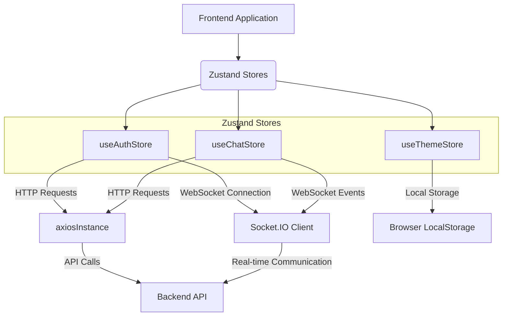

---
title: "State Management and Stores"
description: "Description of how global application state is managed using Zustand stores."
sidebar_position: 32
---

# State Management and Stores

<TOC />

State management is a critical aspect of modern web applications, ensuring data consistency and predictable behavior across components. This application leverages [Zustand](https://github.com/pmndrs/zustand) for its global state management, chosen for its simplicity, efficiency, and minimal boilerplate compared to other solutions. Zustand provides a reactive and performant way to manage application-wide data, including user authentication status, chat messages, and theme preferences.

## System Purpose

The state management system primarily serves to:

*   **Centralize Global Data:** Provide a single source of truth for application-wide data, making it easily accessible and modifiable by any component.
*   **Manage User Authentication:** Store and manage the authenticated user's data, authentication status (e.g., `isCheckingAuth`, `isLoggingIn`), and facilitate authentication operations like login, signup, and logout.
*   **Handle Chat-Related Data:** Store current chat messages, lists of friends, pending and sent friend requests, and the currently selected user for messaging.
*   **Synchronize Real-time Data:** Integrate with WebSockets (Socket.IO) to keep track of online users and receive new messages in real-time.
*   **Persist User Preferences:** Store and retrieve user preferences, such as the chosen theme, even after page reloads.
*   **Provide Action Dispatchers:** Offer a set of asynchronous and synchronous actions to modify the state in a controlled manner, often interacting with a backend API.

## Architecture

The state management architecture is built around independent Zustand stores, each responsible for a specific domain of the application. These stores interact with the backend API via a shared `axiosInstance` and with real-time events via Socket.IO.





### Interactions Flow

1.  **Component Interaction:** React components consume data from Zustand stores and trigger actions defined within them.
2.  **Action Execution:** Actions can be synchronous (e.g., `setTheme`) or asynchronous (e.g., `login`, `sendMessage`).
3.  **API Integration:** Asynchronous actions often make HTTP requests to the backend API using `axiosInstance` ([View on GitHub](https://github.com/shinymack/Chat-App-MERN/blob/main/frontend/src/lib/axios.js)).
4.  **State Update:** Upon successful API responses or specific events, actions call `set` to update the store's state.
5.  **Real-time Updates:** `useAuthStore` manages the Socket.IO connection and `onlineUsers`. `useChatStore` subscribes to `newMessage` events from the socket to update chat messages in real-time.
6.  **Persistence:** `useThemeStore` directly interacts with `localStorage` to persist theme preferences.

## Technology Stack

| Layer/Category       | Technology | Purpose                                                      |
| :------------------- | :--------- | :----------------------------------------------------------- |
| **State Management** | Zustand    | Lightweight, flexible, and scalable state management for React applications. |
| **HTTP Client**      | Axios      | Promise-based HTTP client for making API requests from the frontend. |
| **Real-time**        | Socket.IO  | Bidirectional communication between client and server for real-time features (e.g., online users, new messages). |
| **UI Notifications** | react-hot-toast | Simple and highly customizable toast notifications for user feedback. |
| **Environment Config** | `import.meta.env` | Accessing environment variables for dynamic base URLs and other configurations. |
| **Persistence**      | `localStorage` | Browser API for client-side key-value storage, used for theme persistence. |

## Features

### Authentication and User Management (`useAuthStore`)

The `useAuthStore` ([View on GitHub](https://github.com/shinymack/Chat-App-MERN/blob/main/frontend/src/store/useAuthStore.js)) is central to managing the user's authentication state and their connection to the real-time services. It encapsulates all authentication-related logic and user-specific data.

*   **State Variables:**
    *   `authUser`: Stores the currently authenticated user's data.
    *   `isSigningUp`, `isLoggingIn`, `isUpdatingProfile`, `isCheckingAuth`: Boolean flags to manage loading states for UI feedback.
    *   `onlineUsers`: An array of user IDs currently online, received via Socket.IO.
    *   `socket`: The Socket.IO client instance.
*   **Authentication Flow:**

    

```mermaid
    flowchart LR
        A[Start] --> B{Check Auth Status?};
        B -- Yes --> C(Call /auth/check);
        C -- Success --> D[Set authUser, Connect Socket];
        C -- Failure --> E[Clear authUser];
        B -- No --> F{User wants to Login/Signup?};
        F -- Login --> G(Call /auth/login);
        G -- Success --> H[Set authUser, Connect Socket, Show Toast];
        G -- Failure --> I[Show Error Toast];
        F -- Signup --> J(Call /auth/signup);
        J -- Success --> K[Set authUser, Connect Socket, Show Toast];
        J -- Failure --> L[Show Error Toast];
        D --> M[End];
        E --> M;
        H --> M;
        I --> M;
        K --> M;
        L --> M;
    ```


*   **`checkAuth` function:**
    This function is crucial for verifying the user's session when the application loads. It makes a GET request to `/auth/check`. If successful, it sets the `authUser` and initiates a Socket.IO connection.

    ```javascript
    // frontend/src/store/useAuthStore.js
    // ...
    checkAuth: async () => {
        try {
            const res = await axiosInstance.get("/auth/check");
            set({ authUser: res.data });
            get().connectSocket(); // Connect to Socket.IO upon successful authentication
        } catch (error) {
            set({ authUser: null });
            console.log("Error in checkAuth: ", error);
        } finally {
            set({ isCheckingAuth: false });
        }
    },
    // ...
    ```
    [[View on GitHub](https://github.com/shinymack/Chat-App-MERN/blob/main/frontend/src/store/useAuthStore.js#L20-L31)]
    This ensures that the `authUser` state is populated and the real-time connection is established immediately if a valid session exists. The `finally` block guarantees that `isCheckingAuth` is always reset, regardless of the outcome, to manage UI loading states.

*   **Socket.IO Integration (`connectSocket`, `disconnectSocket`):**
    The `useAuthStore` also manages the lifecycle of the Socket.IO connection. When a user is authenticated (either through `checkAuth`, `signup`, or `login`), `connectSocket` is invoked.

    ```javascript
    // frontend/src/store/useAuthStore.js
    // ...
    connectSocket: () => {
        const { authUser } = get();
        if(!authUser || get().socket?.connected) return; // Prevent connecting if no user or already connected

        const socket = io(BASE_URL, {
            query: {
                userId : authUser._id, // Pass userId for server-side identification
            },
        });
        socket.connect();
        set({socket: socket});

        socket.on("getOnlineUsers", (userIds) => { // Listen for online user updates
            set({onlineUsers: userIds})
        });
    },

    disconnectSocket : () => {
        if(get().socket?.connected) get().socket.disconnect(); // Disconnect socket on logout
    }
    // ...
    ```
    [[View on GitHub](https://github.com/shinymack/Chat-App-MERN/blob/main/frontend/src/store/useAuthStore.js#L95-L113)]
    This setup ensures that:
    *   A WebSocket connection is established only when a user is authenticated.
    *   The `userId` is sent as a query parameter for the server to identify and manage connections.
    *   The `getOnlineUsers` event listener updates the `onlineUsers` state, enabling the UI to show which friends are currently active.
    *   The `disconnectSocket` function is called on logout, cleaning up the connection. This is crucial for resource management and preventing stale connections.

### Chat and Friend Management (`useChatStore`)

The `useChatStore` ([View on GitHub](https://github.com/shinymack/Chat-App-MERN/blob/main/frontend/src/store/useChatStore.js)) handles all data and logic related to messaging and friend requests. It integrates closely with `useAuthStore` for real-time message updates.

*   **State Variables:**
    *   `messages`: Array of messages in the currently selected chat.
    *   `users`: List of the authenticated user's friends.
    *   `pendingRequests`: Friend requests received by the user.
    *   `sentRequests`: Friend requests sent by the user.
    *   `selectedUser`: The user currently selected for chatting.
    *   `isUsersLoading`, `isMessagesLoading`: Loading indicators.
    *   `isFriendBoxOpen`: UI state for the friend management modal.
*   **Message Retrieval and Sending:**
    *   `getMessages(userId)`: Fetches chat history for a specific user.
    *   `sendMessage(messageData)`: Sends a new message to the `selectedUser`.

    ```javascript
    // frontend/src/store/useChatStore.js
    // ...
    getMessages: async (userId) => {
        set({isMessagesLoading: true});
        try {
            const res = await axiosInstance.get(`/messages/${userId}`);
            set({messages: res.data});
        } catch (error) {
            toast.error(error.response.data.message);
        } finally {
            set({isMessagesLoading: false});
        }
    },
    sendMessage: async (messageData) => {
        const {selectedUser, messages} = get(); // Access current state
        try {
            const res = await axiosInstance.post(`/messages/send/${selectedUser._id}`, messageData);
            set({messages : [...messages, res.data]}); // Append new message to existing ones
        } catch (error){
            toast.error(error.response.data.message);
        }
    },
    // ...
    ```
    [[View on GitHub](https://github.com/shinymack/Chat-App-MERN/blob/main/frontend/src/store/useChatStore.js#L110-L132)]
    The `sendMessage` action optimistically updates the `messages` array by appending the new message returned from the backend, providing a faster perceived response to the user.

*   **Real-time Message Subscription:**
    This store directly interacts with the `socket` instance from `useAuthStore` to receive new messages in real-time. This is a powerful pattern for cross-store communication in Zustand.

    ```javascript
    // frontend/src/store/useChatStore.js
    // ...
    subscribeToMessages: () => {
        const { selectedUser } = get();
        if(!selectedUser) return; // Only subscribe if a user is selected

        const socket = useAuthStore.getState().socket; // Access socket from another store
        socket.on("newMessage", (newMessage) => {
            if(newMessage.senderId !== selectedUser._id) return // Only update if message is from selected user
            set({
                messages: [...get().messages, newMessage] // Append new message
            })
        })
    },

    unsubscribeFromMessages: () => {
        const socket = useAuthStore.getState().socket;
        socket.off("newMessage"); // Clean up event listener
    },
    // ...
    ```
    [[View on GitHub](https://github.com/shinymack/Chat-App-MERN/blob/main/frontend/src/store/useChatStore.js#L143-L163)]
    By accessing `useAuthStore.getState().socket`, `useChatStore` can listen to `newMessage` events. This is crucial for real-time chat functionality, ensuring that messages are displayed immediately without requiring a page refresh. The `unsubscribeFromMessages` function is vital for preventing memory leaks and ensuring that listeners are only active when needed (e.g., when a chat component is mounted).

*   **Friend Request Management:**
    Includes actions for sending, accepting, rejecting, and removing friend requests, along with fetching lists of friends and pending/sent requests. These actions typically refresh the relevant lists after a successful operation to reflect the changes in the UI.

### Theme Management (`useThemeStore`)

The `useThemeStore` ([View on GitHub](https://github.com/shinymack/Chat-App-MERN/blob/main/frontend/src/store/useThemeStore.js)) is a simple store dedicated to handling the application's theme.

*   **State Variables:**
    *   `theme`: Stores the current theme (e.g., "dark", "light").
*   **`setTheme` function:**
    This action updates the theme in the store and persists it to `localStorage`, ensuring the user's preference is remembered across sessions.

    ```javascript
    // frontend/src/store/useThemeStore.js
    import { create } from "zustand";

    export const useThemeStore = create((set) => ({
        theme: localStorage.getItem("chat-theme") || "dark", // Initialize from localStorage or default
        setTheme: (theme) => {
            localStorage.setItem("chat-theme", theme); // Persist to localStorage
            set({theme}); // Update Zustand state
        }
    }))
    ```
    [[View on GitHub](https://github.com/shinymack/Chat-App-MERN/blob/main/frontend/src/store/useThemeStore.js#L3-L8)]
    This approach makes theme management straightforward and ensures a consistent user experience by remembering the chosen theme.

## Key Integration Points

*   **Zustand for Global State:** Zustand's simplicity and direct state access (`set`, `get`) make it an ideal choice for managing diverse global states. Its middleware-like `get` function allows stores to access each other's state or even dispatch actions from other stores, as seen with `useChatStore` accessing `useAuthStore.getState().socket`.
*   **API Communication with Axios:** All stores interact with the backend API through a pre-configured `axiosInstance` ([View on GitHub](https://github.com/shinymack/Chat-App-MERN/blob/main/frontend/src/lib/axios.js)). This instance ensures `baseURL` consistency and handles `withCredentials: true` for sending cookies (critical for session-based authentication).
    ```javascript
    // frontend/src/lib/axios.js
    import axios from "axios";

    export const axiosInstance = axios.create({
        baseURL: import.meta.env.MODE == "development" ? "http://localhost:5001/api": "/api",
        withCredentials: true, // Enables sending cookies with requests
    });
    ```
    [[View on GitHub](https://github.com/shinymack/Chat-App-MERN/blob/main/frontend/src/lib/axios.js#L1-L6)]
    Using `import.meta.env.MODE` for `baseURL` allows for flexible deployment configurations, pointing to `localhost:5001/api` during development and `/api` in production, simplifying build processes.
*   **Real-time Synchronization via Socket.IO:** The tight integration between `useAuthStore` (managing the `socket` connection and `onlineUsers`) and `useChatStore` (subscribing to `newMessage` events) is crucial for the application's real-time features. This separation of concerns—one store for connection lifecycle, another for specific event handling—promotes modularity.
*   **Error Handling and User Feedback:** All asynchronous actions include `try-catch` blocks to handle API errors, displaying user-friendly messages using `react-hot-toast`. This consistent error handling strategy improves the user experience significantly.
*   **Scalability Insights:** The use of independent Zustand stores provides excellent scalability. Each store is a self-contained unit managing a specific slice of the application state. As the application grows, new features can introduce new stores without significantly impacting existing ones, promoting modularity and maintainability. The ability to access other store's state (`get().socket` or `useAuthStore.getState().socket`) facilitates necessary cross-cutting concerns without introducing tight coupling.

Next: [Pages and Navigation](./3.3_pages-and-navigation.mdx)
```