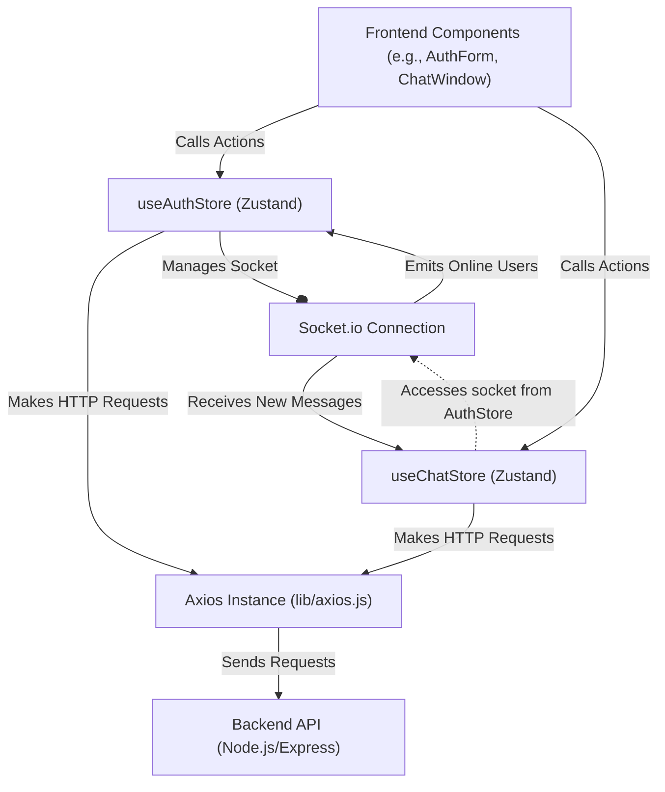
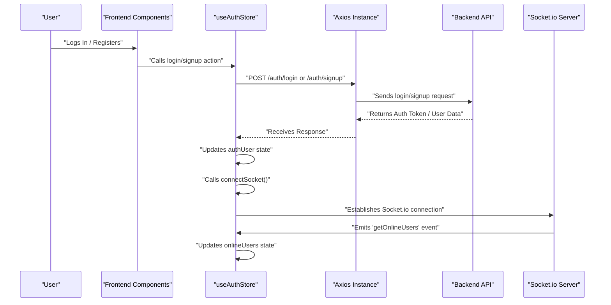

# State Management and Utilities

<TOC />

This section details the core mechanisms for managing global state and common utilities within the frontend application. We leverage **Zustand** for lightweight and efficient state management, **Axios** for robust HTTP requests, and a set of helper functions to enhance the user experience.

## Zustand for Global State Management

Zustand is a small, fast, and scalable state-management solution that uses React hooks. It simplifies the process of creating global stores by providing a minimalist API, making it easy to share state across components without prop drilling.

### Authentication and User State (`useAuthStore`)

The `useAuthStore` is responsible for managing all authentication-related state, including the authenticated user's data, loading states for auth operations, and managing the Socket.io connection for real-time features.

-   **State:** `authUser`, `isSigningUp`, `isLoggingIn`, `isUpdatingProfile`, `isCheckingAuth`, `onlineUsers`, `socket`.
-   **Actions:** `checkAuth`, `signup`, `logout`, `login`, `updateProfile`, `connectSocket`, `disconnectSocket`.

```javascript showLineNumbers {7-11,26-29,66-72}
// frontend/src/store/useAuthStore.js
import { create } from "zustand";
import { axiosInstance } from "../lib/axios";
import toast from "react-hot-toast";
import { io } from "socket.io-client";

const BASE_URL = import.meta.env.MODE == "development" ? "http://localhost:5001": "/";

export const useAuthStore = create((set, get) => ({
    authUser: null,
    isSigningUp: false,
    isLoggingIn: false,
    isUpdatingProfile: false,
    isCheckingAuth: true,
    onlineUsers: [],
    socket: null,

    checkAuth: async () => {
        try {
            const res = await axiosInstance.get("/auth/check");
            set({ authUser: res.data });
            get().connectSocket(); // Connect socket upon successful auth
        } catch (error) {
            set({ authUser: null });
            console.log("Error in checkAuth: ", error);
        } finally {
            set({ isCheckingAuth: false });
        }
    },

    // ... other auth actions (signup, login, logout, updateProfile) ...

    connectSocket: () => {
        const { authUser } = get();
        if(!authUser || get().socket?.connected) return;

        const socket = io(BASE_URL, {
            query: {
                userId : authUser._id,
            },
        });
        socket.connect();
        set({socket: socket});

        socket.on("getOnlineUsers", (userIds) => {
            set({onlineUsers: userIds})
        }); 
    },

    disconnectSocket : () => {
        if(get().socket?.connected) get().socket.disconnect();
    }
}));
```

[[View on GitHub](https://github.com/shinymack/Chat-App-MERN/blob/main/frontend/src/store/useAuthStore.js)]

### Chat and Friend Management State (`useChatStore`)

The `useChatStore` manages all chat-specific data, including messages, user lists (friends), friend requests, and loading states for various chat operations. It also handles interactions related to sending/receiving messages and managing friend relationships.

-   **State:** `messages`, `users`, `pendingRequests`, `sentRequests`, `selectedUser`, `isUsersLoading`, `isMessagesLoading`, `isFriendBoxOpen`.
-   **Actions:** `toggleFriendsBox`, `getFriends`, `getPendingRequests`, `getSentRequests`, `sendFriendRequest`, `acceptFriendRequest`, `rejectFriendRequest`, `removeFriend`, `getMessages`, `sendMessage`, `subscribeToMessages`, `unsubscribeFromMessages`, `setSelectedUser`.

```javascript showLineNumbers {13-16,35-40,111-116}
// frontend/src/store/useChatStore.js
import toast from "react-hot-toast";
import { create } from "zustand";
import { axiosInstance } from "../lib/axios";
import { useAuthStore } from "./useAuthStore"; // Access socket from AuthStore

export const useChatStore = create((set, get) => ({
    messages:[],
    users: [],
    pendingRequests: [],
    sentRequests: [],
    selectedUser: null,
    isUsersLoading: false,
    isMessagesLoading: false,
    isFriendBoxOpen: false,

    toggleFriendsBox: () => set(state => ({ isFriendsBoxOpen: !state.isFriendBoxOpen })),

    getFriends: async () => { /* ... API call and state update ... */ },
    getPendingRequests: async () => { /* ... */ },
    getSentRequests: async () => { /* ... */ },
    sendFriendRequest: async (identifier) => { /* ... */ },
    acceptFriendRequest: async (senderId) => { /* ... */ },
    rejectFriendRequest: async (senderId) => { /* ... */ },
    removeFriend: async (friendId) => { /* ... */ },
    getMessages: async (userId) => { /* ... */ },
    sendMessage: async (messageData) => { /* ... */ },

    subscribeToMessages: () => {
        const { selectedUser } = get();
        if(!selectedUser) return;
        
        // Access the socket instance from useAuthStore
        const socket = useAuthStore.getState().socket; 
        socket.on("newMessage", (newMessage) => {
            if(newMessage.senderId !== selectedUser._id) return
            set({
                messages: [...get().messages, newMessage]
            })
        })
    },

    unsubscribeFromMessages: () => {
        const socket = useAuthStore.getState().socket;
        socket.off("newMessage");
    },
    
    setSelectedUser: (selectedUser) => set({selectedUser})

}));
```

[[View on GitHub](https://github.com/shinymack/Chat-App-MERN/blob/main/frontend/src/store/useChatStore.js)]

### Zustand Store Interaction Diagram

This diagram illustrates how different parts of the frontend application interact with the Zustand stores for state management and real-time communication.





## Axios for HTTP Requests

The `axiosInstance` provides a pre-configured Axios client, centralizing API request settings. This ensures consistent `baseURL`, `withCredentials` for cookie handling, and simplifies API calls throughout the application.

```javascript showLineNumbers {4-7}
// frontend/src/lib/axios.js
import axios from "axios";

export const axiosInstance = axios.create({
    baseURL: import.meta.env.MODE == "development" ? "http://localhost:5001/api": "/api",
    withCredentials: true, // Important for sending/receiving cookies (e.g., JWT)
});
```

[[View on GitHub](https://github.com/shinymack/Chat-App-MERN/blob/main/frontend/src/lib/axios.js)]

## Utility Functions (`lib/utils.js`)

Common utility functions are housed in `lib/utils.js` to promote reusability and maintain a clean codebase. Currently, this includes a function for formatting message timestamps.

```javascript showLineNumbers {2-9}
// frontend/src/lib/utils.js
export function formatMessageTime(date) {
    return new Date(date).toLocaleTimeString("en-US", {
        year: "numeric",
        month: "short",
        day:"2-digit",
        hour: "2-digit",
        minute: "2-digit",
        hour12: true,
    });
}
```

[[View on GitHub](https://github.com/shinymack/Chat-App-MERN/blob/main/frontend/src/lib/utils.js)]

## Key Integration Points

### Authentication Flow and Socket.io Connection

The authentication process is tightly integrated with the Socket.io connection lifecycle. Upon successful login or registration, or during an initial authentication check, the `connectSocket` action in `useAuthStore` is invoked. This ensures that the user is immediately connected to the real-time server and can receive updates like online user status and new messages. Conversely, `disconnectSocket` is called on logout.





### Real-time Chat Message Handling

The `useChatStore` leverages the `socket` instance managed by `useAuthStore` to subscribe to real-time message updates. When a new message is received via the `newMessage` socket event, `useChatStore` updates its `messages` state, ensuring the chat interface reflects incoming communication instantly. This demonstrates cross-store communication where one store (Chat) depends on another's (Auth) managed resource (Socket).

This architecture provides a clear separation of concerns while allowing necessary inter-store communication, leading to a maintainable and scalable frontend.

Next: [Styling and Theming](./3.3_styling-and-theming.mdx)