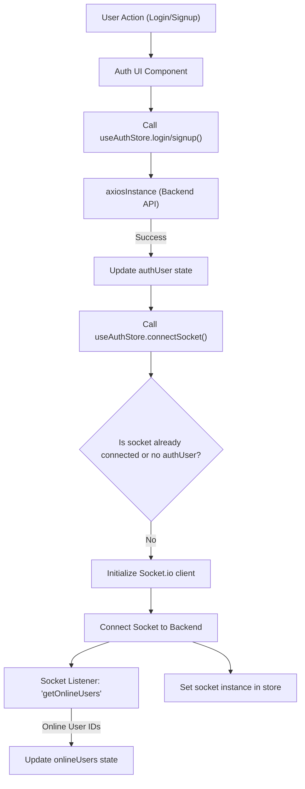
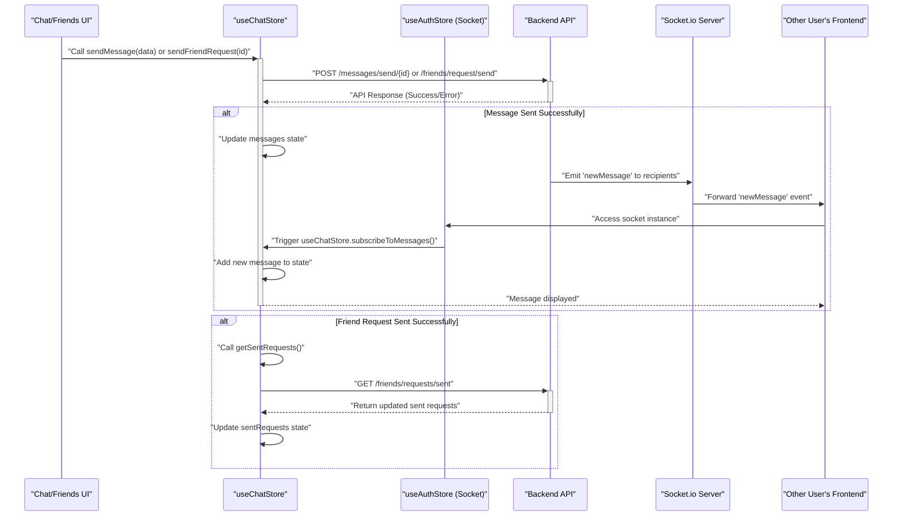

# State Management and Utilities

<TOC />

This section details the client-side state management within the frontend application, primarily utilizing [Zustand](https://zustand-bear.github.io/zustand/) for a lightweight and flexible state solution. It also covers general utility functions that enhance the application's functionality.

Zustand stores are defined as singletons, providing a global state accessible throughout the React components. This approach centralizes data, simplifies state updates, and promotes a clean separation of concerns.

## Zustand Stores

The application leverages three distinct Zustand stores to manage different aspects of the client-side state: `useAuthStore`, `useChatStore`, and `useThemeStore`.

### useAuthStore

The `useAuthStore` manages all authentication-related state, user data, online status, and the WebSocket connection. It serves as the single source of truth for the authenticated user's information and their interaction with the real-time communication layer.

**Key State Properties:**

*   `authUser`: Stores the currently authenticated user's object.
*   `isSigningUp`, `isLoggingIn`, `isUpdatingProfile`, `isCheckingAuth`: Boolean flags to manage loading states during authentication processes.
*   `onlineUsers`: An array of user IDs currently online, received via WebSocket.
*   `socket`: The [Socket.io](https://socket.io/) client instance, managed by the store.

**Core Actions:**

*   `checkAuth()`: Verifies the user's authentication status with the backend.
*   `signup(data)`, `login(data)`: Handles user registration and login, updating `authUser` upon success.
*   `logout()`: Clears `authUser` and disconnects the WebSocket.
*   `updateProfile(data)`: Updates the authenticated user's profile information.
*   `connectSocket()`, `disconnectSocket()`: Manages the lifecycle of the Socket.io client, connecting upon successful authentication and listening for `getOnlineUsers` events.

<br />

```jsx showLineNumbers
// frontend/src/store/useAuthStore.js
import { create } from "zustand";
import { axiosInstance } from "../lib/axios";
import toast from "react-hot-toast";
import { io } from "socket.io-client";

const BASE_URL = import.meta.env.MODE == "development" ? "http://localhost:5001": "/";

export const useAuthStore = create((set, get) => ({
    authUser: null,
    isSigningUp: false,
    isLoggingIn: false,
    isUpdatingProfile: false,
    isCheckingAuth: true,
    onlineUsers: [],
    socket: null,

    checkAuth: async () => {
        // ... omitted for brevity ...
    },

    signup: async (data) => {
        // ... omitted for brevity ...
    },

    logout: async () => {
        // ... omitted for brevity ...
    },

    login: async (data) => {
        // ... omitted for brevity ...
    },
    updateProfile: async (data) => {
        // ... omitted for brevity ...
    },

    connectSocket: () => {
        const { authUser } = get();
        if(!authUser || get().socket?.connected) return;

        const socket = io(BASE_URL, {
            query: {
                userId : authUser._id,
            },
        });
        socket.connect();
        set({socket: socket});

        socket.on("getOnlineUsers", (userIds) => {
            set({onlineUsers: userIds})
        }); 

    },

    disconnectSocket : () => {
        if(get().socket?.connected) get().socket.disconnect();
    }
}));
```

[[View on GitHub](https://github.com/shinymack/Chat-App-MERN/blob/main/frontend/src/store/useAuthStore.js)]

This store ensures that the application's authentication state is consistently managed and that real-time features, such as displaying online users, are seamlessly integrated. The `connectSocket` method is particularly crucial, as it establishes the WebSocket connection and subscribes to events relevant to user presence.





The authentication and socket connection flow is a critical aspect, ensuring that users are properly authenticated and then connected to the real-time communication server to receive updates like online user lists.

### useChatStore

The `useChatStore` centralizes all chat-related data, including messages, user lists, friend requests, and the currently selected chat partner. It also handles the logic for fetching and sending messages, as well as managing friend relationships.

**Key State Properties:**

*   `messages`: An array of messages for the currently selected chat.
*   `users`: A list of the authenticated user's friends.
*   `pendingRequests`, `sentRequests`: Arrays storing incoming and outgoing friend requests.
*   `selectedUser`: The user object of the currently active chat partner.
*   `isUsersLoading`, `isMessagesLoading`: Boolean flags for loading states.
*   `isFriendBoxOpen`: UI state for a friend management modal.

**Core Actions:**

*   `toggleFriendsBox()`: Toggles the visibility of the friend management UI.
*   `getFriends()`, `getPendingRequests()`, `getSentRequests()`: Fetches various lists related to friend management.
*   `sendFriendRequest(identifier)`, `acceptFriendRequest(senderId)`, `rejectFriendRequest(senderId)`, `removeFriend(friendId)`: Handles the full lifecycle of friend requests and friend management.
*   `getMessages(userId)`: Fetches chat messages for a specific user.
*   `sendMessage(messageData)`: Sends a new message to the `selectedUser`.
*   `subscribeToMessages()`, `unsubscribeFromMessages()`: Manages the subscription to `newMessage` Socket.io events, dynamically updating the `messages` state.
*   `setSelectedUser(user)`: Sets the active chat partner.

<br />

```jsx showLineNumbers
// frontend/src/store/useChatStore.js
import toast from "react-hot-toast";
import { create } from "zustand";
import { axiosInstance } from "../lib/axios";
import { useAuthStore } from "./useAuthStore";

export const useChatStore = create((set, get) => ({
    messages:[],
    users: [],
    pendingRequests: [],
    sentRequests: [],
    selectedUser: null,
    isUsersLoading: false,
    isMessagesLoading: false,

    isFriendBoxOpen: false,

    toggleFriendsBox: () => set(state => ({ isFriendsBoxOpen: !state.isFriendBoxOpen })),

    getFriends: async () => {
        // ... omitted for brevity ...
    },
    // ... other friend request methods ...

    sendMessage: async (messageData) => {
        const {selectedUser, messages} = get();
        try {
            const res = await axiosInstance.post(`/messages/send/${selectedUser._id}`, messageData);
            set({messages : [...messages, res.data]});
        } catch (error){
            toast.error(error.response.data.message);
        }
    },

    subscribeToMessages: () => {
        const { selectedUser } = get();
        if(!selectedUser) return;
        
        const socket = useAuthStore.getState().socket; // Access socket from useAuthStore
        if (!socket) {
            console.warn("Socket not available in useAuthStore for message subscription.");
            return;
        }
        socket.on("newMessage", (newMessage) => {
            if(newMessage.senderId !== selectedUser._id) return // Ensure message is for selected user
            set({
                messages: [...get().messages, newMessage]
            })
        })
    },

    unsubscribeFromMessages: () => {
        const socket = useAuthStore.getState().socket;
        if (socket) socket.off("newMessage");
    },
    
    setSelectedUser: (selectedUser) => set({selectedUser})
}));
```

[[View on GitHub](https://github.com/shinymack/Chat-App-MERN/blob/main/frontend/src/store/useChatStore.js)]

The `useChatStore` relies on the `socket` instance provided by `useAuthStore` to listen for incoming messages, demonstrating an important cross-store dependency. This structure ensures that real-time message updates are seamlessly integrated into the chat interface.





The message and friend request lifecycle illustrates the interaction between the UI, `useChatStore`, the backend API, and the Socket.io server for real-time updates and asynchronous operations.

### useThemeStore

The `useThemeStore` is a simple Zustand store dedicated to managing the application's UI theme (e.g., "dark" or "light"). It persists the theme preference in `localStorage` to ensure consistency across sessions.

**Key State Properties:**

*   `theme`: A string indicating the current theme, defaulting to "dark" or the value from `localStorage`.

**Core Actions:**

*   `setTheme(theme)`: Updates the `theme` state and persists it to `localStorage`.

<br />

```jsx showLineNumbers
// frontend/src/store/useThemeStore.js
import { create } from "zustand";

export const useThemeStore = create((set) => ({
    theme: localStorage.getItem("chat-theme") || "dark", // Initialize from localStorage or default
    setTheme: (theme) => {
        localStorage.setItem("chat-theme", theme); // Persist theme to localStorage
        set({theme});
    }
}));
```

[[View on GitHub](https://github.com/shinymack/Chat-App-MERN/blob/main/frontend/src/store/useThemeStore.js)]

This store provides a straightforward mechanism for theme management, allowing users to customize their visual experience while ensuring their preference is remembered.

## Utility Functions

The `frontend/src/lib/utils.js` file houses general-purpose utility functions that abstract common logic, making the codebase cleaner and more reusable.

### formatMessageTime

The `formatMessageTime` function takes a date object or string and returns a formatted time string suitable for displaying alongside chat messages. It ensures a consistent and user-friendly timestamp format.

<br />

```jsx showLineNumbers
// frontend/src/lib/utils.js
export function formatMessageTime(date) {
    return new Date(date).toLocaleTimeString("en-US", {
        year: "numeric",
        month: "short",
        day:"2-digit",
        hour: "2-digit",
        minute: "2-digit",
        hour12: true,
    });
}
```

[[View on GitHub](https://github.com/shinymack/Chat-App-MERN/blob/main/frontend/src/lib/utils.js)]

This utility is essential for presenting timestamps in a readable and localized format throughout the chat interface.

## Key Integration Points

The Zustand stores and utility functions are deeply integrated into the frontend application, forming the backbone of its dynamic behavior:

*   **Authentication Flow**: Upon successful login or signup via `useAuthStore`, the `connectSocket` action is immediately invoked, establishing the real-time connection. This ensures that the user is authenticated and ready for real-time interactions right after logging in.
*   **Real-time Chat**: `useChatStore` dynamically subscribes to `newMessage` events from the Socket.io instance (obtained from `useAuthStore`) whenever a `selectedUser` is active. This seamless integration allows for immediate display of incoming messages without manual refreshing.
*   **UI State Management**: `useThemeStore` ensures that user preferences for the UI theme are respected across sessions, providing a consistent user experience. `useChatStore` manages UI-specific states like `isFriendBoxOpen` to control modal visibility.
*   **Data Formatting**: The `formatMessageTime` utility is used across various components, particularly in the chat message display, to ensure all timestamps are presented consistently and legibly.
*   **Error Handling**: Both `useAuthStore` and `useChatStore` extensively use `react-hot-toast` for user feedback, providing clear notifications for successes and failures in API operations.

These integrations highlight how Zustand enables a modular yet interconnected state management approach, facilitating clear data flow and responsiveness in the application.

Next: [Configuration and Development Setup](./4_configuration-and-development-setup.mdx)