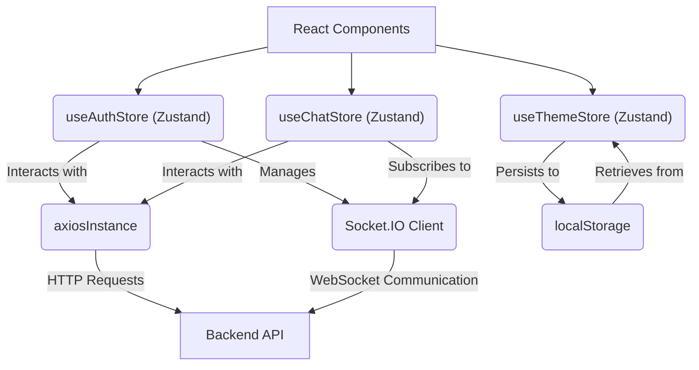
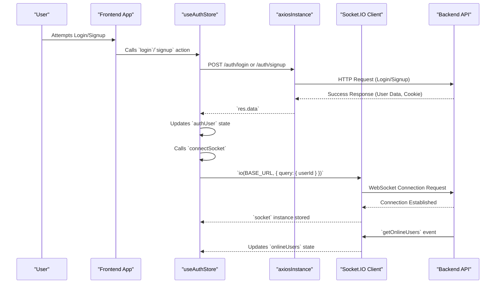

---
title: "State Management and Utilities"
description: "Explanation of how global state is managed and common utility functions."
sidebar_position: 32
---

# State Management and Utilities
<TOC />

This section details the global state management mechanisms and common utility functions employed in the frontend of the application. It covers how user authentication, chat-related data, and theme preferences are managed, along with the configuration of the HTTP client for API interactions.

## System Purpose

The state management system centralizes crucial application data, ensuring a consistent and reactive user experience. Utility functions streamline common tasks like API requests, abstracting away complexities and promoting code reusability.

*   **Authentication (`useAuthStore`)**: Manages the authenticated user's session, including login, signup, logout, profile updates, and real-time online user tracking via WebSockets.
*   **Chat (`useChatStore`)**: Handles all chat-related data such as messages, user lists, friend requests (pending, sent), and the currently selected chat partner. It also orchestrates message sending and reception.
*   **Theme (`useThemeStore`)**: Persists and updates the application's visual theme (e.g., dark/light mode) across user sessions.
*   **API Client (`axiosInstance`)**: Provides a pre-configured Axios instance for making authenticated HTTP requests to the backend API, simplifying data fetching and submission.

## Architecture

The frontend state management follows a modern, hook-based pattern using Zustand, a small, fast, and scalable bear-necessities state management solution. It integrates seamlessly with React components and leverages a custom Axios instance for API communication and Socket.IO for real-time features.

The application's architecture for state and utilities can be visualized as follows:





**Interaction Flow:**
1.  **React Components** consume state and actions directly from Zustand stores (`useAuthStore`, `useChatStore`, `useThemeStore`).
2.  **Zustand Stores** encapsulate business logic.
    *   `useAuthStore` and `useChatStore` use `axiosInstance` for HTTP API calls (e.g., login, fetching messages).
    *   `useAuthStore` initializes and manages the **Socket.IO Client** for real-time features like online users and chat updates.
    *   `useChatStore` subscribes to Socket.IO events (e.g., `newMessage`) to update chat state in real-time.
    *   `useThemeStore` directly interacts with `localStorage` for theme persistence.
3.  **axiosInstance** handles HTTP requests to the **Backend API**, including setting `withCredentials` for cookie-based authentication.
4.  **Socket.IO Client** establishes a persistent WebSocket connection with the **Backend API** for real-time bidirectional communication.

## Technology Stack

| Layer/Category       | Technology      | Purpose                                                                                                               |
| :------------------- | :-------------- | :-------------------------------------------------------------------------------------------------------------------- |
| State Management     | [Zustand](https://github.com/pmndrs/zustand) | Lightweight, fast, and scalable state management for React applications.                                              |
| HTTP Client          | [Axios](https://axios-http.com/) | Promise-based HTTP client for making API requests from the browser.                                                   |
| Real-time            | [Socket.IO Client](https://socket.io/docs/v4/client-api/) | Enables real-time, bidirectional, event-based communication between client and server.                                |
| Notifications        | [React Hot Toast](https://react-hot-toast.com/) | Lightweight and customizable toast notifications for user feedback.                                                   |
| Local Storage        | Web API         | Used by `useThemeStore` to persist user theme preferences across sessions.                                          |

## Core Utilities

### Custom Axios Instance

The `axiosInstance` centralizes HTTP request configuration, ensuring all API calls from the frontend adhere to a consistent base URL and include credentials for authentication.

```javascript showLineNumbers
// frontend/src/lib/axios.js
import axios from "axios";

export const axiosInstance = axios.create({
    baseURL: import.meta.env.MODE == "development" ? "http://localhost:5001/api": "/api",
    withCredentials: true,
});
```
[View on GitHub](https://github.com/shinymack/Chat-App-MERN/blob/main/frontend/src/lib/axios.js#L1-L6)

This snippet creates a global Axios instance:
*   `baseURL`: Dynamically set based on the environment (`development` or `production`), pointing to the backend API endpoint.
*   `withCredentials`: Set to `true` to ensure that cookies (e.g., session cookies for authentication) are sent with cross-origin requests, which is crucial for maintaining user sessions.

**Best Practice Insight:** Centralizing Axios configuration prevents repetitive code and ensures that authentication-related headers or cookies are consistently handled across all API calls. This is a fundamental security and operational pattern for applications relying on cookie-based authentication.

## State Stores

### Authentication Store (`useAuthStore`)

The `useAuthStore` manages the authentication state of the user, including the `authUser` object, loading states for various auth operations, `onlineUsers`, and the `socket` instance.

```javascript showLineNumbers
// frontend/src/store/useAuthStore.js
import { create } from "zustand";
import { axiosInstance } from "../lib/axios";
import toast from "react-hot-toast";
import { io } from "socket.io-client";

const BASE_URL = import.meta.env.MODE == "development" ? "http://localhost:5001": "/";

export const useAuthStore = create((set, get) => ({
    authUser: null,
    isSigningUp: false,
    isLoggingIn: false,
    isUpdatingProfile: false,
    isCheckingAuth: true,
    onlineUsers: [],
    socket: null,

    checkAuth: async () => {
        try {
            const res = await axiosInstance.get("/auth/check");
            set({ authUser: res.data });
            get().connectSocket(); // Connect socket on successful auth
        } catch (error) {
            set({ authUser: null });
            console.log("Error in checkAuth: ", error);
        } finally {
            set({ isCheckingAuth: false });
        }
    },
    // ... other auth methods
    connectSocket: () => {
        const { authUser } = get();
        if(!authUser || get().socket?.connected) return; // Prevent connecting if not authenticated or already connected

        const socket = io(BASE_URL, {
            query: {
                userId : authUser._id,
            },
        });
        socket.connect();
        set({socket: socket}); // Store the socket instance

        socket.on("getOnlineUsers", (userIds) => {
            set({onlineUsers: userIds}) // Update online users list
        });
    },

    disconnectSocket : () => {
        if(get().socket?.connected) get().socket.disconnect(); // Disconnect socket
    }
}));
```
[View on GitHub](https://github.com/shinymack/Chat-App-MERN/blob/main/frontend/src/store/useAuthStore.js#L1-L98)

Key features:
*   **`authUser`**: Holds the currently logged-in user object.
*   **`isCheckingAuth`, `isSigningUp`, `isLoggingIn`, `isUpdatingProfile`**: Boolean flags to manage UI loading states during API calls.
*   **`onlineUsers`**: An array of user IDs currently online, received via Socket.IO.
*   **`socket`**: The Socket.IO client instance, managed within the store for global access and connection lifecycle.
*   **`checkAuth`**: Verifies the user's authentication status with the backend, and if successful, initiates a Socket.IO connection.
*   **`signup`, `login`, `logout`, `updateProfile`**: Standard authentication operations that interact with `axiosInstance` and update `authUser`. `login` and `signup` also trigger `connectSocket`, while `logout` triggers `disconnectSocket`.
*   **`connectSocket`**: Initializes and connects the Socket.IO client, passing the `userId` as a query parameter for server-side identification. It subscribes to the `getOnlineUsers` event.
*   **`disconnectSocket`**: Gracefully disconnects the Socket.IO client.

**Scalability Insight:** Managing the Socket.IO instance within a global store ensures that only one socket connection is active per user session, preventing resource wastage and simplifying real-time event handling across different components.

### Chat Store (`useChatStore`)

The `useChatStore` handles all data and operations related to the chat interface, including messages, user lists, and friend management.

```javascript showLineNumbers
// frontend/src/store/useChatStore.js
import toast from "react-hot-toast";
import { create } from "zustand";
import { axiosInstance } from "../lib/axios";
import { useAuthStore } from "./useAuthStore"; // Access to auth store for socket

export const useChatStore = create((set, get) => ({
    messages:[],
    users: [], // Friends list
    pendingRequests: [],
    sentRequests: [],
    selectedUser: null,
    isUsersLoading: false,
    isMessagesLoading: false,
    isFriendBoxOpen: false,

    // ... methods for friend management (getFriends, sendFriendRequest, etc.)

    getMessages: async (userId) => {
        set({isMessagesLoading: true});
        try {
            const res = await axiosInstance.get(`/messages/${userId}`);
            set({messages: res.data});
        } catch (error) {
            toast.error(error.response.data.message);
        } finally {
            set({isMessagesLoading: false});
        }
    },
    sendMessage: async (messageData) => {
        const {selectedUser, messages} = get();
        try {
            const res = await axiosInstance.post(`/messages/send/${selectedUser._id}`, messageData);
            set({messages : [...messages, res.data]});
        } catch (error){
            toast.error(error.response.data.message);
        }
    },

    subscribeToMessages: () => {
        const { selectedUser } = get();
        if(!selectedUser) return;

        // Retrieve socket from useAuthStore
        const socket = useAuthStore.getState().socket;
        socket.on("newMessage", (newMessage) => {
            if(newMessage.senderId !== selectedUser._id) return // Only add messages from the currently selected user
            set({
                messages: [...get().messages, newMessage]
            })
        })
    },

    unsubscribeFromMessages: () => {
        const socket = useAuthStore.getState().socket;
        socket.off("newMessage");
    },

    setSelectedUser: (selectedUser) => set({selectedUser})
}));
```
[View on GitHub](https://github.com/shinymack/Chat-App-MERN/blob/main/frontend/src/store/useChatStore.js#L1-L125)

Key features:
*   **`messages`**: Array of message objects for the currently selected chat.
*   **`users`**: List of friends.
*   **`pendingRequests`, `sentRequests`**: Lists for managing friend requests.
*   **`selectedUser`**: The user object currently active in the chat window.
*   **`isUsersLoading`, `isMessagesLoading`**: Loading states for fetching user lists and messages.
*   **Friend Management**: Methods like `getFriends`, `sendFriendRequest`, `acceptFriendRequest`, `rejectFriendRequest`, `removeFriend` interact with `axiosInstance` to manage friend relationships.
*   **`getMessages`**: Fetches chat history for `selectedUser`.
*   **`sendMessage`**: Sends a new message via `axiosInstance`, immediately updating the local `messages` state for optimistic UI.
*   **`subscribeToMessages`**: Attaches a listener to the global Socket.IO instance (obtained from `useAuthStore`) for `newMessage` events, updating `messages` in real-time.
*   **`unsubscribeFromMessages`**: Removes the `newMessage` listener to prevent memory leaks and ensure correct message handling when the component unmounts or selected user changes.
*   **`setSelectedUser`**: Sets the user whose chat is currently displayed.

**Design Reason:** Separating `subscribeToMessages` and `unsubscribeFromMessages` ensures that components can manage their real-time subscriptions effectively. This pattern is crucial in dynamic UIs where listeners need to be added and removed based on component lifecycle or state changes (e.g., changing the active chat partner).

### Theme Store (`useThemeStore`)

The `useThemeStore` is a simple Zustand store dedicated to managing the application's theme preference, persisting it in `localStorage`.

```javascript showLineNumbers
// frontend/src/store/useThemeStore.js
import { create } from "zustand";

export const useThemeStore = create((set) => ({
    theme: localStorage.getItem("chat-theme") || "dark", // Initialize from localStorage or default to 'dark'
    setTheme: (theme) => {
        localStorage.setItem("chat-theme", theme); // Persist theme to localStorage
        set({theme}); // Update state
    }
}))
```
[View on GitHub](https://github.com/shinymack/Chat-App-MERN/blob/main/frontend/src/store/useThemeStore.js#L1-L7)

Key features:
*   **`theme`**: Stores the current theme string (e.g., "dark", "light").
*   **Initialization**: The `theme` state is initialized by attempting to retrieve a previously saved theme from `localStorage`. If no theme is found, it defaults to `"dark"`.
*   **`setTheme`**: An action that updates the `theme` in the store and simultaneously persists it to `localStorage`, ensuring the preference is remembered across browser sessions.

**Best Practice Insight:** Using `localStorage` for theme preferences is a common and effective pattern. It provides immediate persistence without requiring backend interaction, leading to a snappier user experience upon revisiting the application.

## Key Integration Points

### Unified Authentication and Real-time

The `useAuthStore` serves as the central hub for user authentication and real-time connectivity. Upon successful login or registration, or during an initial authentication check, the `connectSocket` action is invoked. This establishes a Socket.IO connection, linking the authenticated user to the real-time server and allowing for features like online user status and instant message notifications. Conversely, `disconnectSocket` is called on logout, ensuring clean session termination. This tightly couples authentication state with WebSocket lifecycle management.





### Chat Real-time Integration

The `useChatStore` cleverly integrates with the `useAuthStore`'s Socket.IO instance to handle real-time message updates. Instead of creating its own socket, it retrieves the existing `socket` instance from `useAuthStore` using `useAuthStore.getState().socket`. This singleton-like approach for the socket ensures efficient resource usage and avoids connection conflicts. The `subscribeToMessages` and `unsubscribeFromMessages` actions within `useChatStore` manage specific `newMessage` event listeners, ensuring that messages are only received and processed for the currently `selectedUser`. This separation of concerns allows `useAuthStore` to manage the overall socket lifecycle, while `useChatStore` focuses on chat-specific real-time events.

### Consistent API Interaction

Both `useAuthStore` and `useChatStore` consistently utilize the `axiosInstance` for all their HTTP API calls. This ensures that every request benefits from the predefined `baseURL` and `withCredentials` settings, standardizing communication with the backend. This pattern simplifies error handling and authentication token management (if applicable), as the core setup is handled once in `axios.js`.

**Insights and Best Practices:**
*   **Modularity with Zustand:** The use of separate Zustand stores for `auth`, `chat`, and `theme` promotes a modular architecture. Each store focuses on a specific domain, making the state logic easier to understand, test, and maintain.
*   **Separation of Concerns for Real-time:** While the `useAuthStore` manages the Socket.IO connection lifecycle, `useChatStore` is responsible for subscribing and unsubscribing to specific chat-related real-time events. This clear division prevents the stores from becoming monolithic.
*   **Optimistic UI (e.g., `sendMessage`):** In `sendMessage`, the new message is immediately added to the `messages` array before the API request completes. This "optimistic update" provides instant feedback to the user, enhancing perceived performance, assuming the backend call will succeed. Error handling is in place to revert or inform the user if the request fails.
*   **Error Handling with `react-hot-toast`:** Consistent use of `toast.error` for API call failures provides immediate and user-friendly feedback, improving the user experience by informing them about issues without disrupting the flow.
*   **Environmental Configuration:** The dynamic `baseURL` for Axios and Socket.IO based on `import.meta.env.MODE` allows for easy switching between development and production environments, a critical practice for deployment.

Next: [Pages and Navigation](./3.3_pages-and-navigation.mdx)
```