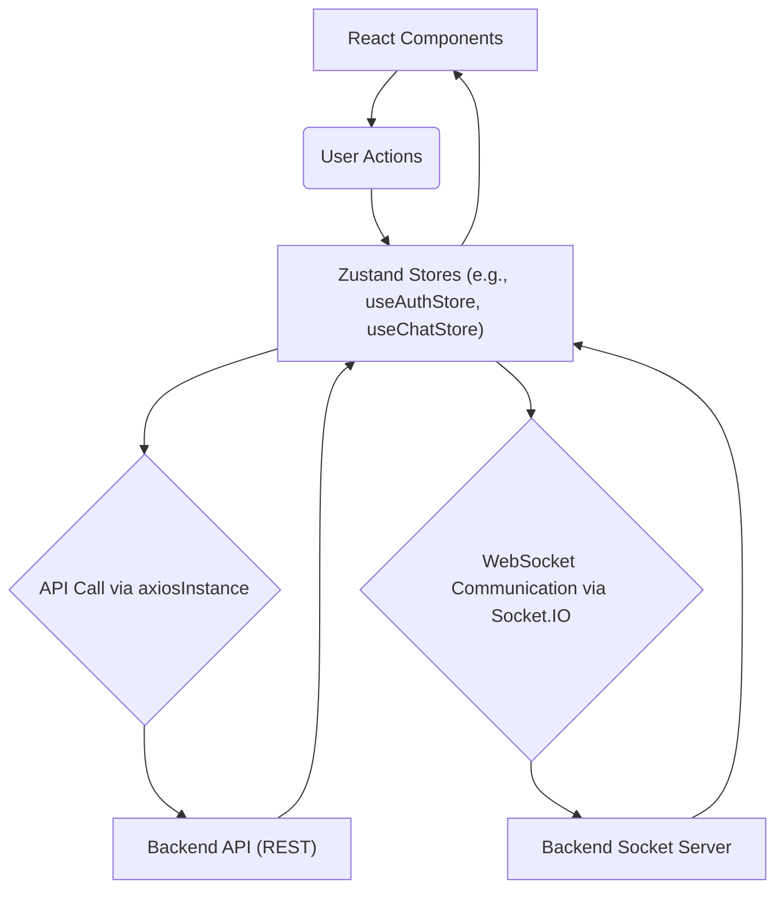
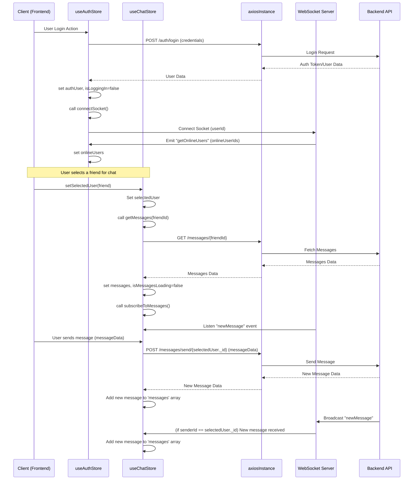

# State Management and Utilities
<TOC />

This section details the client-side state management strategy, leveraging `Zustand` for global state, and essential utility functions. It covers user authentication, chat functionality, and common helper methods, providing a comprehensive overview of how data is managed and manipulated on the frontend.

## Architecture and Core Principles

The frontend architecture employs a centralized state management pattern using Zustand, a lightweight and flexible state management library. This approach allows for efficient sharing and manipulation of application-wide state (like user authentication status and chat data) across various React components. Interaction with the backend API is standardized through a custom Axios instance, ensuring consistent request handling, including authentication credentials. WebSocket communication, powered by `socket.io-client`, facilitates real-time updates for features like online users and new messages.

### State Management Flow
The following diagram illustrates the high-level flow of state management within the application, showcasing how actions trigger state updates and interactions with external services.





## Technology Stack

| Layer/Category       | Technology      | Purpose                                                                                                                                                                                                                                  |
| :------------------- | :-------------- | :--------------------------------------------------------------------------------------------------------------------------------------------------------------------------------------------------------------------------------------- |
| **State Management** | Zustand         | Lightweight, un-opinionated state management for React applications. Provides a simple hook-based API for creating and consuming stores, minimizing boilerplate.                                                                        |
| **HTTP Client**      | Axios           | Promise-based HTTP client for making API requests. Configured with a base URL and `withCredentials` for cookie-based authentication, ensuring seamless interaction with the backend.                                                      |
| **Real-time Comm.**  | Socket.IO Client | Enables real-time, bidirectional event-based communication between the client and the server. Used for features like broadcasting online users and real-time message delivery.                                                        |
| **Notifications**    | `react-hot-toast` | A flexible and customizable toast notification library for React, used to provide immediate feedback to users regarding actions such as successful login, signup, or error messages.                                                    |
| **Utilities**        | JavaScript       | Native JavaScript functions for common tasks, such as date formatting, encapsulating reusable logic.                                                                                                                                     |

## Shared Utilities

The application utilizes a set of shared utility functions to encapsulate common logic and improve code reusability. These utilities handle tasks like API request configuration and data formatting.

### Axios Instance Configuration

A custom Axios instance, `axiosInstance`, is configured to interact with the backend API. This instance ensures all requests automatically include credentials and target the correct base URL based on the environment (development or production).

**File:** `frontend/src/lib/axios.js`
[View on GitHub](https://github.com/shinymack/Chat-App-MERN/blob/main/frontend/src/lib/axios.js)
```javascript showLineNumbers
import axios from "axios";

export const axiosInstance = axios.create({
    baseURL: import.meta.env.MODE == "development" ? "http://localhost:5001/api": "/api",
    withCredentials: true,
});
```
This configuration is crucial for:
*   **Environment-aware Base URL**: Dynamically sets the API endpoint to `http://localhost:5001/api` during development and `/api` in production, simplifying deployment.
*   **Credential Handling**: `withCredentials: true` ensures that cookies (which might contain session tokens for authentication) are sent with every request, maintaining authenticated sessions.

### General Utility Functions

The `utils.js` file houses general-purpose utility functions that can be used across the frontend.

**File:** `frontend/src/lib/utils.js`
[View on GitHub](https://github.com/shinymack/Chat-App-MERN/blob/main/frontend/src/lib/utils.js)
```javascript showLineNumbers
export function formatMessageTime(date) {
    return new Date(date).toLocaleTimeString("en-US", {
        year: "numeric",
        month: "short",
        day:"2-digit",
        hour: "2-digit",
        minute: "2-digit",
        hour12: true,
    });
}
```
The `formatMessageTime` function is used to convert a date string into a human-readable time format, including date and AM/PM indicators, suitable for displaying message timestamps in the chat interface.

## Zustand Stores

Zustand stores are central to managing the frontend's reactive state. They encapsulate related state variables and actions, providing a clean API for components to interact with.

### `useAuthStore`: User Authentication and Real-time Status

The `useAuthStore` manages all authentication-related state, including the currently authenticated user, loading indicators for auth operations, and the list of online users. It also handles the WebSocket connection for real-time online status.

**File:** `frontend/src/store/useAuthStore.js`
[View on GitHub](https://github.com/shinymack/Chat-App-MERN/blob/main/frontend/src/store/useAuthStore.js)

```javascript showLineNumbers
import { create } from "zustand";
import { axiosInstance } from "../lib/axios";
import toast from "react-hot-toast";
import { io } from "socket.io-client";

const BASE_URL = import.meta.env.MODE == "development" ? "http://localhost:5001": "/";

export const useAuthStore = create((set, get) => ({
    authUser: null,
    isSigningUp: false,
    isLoggingIn: false,
    isUpdatingProfile: false,
    isCheckingAuth: true,
    onlineUsers: [],
    socket: null,

    checkAuth: async () => { /* ... */ },
    signup: async (data) => { /* ... */ },
    logout: async () => { /* ... */ },
    login: async (data) => { /* ... */ },
    updateProfile: async (data) => { /* ... */ },
    connectSocket: () => { /* ... */ },
    disconnectSocket : () => { /* ... */ }
}));
```

#### State Variables
*   `authUser`: Holds the authenticated user object (`null` if not authenticated).
*   `isSigningUp`, `isLoggingIn`, `isUpdatingProfile`, `isCheckingAuth`: Boolean flags to indicate the loading state of various authentication operations, useful for UI feedback.
*   `onlineUsers`: An array of user IDs currently online, received via WebSocket.
*   `socket`: The Socket.IO client instance, managed by `connectSocket` and `disconnectSocket`.

#### Actions and Logic

1.  **`checkAuth()`**:
    *   **Purpose**: Verifies the user's authentication status with the backend on application load.
    *   **Flow**: Sends a GET request to `/auth/check` using `axiosInstance`. If successful, sets `authUser` and calls `connectSocket()`. Handles errors by setting `authUser` to `null`.
    *   **Snippet**:
        ```javascript showLineNumbers
        // frontend/src/store/useAuthStore.js#L18-L30
        checkAuth: async () => {
            try {
                const res = await axiosInstance.get("/auth/check");
                set({ authUser: res.data });
                get().connectSocket(); // Connect socket if auth successful
            } catch (error) {
                set({ authUser: null });
                console.log("Error in checkAuth: ", error);
            } finally {
                set({ isCheckingAuth: false });
            }
        },
        ```

2.  **`signup(data)`**:
    *   **Purpose**: Registers a new user.
    *   **Flow**: Posts user data to `/auth/signup`. Sets `authUser` on success and triggers `connectSocket()`. Displays toast notifications for success or error.

3.  **`login(data)`**:
    *   **Purpose**: Authenticates an existing user.
    *   **Flow**: Posts credentials to `/auth/login`. Sets `authUser` on success and triggers `connectSocket()`.

4.  **`logout()`**:
    *   **Purpose**: Logs out the current user.
    *   **Flow**: Posts to `/auth/logout`. Clears `authUser`, displays a success toast, and calls `disconnectSocket()`.

5.  **`updateProfile(data)`**:
    *   **Purpose**: Updates the authenticated user's profile information.
    *   **Flow**: Sends a PUT request to `/auth/update-profile` with updated data. Updates `authUser` in the store on success.

6.  **`connectSocket()`**:
    *   **Purpose**: Establishes a WebSocket connection for the authenticated user.
    *   **Flow**: Initializes `socket.io-client` with the backend URL and the `authUser`'s `_id` as a query parameter. Listens for the `"getOnlineUsers"` event to update the `onlineUsers` state. This ensures that the online status of friends is updated in real-time.
    *   **Snippet**:
        ```javascript showLineNumbers
        // frontend/src/store/useAuthStore.js#L95-L109
        connectSocket: () => {
            const { authUser } = get();
            if(!authUser || get().socket?.connected) return;

            const socket = io(BASE_URL, {
                query: {
                    userId : authUser._id,
                },
            });
            socket.connect();
            set({socket: socket});

            socket.on("getOnlineUsers", (userIds) => {
                set({onlineUsers: userIds})
            });
        },
        ```

7.  **`disconnectSocket()`**:
    *   **Purpose**: Closes the active WebSocket connection.
    *   **Flow**: Calls `socket.disconnect()` if a socket connection exists and is active.

### `useChatStore`: Chat and Friend Management

The `useChatStore` manages all chat-specific state, including messages, user lists (friends, pending requests, sent requests), and the currently selected chat partner. It also handles friend request logic and message retrieval/sending.

**File:** `frontend/src/store/useChatStore.js`
[View on GitHub](https://github.com/shinymack/Chat-App-MERN/blob/main/frontend/src/store/useChatStore.js)

```javascript showLineNumbers
import toast from "react-hot-toast";
import { create } from "zustand";
import { axiosInstance } from "../lib/axios";
import { useAuthStore } from "./useAuthStore";

export const useChatStore = create((set, get) => ({
    messages:[],
    users: [], // Friends list
    pendingRequests: [],
    sentRequests: [],
    selectedUser: null,
    isUsersLoading: false,
    isMessagesLoading: false,
    isFriendBoxOpen: false,

    toggleFriendsBox: () => set(state => ({ isFriendsBoxOpen: !state.isFriendBoxOpen })),
    getFriends: async () => { /* ... */ },
    getPendingRequests: async () => { /* ... */ },
    getSentRequests: async () => { /* ... */ },
    sendFriendRequest: async (identifier) => { /* ... */ },
    acceptFriendRequest: async (senderId) => { /* ... */ },
    rejectFriendRequest: async (senderId) => { /* ... */ },
    removeFriend: async (friendId) => { /* ... */ },
    getMessages: async (userId) => { /* ... */ },
    sendMessage: async (messageData) => { /* ... */ },
    subscribeToMessages: () => { /* ... */ },
    unsubscribeFromMessages: () => { /* ... */ },
    setSelectedUser: (selectedUser) => set({selectedUser})
}));
```

#### State Variables
*   `messages`: Array of messages in the current chat.
*   `users`: List of the authenticated user's friends.
*   `pendingRequests`: List of incoming friend requests.
*   `sentRequests`: List of outgoing friend requests.
*   `selectedUser`: The user object currently selected for chatting.
*   `isUsersLoading`, `isMessagesLoading`: Loading indicators for fetching users/friends and messages.
*   `isFriendBoxOpen`: Boolean to control the visibility of a friend management UI component.

#### Actions and Logic

1.  **`toggleFriendsBox()`**:
    *   **Purpose**: Toggles the visibility of the friends management UI.

2.  **`getFriends()`**:
    *   **Purpose**: Fetches the list of the authenticated user's friends.
    *   **Flow**: Sends a GET request to `/friends/list`. Updates `users` state.

3.  **`getPendingRequests()`**:
    *   **Purpose**: Fetches incoming friend requests.
    *   **Flow**: Sends a GET request to `/friends/requests/pending`. Updates `pendingRequests` state.

4.  **`getSentRequests()`**:
    *   **Purpose**: Fetches outgoing friend requests.
    *   **Flow**: Sends a GET request to `/friends/requests/sent`. Updates `sentRequests` state.

5.  **`sendFriendRequest(identifier)`**:
    *   **Purpose**: Sends a friend request to another user.
    *   **Flow**: Posts to `/friends/request/send`. Refreshes `sentRequests` on success.

6.  **`acceptFriendRequest(senderId)`**:
    *   **Purpose**: Accepts an incoming friend request.
    *   **Flow**: Posts to `/friends/request/accept/:senderId`. Refreshes both `users` (friends list) and `pendingRequests`.

7.  **`rejectFriendRequest(senderId)`**:
    *   **Purpose**: Rejects an incoming friend request.
    *   **Flow**: Posts to `/friends/request/reject/:senderId`. Refreshes `pendingRequests`.

8.  **`removeFriend(friendId)`**:
    *   **Purpose**: Removes an existing friend.
    *   **Flow**: Sends a DELETE request to `/friends/remove/:friendId`. Refreshes `users`. If the removed friend was `selectedUser`, it clears the `selectedUser` state.

9.  **`getMessages(userId)`**:
    *   **Purpose**: Fetches chat messages for a specific user.
    *   **Flow**: Sends a GET request to `/messages/:userId`. Updates `messages` state.
    *   **Snippet**:
        ```javascript showLineNumbers
        // frontend/src/store/useChatStore.js#L122-L131
        getMessages: async (userId) => {
            set({isMessagesLoading: true});
            try {
                const res = await axiosInstance.get(`/messages/${userId}`);
                set({messages: res.data});
            } catch (error) {
                toast.error(error.response.data.message);
            } finally {
                set({isMessagesLoading: false});
            }
        },
        ```

10. **`sendMessage(messageData)`**:
    *   **Purpose**: Sends a new message to the `selectedUser`.
    *   **Flow**: Posts message data to `/messages/send/:selectedUser._id`. Appends the new message to the `messages` array, updating the UI immediately.

11. **`subscribeToMessages()`**:
    *   **Purpose**: Subscribes to real-time new message events via WebSocket.
    *   **Flow**: Accesses the `socket` instance from `useAuthStore`. Listens for `"newMessage"` events. If a new message is received and its sender matches the `selectedUser`, it appends the message to the `messages` state.
    *   **Snippet**:
        ```javascript showLineNumbers
        // frontend/src/store/useChatStore.js#L150-L159
        subscribeToMessages: () => {
            const { selectedUser } = get();
            if(!selectedUser) return;

            const socket = useAuthStore.getState().socket;
            socket.on("newMessage", (newMessage) => {
                if(newMessage.senderId !== selectedUser._id) return
                set({
                    messages: [...get().messages, newMessage]
                })
            })
        },
        ```

12. **`unsubscribeFromMessages()`**:
    *   **Purpose**: Cleans up the WebSocket listener for new messages.
    *   **Flow**: Calls `socket.off("newMessage")` to prevent memory leaks and unnecessary updates when the chat component unmounts or the selected user changes.

13. **`setSelectedUser(selectedUser)`**:
    *   **Purpose**: Sets the user currently selected for chatting.

## Key Integration Points and Best Practices

### State Management Lifecycle
The state management system is designed to provide a cohesive user experience. When a user logs in, `useAuthStore` not only sets the `authUser` but also initiates the WebSocket connection (`connectSocket`), making the user immediately available for real-time features like online status and message reception. When a user logs out, the WebSocket connection is gracefully terminated (`disconnectSocket`).





### API Interaction
All API calls are routed through `axiosInstance`, ensuring consistent error handling and authentication. The use of `toast` provides immediate user feedback for both successful operations and failures, improving the overall user experience.

### Scalability Considerations
The use of Zustand provides a scalable state management solution due to its simplicity and directness. Unlike more opinionated libraries, Zustand avoids unnecessary re-renders and overhead, making it efficient for applications of varying sizes. The clear separation of concerns between `useAuthStore` and `useChatStore` makes each part of the state manageable and testable independently. WebSocket connections are managed per user, allowing for efficient real-time updates without polling, reducing server load.

### Error Handling
Each asynchronous action (e.g., `signup`, `getMessages`) includes `try...catch...finally` blocks to handle potential API errors. Error messages received from the backend (e.g., `error.response.data.message`) are displayed using `react-hot-toast`, providing actionable feedback to the user. Loading states (`isSigningUp`, `isMessagesLoading`, etc.) are managed in `finally` blocks to ensure they are reset regardless of success or failure.

Next: [Styling and Theming](./3.3_styling-and-theming.mdx)