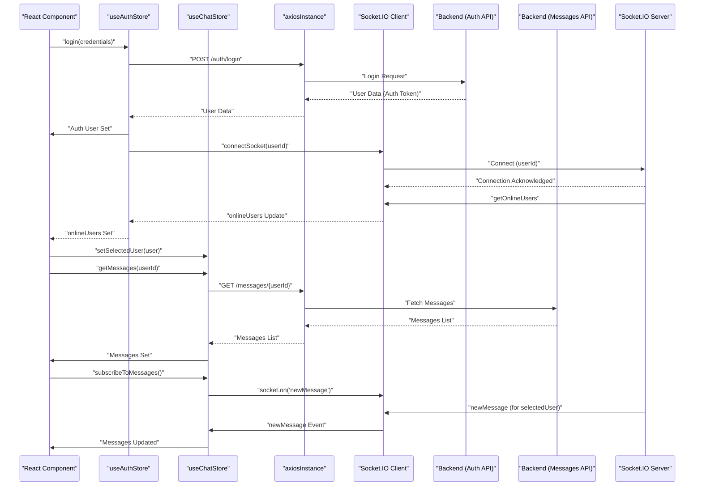

# State Management and Utilities

This section details the core mechanisms for managing application state and providing essential utility functions within the frontend. The application leverages `zustand` for reactive, lightweight state management and `axios` for HTTP requests, ensuring a streamlined and efficient data flow.

<TOC />

## Core State Management Stores

The frontend employs two primary Zustand stores: `useAuthStore` and `useChatStore`. These stores encapsulate related state and logic, promoting modularity and maintainability.

### `useAuthStore`

The `useAuthStore` manages all authentication-related state, user profile information, and WebSocket connection status. It centralizes authentication logic, providing a single source of truth for the user's logged-in status and online presence.

**Key Responsibilities:**

*   **Authentication Flow:** Handles user signup, login, logout, and persistent authentication checks.
*   **User Profile:** Stores the authenticated user's data (`authUser`).
*   **Loading States:** Tracks various loading states (`isSigningUp`, `isLoggingIn`, `isCheckingAuth`, `isUpdatingProfile`) to provide UI feedback.
*   **Online Users:** Maintains a list of currently online users received via WebSocket.
*   **WebSocket Management:** Initializes and disconnects the Socket.IO connection, associating the user's ID with their socket for real-time features.

**Authentication Check Example (`useAuthStore.js`)**

The `checkAuth` action is crucial for verifying the user's session upon application load, ensuring a smooth user experience.

```javascript showLineNumbers {13-25}
// frontend/src/store/useAuthStore.js
import { create } from "zustand";
import { axiosInstance } from "../lib/axios";
import toast from "react-hot-toast";
import { io } from "socket.io-client";

const BASE_URL = import.meta.env.MODE == "development" ? "http://localhost:5001": "/";

export const useAuthStore = create((set, get) => ({
    authUser: null,
    isSigningUp: false,
    // ... other state ...
    isCheckingAuth: true,
    onlineUsers: [],
    socket: null,

    checkAuth: async () => {
        try {
            const res = await axiosInstance.get("/auth/check");
            set({ authUser: res.data });
            get().connectSocket(); // Connect socket upon successful auth
        } catch (error) {
            set({ authUser: null });
            console.log("Error in checkAuth: ", error);
        } finally {
            set({ isCheckingAuth: false });
        }
    },
    // ... other actions ...
}));
```

*   **Explanation:** The `checkAuth` function makes a GET request to `/auth/check`. If successful, `authUser` is set, and the `connectSocket` action is invoked to establish a WebSocket connection.
*   **View on GitHub:** [useAuthStore.js#L13-L25](https://github.com/shinymack/Chat-App-MERN/blob/main/frontend/src/store/useAuthStore.js#L13-L25)

### `useChatStore`

The `useChatStore` is dedicated to managing all chat-related data, including messages, user lists, friend requests, and selected chat partners.

**Key Responsibilities:**

*   **Messages:** Stores the active chat messages for the `selectedUser`.
*   **Users/Friends:** Manages the list of friends the authenticated user has.
*   **Friend Requests:** Handles pending and sent friend requests.
*   **Selected User:** Tracks the currently selected user for chat.
*   **Loading States:** Manages loading states for fetching users and messages.
*   **Friendship Actions:** Provides actions for sending, accepting, rejecting, and removing friend requests/friends.
*   **Message Actions:** Fetches and sends messages to a `selectedUser`.
*   **Real-time Messages:** Subscribes to and unsubscribes from WebSocket events for new messages.

**Sending a Friend Request Example (`useChatStore.js`)**

This action demonstrates how the store interacts with the backend to manage friend relationships.

```javascript showLineNumbers {49-56}
// frontend/src/store/useChatStore.js
import toast from "react-hot-toast";
import { create } from "zustand";
import { axiosInstance } from "../lib/axios";
import { useAuthStore } from "./useAuthStore";

export const useChatStore = create((set, get) => ({
    messages:[],
    users: [],
    pendingRequests: [],
    sentRequests: [],
    selectedUser: null,
    // ... other state ...

    sendFriendRequest: async (identifier) => {
        try {
            const res = await axiosInstance.post("/friends/request/send", { identifier });
            toast.success(res.data.message);
            // Refresh sent requests list
            get().getSentRequests();
        } catch (error) {
            toast.error(error.response?.data?.message || "Failed to send request");
        }
    },
    // ... other actions ...
}));
```

*   **Explanation:** The `sendFriendRequest` function sends a POST request to the `/friends/request/send` endpoint. Upon success, a toast notification is shown, and the `getSentRequests` action is called to update the list of sent requests.
*   **View on GitHub:** [useChatStore.js#L49-L56](https://github.com/shinymack/Chat-App-MERN/blob/main/frontend/src/store/useChatStore.js#L49-L56)

**Real-time Message Subscription Example (`useChatStore.js`)**

This showcases how `useChatStore` leverages the `socket` from `useAuthStore` to listen for new messages.

```javascript showLineNumbers {135-144}
// frontend/src/store/useChatStore.js
// ... imports and store setup ...

export const useChatStore = create((set, get) => ({
    // ... state and other actions ...

    subscribeToMessages: () => {
        const { selectedUser } = get();
        if(!selectedUser) return;

        const socket = useAuthStore.getState().socket; // Access socket from auth store
        socket.on("newMessage", (newMessage) => {
            if(newMessage.senderId !== selectedUser._id) return
            set({
                messages: [...get().messages, newMessage]
            })
        })
    },

    unsubscribeFromMessages: () => {
        const socket = useAuthStore.getState().socket;
        socket.off("newMessage");
    },

    setSelectedUser: (selectedUser) => set({selectedUser})
}));
```

*   **Explanation:** `subscribeToMessages` accesses the WebSocket `socket` instance from `useAuthStore` using `useAuthStore.getState().socket`. It then registers an event listener for "newMessage" and updates the `messages` array if the message is from the currently `selectedUser`.
*   **View on GitHub:** [useChatStore.js#L135-L144](https://github.com/shinymack/Chat-App-MERN/blob/main/frontend/src/store/useChatStore.js#L135-L144)

## Utility Functions and HTTP Client

Beyond state management, the frontend provides shared utilities for common tasks and a centralized HTTP client for API interactions.

### `axiosInstance`

The `axiosInstance` is a pre-configured Axios client, ensuring consistent HTTP request behavior across the application. It automatically includes credentials for cross-origin requests and sets the base URL based on the environment (development or production).

```javascript showLineNumbers {3-6}
// frontend/src/lib/axios.js
import axios from "axios";

export const axiosInstance = axios.create({
    baseURL: import.meta.env.MODE == "development" ? "http://localhost:5001/api": "/api",
    withCredentials: true,
});
```

*   **Explanation:** This snippet defines `axiosInstance`, configuring it with a dynamic `baseURL` and `withCredentials: true` to send cookies (like session tokens) with requests.
*   **View on GitHub:** [axios.js#L3-L6](https://github.com/shinymack/Chat-App-MERN/blob/main/frontend/src/lib/axios.js#L3-L6)

### `utils.js`

This file houses various helper functions. Currently, it includes `formatMessageTime`, which is used to display message timestamps in a user-friendly format.

```javascript showLineNumbers {1-10}
// frontend/src/lib/utils.js
export function formatMessageTime(date) {
    return new Date(date).toLocaleTimeString("en-US", {
        year: "numeric",
        month: "short",
        day:"2-digit",
        hour: "2-digit",
        minute: "2-digit",
        hour12: true,
    });
}
```

*   **Explanation:** `formatMessageTime` takes a date string or object and returns a formatted time string, including year, month, day, and 12-hour time.
*   **View on GitHub:** [utils.js#L1-L10](https://github.com/shinymack/Chat-App-MERN/blob/main/frontend/src/lib/utils.js#L1-L10)

## Key Integration Points

### Frontend State Flow Diagram

The following diagram illustrates the high-level interaction between React components, Zustand stores, the HTTP client, and WebSocket.


```mermaid
graph TD
    A["React Components"]
    B["useAuthStore (Zustand)"]
    C["useChatStore (Zustand)"]
    D["axiosInstance"]
    E["Socket.IO Client"]
    F["Backend API (Node/Express)"]
    G["Socket.IO Server"]

    A -->|Calls actions on| B
    A -->|Calls actions on| C
    B -->|Uses for Auth API| D
    C -->|Uses for Chat/Friends API| D
    B -->|Initializes/Manages| E
    B --.->|"Publishes 'onlineUsers' "| A
    C -->|"Subscribes 'newMessage' from"| E
    E -->|Connects to| G
    D -->|Sends requests to| F
    F -->|Interacts with| G
    G -->|"Emits 'getOnlineUsers'"| E
    G -->|"Emits 'newMessage'"| E
```


### Authentication and Messaging Flow

This sequence diagram details the interaction during a user's login and subsequent real-time message reception.





## Best Practices and Insights

*   **Centralized State:** By using Zustand, state logic is collocated with the state itself, making it easy to reason about and test.
*   **Separation of Concerns:** `useAuthStore` and `useChatStore` clearly separate authentication from chat-specific functionalities, preventing monolithic stores.
*   **Reusability with `axiosInstance`:** A single `axiosInstance` simplifies API interactions, ensures consistent headers, and manages credentials automatically.
*   **Modular Utilities:** The `utils.js` file provides a clear place for shared, pure utility functions, keeping components clean.
*   **Reactive UI:** Zustand's re-render optimization ensures that components only update when relevant slices of state change, promoting performance.
*   **WebSocket Integration:** The integration of Socket.IO into `useAuthStore` ensures that the WebSocket connection is managed lifecycle-wise with the user's authentication status, and then shared to other stores like `useChatStore` for specific event subscriptions. This makes it easier to manage the socket instance globally without direct prop drilling.

Next: [Styling, Build, and Configuration](./3.3_styling-build-and-configuration.mdx)