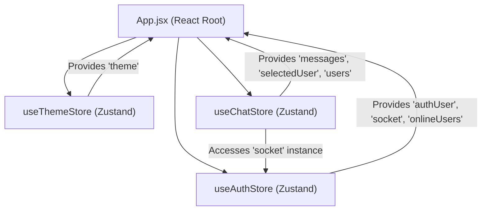
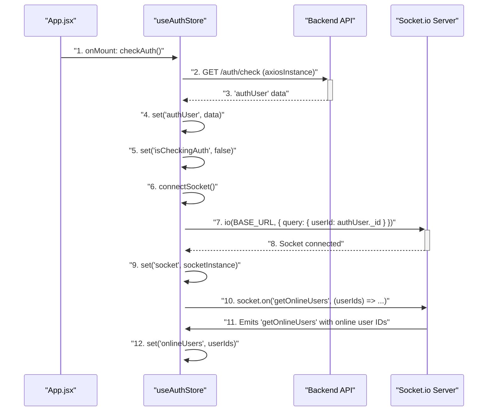

---
title: "State Management"
description: "Explains how application-wide state, including authentication, chat, and theme, is managed using Zustand stores."
sidebar_position: 32
---

# State Management

<TOC />

This section details how the application manages its global state using [Zustand](https://zustand-bear.github.io/zustand/), a lightweight, fast, and scalable state management solution for React. We leverage Zustand to create distinct, focused stores for different domains like authentication, chat, and application theme. This modular approach ensures better organization, reusability, and maintainability of our application's state.

## Zustand: A Concise Overview

Zustand offers a simple API for creating stores that can be consumed by React components. It's built on a small, fast, and unopinionated core, making it an excellent choice for managing complex global state without boilerplate.

Key characteristics:
*   **Simple API**: Easy to create and consume stores.
*   **Hooks-based**: Integrates seamlessly with React hooks.
*   **No boilerplate**: Minimal code needed to define and use stores.
*   **Middleware support**: Extensible with various middleware for logging, persistence, etc. (though not extensively used in this context for simplicity).

## Core State Stores

The application primarily uses three Zustand stores: `useAuthStore`, `useChatStore`, and `useThemeStore`.

### 1. Authentication Store (`useAuthStore`)

The `useAuthStore` manages all authentication-related state, including the authenticated user's data, login/signup status, and most importantly, the WebSocket connection for real-time features.

**Location:** [frontend/src/store/useAuthStore.js](https://github.com/shinymack/Chat-App-MERN/blob/main/frontend/src/store/useAuthStore.js)

#### Key Responsibilities:

*   **`authUser`**: Stores the currently authenticated user object.
*   **Authentication Status Flags**: `isSigningUp`, `isLoggingIn`, `isCheckingAuth`, `isUpdatingProfile` provide real-time feedback on authentication processes.
*   **`onlineUsers`**: An array of user IDs currently online, received via WebSocket.
*   **`socket`**: Holds the Socket.IO client instance, crucial for real-time communication.
*   **`checkAuth()`**: Verifies user authentication status with the backend on app load. If authenticated, it initiates the WebSocket connection.
*   **`signup()`, `login()`, `logout()`, `updateProfile()`**: Handle user authentication actions by interacting with the backend API.
*   **`connectSocket()`**: Establishes a WebSocket connection with the backend, sending the authenticated user's ID. It also sets up a listener for the `getOnlineUsers` event.
*   **`disconnectSocket()`**: Closes the WebSocket connection upon logout.

#### Snippet: `useAuthStore` Initialization and Socket Connection

This snippet illustrates how the `useAuthStore` is defined, including key state variables and the `connectSocket` method.

```javascript
// frontend/src/store/useAuthStore.js
// View on GitHub: https://github.com/shinymack/Chat-App-MERN/blob/main/frontend/src/store/useAuthStore.js#L1-L79
export const useAuthStore = create((set, get) => ({
    authUser: null,
    isSigningUp: false,
    isLoggingIn: false,
    isUpdatingProfile: false,
    isCheckingAuth: true,
    onlineUsers: [],
    socket: null,

    checkAuth: async () => { /* ... */ },
    signup: async (data) => { /* ... */ },
    logout: async () => { /* ... */ },
    login: async (data) => { /* ... */ },
    updateProfile: async (data) => { /* ... */ },

    connectSocket: () => {
        const { authUser } = get();
        if(!authUser || get().socket?.connected) return;

        const socket = io(BASE_URL, {
            query: {
                userId : authUser._id,
            },
        });
        socket.connect();
        set({socket: socket});

        socket.on("getOnlineUsers", (userIds) => {
            set({onlineUsers: userIds})
        }); 
    },
    disconnectSocket : () => {
        if(get().socket?.connected) get().socket.disconnect();
    }
}));
```

### 2. Chat Store (`useChatStore`)

The `useChatStore` is responsible for managing all chat-related data, including messages, user lists, and friend requests. It also handles real-time message updates by subscribing to the WebSocket connection from `useAuthStore`.

**Location:** [frontend/src/store/useChatStore.js](https://github.com/shinymack/Chat-App-MERN/blob/main/frontend/src/store/useChatStore.js)

#### Key Responsibilities:

*   **`messages`**: Stores the messages for the currently selected chat.
*   **`users`**: A list of friends (or users available for chat).
*   **`pendingRequests`, `sentRequests`**: Manage incoming and outgoing friend requests.
*   **`selectedUser`**: The user currently active in the chat interface.
*   **Loading States**: `isUsersLoading`, `isMessagesLoading` to indicate data fetching status.
*   **Friend Management**: `getFriends()`, `getPendingRequests()`, `getSentRequests()`, `sendFriendRequest()`, `acceptFriendRequest()`, `rejectFriendRequest()`, `removeFriend()` handle friend-related operations.
*   **Message Management**: `getMessages()`, `sendMessage()` interact with the backend for message operations.
*   **Real-time Messages**:
    *   **`subscribeToMessages()`**: Listens for `newMessage` events from the WebSocket (accessed via `useAuthStore`) to update the `messages` state in real-time.
    *   **`unsubscribeFromMessages()`**: Cleans up the `newMessage` listener.

#### Snippet: `useChatStore` and Real-time Message Subscription

This snippet demonstrates how `useChatStore` accesses the `socket` instance from `useAuthStore` to subscribe to real-time `newMessage` events.

```javascript
// frontend/src/store/useChatStore.js
// View on GitHub: https://github.com/shinymack/Chat-App-MERN/blob/main/frontend/src/store/useChatStore.js#L1-L157
export const useChatStore = create((set, get) => ({
    messages:[],
    users: [],
    pendingRequests: [],
    sentRequests: [],
    selectedUser: null,
    // ... other states and actions

    subscribeToMessages: () => {
        const { selectedUser } = get();
        if(!selectedUser) return;
        
        // Access socket instance from useAuthStore
        const socket = useAuthStore.getState().socket; 
        socket.on("newMessage", (newMessage) => {
            if(newMessage.senderId !== selectedUser._id) return
            set({
                messages: [...get().messages, newMessage]
            })
        })
    },

    unsubscribeFromMessages: () => {
        const socket = useAuthStore.getState().socket;
        socket.off("newMessage");
    },
    
    setSelectedUser: (selectedUser) => set({selectedUser})
}));
```

### 3. Theme Store (`useThemeStore`)

The `useThemeStore` is a simple store managing the application's visual theme, persisting it to `localStorage`.

**Location:** [frontend/src/store/useThemeStore.js](https://github.com/shinymack/Chat-App-MERN/blob/main/frontend/src/store/useThemeStore.js)

#### Key Responsibilities:

*   **`theme`**: Stores the current theme name (e.g., "dark", "light").
*   **`setTheme(theme)`**: Updates the theme state and persists it to `localStorage` for continuity across sessions.

#### Snippet: `useThemeStore` Definition

```javascript
// frontend/src/store/useThemeStore.js
// View on GitHub: https://github.com/shinymack/Chat-App-MERN/blob/main/frontend/src/store/useThemeStore.js#L1-L8
import { create } from "zustand";

export const useThemeStore = create((set) => ({
    theme: localStorage.getItem("chat-theme") || "dark",
    setTheme: (theme) => {
        localStorage.setItem("chat-theme", theme);
        set({theme});
    }
}))
```

## Application-wide Integration (`App.jsx`)

The `App.jsx` component serves as the entry point for integrating these Zustand stores into the React component tree. It orchestrates initial authentication checks and applies the theme globally.

**Location:** [frontend/src/App.jsx](https://github.com/shinymack/Chat-App-MERN/blob/main/frontend/src/App.jsx)

#### Key Integration Points:

*   **Theme Application**: The `data-theme` attribute on the root `div` is dynamically set based on the `theme` state from `useThemeStore`.
*   **Authentication Check**: `useEffect` hook calls `checkAuth()` from `useAuthStore` once on component mount to verify the user's session.
*   **Conditional Rendering**: The application displays a loader while `isCheckingAuth` is true, ensuring a smooth user experience during the initial authentication check.
*   **Route Protection**: Routes are protected based on `authUser` status, redirecting users to login or home pages as appropriate.

#### Snippet: `App.jsx` Initial Setup and Theme/Auth Usage

```jsx
// frontend/src/App.jsx
// View on GitHub: https://github.com/shinymack/Chat-App-MERN/blob/main/frontend/src/App.jsx#L1-L47
import { useEffect } from 'react'
import { Routes, Route, Navigate } from 'react-router-dom'
import Navbar from './components/Navbar'
import HomePage from './pages/HomePage'
import SignUpPage from './pages/SignUpPage' 
import LoginPage from './pages/LoginPage' 
import SettingsPage from './pages/SettingsPage' 
import ProfilePage from './pages/ProfilePage'

import { useThemeStore } from './store/useThemeStore'
import { useAuthStore } from './store/useAuthStore'; 
import { Loader } from 'lucide-react'
import { Toaster } from 'react-hot-toast'

const App = () => {
  const { authUser, checkAuth, isCheckingAuth, onlineUsers } = useAuthStore();
  const { theme } = useThemeStore();

  useEffect(() => {
    checkAuth(); // Initial authentication check
  }, [checkAuth]);

  if(isCheckingAuth && !authUser) return (
      <div className='flex items-center justify-center h-screen'>
        <Loader className='size-10 animate-spin' />
      </div>
  )

  return (
    <div className='' data-theme={theme}> {/* Apply theme */}
      <Navbar />
      <Toaster />
      <Routes>
        <Route path='/' element={authUser ? <HomePage />: <Navigate to='/login' />} />
        {/* ... other routes ... */}
      </Routes>
    </div> 
  )
}

export default App
```

## State Management Flow

The following diagram illustrates the high-level interaction between `App.jsx` and the Zustand stores.





## Authentication and Socket Connection Flow

This sequence diagram details the process of authentication, checking user status, and establishing a WebSocket connection.





## Key Integration Points

*   **Centralized Authentication**: `useAuthStore` acts as the single source of truth for user authentication status and the WebSocket connection. This simplifies access control and real-time feature integration across the application.
*   **Modular State**: By separating concerns into `Auth`, `Chat`, and `Theme` stores, the application maintains a clear structure. This makes individual features easier to understand, test, and maintain.
*   **Cross-Store Communication**: `useChatStore` intelligently accesses the `socket` instance from `useAuthStore.getState()` when needed. This pattern allows stores to remain independent while still leveraging shared resources, promoting a cleaner dependency graph.
*   **Real-time Features**: The integration of Socket.IO directly into `useAuthStore` and its consumption by `useChatStore` demonstrates a powerful way to implement real-time features like online user status and instant message delivery.
*   **Persistence**: `useThemeStore` utilizes `localStorage` for simple, client-side persistence of user preferences, ensuring a consistent experience across sessions.
*   **Lifecycle Management**: `App.jsx` ensures that authentication checks and initial state setup (like connecting the socket) happen at the appropriate time in the application's lifecycle (`useEffect`).

This state management architecture, built with Zustand, provides a robust, scalable, and easy-to-understand foundation for the chat application, handling complex requirements like authentication, real-time communication, and user preferences efficiently.

Next: [Pages and Routing](./3.3_pages-and-routing.mdx)
```