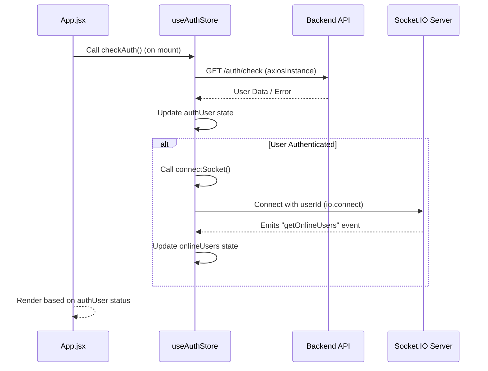
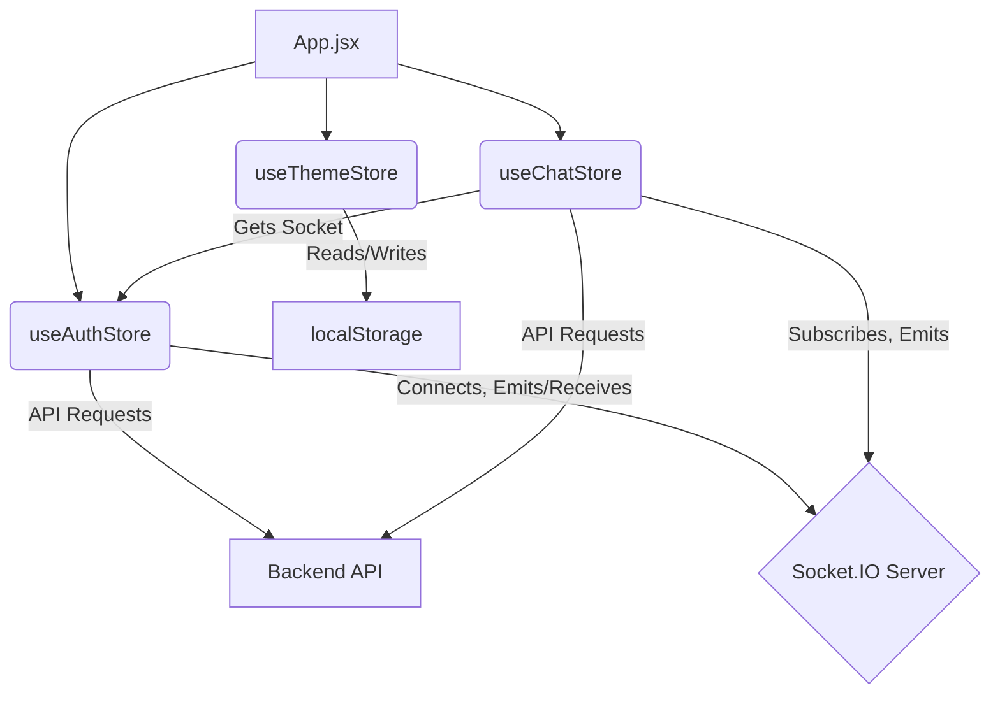

---
title: "State Management"
description: "Explains how global and local state is managed across the frontend application using Zustand."
sidebar_position: 32
---

# State Management

<TOC />

This section details the state management strategy employed in the frontend application, leveraging **Zustand** for both global and local state. Zustand is a lightweight, performant, and flexible state management solution that minimizes boilerplate and integrates seamlessly with React. Its philosophy emphasizes creating modular, observable stores that components can subscribe to, ensuring efficient re-renders and a clear separation of concerns.

The application utilizes three primary global Zustand stores: `useAuthStore`, `useChatStore`, and `useThemeStore`, each dedicated to managing specific facets of the application's state.

## Core State Management with Zustand

Zustand simplifies state management by allowing the creation of "stores" that are essentially custom React hooks. These hooks provide access to the state and functions to modify it, making state management intuitive and robust. The `create` function from `zustand` is used to define a store, which can then be imported and used in any React component.

### Zustand Stores Overview

The following table summarizes the key Zustand stores and their primary responsibilities:

| Store Name       | Purpose                                                    | Key State Variables                     | Interactions                                        |
| :--------------- | :--------------------------------------------------------- | :-------------------------------------- | :-------------------------------------------------- |
| `useAuthStore`   | Manages user authentication, session, and online status.   | `authUser`, `isCheckingAuth`, `onlineUsers`, `socket` | Backend API, Socket.IO                  |
| `useChatStore`   | Handles chat messages, friend lists, and requests.         | `messages`, `users`, `selectedUser`, `pendingRequests` | Backend API, `useAuthStore` (for socket) |
| `useThemeStore`  | Controls the application's visual theme (e.g., dark/light). | `theme`                                 | `localStorage`                              |

## Global Stores

### Authentication Store (`useAuthStore`)

The `useAuthStore` is central to managing user identity and session across the application. It handles user login, signup, logout, profile updates, and most importantly, manages the WebSocket connection for real-time features like displaying online users.

[View `frontend/src/store/useAuthStore.js` on GitHub](https://github.com/shinymack/Chat-App-MERN/blob/main/frontend/src/store/useAuthStore.js)

**Key Functionalities:**

*   **User Authentication:** Manages the `authUser` object (containing user data) and related loading states (`isSigningUp`, `isLoggingIn`, `isUpdatingProfile`).
*   **Session Management:** `checkAuth` verifies the user's session with the backend on application load.
*   **Real-time Connectivity:** Establishes and manages a `socket.io` connection, tracking `onlineUsers` based on server updates.
*   **Error Handling:** Utilizes `react-hot-toast` for user feedback on authentication actions.

**Code Snippet: `useAuthStore` Initialization and Core Actions**

The store is initialized with various state properties and actions that interact with the backend API and the Socket.IO server.

```javascript
// frontend/src/store/useAuthStore.js
import { create } from "zustand";
import { axiosInstance } from "../lib/axios";
import toast from "react-hot-toast";
import { io } from "socket.io-client";

const BASE_URL = import.meta.env.MODE == "development" ? "http://localhost:5001": "/";

export const useAuthStore = create((set, get) => ({
    authUser: null,
    isSigningUp: false,
    isLoggingIn: false,
    isUpdatingProfile: false,
    isCheckingAuth: true,
    onlineUsers: [],
    socket: null,

    checkAuth: async () => {
        try {
            const res = await axiosInstance.get("/auth/check");
            set({ authUser: res.data });
            get().connectSocket(); // Connect socket if authenticated
        } catch (error) {
            set({ authUser: null });
            console.log("Error in checkAuth: ", error);
        } finally {
            set({ isCheckingAuth: false });
        }
    },
    // ... other auth actions like signup, login, logout, updateProfile
    connectSocket: () => { /* ... */ },
    disconnectSocket : () => { /* ... */ }
}));
```
[View on GitHub](https://github.com/shinymack/Chat-App-MERN/blob/main/frontend/src/store/useAuthStore.js#L5-L35)

**Insights:** The `get()` function within Zustand actions is crucial for accessing the current state or other actions within the same store, enabling sequential logic like calling `connectSocket()` after a successful `checkAuth` or `login`. The `isCheckingAuth` state prevents premature rendering of authenticated routes, ensuring a smooth user experience during initial load.

**Authentication Flow with Socket.IO**

The following sequence diagram illustrates the `checkAuth` and `connectSocket` flow within the `useAuthStore`, demonstrating its interaction with the backend API and the Socket.IO server.





### Chat Store (`useChatStore`)

The `useChatStore` is responsible for all chat-related data, including messages, managing friend lists, and handling friend requests. It integrates with the `useAuthStore` to leverage the existing WebSocket connection for real-time message updates.

[View `frontend/src/store/useChatStore.js` on GitHub](https://github.com/shinymack/Chat-App-MERN/blob/main/frontend/src/store/useChatStore.js)

**Key Functionalities:**

*   **Messaging:** Stores `messages` for the `selectedUser` and provides actions to `getMessages` and `sendMessage`.
*   **Friends Management:** Manages `users` (friends list), `pendingRequests`, and `sentRequests` with actions for fetching, sending, accepting, rejecting, and removing friends.
*   **Real-time Messages:** Subscribes to the "newMessage" WebSocket event using the socket from `useAuthStore` to receive incoming messages.
*   **UI State:** Controls `isFriendBoxOpen` for the friends list UI and loading states like `isUsersLoading`, `isMessagesLoading`.

**Code Snippet: `useChatStore` Initialization and Messaging Actions**

This snippet shows the initial state for chat functionalities and core methods for fetching and sending messages.

```javascript
// frontend/src/store/useChatStore.js
import toast from "react-hot-toast";
import { create } from "zustand";
import { axiosInstance } from "../lib/axios";
import { useAuthStore } from "./useAuthStore";

export const useChatStore = create((set, get) => ({
    messages:[],
    users: [],
    pendingRequests: [],
    sentRequests: [],
    selectedUser: null,
    isUsersLoading: false,
    isMessagesLoading: false,
    isFriendBoxOpen: false,

    toggleFriendsBox: () => set(state => ({ isFriendsBoxOpen: !state.isFriendsBoxOpen })),

    getFriends: async () => { /* ... */ },
    getPendingRequests: async () => { /* ... */ },
    getSentRequests: async () => { /* ... */ },
    sendFriendRequest: async (identifier) => { /* ... */ },
    acceptFriendRequest: async (senderId) => { /* ... */ },
    rejectFriendRequest: async (senderId) => { /* ... */ },
    removeFriend: async (friendId) => { /* ... */ },

    getMessages: async (userId) => {
        set({isMessagesLoading: true});
        try {
            const res = await axiosInstance.get(`/messages/${userId}`);
            set({messages: res.data});
        } catch (error) {
            toast.error(error.response.data.message);
        } finally {
            set({isMessagesLoading: false});
        }
    },
    sendMessage: async (messageData) => {
        const {selectedUser, messages} = get();
        try {
            const res = await axiosInstance.post(`/messages/send/${selectedUser._id}`, messageData);
            set({messages : [...messages, res.data]});
        } catch (error){
            toast.error(error.response.data.message);
        }
    },
    // ... socket subscription/unsubscription actions
    setSelectedUser: (selectedUser) => set({selectedUser})
}));
```
[View on GitHub](https://github.com/shinymack/Chat-App-MERN/blob/main/frontend/src/store/useChatStore.js#L7-L29)

**Insights:** The `subscribeToMessages` and `unsubscribeFromMessages` actions demonstrate how Zustand stores can interact. `useChatStore` directly accesses the `socket` instance from `useAuthStore` via `useAuthStore.getState().socket`. This pattern allows for sharing state and functionality between different, but related, Zustand stores without creating tight coupling. It also showcases how to handle real-time updates by appending new messages to the existing `messages` array.

### Theme Store (`useThemeStore`)

The `useThemeStore` is a simple, yet effective, store for managing the application's visual theme. It ensures that the user's preferred theme persists across sessions by leveraging `localStorage`.

[View `frontend/src/store/useThemeStore.js` on GitHub](https://github.com/shinymack/Chat-App-MERN/blob/main/frontend/src/store/useThemeStore.js)

**Key Functionalities:**

*   **Theme Storage:** Stores the current `theme` (e.g., "dark") in its state.
*   **Persistence:** Reads the initial theme from `localStorage` and updates it whenever the theme changes.

**Code Snippet: `useThemeStore` Definition**

```javascript
// frontend/src/store/useThemeStore.js
import { create } from "zustand";

export const useThemeStore = create((set) => ({
    theme: localStorage.getItem("chat-theme") || "dark", // Initialize from localStorage or default to 'dark'
    setTheme: (theme) => {
        localStorage.setItem("chat-theme", theme); // Persist theme to localStorage
        set({theme}); // Update state
    }
}))
```
[View on GitHub](https://github.com/shinymack/Chat-App-MERN/blob/main/frontend/src/store/useThemeStore.js#L3-L8)

**Insights:** This store exemplifies Zustand's simplicity for managing straightforward global states. The direct interaction with `localStorage` within the `setTheme` action ensures immediate persistence without requiring additional middleware.

## Application-wide State Consumption (`App.jsx`)

The `App.jsx` component serves as the entry point for the frontend application and acts as a primary consumer of the global state stores. It demonstrates how these stores influence the overall UI, routing, and initial data loading.

[View `frontend/src/App.jsx` on GitHub](https://github.com/shinymack/Chat-App-MERN/blob/main/frontend/src/App.jsx)

**Key Responsibilities in State Management:**

*   **Initial Authentication Check:** Triggers `useAuthStore.checkAuth()` on component mount to verify user session.
*   **Global Theme Application:** Applies the `theme` from `useThemeStore` to the root `div` element, affecting the entire application's styling.
*   **Protected Routing:** Uses the `authUser` state from `useAuthStore` to conditionally render routes, redirecting unauthenticated users to the login page and authenticated users away from auth pages.
*   **Loading Indicators:** Displays a global loader if `isCheckingAuth` is true, providing a better user experience during the initial authentication check.

**Code Snippet: `App.jsx` State Consumption and Routing**

This snippet highlights how `App.jsx` consumes state from `useAuthStore` and `useThemeStore` to manage routing and apply global styles.

```javascript
// frontend/src/App.jsx
import Navbar from './components/Navbar'
import { Routes, Route, Navigate } from 'react-router-dom'
import { useEffect } from 'react'
// ... other page imports
import { useThemeStore } from './store/useThemeStore'
import { useAuthStore } from './store/useAuthStore';
import { Loader } from 'lucide-react'
import { Toaster } from 'react-hot-toast'

const App = () => {
  const { authUser, checkAuth, isCheckingAuth, onlineUsers } = useAuthStore();
  const { theme } = useThemeStore();

  useEffect(() => {
    checkAuth(); // Trigger auth check on app load
  }, [checkAuth]); // Dependency array ensures checkAuth is stable

  if(isCheckingAuth && !authUser) return (
      <div className='flex items-center justify-center h-screen'>
        <Loader className='size-10 animate-spin' /> {/* Global loading indicator */}
      </div>
  )

  return (
    <div className='' data-theme={theme}> {/* Apply global theme */}
      <Navbar />
      <Toaster /> {/* Global toast notifications */}
      <Routes>
        <Route path='/' element={authUser ? <HomePage />: <Navigate to='/login' />} />
        <Route path='/signup' element={ !authUser ? <SignUpPage />: <Navigate to='/' />} />
        <Route path='/login' element={!authUser ? <LoginPage />: <Navigate to='/' />} />
        <Route path='/settings' element={<SettingsPage />} />
        <Route path='/profile' element={authUser ? <ProfilePage />: <Navigate to='/login' />} />
      </Routes>
    </div>
  )
}

export default App
```
[View on GitHub](https://github.com/shinymack/Chat-App-MERN/blob/main/frontend/src/App.jsx#L18-L43)

**Insights:** The `useEffect` hook ensures `checkAuth` is called only once on component mount, and the `isCheckingAuth` state provides a robust mechanism to prevent rendering sensitive content before the authentication status is confirmed. The `data-theme` attribute on the root `div` is a common pattern for applying CSS themes globally, allowing styling libraries or custom CSS to react to the `theme` state.

## Key Integration Points

State management is intricately woven throughout the application, defining how different parts interact and react to changes.

### State Management Architecture

The diagram below illustrates the high-level architecture of state management within the frontend, showing how `App.jsx` interacts with the Zustand stores, and how these stores interact with external services.





### Authentication Flow and UI Reactions

*   The `useAuthStore`'s `checkAuth`, `login`, and `signup` actions are the primary entry points for managing user sessions.
*   Upon successful authentication, `authUser` is set, triggering a re-render in `App.jsx`, which then redirects to `HomePage`.
*   Crucially, `connectSocket()` is called after successful authentication, establishing the WebSocket connection necessary for real-time features.
*   If authentication fails or a user logs out, `authUser` becomes `null`, and `App.jsx` navigates the user to the `LoginPage`.

### Real-time Communication Integration

*   The `useAuthStore` is responsible for initializing and maintaining the `socket.io` client instance. It handles general events like `getOnlineUsers`.
*   The `useChatStore` subscribes to specific chat-related events (e.g., `newMessage`) using the socket provided by `useAuthStore`. This modular approach keeps chat-specific real-time logic separate while reusing the established socket connection. This is a best practice for scalability and maintainability, ensuring that socket management is centralized.

### Theme Persistence

*   The `useThemeStore` demonstrates a simple, yet effective, pattern for persisting user preferences. By directly interacting with `localStorage`, the chosen theme is remembered across browser sessions, enhancing user experience.
*   `App.jsx` consuming `theme` from `useThemeStore` ensures that the chosen theme is applied globally to the entire application's root element.

### Best Practices and Scalability

*   **Modularity:** Each Zustand store focuses on a specific domain (auth, chat, theme), promoting clear separation of concerns and making the codebase easier to understand, test, and maintain.
*   **Performance:** Zustand's selector-based approach ensures that components only re-render when the specific slice of state they consume changes, optimizing performance.
*   **Direct State Access (`get()`):** Using `get()` within actions to access current state or other actions allows for complex, sequential logic within a single store (e.g., `connectSocket()` after `checkAuth()`) or between stores (`useChatStore` accessing `useAuthStore.getState().socket`).
*   **Immutability:** State updates typically involve creating new arrays or objects (e.g., `[...messages, res.data]`), adhering to React's best practices for immutability and ensuring efficient change detection.
*   **Error Handling:** Consistent use of `react-hot-toast` across all store actions provides immediate feedback to the user regarding the success or failure of an operation, improving the user experience.

Next: [Pages and Navigation](./3.3_pages-and-navigation.mdx)
```