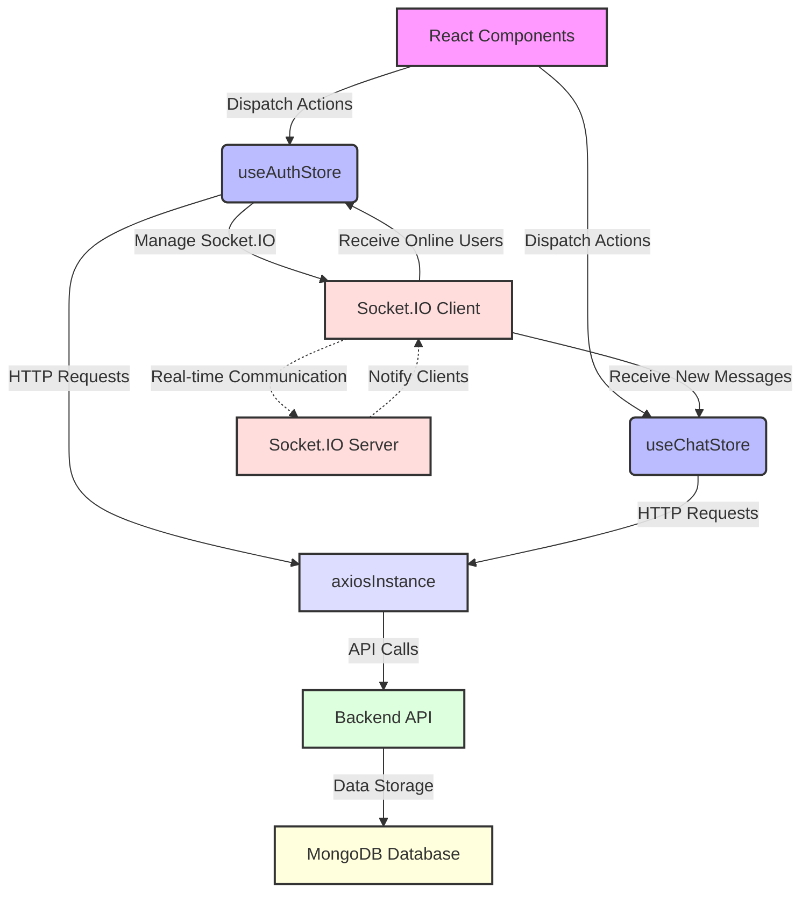

```mdx
---
title: "State Management & Data Interaction"
description: "Details on how global application state is managed using Zustand and data is fetched from the backend using Axios."
sidebar_position: 32
---

# State Management & Data Interaction

<TOC />

This section delves into the core mechanisms for managing application state and interacting with the backend API. We explore how global state is maintained using Zustand, a lightweight state management library, and how data is fetched and sent via Axios, an HTTP client. Furthermore, it covers the integration of Socket.IO for real-time functionalities, ensuring a dynamic and responsive user experience.

## 1. API Communication with Axios

The application leverages Axios for making HTTP requests to the backend API. A custom Axios instance is configured to streamline API interactions, handling base URLs and credential management consistently across the frontend.

### 1.1. Axios Instance Configuration

The `axios.js` file establishes a pre-configured Axios instance, `axiosInstance`, which serves as the primary tool for all API calls within the frontend.

**WHAT it does:**
This configuration creates a custom Axios instance with specific defaults:
*   `baseURL`: Dynamically set based on the `import.meta.env.MODE`. In `development`, it points to `http://localhost:5001/api`, while in `production`, it defaults to `/api` (relative path, assuming the frontend and backend are served from the same domain or a proxy handles the `/api` route).
*   `withCredentials`: Set to `true` to ensure that cookies, including session IDs for authentication, are sent with cross-origin requests.

**WHY it's designed this way:**
*   **Environment Agnostic**: The `baseURL` ensures that the application correctly targets the backend API whether running locally for development or deployed to a production environment without requiring manual changes.
*   **Authentication Handling**: `withCredentials: true` is crucial for MERN stack applications that rely on cookie-based authentication (e.g., `express-session`). It allows the backend to identify the authenticated user based on the session cookie sent with each request.
*   **Consistency**: Using a single `axiosInstance` centralizes API configuration, making it easier to manage headers, interceptors, or error handling globally if needed in the future.

```javascript filename="frontend/src/lib/axios.js"
import axios from "axios";

export const axiosInstance = axios.create({
    baseURL: import.meta.env.MODE == "development" ? "http://localhost:5001/api": "/api",
    withCredentials: true,
});
```
<p align="right">Source: <a href="https://github.com/shinymack/Chat-App-MERN/blob/main/frontend/src/lib/axios.js#L1-L6">frontend/src/lib/axios.js#L1-L6</a></p>

## 2. Global State Management with Zustand

Zustand is employed for managing the global application state. Its minimalistic API and hook-based approach make it an efficient choice for React applications, providing a clean way to define and interact with store states.

### 2.1. Authentication Store (`useAuthStore`)

The `useAuthStore` is responsible for managing all authentication-related state and actions, including user data, authentication status, and Socket.IO connection.

**WHAT it does:**
This store centralizes authentication logic and user session management. It holds:
*   **User Information**: `authUser` (the currently logged-in user's data).
*   **Loading States**: `isSigningUp`, `isLoggingIn`, `isUpdatingProfile`, `isCheckingAuth` to manage UI feedback during asynchronous operations.
*   **Real-time Data**: `onlineUsers` (a list of currently online user IDs received via Socket.IO).
*   **Socket Instance**: `socket` for real-time communication.

**WHY it's designed this way:**
*   **Centralized Authentication**: All authentication-related data and functions (login, logout, signup, profile update, auth check) are encapsulated in one store, ensuring a single source of truth for user authentication status.
*   **Improved User Experience**: Loading states allow for UI elements to reflect ongoing processes, preventing multiple submissions and providing visual feedback.
*   **Real-time Integration**: It manages the lifecycle of the Socket.IO connection, ensuring that authenticated users are connected to the real-time server and their online status is tracked.

**HOW components interact:**
Components can subscribe to `useAuthStore` to access `authUser` for displaying user details or conditional rendering, and dispatch actions like `login` or `logout` directly. The store uses `axiosInstance` for all backend API calls and `socket.io-client` for real-time events.

#### 2.1.1. Key Actions in `useAuthStore`

*   **`checkAuth`**:
    *   **WHAT**: Verifies the user's authentication status with the backend.
    *   **WHY**: Essential for persisting user sessions across page reloads or initial application load. It ensures the `authUser` state is correctly populated if a session exists.
    *   **HOW**: Makes a GET request to `/auth/check` via `axiosInstance`. On success, sets `authUser` and then calls `connectSocket` to establish a real-time connection.

*   **`signup`, `login`**:
    *   **WHAT**: Handles user registration and login.
    *   **WHY**: Provides core functionalities for user access.
    *   **HOW**: Posts user credentials to `/auth/signup` or `/auth/login` respectively. On success, sets `authUser`, displays a success toast, and initiates a `connectSocket` call.

*   **`logout`**:
    *   **WHAT**: Invalidates the user's session.
    *   **WHY**: Securely ends the user's session and clears local state.
    *   **HOW**: Posts to `/auth/logout` via `axiosInstance`, sets `authUser` to `null`, displays a success toast, and calls `disconnectSocket`.

*   **`updateProfile`**:
    *   **WHAT**: Allows authenticated users to update their profile information.
    *   **WHY**: Provides self-service for managing user details.
    *   **HOW**: Makes a PUT request to `/auth/update-profile` with updated data. On success, updates `authUser` in the store.

*   **`connectSocket`, `disconnectSocket`**:
    *   **WHAT**: Manages the Socket.IO client connection.
    *   **WHY**: Establishes and terminates the real-time communication channel. `connectSocket` is called upon successful authentication to enable features like online user tracking. `disconnectSocket` is called on logout to clean up resources.
    *   **HOW**: `connectSocket` initializes a new Socket.IO client, passing the `authUser._id` as a query parameter. It listens for the `"getOnlineUsers"` event to update the `onlineUsers` state.

```javascript filename="frontend/src/store/useAuthStore.js"
import { create } from "zustand";
import { axiosInstance } from "../lib/axios";
import toast from "react-hot-toast";
import { io } from "socket.io-client";

const BASE_URL = import.meta.env.MODE == "development" ? "http://localhost:5001": "/";

export const useAuthStore = create((set, get) => ({
    authUser: null,
    isSigningUp: false,
    isLoggingIn: false,
    isUpdatingProfile: false,
    isCheckingAuth: true,
    onlineUsers: [],
    socket: null,

    checkAuth: async () => {
        try {
            const res = await axiosInstance.get("/auth/check");
            set({ authUser: res.data });
            get().connectSocket(); // Connect socket on successful auth
        } catch (error) {
            set({ authUser: null });
            console.log("Error in checkAuth: ", error);
        } finally {
            set({ isCheckingAuth: false });
        }
    },

    // ... other auth actions (signup, logout, login, updateProfile)

    connectSocket: () => {
        const { authUser } = get();
        if(!authUser || get().socket?.connected) return;

        const socket = io(BASE_URL, {
            query: {
                userId : authUser._id,
            },
        });
        socket.connect();
        set({socket: socket});

        socket.on("getOnlineUsers", (userIds) => {
            set({onlineUsers: userIds})
        });
    },

    disconnectSocket : () => {
        if(get().socket?.connected) get().socket.disconnect();
    }
}));
```
<p align="right">Source: <a href="https://github.com/shinymack/Chat-App-MERN/blob/main/frontend/src/store/useAuthStore.js#L1-L84">frontend/src/store/useAuthStore.js#L1-L84</a></p>

### 2.2. Chat Store (`useChatStore`)

The `useChatStore` manages all state and actions related to chat functionalities, including messages, friend lists, and friend requests.

**WHAT it does:**
This store holds the application's chat-specific data:
*   **Chat Content**: `messages` for the currently selected chat.
*   **User/Friend Lists**: `users` (friends of the authenticated user), `pendingRequests`, `sentRequests`.
*   **Selected Chat**: `selectedUser` (the user currently being chatted with).
*   **UI States**: `isUsersLoading`, `isMessagesLoading`, `isFriendBoxOpen`.

**WHY it's designed this way:**
*   **Modular Chat Logic**: Separates chat concerns from authentication, improving maintainability and readability.
*   **Responsive Chat UI**: Provides loading states for a smoother user experience during data fetching.
*   **Comprehensive Friend Management**: Centralizes all friend-related operations (listing, sending/accepting/rejecting requests, removing friends).
*   **Real-time Messaging**: Integrates with the Socket.IO instance from `useAuthStore` to listen for new messages, ensuring immediate updates.

**HOW components interact:**
Chat components will subscribe to `useChatStore` to display messages, friend lists, or selected user details. They dispatch actions like `sendMessage`, `getMessages`, or `sendFriendRequest` to interact with the backend and update the store's state.

#### 2.2.1. Key Actions in `useChatStore`

*   **Friend Management Actions (`getFriends`, `getPendingRequests`, `getSentRequests`, `sendFriendRequest`, `acceptFriendRequest`, `rejectFriendRequest`, `removeFriend`)**:
    *   **WHAT**: Retrieve and manage the authenticated user's friends and friend requests.
    *   **WHY**: Facilitates the core social networking aspect of the chat application.
    *   **HOW**: These actions use `axiosInstance` to make requests to various `/friends` API endpoints. They update the respective state arrays (`users`, `pendingRequests`, `sentRequests`) and often trigger re-fetching of related lists after a successful operation (e.g., accepting a request refreshes both friends and pending requests).

*   **Message Management Actions (`getMessages`, `sendMessage`)**:
    *   **WHAT**: Fetch chat history for a selected user and send new messages.
    *   **WHY**: Enables the primary chat functionality.
    *   **HOW**: `getMessages` fetches messages from `/messages/:userId`. `sendMessage` posts a new message to `/messages/send/:userId` and appends the new message to the `messages` array in the state.

*   **Real-time Message Subscription (`subscribeToMessages`, `unsubscribeFromMessages`)**:
    *   **WHAT**: Hooks into the `socket` from `useAuthStore` to listen for incoming new messages.
    *   **WHY**: Critical for real-time communication, ensuring messages appear instantly without manual refreshes.
    *   **HOW**: `subscribeToMessages` registers an event listener for `"newMessage"` on the global `socket` instance. When a `newMessage` is received and its `senderId` matches the `selectedUser`, it's appended to the `messages` array. `unsubscribeFromMessages` cleans up the listener to prevent memory leaks or incorrect state updates when switching chats or logging out.

```javascript filename="frontend/src/store/useChatStore.js"
import toast from "react-hot-toast";
import { create } from "zustand";
import { axiosInstance } from "../lib/axios";
import { useAuthStore } from "./useAuthStore"; // Import to access socket

export const useChatStore = create((set, get) => ({
    messages:[],
    users: [],
    pendingRequests: [],
    sentRequests: [],
    selectedUser: null,
    isUsersLoading: false,
    isMessagesLoading: false,
    isFriendBoxOpen: false,

    // ... friend management actions (getFriends, sendFriendRequest, etc.)

    getMessages: async (userId) => {
        set({isMessagesLoading: true});
        try {
            const res = await axiosInstance.get(`/messages/${userId}`);
            set({messages: res.data});
        } catch (error) {
            toast.error(error.response.data.message);
        } finally {
            set({isMessagesLoading: false});
        }
    },
    sendMessage: async (messageData) => {
        const {selectedUser, messages} = get();
        try {
            const res = await axiosInstance.post(`/messages/send/${selectedUser._id}`, messageData);
            set({messages : [...messages, res.data]});
        } catch (error){
            toast.error(error.response.data.message);
        }
    },

    subscribeToMessages: () => {
        const { selectedUser } = get();
        if(!selectedUser) return;

        const socket = useAuthStore.getState().socket; // Access socket from Auth store
        socket.on("newMessage", (newMessage) => {
            if(newMessage.senderId !== selectedUser._id) return // Only add if from selected user
            set({
                messages: [...get().messages, newMessage]
            })
        })
    },

    unsubscribeFromMessages: () => {
        const socket = useAuthStore.getState().socket;
        socket.off("newMessage");
    },

    setSelectedUser: (selectedUser) => set({selectedUser})
}));
```
<p align="right">Source: <a href="https://github.com/shinymack/Chat-App-MERN/blob/main/frontend/src/store/useChatStore.js#L1-L127">frontend/src/store/useChatStore.js#L1-L127</a></p>

## 3. System Architecture & Data Flow

The application's state management and data interaction follow a clear pattern: the UI dispatches actions to Zustand stores, which then use the `axiosInstance` for API calls or the `socket` for real-time communication.





### 3.1. User Login and Real-time Connection Flow

A critical flow in the application is how a user logs in and subsequently establishes a real-time connection for features like online user status and instant messaging.


```mermaid
flowchart LR
    A[User] -- 1. Enters Credentials --> B(Login Form)
    B -- 2. Submits Form --> C{useAuthStore.login(data)}
    C -- 3. Sends POST /auth/login --> D[axiosInstance]
    D -- 4. API Request --> E[Backend API]
    E -- 5. Authenticates & Sets Cookie --> F[Success Response]
    F -- 6. Updates authUser State --> G{useAuthStore.set({ authUser: res.data })}
    G -- 7. Triggers --> H{useAuthStore.connectSocket()}
    H -- 8. Connects with userId --> I[Socket.IO Client]
    I -- 9. Handshake --> J[Socket.IO Server]
    J -- 10. Emits "getOnlineUsers" --> I
    I -- 11. Updates onlineUsers State --> K{useAuthStore.set({ onlineUsers })}
```


## 4. Best Practices and Key Insights

*   **Separation of Concerns**: `useAuthStore` and `useChatStore` demonstrate effective separation, each managing a distinct domain of the application. This makes the codebase more organized, testable, and maintainable.
*   **Centralized API Client**: Using a single `axiosInstance` ensures consistency in API requests and simplifies global configuration (e.g., adding request/response interceptors for error handling or logging).
*   **Asynchronous State Management**: Zustand's `set` and `get` functions within actions facilitate robust asynchronous state updates. The inclusion of loading states (`isCheckingAuth`, `isMessagesLoading`, etc.) is crucial for providing good user feedback during network operations.
*   **User Feedback with Toasts**: Integrating `react-hot-toast` across all API calls provides immediate and clear feedback to the user about the success or failure of actions, greatly enhancing the user experience.
*   **Cross-Store Communication**: The ability for `useChatStore` to access the `socket` instance from `useAuthStore` (`useAuthStore.getState().socket`) showcases an elegant way to share global instances or state between different Zustand stores, allowing for modular yet interconnected logic.
*   **Real-time Event Management**: The `subscribeToMessages` and `unsubscribeFromMessages` pattern in `useChatStore` highlights best practices for managing real-time event listeners, preventing memory leaks and ensuring events are handled only when relevant (e.g., when a specific chat is selected).
*   **Environment Variables**: The dynamic `baseURL` for Axios and `BASE_URL` for Socket.IO connection based on `import.meta.env.MODE` ensures the application is deployable to different environments without code changes.

These design choices contribute to a robust, scalable, and user-friendly chat application, efficiently managing both persistent and real-time data interactions.

---

Next: [Styling & Theming](./3.3_styling_theming.mdx)
```