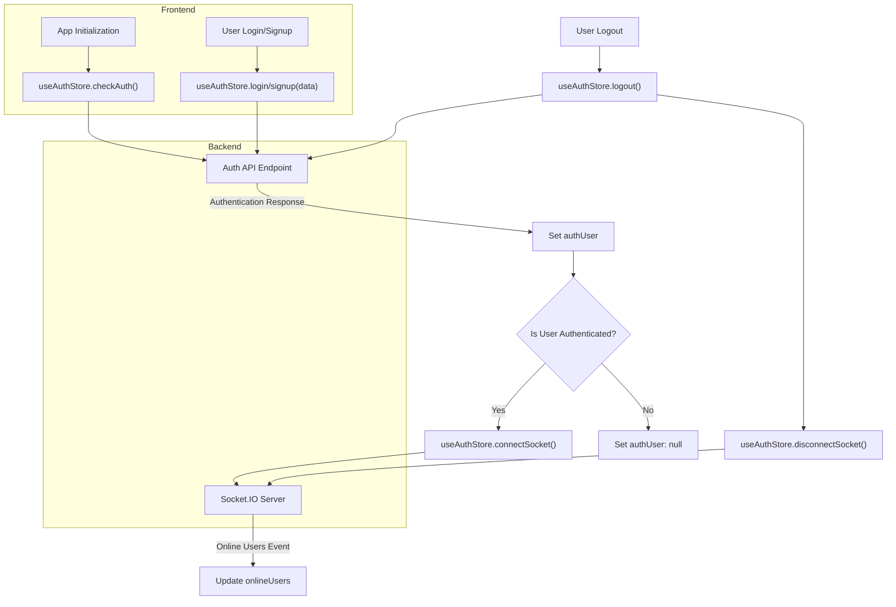
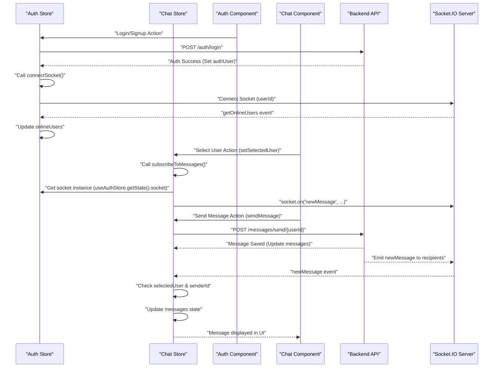

---
title: "Frontend State Management"
description: "Explains how global application state, including authentication and chat data, is managed using Zustand."
sidebar_position: 33
---

# Frontend State Management

<TOC />

This document details the frontend state management architecture, primarily leveraging [Zustand](https://zustand-bears.github.io/blog/) for a lightweight and scalable approach. We manage critical application states such as user authentication, chat messages, user profiles, and UI themes across various stores.

## Core Principles

The frontend state management adheres to the following principles:

*   **Simplicity**: Zustand provides a minimalistic API, reducing boilerplate compared to other state management libraries.
*   **Modularity**: State is organized into distinct stores (`useAuthStore`, `useChatStore`, `useThemeStore`), each responsible for a specific domain.
*   **Reactivity**: Components automatically re-render only when the state they subscribe to changes.
*   **Centralized API Interaction**: All API calls are routed through a single `axiosInstance` to ensure consistent request handling, including credential management.

## Axios Instance Configuration

A centralized Axios instance is used for all API requests, ensuring `withCredentials` is always set to `true` for handling HTTP-only cookies (e.g., authentication tokens). This simplifies API interaction across different stores and components.

```javascript showLineNumbers {5-8}
// frontend/src/lib/axios.js
import axios from "axios";

export const axiosInstance = axios.create({
    baseURL: import.meta.env.MODE == "development" ? "http://localhost:5001/api": "/api",
    withCredentials: true,
});
```

The `baseURL` dynamically adjusts based on the environment, pointing to the local development server or the relative `/api` endpoint in production.

- [View on GitHub](https://github.com/shinymack/Chat-App-MERN/blob/main/frontend/src/lib/axios.js#L1-L8)

## Authentication Store (`useAuthStore`)

The `useAuthStore` manages user authentication status, user profile data, and integrates with real-time functionalities via WebSockets. It handles user lifecycle events like login, signup, logout, and profile updates.

### State Variables

| State Variable        | Description                                       | Type      | Default Value |
| :-------------------- | :------------------------------------------------ | :-------- | :------------ |
| `authUser`            | Current authenticated user object.                | `Object`  | `null`        |
| `isSigningUp`         | Indicates if a signup operation is in progress.   | `boolean` | `false`       |
| `isLoggingIn`         | Indicates if a login operation is in progress.    | `boolean` | `false`       |
| `isUpdatingProfile`   | Indicates if a profile update is in progress.     | `boolean` | `false`       |
| `isCheckingAuth`      | Indicates if the initial auth check is in progress. | `boolean` | `true`        |
| `onlineUsers`         | Array of IDs of currently online users.           | `Array`   | `[]`          |
| `socket`              | The Socket.IO client instance.                    | `Object`  | `null`        |

### Actions

The store provides actions for common authentication flows:

*   `checkAuth()`: Verifies authentication status with the backend and initializes the WebSocket connection if authenticated.
*   `signup(data)`: Registers a new user.
*   `login(data)`: Authenticates an existing user.
*   `logout()`: Logs out the current user and disconnects the WebSocket.
*   `updateProfile(data)`: Updates the authenticated user's profile.
*   `connectSocket()`: Establishes a WebSocket connection, queries online users, and sets up real-time events.
*   `disconnectSocket()`: Closes the active WebSocket connection.

### Socket.IO Integration

The `connectSocket` action initiates a Socket.IO connection, passing the authenticated user's ID as a query parameter. This allows the backend to track online users and facilitate real-time communication.

```javascript showLineNumbers {76-85}
// frontend/src/store/useAuthStore.js
// ... (imports and other state/actions)

    connectSocket: () => {
        const { authUser } = get();
        if(!authUser || get().socket?.connected) return;

        const socket = io(BASE_URL, {
            query: {
                userId : authUser._id,
            },
        });
        socket.connect();
        set({socket: socket});

        socket.on("getOnlineUsers", (userIds) => {
            set({onlineUsers: userIds})
        }); 
    },

    disconnectSocket : () => {
        if(get().socket?.connected) get().socket.disconnect();
    }
}));
```

- [View on GitHub](https://github.com/shinymack/Chat-App-MERN/blob/main/frontend/src/store/useAuthStore.js#L76-L92)

### Authentication Flow Diagram





## Chat Store (`useChatStore`)

The `useChatStore` manages all chat-related data, including user lists (friends), messages, friend requests, and selected chat partners. It interacts with the backend for data fetching and sending, and subscribes to real-time message updates.

### State Variables

| State Variable        | Description                                       | Type      | Default Value |
| :-------------------- | :------------------------------------------------ | :-------- | :------------ |
| `messages`            | Array of messages in the current conversation.    | `Array`   | `[]`          |
| `users`               | Array of the authenticated user's friends.        | `Array`   | `[]`          |
| `pendingRequests`     | Array of incoming friend requests.                | `Array`   | `[]`          |
| `sentRequests`        | Array of outgoing friend requests.                | `Array`   | `[]`          |
| `selectedUser`        | The user currently selected for chat.             | `Object`  | `null`        |
| `isUsersLoading`      | Indicates if friends list is being fetched.       | `boolean` | `false`       |
| `isMessagesLoading`   | Indicates if messages are being fetched.          | `boolean` | `false`       |
| `isFriendBoxOpen`     | Controls visibility of the friends/requests modal. | `boolean` | `false`       |

### Actions

The store provides extensive actions for chat functionalities:

*   `toggleFriendsBox()`: Toggles the visibility of the friend management box.
*   `getFriends()`: Fetches the list of friends.
*   `getPendingRequests()`: Fetches incoming friend requests.
*   `getSentRequests()`: Fetches outgoing friend requests.
*   `sendFriendRequest(identifier)`: Sends a new friend request.
*   `acceptFriendRequest(senderId)`: Accepts a pending friend request.
*   `rejectFriendRequest(senderId)`: Rejects a pending friend request.
*   `removeFriend(friendId)`: Removes a friend.
*   `getMessages(userId)`: Fetches messages for a specific user.
*   `sendMessage(messageData)`: Sends a new message to the `selectedUser`.
*   `subscribeToMessages()`: Listens for `newMessage` WebSocket events and updates `messages`.
*   `unsubscribeFromMessages()`: Cleans up the `newMessage` WebSocket listener.
*   `setSelectedUser(user)`: Sets the user for the current chat conversation.

### Real-time Message Subscription

The `subscribeToMessages` action demonstrates cross-store communication by accessing the Socket.IO instance from `useAuthStore`. This allows `useChatStore` to listen for new messages relevant to the currently selected chat.

```javascript showLineNumbers {92-99}
// frontend/src/store/useChatStore.js
// ... (imports and other state/actions)

    subscribeToMessages: () => {
        const { selectedUser } = get();
        if(!selectedUser) return;
        
        const socket = useAuthStore.getState().socket; // Accessing socket from useAuthStore
        socket.on("newMessage", (newMessage) => {
            if(newMessage.senderId !== selectedUser._id) return
            set({
                messages: [...get().messages, newMessage]
            })
        })
    },

    unsubscribeFromMessages: () => {
        const socket = useAuthStore.getState().socket;
        socket.off("newMessage");
    },
```

- [View on GitHub](https://github.com/shinymack/Chat-App-MERN/blob/main/frontend/src/store/useChatStore.js#L92-L105)

## Theme Store (`useThemeStore`)

The `useThemeStore` is a simple Zustand store responsible for managing the application's theme (e.g., 'dark' or 'light'). It persists the selected theme to `localStorage`.

### State Variables

| State Variable | Description                   | Type     | Default Value |
| :------------- | :---------------------------- | :------- | :------------ |
| `theme`        | Current application theme.    | `string` | `"dark"`      |

### Actions

*   `setTheme(theme)`: Updates the `theme` state and saves it to `localStorage`.

```javascript showLineNumbers
// frontend/src/store/useThemeStore.js
import { create } from "zustand";

export const useThemeStore = create((set) => ({
    theme: localStorage.getItem("chat-theme") || "dark",
    setTheme: (theme) => {
        localStorage.setItem("chat-theme", theme);
        set({theme});
    }
}))
```

- [View on GitHub](https://github.com/shinymack/Chat-App-MERN/blob/main/frontend/src/store/useThemeStore.js#L1-L8)

## Key Integration Points

*   **Authentication-driven Socket Connection**: The `useAuthStore`'s `connectSocket` action is called immediately after a successful authentication (`checkAuth`, `login`, `signup`), ensuring real-time features are only enabled for authenticated users.
*   **Cross-Store Socket Access**: The `useChatStore` directly accesses the `socket` instance from `useAuthStore` using `useAuthStore.getState().socket` to subscribe to new message events. This pattern centralizes WebSocket management while allowing other stores to utilize the connection.
*   **Centralized Error Handling**: `react-hot-toast` is used across all stores to provide consistent, user-friendly feedback for success and error messages from API calls.
*   **Dynamic Base URL**: The `axiosInstance` dynamically sets its `baseURL` based on the environment, streamlining deployment between development and production.

### Data Flow for Real-time Messaging





Next: [Development and Configuration](./4_development-and-configuration.mdx)
```