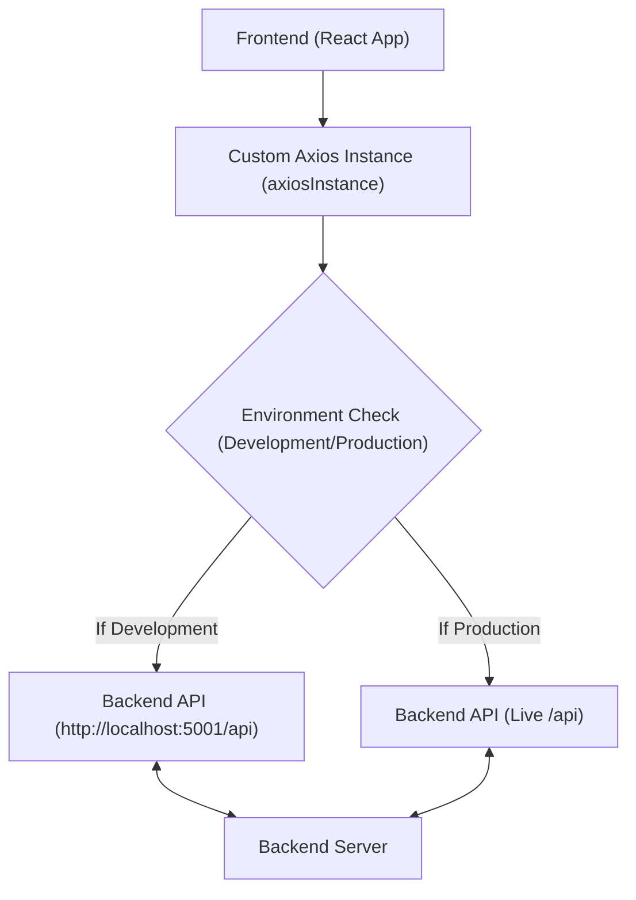
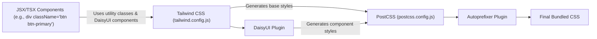

---
title: "Frontend Utilities and Styling"
description: "Documents shared utility functions, API integration, and styling configurations for the frontend."
sidebar_position: 33
---

# Frontend Utilities and Styling

<TOC />

This section delves into the foundational utilities and styling configurations that empower the frontend of the application. It covers crucial aspects such as streamlined API communication, reusable helper functions, and the comprehensive setup for styling with Tailwind CSS and DaisyUI. Understanding these components is key to grasping the maintainability, extensibility, and visual consistency of the user interface.

## API Integration with Axios

The `frontend/src/lib/axios.js` file establishes a custom Axios instance, centralizing API requests and ensuring consistent configuration across the application. This approach is vital for managing API endpoints, handling authentication, and standardizing request headers.

### `axiosInstance` Configuration

The `axiosInstance` is configured to dynamically adjust its `baseURL` based on the environment (`development` or `production`), ensuring seamless transitions between local development and deployed stages. It also enables `withCredentials` to handle cookies for session management, critical for authentication.

```javascript
// frontend/src/lib/axios.js
import axios from "axios";

export const axiosInstance = axios.create({
    baseURL: import.meta.env.MODE == "development" ? "http://localhost:5001/api": "/api",
    withCredentials: true,
});
```

[[View on GitHub]](https://github.com/shinymack/Chat-App-MERN/blob/main/frontend/src/lib/axios.js)

Using a dedicated instance like `axiosInstance` allows for:
*   **Centralized configuration**: All requests originating from this instance inherit the `baseURL` and `withCredentials` settings.
*   **Environment flexibility**: The `import.meta.env.MODE` check ensures the application targets the correct backend API during development and production.
*   **Interceptors**: While not shown in the snippet, this is the ideal place to add request or response interceptors for global error handling, token attachment, or logging.

### API Request Flow

The following diagram illustrates how the frontend leverages the `axiosInstance` for API communication.





This ensures that API calls are consistently routed to the correct backend endpoint, whether you're developing locally or running the deployed application.

## Frontend Utility Functions

The `frontend/src/lib/utils.js` file serves as a central repository for various helper functions designed to perform common, reusable tasks. These utilities enhance code readability, reduce duplication, and promote a consistent approach to data manipulation and display.

### `formatMessageTime` Function

A prime example is the `formatMessageTime` function, which takes a date string and formats it into a user-friendly local time string, including year, month, day, and 12-hour time with AM/PM indicators. This is particularly useful for displaying timestamps on messages or events.

```javascript
// frontend/src/lib/utils.js
export function formatMessageTime(date) {
    return new Date(date).toLocaleTimeString("en-US", {
        year: "numeric",
        month: "short",
        day:"2-digit",
        hour: "2-digit",
        minute: "2-digit",
        hour12: true,
    });
}
```

[[View on GitHub]](https://github.com/shinymack/Chat-App-MERN/blob/main/frontend/src/lib/utils.js)

This function abstracts away the complexity of `toLocaleTimeString` options, providing a simple interface for consistent date/time formatting throughout the UI. For instance, `formatMessageTime("2023-10-27T10:30:00Z")` might return something like "Oct 27, 2023, 06:30 AM".

## Styling with Tailwind CSS and DaisyUI

The application adopts a modern, utility-first approach to styling using Tailwind CSS, significantly speeding up UI development. This is further enhanced by DaisyUI, a plugin that provides pre-built component classes on top of Tailwind, making it easy to implement common UI patterns with minimal effort.

### Tailwind CSS Configuration

The `frontend/tailwind.config.js` file is the heart of the styling system. It configures Tailwind CSS, specifies which files to scan for utility classes, extends the default theme, and integrates plugins like DaisyUI.

```javascript
// frontend/tailwind.config.js
import daisyui from "daisyui"


/** @type {import('tailwindcss').Config} */
export default {
  content: [
    "./index.html",
    "./src/**/*.{js,ts,jsx,tsx}",
  ],
  theme: {
    extend: {
      fontFamily : {
        chivo : ['Chivo', 'sans-serif'],
      }
    },
  },
  plugins: [daisyui],
  daisyui : {
 themes: [
      "light",
      "dark",
      "cupcake",
      "bumblebee",
      "emerald",
      "corporate",
      // ... many more themes
    ],
  }
}
```

[[View on GitHub]](https://github.com/shinymack/Chat-App-MERN/blob/main/frontend/tailwind.config.js)

Key configurations here include:
*   **`content`**: Defines the files where Tailwind should look for class names to generate CSS. This ensures only used styles are bundled.
*   **`theme.extend`**: Allows adding custom values to Tailwind's default theme without overwriting existing ones. Here, a custom `chivo` font family is added.
*   **`plugins`**: Registers Tailwind plugins. `daisyui` is crucial for enabling its component classes and theme management.
*   **`daisyui.themes`**: Specifies the array of DaisyUI themes available for the application, enabling easy theme switching.

### PostCSS Configuration

`frontend/postcss.config.js` configures PostCSS, a tool for transforming CSS with JavaScript plugins. In this setup, it's used to process Tailwind CSS and add vendor prefixes using Autoprefixer.

```javascript
// frontend/postcss.config.js
export default {
  plugins: {
    tailwindcss: {},
    autoprefixer: {},
  },
}
```

[[View on GitHub]](https://github.com/shinymack/Chat-App-MERN/blob/main/frontend/postcss.config.js)

This configuration ensures:
*   **`tailwindcss`**: Processes Tailwind's directives and generates the final CSS based on the utility classes used in the `content` files.
*   **`autoprefixer`**: Automatically adds vendor prefixes (e.g., `-webkit-`, `-moz-`) to CSS rules, ensuring compatibility across different browsers.

### Styling Workflow Diagram

The styling pipeline integrates PostCSS, Tailwind CSS, and DaisyUI to produce a highly customizable and efficient styling system.





This workflow ensures that styles are efficiently generated, optimized, and compatible with various browsers, leading to a robust and performant user interface.

## Key Integration Points

The files documented here form a cohesive foundation for the frontend:

1.  **Centralized API Communication**: The `axiosInstance` in `frontend/src/lib/axios.js` acts as the single point of contact for all backend interactions, promoting consistency and easier maintenance of API logic. Any new feature requiring data from the server will leverage this instance.
2.  **Reusable Utilities**: `frontend/src/lib/utils.js` houses helper functions like `formatMessageTime` that can be imported and used across various components, reducing code duplication and ensuring uniform data presentation. These functions contribute significantly to the application's overall "DRY" (Don't Repeat Yourself) principle.
3.  **Flexible and Themed Styling**: The combination of `tailwind.config.js` and `postcss.config.js` provides a powerful and highly customizable styling system. Tailwind's utility-first approach allows for rapid UI development, while DaisyUI adds a layer of pre-designed components and theme management, enabling quick changes to the application's look and feel without extensive CSS modifications. The `daisyui.themes` array makes it straightforward to offer users different visual experiences.

In summary, these frontend utilities and styling configurations are critical for building a maintainable, scalable, and visually appealing user interface, simplifying development by abstracting common tasks and providing a robust styling framework.
```