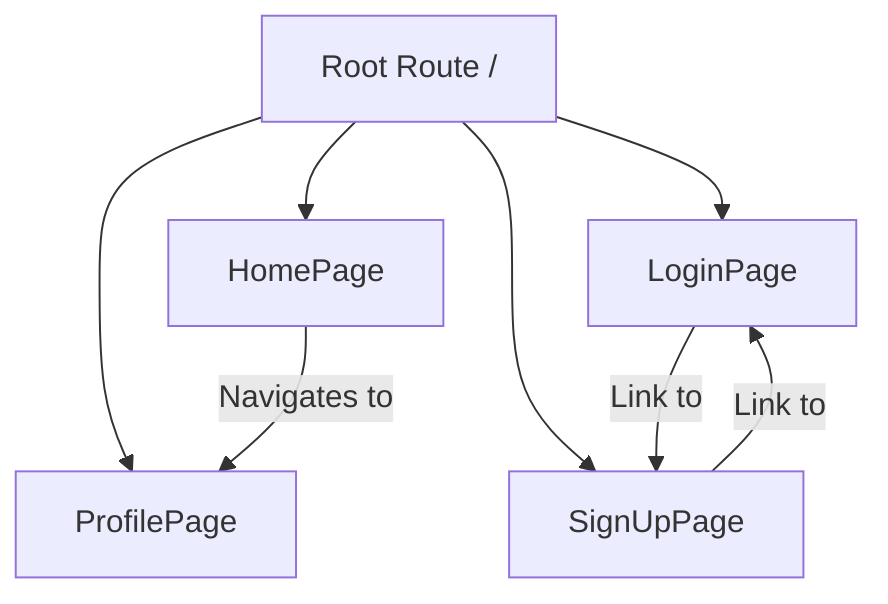

# Frontend Pages & Routes
<TOC />

## Overview of Frontend Pages

The frontend of the application is built with React and structured into several distinct pages, each serving a specific user interaction and application state. These pages are responsible for rendering the user interface, handling user input, and interacting with the backend API to manage data and authentication. The architecture emphasizes a clear separation of concerns, with pages orchestrating components and managing local state, while global state (e.g., authentication, selected chat user) is managed by Zustand stores.

## Core Application Pages

### Home Page
The `HomePage` is the central hub for authenticated users, displaying the main chat interface. It conditionally renders the chat area based on whether a user has selected a conversation.
- **Purpose**: Displays the main chat interface, including the sidebar, chat container, and an optional friends list.
- **Components**: Integrates `Sidebar`, `ChatContainer`, `NoChatSelected`, and `FriendsBox`.
- **State Management**: Utilizes `useChatStore` to determine the `selectedUser` and `isFriendsBoxOpen`, dynamically rendering UI elements.
- **Key Insight**: The conditional rendering of `ChatContainer` or `NoChatSelected` based on `selectedUser` from the global state (`useChatStore`) ensures a dynamic and responsive user experience. The `FriendsBox` is also conditionally rendered, indicating a modular approach to UI elements.

```jsx
const HomePage = () => {
  const { selectedUser } = useChatStore();
  const { isFriendsBoxOpen } = useChatStore();
  return (
      <div className="h-screen bg-base-200">
      <div className="flex items-center justify-center pt-20 px-4 w-full">
        <div className="bg-base-100 rounded-lg shadow-xl w-full max-w-6xl h-[calc(100vh-8rem)]">
          <div className="flex h-full rounded-lg overflow-hidden w-full">
            <Sidebar />
            {!selectedUser ? <NoChatSelected /> : <ChatContainer />}
            {isFriendsBoxOpen && <FriendsBox />}

          </div>

        </div>
      </div>
    </div>
  )
}
```
[View on GitHub](https://github.com/shinymack/Chat-App-MERN/blob/main/frontend/src/pages/HomePage.jsx#L8-L26)

### Login Page
The `LoginPage` provides the interface for existing users to authenticate with the application. It supports both email/password login and Google OAuth.
- **Purpose**: Allows users to sign in to their existing accounts.
- **Authentication**: Handles email/password authentication via a form submission and redirects to a Google OAuth flow.
- **State Management**: Uses `useState` for form data and `useAuthStore` for `login` function and `isLoggingIn` status.
- **Dependencies**: Leverages `lucide-react` for icons and `react-icons/fc` for the Google icon.
- **Best Practice**: Integration with Google OAuth (`googleAuthUrl`) demonstrates a common strategy for offering alternative, secure authentication methods, enhancing user convenience and reducing password management burden. The use of `AuthImagePattern` for consistent branding across authentication pages.

```jsx
const LoginPage = () => {
  const [showPassword, setShowPassword] = useState(false);
  const [formData, setFormData] = useState({
    email: "",
    password: "",
  })
  const { login, isLoggingIn } = useAuthStore();

  const handleSubmit = async (e) => {
    e.preventDefault();
    login(formData);
  }
  const backendDomain = import.meta.env.VITE_BACKEND_URL;
  const googleAuthUrl = `${backendDomain}/api/auth/google`;
  // ... rest of the component
}
```
[View on GitHub](https://github.com/shinymack/Chat-App-MERN/blob/main/frontend/src/pages/LoginPage.jsx#L11-L26)

### Sign Up Page
The `SignUpPage` facilitates the creation of new user accounts. Similar to the login page, it supports both traditional email/password registration and Google OAuth.
- **Purpose**: Allows new users to register for an account.
- **Form Validation**: Includes client-side validation for username, email, and password fields using `react-hot-toast` for feedback.
- **Authentication**: Initiates user registration via `signup` function from `useAuthStore` and offers Google OAuth.
- **Dependencies**: Uses `lucide-react` for icons and `react-icons/fc` for the Google icon.
- **Key Insight**: The `validateForm` function ensures basic client-side validation, improving user experience by catching common errors before an API call. Password visibility toggle (`showPassword`) is a common usability feature.

```jsx
const SignUpPage = () => {
  const [showPassword, setShowPassword] = useState(false);
  const [formData, setFormData] = useState({
    username: "",
    email: "",
    password: "",
  });

  const { signup, IsSigningUp } = useAuthStore();

  const validateForm = () => {
    if(!formData.username.trim()) return toast.error("Username is required");
    if(!formData.email.trim()) return toast.error("Email is required");
    if (!/\S+@\S+\.\S+/.test(formData.email)) return toast.error("Invalid email format");
    if (!formData.password) return toast.error("Password is required");
    if (formData.password.length < 6) return toast.error("Password must be at least 6 characters");

    return true;
  };

  const handleSubmit = (e) => {
    e.preventDefault();

    const success = validateForm();
    if(success===true) signup(formData);
  };
  // ... rest of the component
}
```
[View on GitHub](https://github.com/shinymack/Chat-App-MERN/blob/main/frontend/src/pages/SignUpPage.jsx#L11-L40)

### Profile Page
The `ProfilePage` enables authenticated users to view and update their profile information, specifically their profile picture and username.
- **Purpose**: Displays and allows editing of user profile information.
- **Features**:
    - **Profile Picture Update**: Users can upload a new profile picture, which is then converted to Base64 and sent to the backend.
    - **Username Editing**: Users can edit their username with debounced availability checking against the backend.
- **State Management**: Uses `useState` for image selection, edit mode, and `useAuthStore` for `authUser`, `isUpdatingProfile`, and `updateProfile`.
- **API Interaction**: Employs `axiosInstance` for checking username availability.
- **Best Practice**: The debounced username check (`useEffect` with `setTimeout`) significantly reduces the load on the backend by only sending a request after the user pauses typing, demonstrating an efficient API interaction pattern. The conditional rendering for editing provides a smooth user experience.

```jsx
	// --- Debounced Username Check ---
	useEffect(() => {
		clearTimeout(debounceTimeout.current);

		if (!newUsername.trim() || newUsername.trim().length < 3) {
			setUsernameStatus({ checking: false, available: false, message: "Must be 3+ characters." });
			return;
		}

		if (newUsername === authUser.username) {
			setUsernameStatus({ checking: false, available: true, message: "" });
			return;
		}

		setUsernameStatus((prev) => ({ ...prev, checking: true, message: "Checking..." }));

		debounceTimeout.current = setTimeout(async () => {
			try {
				const res = await axiosInstance.get(`/auth/username/check/${newUsername}`);
				setUsernameStatus({
					checking: false,
					available: res.data.available,
					message: res.data.message,
				});
			} catch (error) {
				const message = error.response?.data?.message || "Error checking username.";
				setUsernameStatus({ checking: false, available: false, message });
			}
		}, 500); // 500ms debounce delay

		return () => clearTimeout(debounceTimeout.current);
	}, [newUsername, authUser.username]);
	// ---------------------------------
```
[View on GitHub](https://github.com/shinymack/Chat-App-MERN/blob/main/frontend/src/pages/ProfilePage.jsx#L62-L91)

## Frontend Routing Overview

The application utilizes `react-router-dom` for navigation between these pages. Although the `App.jsx` file is not provided, the `Link` components in `LoginPage.jsx` and `SignUpPage.jsx` clearly indicate the routing paths: `/login`, `/signup`, and implicitly `/` for the `HomePage` and `/profile` for the `ProfilePage`.





This diagram illustrates the primary routes and navigation paths within the frontend application.

## Key Integration Points

The frontend pages serve as the primary interface for user interaction and are tightly integrated with the application's global state management and backend API.

-   **Authentication Flow**: `LoginPage` and `SignUpPage` are crucial entry points, managing user authentication. They interact directly with the `useAuthStore` to dispatch login/signup actions, which in turn communicate with the backend API for user verification and token exchange.
-   **Profile Management**: `ProfilePage` exemplifies robust interaction with both local and global state. It allows for direct modifications (like profile picture uploads) that trigger API calls (`updateProfile`) and reflects changes in `authUser` from `useAuthStore`. The debounced username check highlights a thoughtful approach to optimizing API calls for frequently changing input.
-   **Chat State**: `HomePage` is the primary consumer of the `useChatStore`. Its dynamic rendering based on `selectedUser` demonstrates how global state drives the core UI experience, ensuring that conversations are displayed only when a recipient is chosen.
-   **Environment Variables**: The use of `import.meta.env.VITE_BACKEND_URL` in `LoginPage` and `SignUpPage` ensures that the application can easily adapt to different backend environments (development, staging, production) without code changes, following best practices for configuration management.
-   **Error Handling**: Although not explicitly detailed in every snippet, the `validateForm` in `SignUpPage` and `toast.error` calls suggest a consistent pattern of providing user feedback for validation and API-related errors.

Next: [Utilities & Helpers](./4_utilities_helpers.mdx)