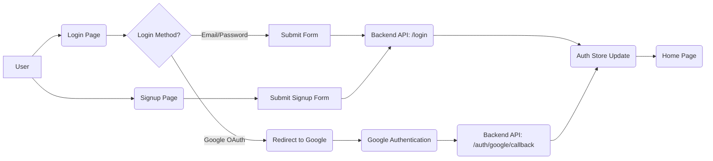
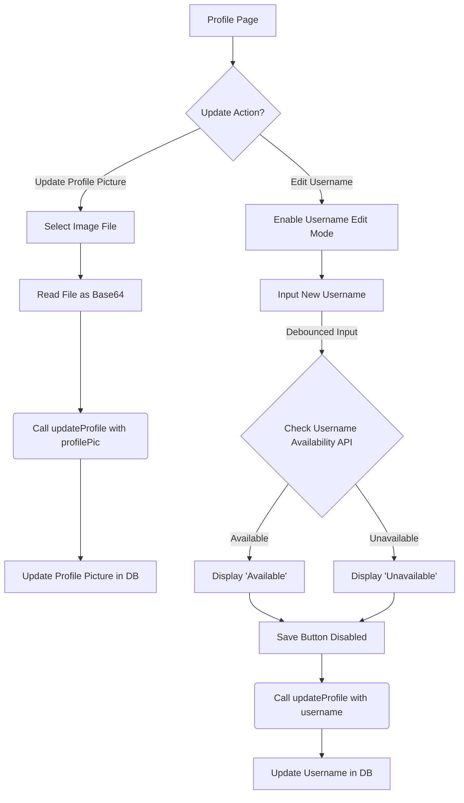

# Pages and Navigation
<TOC />

This section details the primary user-facing pages of the application, focusing on their individual purposes, core components, and how users navigate between them to interact with the system. From authentication to the main chat interface and user profile management, these pages form the backbone of the client-side experience.

## Application Pages

The frontend of the application is structured around several key pages, each serving a distinct purpose in the user journey.

### Home Page
The `HomePage` is the central hub for authenticated users, providing the main chat interface. It conditionally renders different components based on the user's current chat selection, ensuring a dynamic and responsive user experience.

*   **Purpose**: Main chat interface, displaying user's contacts and active chat.
*   **Key Components**:
    *   `Sidebar`: Displays the list of user's friends and chat groups.
    *   `ChatContainer`: Renders the conversation for the `selectedUser`.
    *   `NoChatSelected`: A placeholder component shown when no chat is active.
    *   `FriendsBox`: A modal or slide-out component for managing friends, conditionally displayed.
*   **State Management**: Utilizes the `useChatStore` Zustand store to manage the `selectedUser` and `isFriendsBoxOpen` states, driving conditional rendering.

```jsx title="frontend/src/pages/HomePage.jsx"
// import React from 'react'

import ChatContainer from "../components/ChatContainer";
import FriendsBox from "../components/FriendsBox";
import NoChatSelected from "../components/NoChatSelected";
import Sidebar from "../components/Sidebar";
import { useChatStore } from "../store/useChatStore"

const HomePage = () => {
  const { selectedUser } = useChatStore();
  const { isFriendsBoxOpen } = useChatStore();
  return (
      <div className="h-screen bg-base-200">
      <div className="flex items-center justify-center pt-20 px-4 w-full">
        <div className="bg-base-100 rounded-lg shadow-xl w-full max-w-6xl h-[calc(100vh-8rem)]">
          <div className="flex h-full rounded-lg overflow-hidden w-full">
            <Sidebar />
            {!selectedUser ? <NoChatSelected /> : <ChatContainer />} {/* Conditionally renders chat or placeholder */}
            {isFriendsBoxOpen && <FriendsBox />} {/* Conditionally renders FriendsBox */}
          </div>
        </div>
      </div>
    </div>
  )
}

export default HomePage
```
[[View on GitHub]](https://github.com/shinymack/Chat-App-MERN/blob/main/frontend/src/pages/HomePage.jsx#L1-L29)

### Login Page
The `LoginPage` handles user authentication, allowing existing users to sign in. It supports both traditional email/password login and Google OAuth for convenience.

*   **Purpose**: Authenticate existing users.
*   **Features**:
    *   Email and password input fields with validation.
    *   Password visibility toggle.
    *   Google OAuth integration.
    *   Navigation link to the `SignUpPage`.
    *   Visual feedback during login (loading spinner).
*   **State Management**: Interacts with the `useAuthStore` for `login` actions and `isLoggingIn` status.
*   **Navigation**: Uses `react-router-dom`'s `Link` component to navigate to `/signup` for new users.

The login submission process:
```jsx title="frontend/src/pages/LoginPage.jsx"
// ... (imports)
const LoginPage = () => {
  const [showPassword, setShowPassword] = useState(false);
  const [formData, setFormData] = useState({
    email: "",
    password: "",
  })
  const { login, isLoggingIn } = useAuthStore(); // Auth store for login logic

  const handleSubmit = async (e) => {
    e.preventDefault();
    login(formData); // Call login action from Zustand store
  }
  const backendDomain = import.meta.env.VITE_BACKEND_URL;
  const googleAuthUrl = `${backendDomain}/api/auth/google`; // Google OAuth endpoint
  return (
    // ... (JSX for form and UI)
            <button type="submit" className="btn btn-primary w-full" disabled={isLoggingIn}>
              {isLoggingIn ? (
                <>
                  <Loader2 className="h-5 w-5 animate-spin" />
                  Loading...
                </>
              ) : (
                "Sign in"
              )}
            </button>
          </form>
          <div className="divider text-base-content/60 my-4">OR</div>

          <a
            href={googleAuthUrl} // Link to your backend Google auth route
            className="btn btn-primary btn-outline w-full"
          >
            <FcGoogle className="size-5 mr-2" />
            Sign in with Google
          </a>

          <div className="text-center">
            <p className="text-base-content/60">
              Don&apos;t have an account?{" "}
              <Link to="/signup" className="link link-primary"> {/* Navigation to Signup */}
                Create account
              </Link>
            </p>
          </div>
    // ... (rest of JSX)
  )
}
export default LoginPage
```
[[View on GitHub]](https://github.com/shinymack/Chat-App-MERN/blob/main/frontend/src/pages/LoginPage.jsx#L10-L108)

### Sign Up Page
The `SignUpPage` allows new users to register an account. Similar to the login page, it offers both local registration and Google OAuth.

*   **Purpose**: Register new user accounts.
*   **Features**:
    *   Username, email, and password input fields.
    *   Basic client-side form validation (e.g., email format, password length).
    *   Password visibility toggle.
    *   Google OAuth integration.
    *   Navigation link to the `LoginPage`.
    *   Visual feedback during registration (loading spinner).
*   **State Management**: Interacts with the `useAuthStore` for `signup` actions and `IsSigningUp` status.

Client-side validation and form submission:
```jsx title="frontend/src/pages/SignUpPage.jsx"
// ... (imports)
const SignUpPage = () => {
  const [showPassword, setShowPassword] = useState(false);
  const [formData, setFormData] = useState({
    username: "",
    email: "",
    password: "",
  });

  const { signup, IsSigningUp } = useAuthStore();

  const validateForm = () => { // Basic client-side validation
    if(!formData.username.trim()) return toast.error("Username is required");
    if(!formData.email.trim()) return toast.error("Email is required");
    if (!/\S+@\S+\.\S+/.test(formData.email)) return toast.error("Invalid email format");
    if (!formData.password) return toast.error("Password is required");
    if (formData.password.length < 6) return toast.error("Password must be at least 6 characters");

    return true;
  };

  const handleSubmit = (e) => {
    e.preventDefault();

    const success = validateForm();
    if(success===true) signup(formData); // Call signup action if validation passes
  };
  
  const backendDomain = import.meta.env.VITE_BACKEND_URL;
  const googleAuthUrl = `${backendDomain}/api/auth/google`;
  return (
    // ... (JSX for form and UI)
            <button type="submit" className="btn btn-primary w-full" disabled={IsSigningUp}>
              {IsSigningUp ? (
                <>
                  <Loader2 className="size-5 animate-spin" />
                  Loading...
                </>
              ) : (
                "Create Account"
              )}
            </button>
          </form>
          <div className="divider text-base-content/60 my-4">OR</div>

          <a
            href={googleAuthUrl} // Link to your backend Google auth route
            className="btn btn-primary btn-outline w-full" 
          >
            <FcGoogle className="size-5 mr-2" /> 
            Sign up with Google
          </a>

          <div className="text-center">
            <p className="text-base-content/60">
              Already have an account?{" "}
              <Link to="/login" className="link link-primary"> {/* Navigation to Login */}
                Sign in
              </Link>
            </p>
          </div>
    // ... (rest of JSX)
  );
};
export default SignUpPage;
```
[[View on GitHub]](https://github.com/shinymack/Chat-App-MERN/blob/main/frontend/src/pages/SignUpPage.jsx#L10-L113)

### Profile Page
The `ProfilePage` allows authenticated users to view and update their profile information, including their profile picture and username. It incorporates advanced features like debounced input for username availability checks.

*   **Purpose**: Display and manage user profile details.
*   **Features**:
    *   Display of current profile picture, username, email, member since date, and account status.
    *   Ability to upload and update profile pictures.
    *   Editable username with a dedicated edit mode.
    *   Debounced username availability check for enhanced user experience and reduced API calls.
    *   Visual feedback during profile updates.
*   **State Management**: Integrates `useAuthStore` for fetching `authUser` data and initiating `updateProfile` actions, as well as `isUpdatingProfile` status.
*   **API Interaction**: Uses `axiosInstance` for the debounced username availability check.

Profile picture upload handler:
```jsx title="frontend/src/pages/ProfilePage.jsx"
// ... (imports)
const ProfilePage = () => {
	const { authUser, isUpdatingProfile, updateProfile } = useAuthStore();
	const [selectedImg, setSelectedImg] = useState(null);

    // ... (username edit state)

	const handleImageUpload = async (e) => {
		const file = e.target.files[0];
		if (!file) return;

		const reader = new FileReader();
		reader.readAsDataURL(file);

		reader.onload = async () => {
			const base64Image = reader.result; // Convert image to Base64
			setSelectedImg(base64Image); // Update local state for immediate visual feedback
			await updateProfile({ profilePic: base64Image }); // Call store action to update profile
		};
	};
    // ... (rest of component)
}
export default ProfilePage;
```
[[View on GitHub]](https://github.com/shinymack/Chat-App-MERN/blob/main/frontend/src/pages/ProfilePage.jsx#L35-L51)

Debounced username check logic:
```jsx title="frontend/src/pages/ProfilePage.jsx"
// ... (imports)
const ProfilePage = () => {
	// ... (state declarations)
	const [isEditingUsername, setIsEditingUsername] = useState(false);
	const [newUsername, setNewUsername] = useState(authUser?.username || "");
	const [usernameStatus, setUsernameStatus] = useState({
		checking: false,
		available: true,
		message: "",
	});
	const debounceTimeout = useRef(null); // Ref to hold the debounce timer

	// --- Debounced Username Check ---
	useEffect(() => {
		clearTimeout(debounceTimeout.current); // Clear any existing timer

		if (!newUsername.trim() || newUsername.trim().length < 3) {
			setUsernameStatus({ checking: false, available: false, message: "Must be 3+ characters." });
			return;
		}

		if (newUsername === authUser.username) {
			setUsernameStatus({ checking: false, available: true, message: "" });
			return;
		}

		setUsernameStatus((prev) => ({ ...prev, checking: true, message: "Checking..." }));

		debounceTimeout.current = setTimeout(async () => { // Set new debounce timer
			try {
				const res = await axiosInstance.get(`/auth/username/check/${newUsername}`);
				setUsernameStatus({
					checking: false,
					available: res.data.available,
					message: res.data.message,
				});
			} catch (error) {
				const message = error.response?.data?.message || "Error checking username.";
				setUsernameStatus({ checking: false, available: false, message });
			}
		}, 500); // 500ms debounce delay

		return () => clearTimeout(debounceTimeout.current); // Cleanup function
	}, [newUsername, authUser.username]);
	// ---------------------------------
    // ... (rest of component)
}
export default ProfilePage;
```
[[View on GitHub]](https://github.com/shinymack/Chat-App-MERN/blob/main/frontend/src/pages/ProfilePage.jsx#L60-L98)

## Navigation Strategy

The application leverages `react-router-dom` for client-side routing, enabling seamless navigation between pages without full page reloads.

*   **Authentication Flow**: Unauthenticated users are directed to the `/login` or `/signup` routes. Upon successful authentication, users are typically redirected to the `/` (Home) route.
*   **Protected Routes**: The `HomePage` and `ProfilePage` are protected routes, meaning access is restricted to authenticated users. If an unauthenticated user tries to access these, they are redirected to the `LoginPage`. (Though the router config is not provided, this is a standard pattern for such applications).
*   **Declarative Navigation**: `Link` components from `react-router-dom` are used for declarative navigation, as seen in `LoginPage` and `SignUpPage` for switching between authentication forms.
*   **Programmatic Navigation**: Implicit redirects (e.g., after successful login/signup) are handled programmatically within the authentication store or a wrapper component.

### Authentication Flow Diagram
This diagram illustrates the user's journey through the authentication process.





### Profile Update Flow Diagram
This diagram outlines the process of updating a user's profile, including the debounced username check.





## Key Integration Points

### State Management
The application heavily relies on Zustand for global state management, particularly for authentication (`useAuthStore`) and chat-related data (`useChatStore`). This centralized approach ensures consistent data across components and simplifies state updates.

*   `useAuthStore`: Manages user authentication status (`authUser`), login/signup/logout actions, and associated loading states (`isLoggingIn`, `IsSigningUp`, `isUpdatingProfile`).
*   `useChatStore`: Manages the currently `selectedUser` for chat and the visibility of the `FriendsBox` (`isFriendsBoxOpen`).

### API Interaction
All interactions with the backend API are typically handled through an `axiosInstance` (as seen in `ProfilePage` for username checking). This promotes a consistent way of making HTTP requests, often configured with default headers (like authorization tokens) and error handling.

### Authentication Mechanisms
The application supports multiple authentication methods:

*   **Local Authentication**: Users can register and log in using their email and password. This involves submitting credentials to the backend API (`/api/auth/login`, `/api/auth/signup`).
*   **Google OAuth**: For convenience, users can sign up or log in using their Google account. This redirection-based flow sends the user to Google for authentication and then back to a backend callback endpoint (`/api/auth/google/callback`).

### Routing and Protection
`react-router-dom` is the core library for handling client-side routing. It's crucial for defining public routes (Login, Signup) and private/protected routes (Home, Profile) that only authenticated users can access. This ensures security and a structured user flow.

### Insights and Best Practices
*   **Modular Component Design**: Pages are composed of smaller, reusable components (e.g., `AuthImagePattern`, `Sidebar`, `ChatContainer`), promoting maintainability and reusability.
*   **User Experience (UX)**: Features like password visibility toggles, loading spinners, and debounced input (for username checks) significantly enhance the user experience by providing clear feedback and preventing unnecessary API calls.
*   **Scalability**: Centralizing authentication logic in `useAuthStore` and chat logic in `useChatStore` makes the application more scalable by separating concerns and providing a single source of truth for critical data. The use of `axiosInstance` for API calls also ensures a consistent and extensible way to interact with the backend.
*   **Environment Variables**: The `VITE_BACKEND_URL` environment variable is used to dynamically configure the backend domain, making the application adaptable to different deployment environments.

---

Next: [Utilities and Integrations](./4_utilities-and-integrations.mdx)