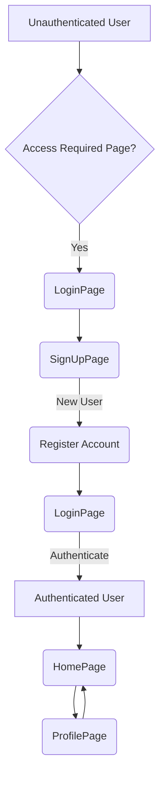

---
title: "Pages and Navigation"
description: "Structure and functionality of the main application pages and navigation flow."
sidebar_position: 33
---

# Pages and Navigation

This section outlines the structure and core functionalities of the primary application pages, focusing on how users navigate and interact with the system. The frontend is built with React, leveraging state management (Zustand) and React Router for efficient navigation and dynamic content rendering.

<TOC />

## Application Flow Overview

The application's navigation is structured to provide a clear user journey, distinguishing between authenticated and unauthenticated states. Users first encounter authentication pages (Login, Sign Up) and, upon successful authentication, are directed to the core messaging functionality (Home Page) and can manage their personal details (Profile Page).

Here's a high-level overview of the page interactions:





## Core Pages and Functionality

The frontend application features several distinct pages, each serving a specific purpose in the user experience.

### Home Page

The `HomePage.jsx` ([View on GitHub](https://github.com/shinymack/Chat-App-MERN/blob/main/frontend/src/pages/HomePage.jsx)) serves as the central hub for authenticated users, displaying the main chat interface. It conditionally renders components based on the user's current selections and state, ensuring a dynamic and responsive user experience.

#### Features

*   **Chat Interface**: Displays active conversations and allows users to send/receive messages.
*   **User Selection**: Manages the currently selected chat partner, dynamically switching the `ChatContainer`.
*   **Friends List**: A toggleable sidebar (`FriendsBox`) provides access to the user's friends or contacts.
*   **Sidebar Navigation**: Integrates a `Sidebar` component for overall application navigation, possibly including access to settings, profile, and logout.

#### Component Integration

The Home Page orchestrates the rendering of several key components:

*   **`Sidebar`**: Provides general navigation and may include user information or quick actions.
*   **`ChatContainer`**: Displays the active chat messages and input field when a user is selected.
*   **`NoChatSelected`**: A placeholder component shown when no specific chat is active.
*   **`FriendsBox`**: A dynamically appearing component for managing and viewing friends, controlled by the `isFriendsBoxOpen` state.

```jsx
// frontend/src/pages/HomePage.jsx
import ChatContainer from "../components/ChatContainer";
import FriendsBox from "../components/FriendsBox";
import NoChatSelected from "../components/NoChatSelected";
import Sidebar from "../components/Sidebar";
import { useChatStore } from "../store/useChatStore"

const HomePage = () => {
  const { selectedUser } = useChatStore();
  const { isFriendsBoxOpen } = useChatStore();
  return (
      <div className="h-screen bg-base-200">
      <div className="flex items-center justify-center pt-20 px-4 w-full">
        <div className="bg-base-100 rounded-lg shadow-xl w-full max-w-6xl h-[calc(100vh-8rem)]">
          <div className="flex h-full rounded-lg overflow-hidden w-full">
            <Sidebar />
            {!selectedUser ? <NoChatSelected /> : <ChatContainer />}
            {isFriendsBoxOpen && <FriendsBox />}
          </div>
        </div>
      </div>
    </div>
  )
}
// View on GitHub: [frontend/src/pages/HomePage.jsx#L6-L26](https://github.com/shinymack/Chat-App-MERN/blob/main/frontend/src/pages/HomePage.jsx#L6-L26)
```

The conditional rendering (`{!selectedUser ? <NoChatSelected /> : <ChatContainer />}`) ensures that the user interface adapts immediately to whether a chat recipient has been chosen, providing a clear visual cue and preventing empty states.

### Login Page

The `LoginPage.jsx` ([View on GitHub](https://github.com/shinymack/Chat-App-MERN/blob/main/frontend/src/pages/LoginPage.jsx)) handles user authentication, allowing existing users to sign into their accounts. It supports both traditional email/password login and third-party authentication via Google.

#### Features

*   **Email/Password Login**: Standard form-based authentication.
*   **Password Visibility Toggle**: Enhances user experience by allowing users to view their typed password.
*   **Google Authentication**: Integrates with Google OAuth for streamlined sign-in.
*   **Navigation to Sign Up**: Provides a link to the `SignUpPage` for new users.
*   **Loading State**: Visually indicates when a login request is in progress.

#### Authentication Flow

The login process involves form submission to a backend API or redirection to a third-party authentication provider.

```jsx
// frontend/src/pages/LoginPage.jsx
import { useState } from "react"
import { useAuthStore } from "../store/useAuthStore";
import { Eye, EyeOff, Loader2, Lock, Mail, MessageSquare } from "lucide-react";
import { Link } from "react-router-dom";
import AuthImagePattern from "../components/AuthImagePattern";
import { FcGoogle } from "react-icons/fc";

const LoginPage = () => {
  const [showPassword, setShowPassword] = useState(false);
  const [formData, setFormData] = useState({
    email: "",
    password: "",
  })
  const { login, isLoggingIn } = useAuthStore();

  const handleSubmit = async (e) => {
    e.preventDefault();
    login(formData);
  }
  const backendDomain = import.meta.env.VITE_BACKEND_URL;
  const googleAuthUrl = `${backendDomain}/api/auth/google`;
  return (
    <div className="h-screen grid lg:grid-cols-2">
      {/* Left Side - Form */}
      <div className="flex flex-col justify-center items-center p-6 sm:p-12">
        {/* ... form content ... */}
          <form onSubmit={handleSubmit} className="space-y-6">
            {/* ... email and password inputs ... */}
            <button type="submit" className="btn btn-primary w-full" disabled={isLoggingIn}>
              {isLoggingIn ? (
                <>
                  <Loader2 className="h-5 w-5 animate-spin" />
                  Loading...
                </>
              ) : (
                "Sign in"
              )}
            </button>
          </form>
          <div className="divider text-base-content/60 my-4">OR</div>
          <a
            href={googleAuthUrl} // Link to your backend Google auth route
            className="btn btn-primary btn-outline w-full"
          >
            <FcGoogle className="size-5 mr-2" />
            Sign in with Google
          </a>
          {/* ... link to sign up ... */}
        </div>
      </div>
      <AuthImagePattern
        title={"Welcome back!"}
        subtitle={"Sign in to continue your conversations and catch up with your messages."}
      />
    </div>
  )
}
// View on GitHub: [frontend/src/pages/LoginPage.jsx#L1-L98](https://github.com/shinymack/Chat-App-MERN/blob/main/frontend/src/pages/LoginPage.jsx#L1-L98)
```

The `handleSubmit` function triggers the `login` action from the `useAuthStore`, centralizing authentication logic. The `googleAuthUrl` directly links to the backend's Google authentication endpoint, initiating the OAuth flow.

### Sign Up Page

The `SignUpPage.jsx` ([View on GitHub](https://github.com/shinymack/Chat-App-MERN/blob/main/frontend/src/pages/SignUpPage.jsx)) facilitates the creation of new user accounts. Similar to the Login Page, it supports both traditional registration and Google sign-up.

#### Features

*   **User Registration**: Captures username, email, and password for new accounts.
*   **Form Validation**: Client-side validation for input fields (e.g., email format, password length).
*   **Password Visibility Toggle**: Allows users to confirm their password entry.
*   **Google Sign Up**: Offers a quick registration option using Google OAuth.
*   **Navigation to Login**: Provides a link back to the `LoginPage` for existing users.
*   **Loading State**: Displays a loading spinner during the sign-up process.

```jsx
// frontend/src/pages/SignUpPage.jsx
import { useState } from "react";
import { useAuthStore } from "../store/useAuthStore";
import { MessageSquare, User, Mail, Lock, EyeOff, Eye, Loader2 } from "lucide-react";
import { Link } from "react-router-dom";
import AuthImagePattern from "../components/AuthImagePattern";
import toast from "react-hot-toast";

import { FcGoogle } from "react-icons/fc";
const SignUpPage = () => {
  const [showPassword, setShowPassword] = useState(false);
  const [formData, setFormData] = useState({
    username: "",
    email: "",
    password: "",
  });

  const { signup, IsSigningUp } = useAuthStore();

  const validateForm = () => {
    if(!formData.username.trim()) return toast.error("Username is required");
    if(!formData.email.trim()) return toast.error("Email is required");
    if (!/\S+@\S+\.\S+/.test(formData.email)) return toast.error("Invalid email format");
    if (!formData.password) return toast.error("Password is required");
    if (formData.password.length < 6) return toast.error("Password must be at least 6 characters");

    return true;
  };

  const handleSubmit = (e) => {
    e.preventDefault();

    const success = validateForm();
    if(success===true) signup(formData);
  };
  
  const backendDomain = import.meta.env.VITE_BACKEND_URL;
  const googleAuthUrl = `${backendDomain}/api/auth/google`;
  return (
    <div className="min-h-screen grid lg:grid-cols-2">
      {/* left side */}
      <div className="flex flex-col justify-center items-center p-6 sm:p-12">
        {/* ... logo and title ... */}
          <form onSubmit={handleSubmit} className="space-y-6">
            {/* ... username, email, password inputs ... */}
            <button type="submit" className="btn btn-primary w-full" disabled={IsSigningUp}>
              {IsSigningUp ? (
                <>
                  <Loader2 className="size-5 animate-spin" />
                  Loading...
                </>
              ) : (
                "Create Account"
              )}
            </button>
          </form>
          <div className="divider text-base-content/60 my-4">OR</div>
          <a
            href={googleAuthUrl} // Link to your backend Google auth route
            className="btn btn-primary btn-outline w-full" 
          >
            <FcGoogle className="size-5 mr-2" /> 
            Sign up with Google
          </a>
          {/* ... link to sign in ... */}
        </div>
      </div>
      <AuthImagePattern
        title="Join our community"
        subtitle="Connect with friends, share moments, and stay in touch with your loved ones."
      />
    </div>
  );
};
// View on GitHub: [frontend/src/pages/SignUpPage.jsx#L1-L121](https://github.com/shinymack/Chat-App-MERN/blob/main/frontend/src/pages/SignUpPage.jsx#L1-L121)
```
Client-side validation using `toast.error` (from `react-hot-toast`) provides immediate feedback to the user before the request is sent to the server, improving the user experience.

### Profile Page

The `ProfilePage.jsx` ([View on GitHub](https://github.com/shinymack/Chat-App-MERN/blob/main/frontend/src/pages/ProfilePage.jsx)) allows authenticated users to view and update their profile information.

#### Features

*   **Profile Picture Upload**: Users can change their profile picture via an image upload mechanism.
*   **Username Editing**: Users can update their username with real-time availability checks.
*   **Account Information Display**: Shows static information like email, member since date, and account status.
*   **Loading Indicators**: Provides visual feedback during profile picture uploads and username updates.
*   **Debounced Username Check**: Prevents excessive API calls by delaying username availability checks until typing pauses.

#### Profile Update Workflow

The profile update functionality, especially for the username, includes a debounced mechanism to optimize API calls.


```mermaid
flowchart LR
    A[User Edits Username] --> B{Typing Paused?};
    B -- No --> A;
    B -- Yes --> C[Start Debounce Timer (500ms)];
    C -- Timer Expires --> D[API Call: Check Username Availability];
    D --> E{Username Available?};
    E -- No --> F[Display Error/Unavailable];
    E -- Yes --> G[Display Available];
    G --> H[User Clicks Save];
    H --> I[API Call: Update Profile];
    I -- Success --> J[Update Local State & Display Success];
    I -- Failure --> K[Display Error];
```


The username editing logic demonstrates robust user experience considerations:

```jsx
// frontend/src/pages/ProfilePage.jsx
import { useState, useEffect, useRef } from "react";
import { useAuthStore } from "../store/useAuthStore";
import { Camera, Mail, User, Edit, Save, X, Loader2 } from "lucide-react";
import toast from "react-hot-toast";
import { axiosInstance } from "../lib/axios";

const ProfilePage = () => {
	const { authUser, isUpdatingProfile, updateProfile } = useAuthStore();
	const [selectedImg, setSelectedImg] = useState(null);

	const [isEditingUsername, setIsEditingUsername] = useState(false);
	const [newUsername, setNewUsername] = useState(authUser?.username || "");
	const [usernameStatus, setUsernameStatus] = useState({
		checking: false,
		available: true,
		message: "",
	});
	const debounceTimeout = useRef(null);

	// --- Debounced Username Check ---
	useEffect(() => {
		clearTimeout(debounceTimeout.current);

		if (!newUsername.trim() || newUsername.trim().length < 3) {
			setUsernameStatus({ checking: false, available: false, message: "Must be 3+ characters." });
			return;
		}

		if (newUsername === authUser.username) {
			setUsernameStatus({ checking: false, available: true, message: "" });
			return;
		}

		setUsernameStatus((prev) => ({ ...prev, checking: true, message: "Checking..." }));

		debounceTimeout.current = setTimeout(async () => {
			try {
				const res = await axiosInstance.get(`/auth/username/check/${newUsername}`);
				setUsernameStatus({
					checking: false,
					available: res.data.available,
					message: res.data.message,
				});
			} catch (error) {
				const message = error.response?.data?.message || "Error checking username.";
				setUsernameStatus({ checking: false, available: false, message });
			}
		}, 500);

		return () => clearTimeout(debounceTimeout.current);
	}, [newUsername, authUser.username]);
	// ---------------------------------

	const handleSaveUsername = async () => {
		if (!usernameStatus.available || newUsername === authUser.username) {
			toast.error("Cannot save. Username is either unavailable or unchanged.");
			return;
		}
		await updateProfile({ username: newUsername });
		setIsEditingUsername(false);
	};

	const handleCancelEdit = () => {
		setIsEditingUsername(false);
		setNewUsername(authUser.username);
		setUsernameStatus({ checking: false, available: true, message: "" });
	};

	return (
		<div className="h-screen pt-20">
			{/* ... JSX for profile display ... */}
						{!isEditingUsername ? (
								<div className="flex items-center gap-2">
									<p className="px-4 py-2.5 bg-base-200 rounded-lg border flex-grow">
										{authUser?.username}
									</p>
									<button onClick={() => setIsEditingUsername(true)} className="btn btn-ghost btn-sm">
										<Edit className="w-4 h-4" />
									</button>
								</div>
							) : (
								<div className="space-y-2">
									<div className="flex items-center gap-2">
										<input
											type="text"
											value={newUsername}
											onChange={(e) => setNewUsername(e.target.value.toLowerCase())}
											className="input input-bordered w-full"
										/>
										<button onClick={handleSaveUsername} className="btn btn-success btn-sm" disabled={!usernameStatus.available || usernameStatus.checking || isUpdatingProfile}>
											{isUpdatingProfile ? <Loader2 className="w-4 h-4 animate-spin" /> : <Save className="w-4 h-4" />}
										</button>
										<button onClick={handleCancelEdit} className="btn btn-error btn-sm">
											<X className="w-4 h-4" />
										</button>
									</div>
									<div className={`text-xs h-4 ${usernameStatus.available ? 'text-green-500' : 'text-error'}`}>
										{usernameStatus.checking ? <Loader2 className="w-3 h-3 animate-spin inline-block mr-1" /> : null}
										{usernameStatus.message}
									</div>
								</div>
							)}
			{/* ... rest of the profile JSX ... */}
		</div>
	);
};
// View on GitHub: [frontend/src/pages/ProfilePage.jsx#L37-L177](https://github.com/shinymack/Chat-App-MERN/blob/main/frontend/src/pages/ProfilePage.jsx#L37-L177)
```
The `useEffect` hook with a `debounceTimeout` prevents a new API call for username availability every time a character is typed, waiting 500ms after the last input. This significantly reduces server load and improves responsiveness for the user.

## Key Integration Points

### State Management (Zustand)

All pages heavily rely on Zustand for global state management.
*   `useAuthStore`: Manages user authentication status, user data (`authUser`), and authentication-related actions like `login`, `signup`, and `updateProfile`. This ensures that user data is consistently available across authenticated routes and state changes trigger re-renders.
*   `useChatStore`: In `HomePage.jsx`, this store manages the `selectedUser` and `isFriendsBoxOpen` states, dictating which chat interface components are displayed.

### API Interactions (Axios)

Authentication and profile updates involve making asynchronous calls to the backend API.
*   `LoginPage` and `SignUpPage` use `login` and `signup` actions (from `useAuthStore`), which internally call the backend API to authenticate or register users.
*   `ProfilePage` uses `updateProfile` (from `useAuthStore`) for profile picture and username updates, and `axiosInstance.get` for the debounced username availability check.
*   The `googleAuthUrl` in both `LoginPage` and `SignUpPage` directly points to a backend endpoint (`/api/auth/google`) which initiates the OAuth flow, delegating the authentication heavy lifting to the backend.

### Routing (React Router)

`react-router-dom` is used to manage navigation between pages (`Link` component) and to protect routes.
*   `LoginPage` and `SignUpPage` contain `Link` components to navigate between them.
*   The overall application likely uses route protection (e.g., private routes) to ensure `HomePage` and `ProfilePage` are only accessible to authenticated users, redirecting unauthenticated users to `LoginPage`.

### Best Practices & Scalability

*   **Modular Component Design**: Pages are composed of smaller, reusable components (e.g., `AuthImagePattern`, `Sidebar`, `ChatContainer`), which improves maintainability and scalability.
*   **Centralized Authentication Logic**: The `useAuthStore` centralizes all authentication-related state and functions, making it easier to manage user sessions and implement features like automatic logout or token refresh.
*   **Debouncing API Calls**: The `ProfilePage`'s debounced username check is a prime example of optimizing frontend-backend communication, reducing unnecessary network requests and improving user experience under heavy typing.
*   **Environment Variables**: The use of `import.meta.env.VITE_BACKEND_URL` for `googleAuthUrl` demonstrates good practice for managing configuration, allowing easy switching between development and production environments.
*   **UI Feedback**: Consistent use of loading indicators (`Loader2` icon) and toast notifications (`react-hot-toast`) provides clear feedback to users during asynchronous operations, enhancing perceived performance and usability.

Next: [Development and Configuration](./4_development-and-configuration.mdx)
```