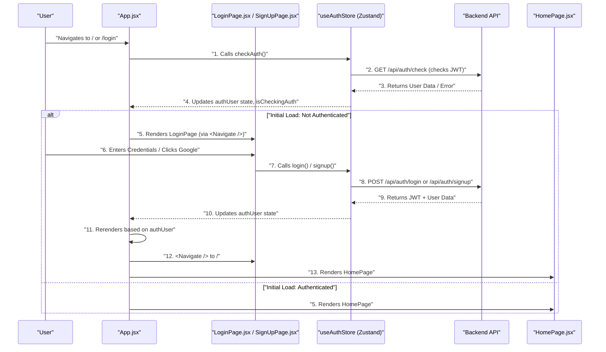

---
title: "Pages and Routing"
description: "Describes the structure of different application pages and how navigation is handled within the frontend."
sidebar_position: 33
---

# Pages and Routing

<TOC />

This section details how the frontend application structures its different views and manages navigation between them. The core of the routing logic resides in `frontend/src/App.jsx`, utilizing `react-router-dom` to define routes and handle authentication-based redirections. Individual pages like `HomePage`, `LoginPage`, and `SignUpPage` define the UI and business logic for their respective views.

## Centralized Routing with `App.jsx`

The `App.jsx` component serves as the central hub for frontend routing. It sets up `react-router-dom`'s `Routes` and `Route` components, dictating which component renders for a given URL path. Crucially, it integrates authentication logic to guard routes, ensuring users are redirected to the login page if they try to access protected content while unauthenticated.

### Key Aspects:

*   **Route Definition**: Defines primary application routes such as `/`, `/login`, `/signup`, `/settings`, and `/profile`.
*   **Authentication Guarding**: Uses the `authUser` state from `useAuthStore` to conditionally render components or `Navigate` users to appropriate pages (e.g., redirecting to `/login` if unauthenticated for the home page, or to `/` if authenticated on the login/signup pages).
*   **Global State Integration**: Leverages `useThemeStore` to apply the current theme to the application and `useAuthStore` to check authentication status on initial load and manage user sessions.
*   **Loading State**: Displays a `Loader` component while `isCheckingAuth` is true, providing a smooth user experience during authentication checks.

```jsx title="frontend/src/App.jsx - Route Configuration"
// Highlight-start
import { Routes, Route, Navigate } from 'react-router-dom'
import HomePage from './pages/HomePage'
import SignUpPage from './pages/SignUpPage'
import LoginPage from './pages/LoginPage'
import SettingsPage from './pages/SettingsPage'
import ProfilePage from './pages/ProfilePage'
// Highlight-end

// ... (imports and state hooks) ...

  return (
    <div className='' data-theme={theme}>
      <Navbar />
      <Toaster />
      <Routes>
        {/* Highlight-start */}
        <Route path='/' element={authUser ? <HomePage />: <Navigate to='/login' />} />
        <Route path='/signup' element={ !authUser ? <SignUpPage />: <Navigate to='/' />} />
        <Route path='/login' element={!authUser ? <LoginPage />: <Navigate to='/' />} />
        <Route path='/settings' element={<SettingsPage />} />
        <Route path='/profile' element={authUser ? <ProfilePage />: <Navigate to='/login' />} />
        {/* Highlight-end */}
      </Routes>
    </div>
  )
}
```
<p align="right">
  [<a href="https://github.com/shinymack/Chat-App-MERN/blob/main/frontend/src/App.jsx#L26-L35" target="_blank">View on GitHub</a>]
</p>

### Initial Authentication Check

Upon application load, `App.jsx` performs an authentication check using `checkAuth()` from the `useAuthStore`. This ensures that the user's session is validated and the `authUser` state is populated correctly before rendering any protected routes.

```jsx title="frontend/src/App.jsx - Initial Auth Check"
// Highlight-start
import { useEffect } from 'react'
import { useAuthStore } from './store/useAuthStore';
import { Loader } from 'lucide-react'
// Highlight-end

const App = () => {
  const { authUser, checkAuth, isCheckingAuth, onlineUsers } = useAuthStore();
  // Highlight-start
  useEffect(() => {
    checkAuth();
  }, [checkAuth]);

  if(isCheckingAuth && !authUser) return (
      <div className='flex items-center justify-center h-screen'>
        <Loader className='size-10 animate-spin' />
      </div>
  )
  // Highlight-end
// ... (rest of App component) ...
```
<p align="right">
  [<a href="https://github.com/shinymack/Chat-App-MERN/blob/main/frontend/src/App.jsx#L20-L24" target="_blank">View on GitHub</a>]
</p>

## The Home Page (`HomePage.jsx`)

The `HomePage.jsx` component represents the main interface of the chat application. It orchestrates the display of various sub-components, such as the `Sidebar`, `ChatContainer`, `FriendsBox`, and a `NoChatSelected` placeholder. Its rendering logic dynamically adjusts based on the currently `selectedUser` from the `useChatStore` and the `isFriendsBoxOpen` state.

```jsx title="frontend/src/pages/HomePage.jsx - Conditional Chat Rendering"
// Highlight-start
import ChatContainer from "../components/ChatContainer";
import FriendsBox from "../components/FriendsBox";
import NoChatSelected from "../components/NoChatSelected";
import Sidebar from "../components/Sidebar";
import { useChatStore } from "../store/useChatStore"
// Highlight-end

const HomePage = () => {
  const { selectedUser } = useChatStore();
  const { isFriendsBoxOpen } = useChatStore();
  return (
      <div className="h-screen bg-base-200">
      <div className="flex items-center justify-center pt-20 px-4 w-full">
        <div className="bg-base-100 rounded-lg shadow-xl w-full max-w-6xl h-[calc(100vh-8rem)]">
          <div className="flex h-full rounded-lg overflow-hidden w-full">
            <Sidebar />
            {/* Highlight-start */}
            {!selectedUser ? <NoChatSelected /> : <ChatContainer />}
            {isFriendsBoxOpen && <FriendsBox />}
            {/* Highlight-end */}
          </div>
        </div>
      </div>
    </div>
  )
}
```
<p align="right">
  [<a href="https://github.com/shinymack/Chat-App-MERN/blob/main/frontend/src/pages/HomePage.jsx#L16-L18" target="_blank">View on GitHub</a>]
</p>

## Authentication Pages (`LoginPage.jsx` and `SignUpPage.jsx`)

These pages handle user authentication workflows, including user registration and login. They feature interactive forms, password visibility toggles, client-side validation, and integration with Google OAuth for alternative sign-in methods. Both pages utilize the `useAuthStore` to interact with the backend authentication API.

### Common Features:

*   **Form Management**: Uses `useState` to manage form input fields (`username`, `email`, `password`).
*   **Password Visibility**: Provides a toggle to show or hide the password input, enhancing usability.
*   **Authentication Logic**: Calls `login` or `signup` functions from `useAuthStore`, displaying a loading spinner (`Loader2`) during API requests.
*   **Google OAuth**: Offers a "Sign in/up with Google" button, linking directly to the backend's Google authentication endpoint.
*   **Navigation**: Uses `Link` from `react-router-dom` to allow users to easily switch between the login and signup pages.

```jsx title="frontend/src/pages/LoginPage.jsx - Form Submission and Google Auth"
// Highlight-start
import { useState } from "react"
import { useAuthStore } from "../store/useAuthStore";
import { Eye, EyeOff, Loader2, Lock, Mail, MessageSquare } from "lucide-react";
import { Link } from "react-router-dom";
import AuthImagePattern from "../components/AuthImagePattern";
import { FcGoogle } from "react-icons/fc";
// Highlight-end

const LoginPage = () => {
  const [showPassword, setShowPassword] = useState(false);
  const [formData, setFormData] = useState({ /* ... */ });
  const { login, isLoggingIn } = useAuthStore();

  const handleSubmit = async (e) => {
    e.preventDefault();
    // Highlight-next-line
    login(formData);
  }
  const backendDomain = import.meta.env.VITE_BACKEND_URL;
  const googleAuthUrl = `${backendDomain}/api/auth/google`;
  return (
    <div className="h-screen grid lg:grid-cols-2">
      <div className="flex flex-col justify-center items-center p-6 sm:p-12">
        {/* ... form structure ... */}
          <form onSubmit={handleSubmit} className="space-y-6">
            {/* ... input fields ... */}
            <button type="submit" className="btn btn-primary w-full" disabled={isLoggingIn}>
              {isLoggingIn ? (
                <>
                  <Loader2 className="h-5 w-5 animate-spin" />
                  Loading...
                </>
              ) : (
                "Sign in"
              )}
            </button>
          </form>
          <div className="divider text-base-content/60 my-4">OR</div>
          {/* Highlight-start */}
          <a
            href={googleAuthUrl} // Link to your backend Google auth route
            className="btn btn-primary btn-outline w-full"
          >
            <FcGoogle className="size-5 mr-2" />
            Sign in with Google
          </a>
          {/* Highlight-end */}
          <div className="text-center">
            <p className="text-base-content/60">
              Don&apos;t have an account?{" "}
              {/* Highlight-next-line */}
              <Link to="/signup" className="link link-primary">
                Create account
              </Link>
            </p>
          </div>
        </div>
      </div>
      {/* ... AuthImagePattern ... */}
    </div>
  )
}
```
<p align="right">
  [<a href="https://github.com/shinymack/Chat-App-MERN/blob/main/frontend/src/pages/LoginPage.jsx#L20-L141" target="_blank">View on GitHub</a>]
</p>

### Client-Side Form Validation

The `SignUpPage.jsx` includes basic client-side validation to ensure user inputs meet certain criteria (e.g., non-empty username/email, valid email format, minimum password length) before attempting to register the user.

```jsx title="frontend/src/pages/SignUpPage.jsx - Form Validation"
// Highlight-start
import toast from "react-hot-toast";
// Highlight-end

const SignUpPage = () => {
  // ... (state hooks) ...

  // Highlight-start
  const validateForm = () => {
    if(!formData.username.trim()) return toast.error("Username is required");
    if(!formData.email.trim()) return toast.error("Email is required");
    if (!/\S+@\S+\.\S/.test(formData.email)) return toast.error("Invalid email format");
    if (!formData.password) return toast.error("Password is required");
    if (formData.password.length < 6) return toast.error("Password must be at least 6 characters");

    return true;
  };

  const handleSubmit = (e) => {
    e.preventDefault();

    const success = validateForm();
    if(success===true) signup(formData);
  };
  // Highlight-end
  // ... (rest of SignUpPage component) ...
```
<p align="right">
  [<a href="https://github.com/shinymack/Chat-App-MERN/blob/main/frontend/src/pages/SignUpPage.jsx#L20-L37" target="_blank">View on GitHub</a>]
</p>

## Page and Routing Flow

The following diagram illustrates the overall routing structure and how different pages are conditionally rendered or redirected based on user authentication status.


```mermaid
graph TD
    A["User Access"] --> B["App.jsx (Router)"]

    subgraph Auth Flow
        B -->|If Not Authenticated| C["LoginPage.jsx"]
        B -->|If Not Authenticated| D["SignUpPage.jsx"]
        C -->|Successful Login| E["HomePage.jsx"]
        D -->|Successful Signup| E
        C -->|Link| D
        D -->|Link| C
    end

    subgraph Authenticated Flow
        B -->|If Authenticated & Path "/"| E["HomePage.jsx"]
        E -->|Select Chat| F["ChatContainer.jsx"]
        E -->|No Chat Selected| G["NoChatSelected.jsx"]
        E -->|Friends Box Open| H["FriendsBox.jsx"]
        B -->|Path "/settings"| I["SettingsPage.jsx"]
        B -->|Path "/profile"| J["ProfilePage.jsx"]
    end

    E -.->|"Uses Chat Store"| F
    E -.->|"Uses Chat Store"| G
    E -.->|"Uses Chat Store"| H

    C -.->|"Uses Auth Store"| AppState["App State (Zustand)"]
    D -.->|"Uses Auth Store"| AppState
    E -.->|"Uses Auth Store & Chat Store"| AppState
    I -.->|"Uses Auth Store"| AppState
    J -.->|"Uses Auth Store"| AppState

    B -->|"Checks Auth Status"| AppState
    AppState -->|"Auth Status"| B
```


## Authentication Process Overview

This sequence diagram outlines the steps involved when a user attempts to log in or sign up, and how `App.jsx` handles authentication state changes.





## Key Integration Points

*   **`react-router-dom`**: The fundamental library for declarative routing in React applications. `App.jsx` uses `BrowserRouter`, `Routes`, `Route`, and `Navigate` components to define paths, map them to components, and handle programmatic redirections based on application state.
*   **Zustand (`useAuthStore`, `useChatStore`)**: These global state management stores are critical for routing and page behavior. `useAuthStore` dictates access to protected routes, while `useChatStore` influences the conditional rendering within `HomePage`.
*   **Conditional Rendering**: Extensive use of conditional rendering (`authUser ? <ComponentA /> : <ComponentB />`) allows the application to dynamically change its UI based on authentication status or selected chat.
*   **Google OAuth**: Integration with Google authentication provides a streamlined sign-in/sign-up experience, relying on a backend endpoint to handle the OAuth flow.

Next: [User and Friend Management](./4.1_user-and-friend-management.mdx)
```