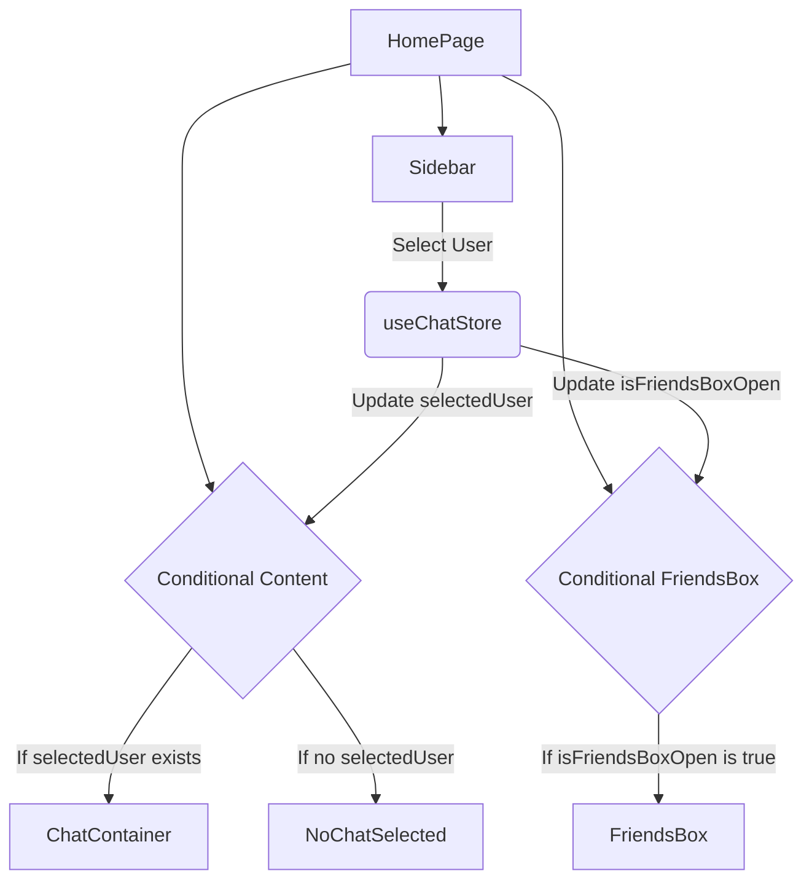

# Pages and Routing

<TOC />

This section delves into the core user interfaces of the application, outlining the primary pages, their functionalities, and how users navigate between them. The frontend application leverages React for building interactive UIs and `react-router-dom` for managing declarative routing. This ensures a seamless single-page application experience with distinct URLs for different views, handling both authenticated and unauthenticated user flows.

## Core Application Pages

The application is structured around several key pages, each serving a specific purpose in the user journey, from authentication to real-time communication and profile management.

### HomePage

The `HomePage` is the central hub for authenticated users, serving as the main chat interface. It intelligently adapts its display based on user interactions and selected chat partners, providing a dynamic communication environment.

*   **Purpose:** Displays the main chat interface, allowing users to view recent conversations, select contacts, and send/receive messages.
*   **Key Components:**
    *   `Sidebar`: Lists available users/friends for chatting.
    *   `ChatContainer`: Displays messages for the `selectedUser`.
    *   `NoChatSelected`: A placeholder component shown when no chat is active.
    *   `FriendsBox`: A conditionally rendered component for managing friends or finding new contacts.
*   **State Management:** Utilizes `useChatStore` to manage the currently `selectedUser` and the visibility of `isFriendsBoxOpen`, enabling reactive UI updates without prop drilling.

The `HomePage` dynamically renders chat-related components based on the global chat state:

```jsx
// frontend/src/pages/HomePage.jsx
import ChatContainer from "../components/ChatContainer";
import FriendsBox from "../components/FriendsBox";
import NoChatSelected from "../components/NoChatSelected";
import Sidebar from "../components/Sidebar";
import { useChatStore } from "../store/useChatStore"

const HomePage = () => {
  const { selectedUser } = useChatStore();
  const { isFriendsBoxOpen } = useChatStore();
  return (
      <div className="h-screen bg-base-200">
      <div className="flex items-center justify-center pt-20 px-4 w-full">
        <div className="bg-base-100 rounded-lg shadow-xl w-full max-w-6xl h-[calc(100vh-8rem)]">
          <div className="flex h-full rounded-lg overflow-hidden w-full">
            <Sidebar />
            {!selectedUser ? <NoChatSelected /> : <ChatContainer />}
            {isFriendsBoxOpen && <FriendsBox />}
          </div>
        </div>
      </div>
    </div>
  )
}

export default HomePage
```
[[View on GitHub](https://github.com/shinymack/Chat-App-MERN/blob/main/frontend/src/pages/HomePage.jsx#L1-L29)]

### LoginPage

The `LoginPage` is the entry point for existing users to access their accounts. It provides standard email/password authentication and integrates with third-party authentication providers like Google.

*   **Purpose:** Authenticates existing users, enabling access to the application's features.
*   **Authentication Methods:**
    *   **Email and Password:** Users can log in using their registered email and password. Client-side state (`formData`) captures input, and `handleSubmit` triggers the authentication process.
    *   **Google OAuth:** Integration with Google allows for quick sign-in via Google accounts, leveraging a backend authentication route.
*   **State Management:** `useAuthStore` manages the `login` function and the `isLoggingIn` loading state, providing feedback to the user during the authentication request.
*   **Navigation:** Includes a link to the `/signup` page for new users.

The login submission logic and Google OAuth integration are handled as follows:

```jsx
// frontend/src/pages/LoginPage.jsx
// ... (imports)
import { Link } from "react-router-dom"; // for navigation
import { FcGoogle } from "react-icons/fc"; // for Google icon

const LoginPage = () => {
  const [showPassword, setShowPassword] = useState(false);
  const [formData, setFormData] = useState({
    email: "",
    password: "",
  })
  const { login, isLoggingIn } = useAuthStore();

  const handleSubmit = async (e) => {
    e.preventDefault();
    login(formData); // Triggers authentication via auth store
  }
  const backendDomain = import.meta.env.VITE_BACKEND_URL;
  const googleAuthUrl = `${backendDomain}/api/auth/google`; // Google OAuth endpoint
  return (
    <div className="h-screen grid lg:grid-cols-2">
      {/* ... (form and UI elements) */}
            <button type="submit" className="btn btn-primary w-full" disabled={isLoggingIn}>
              {isLoggingIn ? (
                <>
                  <Loader2 className="h-5 w-5 animate-spin" />
                  Loading...
                </>
              ) : (
                "Sign in"
              )}
            </button>
          </form>
          <div className="divider text-base-content/60 my-4">OR</div>

          <a
            href={googleAuthUrl} // Link to your backend Google auth route
            className="btn btn-primary btn-outline w-full"
          >
            <FcGoogle className="size-5 mr-2" />
            Sign in with Google
          </a>
          {/* ... (rest of the component) */}
```
[[View on GitHub](https://github.com/shinymack/Chat-App-MERN/blob/main/frontend/src/pages/LoginPage.jsx#L11-L97)]

### SignUpPage

The `SignUpPage` facilitates the creation of new user accounts. It ensures basic validation for user inputs before submitting registration requests to the backend.

*   **Purpose:** Allows new users to register for an account using their desired username, email, and password.
*   **User Input:** Collects `username`, `email`, and `password` for registration.
*   **Client-side Validation:** Implements basic checks for required fields, email format, and password length (`validateForm` function) to provide immediate feedback to the user.
*   **State Management:** `useAuthStore`'s `signup` function is responsible for sending registration data to the backend, with `IsSigningUp` providing a loading indicator.
*   **Navigation:** Provides a link to the `/login` page for users who already have an account.

The `validateForm` and `handleSubmit` functions illustrate the client-side validation and registration initiation:

```jsx
// frontend/src/pages/SignUpPage.jsx
// ... (imports)
import toast from "react-hot-toast"; // for user notifications

const SignUpPage = () => {
  const [showPassword, setShowPassword] = useState(false);
  const [formData, setFormData] = useState({
    username: "",
    email: "",
    password: "",
  });

  const { signup, IsSigningUp } = useAuthStore();

  const validateForm = () => { // Client-side validation
    if(!formData.username.trim()) return toast.error("Username is required");
    if(!formData.email.trim()) return toast.error("Email is required");
    if (!/\S+@\S+\.\S+/.test(formData.email)) return toast.error("Invalid email format");
    if (!formData.password) return toast.error("Password is required");
    if (formData.password.length < 6) return toast.error("Password must be at least 6 characters");
    return true;
  };

  const handleSubmit = (e) => {
    e.preventDefault();
    const success = validateForm();
    if(success===true) signup(formData); // Call signup action if validation passes
  };
  
  const backendDomain = import.meta.env.VITE_BACKEND_URL;
  const googleAuthUrl = `${backendDomain}/api/auth/google`; // Google OAuth endpoint
  return (
    // ... (rest of the component)
```
[[View on GitHub](https://github.com/shinymack/Chat-App-MERN/blob/main/frontend/src/pages/SignUpPage.jsx#L10-L42)]

### ProfilePage

The `ProfilePage` allows authenticated users to view and update their personal information, including their profile picture and username.

*   **Purpose:** Provides a dedicated space for users to manage their account details.
*   **Features:**
    *   **Profile Picture Upload:** Users can upload a new profile picture. The image is converted to a base64 string and sent to the backend for update.
    *   **Username Editing:** Users can edit their username. This feature includes a debounced check to verify username availability in real-time against the backend API, enhancing user experience by preventing conflicts.
    *   **Display User Information:** Shows the user's current username, email, membership date, and account status.
*   **State Management:** `useAuthStore` provides access to `authUser` data, `isUpdatingProfile` loading state, and the `updateProfile` action.
*   **API Interactions:** Uses `axiosInstance` for debounced username availability checks.

The profile update and username editing logic highlights advanced state management and API interaction:

```jsx
// frontend/src/pages/ProfilePage.jsx
// ... (imports)
import { axiosInstance } from "../lib/axios"; // For API calls

const ProfilePage = () => {
	const { authUser, isUpdatingProfile, updateProfile } = useAuthStore();
	const [selectedImg, setSelectedImg] = useState(null);
	const [isEditingUsername, setIsEditingUsername] = useState(false);
	const [newUsername, setNewUsername] = useState(authUser?.username || "");
	const [usernameStatus, setUsernameStatus] = useState({
		checking: false,
		available: true,
		message: "",
	});
	const debounceTimeout = useRef(null); // Ref for debouncing

	const handleImageUpload = async (e) => {
		const file = e.target.files[0];
		if (!file) return;

		const reader = new FileReader();
		reader.readAsDataURL(file);

		reader.onload = async () => {
			const base64Image = reader.result;
			setSelectedImg(base64Image);
			await updateProfile({ profilePic: base64Image }); // Update profile picture
		};
	};

	// --- Debounced Username Check ---
	useEffect(() => {
		clearTimeout(debounceTimeout.current); // Clear previous timeout

		if (!newUsername.trim() || newUsername.trim().length < 3) {
			setUsernameStatus({ checking: false, available: false, message: "Must be 3+ characters." });
			return;
		}
		if (newUsername === authUser.username) {
			setUsernameStatus({ checking: false, available: true, message: "" });
			return;
		}

		setUsernameStatus((prev) => ({ ...prev, checking: true, message: "Checking..." }));
		debounceTimeout.current = setTimeout(async () => { // Debounced API call
			try {
				const res = await axiosInstance.get(`/auth/username/check/${newUsername}`);
				setUsernameStatus({
					checking: false,
					available: res.data.available,
					message: res.data.message,
				});
			} catch (error) {
				const message = error.response?.data?.message || "Error checking username.";
				setUsernameStatus({ checking: false, available: false, message });
			}
		}, 500); // 500ms debounce delay
		return () => clearTimeout(debounceTimeout.current);
	}, [newUsername, authUser.username]);
	// ---------------------------------

	const handleSaveUsername = async () => {
		if (!usernameStatus.available || newUsername === authUser.username) {
			toast.error("Cannot save. Username is either unavailable or unchanged.");
			return;
		}
		await updateProfile({ username: newUsername }); // Update username
		setIsEditingUsername(false);
	};
	// ... (rest of the component)
```
[[View on GitHub](https://github.com/shinymack/Chat-App-MERN/blob/main/frontend/src/pages/ProfilePage.jsx#L27-L107)]

## Routing Mechanism

The application utilizes `react-router-dom` for client-side routing, enabling navigation between different pages without full page reloads.

*   **Declarative Routing:** Routes are defined declaratively, mapping specific URL paths to React components.
*   **Authentication Guards (Implicit):** While not explicitly shown in these files, typical `react-router-dom` setups would include route protection (e.g., using `Outlet` and conditional rendering in a parent `App` component) to redirect unauthenticated users from `HomePage` or `ProfilePage` to `LoginPage`. Similarly, authenticated users might be redirected from `LoginPage`/`SignUpPage` to `HomePage`.
*   **Navigation:** The `Link` component from `react-router-dom` is used for internal navigation (e.g., between login and signup). External links, such as for Google OAuth, use standard `<a>` tags pointing to backend endpoints.

### Authentication Flow Diagram

This diagram illustrates the core authentication process, showcasing how users interact with the Login and Signup pages and how these interactions lead to authentication or registration.


```mermaid
flowchart LR
    A[User] -->|Navigate to /login| B(LoginPage)
    A -->|Navigate to /signup| C(SignUpPage)

    B -->|Submit Credentials| D{Auth Store: login()}
    B -->|Click Google Sign-in| G(Backend /api/auth/google)

    C -->|Submit Registration| E{Auth Store: signup()}
    C -->|Click Google Sign-up| G

    D -->|API Call: POST /auth/login| F(Backend Auth API)
    E -->|API Call: POST /auth/register| F

    G -->|OAuth Flow| F
    F -->|Success: Set Auth Cookie| H[Authenticated Session]
    F -->|Failure: Error| I(Display Error)

    H -->|Redirect to /home| J(HomePage)
    B -- Redirect on Auth --> J
    C -- Redirect on Auth --> J
```


### Main Application Layout Diagram

The `HomePage` represents the main application interface. This diagram visualizes its internal component structure and how data flow and conditional rendering determine the user's view.





## Key Integration Points

### State Management for Pages

All presented pages heavily rely on Zustand, a lightweight state management library, through `useAuthStore` and `useChatStore`.
*   **`useAuthStore`**: Managers the authentication state (`authUser`, `isLoggingIn`, `IsSigningUp`, `isUpdatingProfile`) and actions (`login`, `signup`, `updateProfile`). This store is critical for controlling access to routes and displaying user-specific information across `LoginPage`, `SignUpPage`, and `ProfilePage`.
*   **`useChatStore`**: Manages chat-specific states such as the `selectedUser` and the visibility of the `FriendsBox` (`isFriendsBoxOpen`). `HomePage` directly consumes these states for its conditional rendering logic.

### Authentication and Authorization

The `LoginPage` and `SignUpPage` are the primary interfaces for user authentication. They interact with the backend authentication API to create user sessions (via HTTP-only cookies) and persist user data in the global `useAuthStore`. `ProfilePage` extends this by allowing authenticated users to update their details, also mediated by the `useAuthStore` and backend API calls. The `Link` component from `react-router-dom` allows unauthenticated users to navigate between these pages.

### API Interaction Flows

*   **Login/Signup:** Both pages initiate `POST` requests to the backend (`/api/auth/login` and `/api/auth/register`) via the `useAuthStore` actions. These actions handle the API call, response processing (e.g., setting the auth cookie), and updating the global authentication state.
*   **Google OAuth:** Both `LoginPage` and `SignUpPage` provide a direct link to a backend endpoint (`/api/auth/google`). This initiates an OAuth 2.0 flow, where Google authenticates the user, and the backend then creates/logs in the user in the application, redirecting them back to the frontend (likely `/home`) with an authenticated session.
*   **Profile Updates:** `ProfilePage` leverages the `updateProfile` action in `useAuthStore` to send `PATCH` requests to the backend (e.g., `/api/users/profile`) for updating profile pictures or usernames.
*   **Debounced Username Check:** A key detail in `ProfilePage` is the debounced `GET` request to `/api/auth/username/check/:username`. This prevents excessive API calls during typing and provides real-time availability feedback, improving user experience and optimizing backend load.

### Best Practices and Scalability

*   **Modular Design:** Separating pages into distinct components (e.g., `ChatContainer`, `Sidebar`) promotes reusability and maintainability.
*   **Centralized State Management (Zustand):** Using `useAuthStore` and `useChatStore` centralizes critical application state, making it predictable and easier to debug, which is vital for scalable applications.
*   **Client-side Validation:** Implementing `validateForm` in `SignUpPage` reduces unnecessary network requests and provides immediate user feedback, enhancing UX.
*   **Loading States:** Explicit `isLoggingIn`, `IsSigningUp`, and `isUpdatingProfile` states, along with `Loader2` icons, inform users about ongoing asynchronous operations, crucial for perceived performance.
*   **Error Handling:** The use of `toast` for user notifications indicates robust error and success feedback mechanisms.
*   **Debouncing for API Calls:** The username availability check in `ProfilePage` is a prime example of debouncing, a critical optimization technique to prevent spamming the backend with requests during rapid user input, which is essential for backend stability and scalability.

Next: [Development and Configuration](./4_development-and-configuration.mdx)