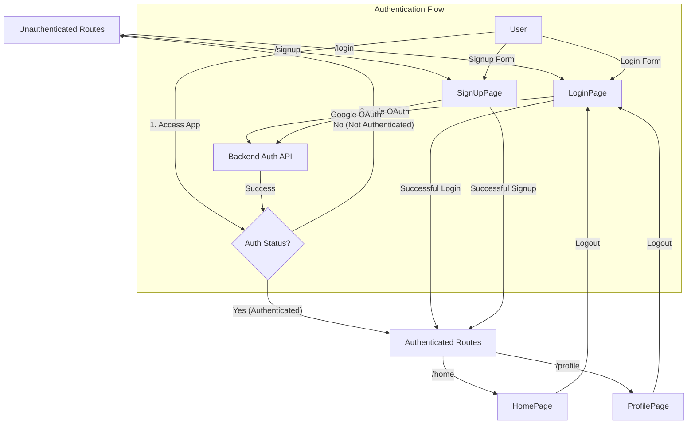
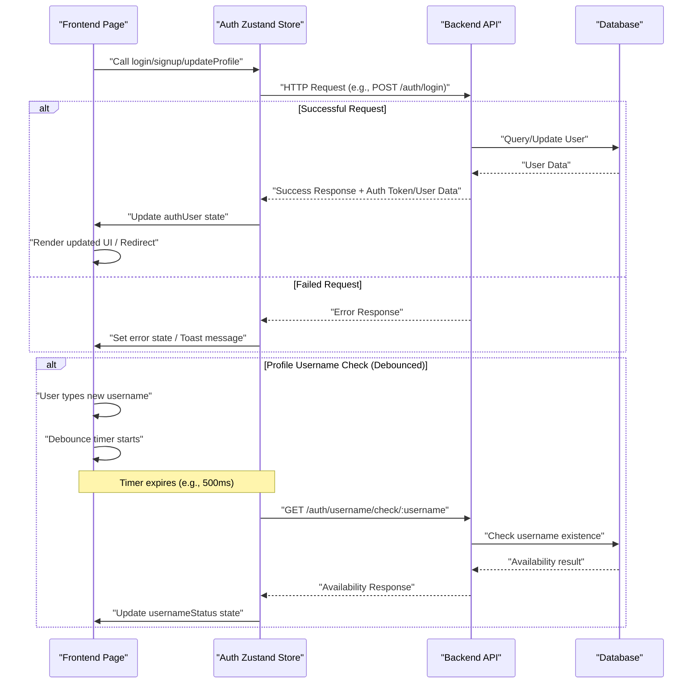

---
title: "Pages and Navigation"
description: "Overview of the main application pages, their responsibilities, and routing within the frontend."
sidebar_position: 33
---

# Pages and Navigation

<TOC />

The frontend of this chat application is structured around a set of distinct pages, each serving a specific purpose within the user's journey. These pages handle user authentication, profile management, and the core chat functionalities. Routing between these pages is managed using `react-router-dom`, ensuring a seamless single-page application experience.

This document outlines the main pages, their primary responsibilities, and how they integrate with the application's state and backend.

## Application Pages

### Home Page (`HomePage.jsx`)

The `HomePage` serves as the central hub for authenticated users, displaying the main chat interface. It conditionally renders different components based on the user's interaction (e.g., whether a chat is selected or the friends box is open).

**Key Responsibilities:**

*   **Chat Display:** Shows the active chat conversation or a placeholder if no chat is selected.
*   **User Interaction:** Integrates the sidebar for navigation and the friends list for managing contacts.
*   **State Management:** Utilizes `useChatStore` to determine the currently selected user for chat.

**Relevant Components:** `Sidebar`, `ChatContainer`, `FriendsBox`, `NoChatSelected`

**Code Snippet: `HomePage` Structure**

This snippet illustrates the conditional rendering within the `HomePage` based on `selectedUser` and `isFriendsBoxOpen` from the chat store.

```jsx
import ChatContainer from "../components/ChatContainer";
import FriendsBox from "../components/FriendsBox";
import NoChatSelected from "../components/NoChatSelected";
import Sidebar from "../components/Sidebar";
import { useChatStore } from "../store/useChatStore"

const HomePage = () => {
  const { selectedUser } = useChatStore();
  const { isFriendsBoxOpen } = useChatStore();
  return (
      <div className="h-screen bg-base-200">
      <div className="flex items-center justify-center pt-20 px-4 w-full">
        <div className="bg-base-100 rounded-lg shadow-xl w-full max-w-6xl h-[calc(100vh-8rem)]">
          <div className="flex h-full rounded-lg overflow-hidden w-full">
            <Sidebar />
            {!selectedUser ? <NoChatSelected /> : <ChatContainer />}
            {isFriendsBoxOpen && <FriendsBox />}
          </div>
        </div>
      </div>
    </div>
  )
}

export default HomePage
```
[View on GitHub](https://github.com/shinymack/Chat-App-MERN/blob/main/frontend/src/pages/HomePage.jsx#L1-L24)

---

### Login Page (`LoginPage.jsx`)

The `LoginPage` provides the interface for existing users to sign into their accounts. It supports both traditional email/password login and Google OAuth.

**Key Responsibilities:**

*   **User Authentication:** Handles form submission for email/password login.
*   **Google OAuth:** Redirects users to the backend's Google authentication endpoint.
*   **Navigation:** Provides a link to the `SignUpPage` for new users.
*   **Input Validation:** Manages password visibility and displays loading states during authentication.

**Key Hooks/Libraries:** `useState`, `useAuthStore`, `react-router-dom` (`Link`), `lucide-react`, `react-icons/fc`

**Code Snippet: Login Form Submission**

This excerpt shows how `LoginPage` uses `useState` for form data and `useAuthStore` for the `login` action, along with conditional rendering for the submit button's content.

```jsx
// ... (imports)

const LoginPage = () => {
  const [showPassword, setShowPassword] = useState(false);
  const [formData, setFormData] = useState({
    email: "",
    password: "",
  })
  const { login, isLoggingIn } = useAuthStore();

  const handleSubmit = async (e) => {
    e.preventDefault();
    login(formData);
  }
  const backendDomain = import.meta.env.VITE_BACKEND_URL;
  const googleAuthUrl = `${backendDomain}/api/auth/google`;
  return (
    <div className="h-screen grid lg:grid-cols-2">
      {/* Left Side - Form */}
      <div className="flex flex-col justify-center items-center p-6 sm:p-12">
        <div className="w-full max-w-md space-y-8">
          {/* ... (logo and intro) */}
          <form onSubmit={handleSubmit} className="space-y-6">
            {/* ... (email and password inputs) */}
            <button type="submit" className="btn btn-primary w-full" disabled={isLoggingIn}>
              {isLoggingIn ? (
                <>
                  <Loader2 className="h-5 w-5 animate-spin" />
                  Loading...
                </>
              ) : (
                "Sign in"
              )}
            </button>
          </form>
          <div className="divider text-base-content/60 my-4">OR</div>
          <a
            href={googleAuthUrl} // Link to your backend Google auth route
            className="btn btn-primary btn-outline w-full"
          >
            <FcGoogle className="size-5 mr-2" />
            Sign in with Google
          </a>
          <div className="text-center">
            <p className="text-base-content/60">
              Don&apos;t have an account?{" "}
              <Link to="/signup" className="link link-primary">
                Create account
              </Link>
            </p>
          </div>
        </div>
      </div>
      {/* ... (AuthImagePattern) */}
    </div>
  )
}

export default LoginPage
```
[View on GitHub](https://github.com/shinymack/Chat-App-MERN/blob/main/frontend/src/pages/LoginPage.jsx#L1-L122)

---

### Profile Page (`ProfilePage.jsx`)

The `ProfilePage` allows authenticated users to view and update their profile information, specifically their profile picture and username.

**Key Responsibilities:**

*   **Display User Info:** Shows the current profile picture, username, and email.
*   **Profile Picture Upload:** Enables users to select and upload a new profile picture, which is then sent to the backend as a base64 encoded string.
*   **Username Editing:** Allows users to edit their username with debounced availability checking against the backend.
*   **Account Details:** Displays account creation date and status.
*   **State Management:** Interacts with `useAuthStore` for fetching and updating user data.

**Key Hooks/Libraries:** `useState`, `useEffect`, `useRef`, `useAuthStore`, `lucide-react`, `react-hot-toast`, `axiosInstance`

**Code Snippet: Username Editing Logic**

This snippet highlights the debounced username validation and the UI for editing, saving, and canceling username changes.

```jsx
// ... (imports)

const ProfilePage = () => {
	const { authUser, isUpdatingProfile, updateProfile } = useAuthStore();
	const [selectedImg, setSelectedImg] = useState(null);

	const [isEditingUsername, setIsEditingUsername] = useState(false);
	const [newUsername, setNewUsername] = useState(authUser?.username || "");
	const [usernameStatus, setUsernameStatus] = useState({
		checking: false,
		available: true,
		message: "",
	});
	const debounceTimeout = useRef(null);

	// ... (handleImageUpload)

	// --- Debounced Username Check ---
	useEffect(() => {
		clearTimeout(debounceTimeout.current);
		if (!newUsername.trim() || newUsername.trim().length < 3) {
			setUsernameStatus({ checking: false, available: false, message: "Must be 3+ characters." });
			return;
		}
		if (newUsername === authUser.username) {
			setUsernameStatus({ checking: false, available: true, message: "" });
			return;
		}
		setUsernameStatus((prev) => ({ ...prev, checking: true, message: "Checking..." }));
		debounceTimeout.current = setTimeout(async () => {
			try {
				const res = await axiosInstance.get(`/auth/username/check/${newUsername}`);
				setUsernameStatus({
					checking: false,
					available: res.data.available,
					message: res.data.message,
				});
			} catch (error) {
				const message = error.response?.data?.message || "Error checking username.";
				setUsernameStatus({ checking: false, available: false, message });
			}
		}, 500); // 500ms debounce delay
		return () => clearTimeout(debounceTimeout.current);
	}, [newUsername, authUser.username]);
	// ---------------------------------

	const handleSaveUsername = async () => {
		if (!usernameStatus.available || newUsername === authUser.username) {
			toast.error("Cannot save. Username is either unavailable or unchanged.");
			return;
		}
		await updateProfile({ username: newUsername });
		setIsEditingUsername(false); // Exit edit mode on success
	};

	const handleCancelEdit = () => {
		setIsEditingUsername(false);
		setNewUsername(authUser.username); // Reset to original username
		setUsernameStatus({ checking: false, available: true, message: "" }); // Reset status
	};

	return (
		<div className="h-screen pt-20">
			{/* ... (profile picture section) */}
					<div className="space-y-6">
						<div className="space-y-1.5">
							<div className="text-sm text-zinc-400 flex items-center gap-2">
								<User className="w-4 h-4" />
								Username
							</div>
							{!isEditingUsername ? (
								<div className="flex items-center gap-2">
									<p className="px-4 py-2.5 bg-base-200 rounded-lg border flex-grow">
										{authUser?.username}
									</p>
									<button onClick={() => setIsEditingUsername(true)} className="btn btn-ghost btn-sm">
										<Edit className="w-4 h-4" />
									</button>
								</div>
							) : (
								<div className="space-y-2">
									<div className="flex items-center gap-2">
										<input
											type="text"
											value={newUsername}
											onChange={(e) => setNewUsername(e.target.value.toLowerCase())}
											className="input input-bordered w-full"
										/>
										<button onClick={handleSaveUsername} className="btn btn-success btn-sm" disabled={!usernameStatus.available || usernameStatus.checking || isUpdatingProfile}>
											{isUpdatingProfile ? <Loader2 className="w-4 h-4 animate-spin" /> : <Save className="w-4 h-4" />}
										</button>
										<button onClick={handleCancelEdit} className="btn btn-error btn-sm">
											<X className="w-4 h-4" />
										</button>
									</div>
									<div className={`text-xs h-4 ${usernameStatus.available ? 'text-green-500' : 'text-error'}`}>
										{usernameStatus.checking ? <Loader2 className="w-3 h-3 animate-spin inline-block mr-1" /> : null}
										{usernameStatus.message}
									</div>
								</div>
							)}
						</div>
						{/* ... (email and account info) */}
					</div>
				</div>
			</div>
		</div>
	);
};

export default ProfilePage;
```
[View on GitHub](https://github.com/shinymack/Chat-App-MERN/blob/main/frontend/src/pages/ProfilePage.jsx#L42-L210)

---

### Sign Up Page (`SignUpPage.jsx`)

The `SignUpPage` facilitates the creation of new user accounts. Similar to the login page, it offers both traditional registration and Google OAuth.

**Key Responsibilities:**

*   **User Registration:** Captures username, email, and password for new account creation.
*   **Google OAuth:** Provides a link for signing up via Google.
*   **Navigation:** Directs users to the `LoginPage` if they already have an account.
*   **Client-side Validation:** Performs basic form validation before submitting data to the backend.
*   **Password Visibility:** Allows users to toggle password visibility.

**Key Hooks/Libraries:** `useState`, `useAuthStore`, `react-router-dom` (`Link`), `lucide-react`, `react-hot-toast`, `react-icons/fc`

**Code Snippet: Form Validation and Submission**

This snippet demonstrates the client-side validation logic using `react-hot-toast` for feedback, followed by the `signup` call from `useAuthStore`.

```jsx
// ... (imports)

const SignUpPage = () => {
  const [showPassword, setShowPassword] = useState(false);
  const [formData, setFormData] = useState({
    username: "",
    email: "",
    password: "",
  });

  const { signup, IsSigningUp } = useAuthStore();

  const validateForm = () => {
    if(!formData.username.trim()) return toast.error("Username is required");
    if(!formData.email.trim()) return toast.error("Email is required");
    if (!/\S+@\S+\.\S+/.test(formData.email)) return toast.error("Invalid email format");
    if (!formData.password) return toast.error("Password is required");
    if (formData.password.length < 6) return toast.error("Password must be at least 6 characters");

    return true;
  };

  const handleSubmit = (e) => {
    e.preventDefault();

    const success = validateForm();
    if(success===true) signup(formData);
  };
  
  const backendDomain = import.meta.env.VITE_BACKEND_URL;
  const googleAuthUrl = `${backendDomain}/api/auth/google`;
  return (
    <div className="min-h-screen grid lg:grid-cols-2">
      {/* ... (left side form structure) */}
          <form onSubmit={handleSubmit} className="space-y-6">
            {/* ... (username, email, password inputs) */}
            <button type="submit" className="btn btn-primary w-full" disabled={IsSigningUp}>
              {IsSigningUp ? (
                <>
                  <Loader2 className="size-5 animate-spin" />
                  Loading...
                </>
              ) : (
                "Create Account"
              )}
            </button>
          </form>
          {/* ... (Google OAuth and link to login) */}
        </div>
      </div>
      {/* ... (AuthImagePattern) */}
    </div>
  );
};
export default SignUpPage;
```
[View on GitHub](https://github.com/shinymack/Chat-App-MERN/blob/main/frontend/src/pages/SignUpPage.jsx#L1-L141)

---

## Frontend Navigation Flow

The application uses `react-router-dom` for client-side routing. The main `App` component defines the routes, protecting certain routes (like `/`) to ensure only authenticated users can access the core application features.





## Key Integration Points

### State Management with Zustand

Pages heavily rely on Zustand stores (`useAuthStore` and `useChatStore`) for managing global application state:

*   **`useAuthStore`**: Manages user authentication status, `authUser` object, and actions like `login`, `signup`, `logout`, and `updateProfile`. This allows pages to react to authentication changes (e.g., redirecting to login on logout or displaying user-specific data).
*   **`useChatStore`**: Manages the `selectedUser` for chat, `isFriendsBoxOpen`, and `messages` for the current conversation. `HomePage` is a primary consumer of this store.

### Backend API Interactions

Most pages interact with the backend API for data persistence and authentication:

*   **Authentication Pages (`LoginPage`, `SignUpPage`)**: Send user credentials to `/api/auth/login` or `/api/auth/signup`. Google OAuth flows redirect to `/api/auth/google`.
*   **Profile Page (`ProfilePage`)**: Updates user data via `/api/users/update-profile` and checks username availability via `/api/auth/username/check/:username`.
*   **Axios Instance**: The `axiosInstance` is used across pages to ensure consistent header (e.g., `Authorization`) and error handling for API calls.





### Client-Side Validation and User Feedback

Pages implement client-side validation (e.g., password length, email format) using `react-hot-toast` to provide immediate feedback to users, improving the user experience before submitting data to the backend. This helps reduce unnecessary network requests and guides users in correcting input errors.

Next: [Development Guidelines and Tools](./4_development-guidelines-tools.mdx)
```